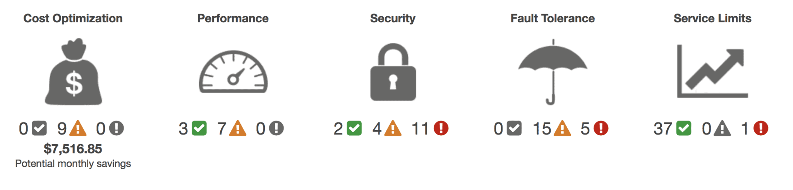
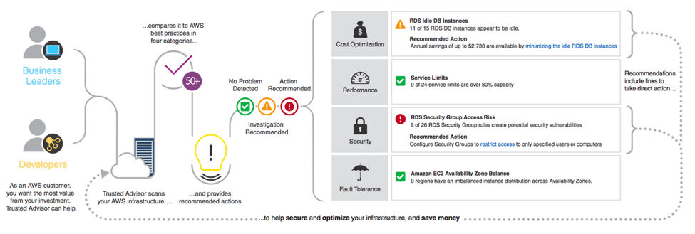

# AWS Trusted Advisor

## 1. Introduction

AWS Trusted Advisor is an AWS tool that provides real‑time assistance by inspecting your AWS resources and configurations. Its primary goals include:

- **Cost Optimization:** By highlighting idle or underutilized resources (like EC2 instances, EBS volumes, Elastic IP addresses, etc.), it helps reduce unnecessary expenses. For instance, if you receive a notification that some RDS instances have been idle for more than 30 days, you can consolidate or terminate those resources to save money.
- **Security:** It examines your environment for security gaps—for example, it checks for overly permissive security groups, weak IAM practices (such as using root credentials), and non‑compliance with MFA requirements.
- **Fault Tolerance:** It assesses the resiliency of your architecture by checking for issues like missing backups, uneven distribution of instances across Availability Zones, and other redundancy shortcomings.
- **Performance:** It looks at utilization metrics (e.g., CPU and network I/O on EC2 instances) and other configuration details to recommend improvements that boost application performance.
- **Service Limits:** It monitors your resource usage in relation to AWS service limits and alerts you when usage exceeds 80% of your quota.

Trusted Advisor essentially serves as an automated auditor, ensuring that your account adheres to best practices across these five critical areas.

## 2. How Does AWS Trusted Advisor Work?

Trusted Advisor continuously scans your AWS environment and compares its configuration and usage patterns against AWS best practices. Its dashboard uses a simple, intuitive color‑coding system to communicate the status of each check:

- **Green – No Problem Detected:** Everything is configured according to best practices.
- **Yellow – Investigation Recommended:** There might be a potential issue that needs a closer look.
- **Red – Action Recommended:** Immediate corrective action is advised to avoid potential problems.

For example, when planning a new RDS deployment, if Trusted Advisor detects that some existing RDS instances have been idle for over 30 days, you might repurpose an idle instance rather than provisioning a new one—thus saving costs.

The Trusted Advisor checks cover a wide array of services and aspects of your infrastructure, grouped primarily into four categories:

1. **Cost Optimization**
2. **Security**
3. **Fault Tolerance**
4. **Performance**

Additionally, it includes a **Service Limits** check to help you monitor your consumption relative to AWS quotas.

## 3. Core Checks and Categories

### 3.1 Cost Optimization

Trusted Advisor recommends actions such as:

- **Idle Resources:** Identifies EC2 instances, load balancers, or RDS instances that are underutilized.
- **Resource Right-Sizing:** Advises on using reserved instances or Savings Plans based on your usage history.
- **Unassociated Elastic IPs:** Alerts you to static IPs that are not attached to running instances.
- **Underutilized EBS Volumes:** Reviews volume configurations to spot volumes that are not being fully used.

These recommendations can help significantly lower your AWS bills by eliminating waste.

### 3.2 Security

Security checks help you harden your environment by:

- **Security Groups – Specific Ports Unrestricted:** Identifies overly permissive rules that might expose your EC2 instances.
- **IAM Use Check:** Ensures that you’re not using account-level credentials, encouraging the use of users, groups, and roles instead.
- **MFA on Root Account Check:** Recommends enabling multi-factor authentication to add an extra layer of security.
- **S3 Bucket Permissions:** Verifies that bucket policies aren’t overly permissive.

By following these recommendations, you can better protect your AWS resources from threats.

### 3.3 Fault Tolerance

Fault tolerance checks focus on improving your system’s resilience:

- **EC2 Availability Zone Balance:** Ensures that your instances are distributed across multiple Availability Zones.
- **EBS Snapshots:** Monitors the age of snapshots to help you maintain effective backup strategies.
- **Load Balancer Optimization:** Reviews the configuration of load balancers for optimal redundancy.
- **RDS Backups and Multi-AZ Deployments:** Checks that your databases are properly backed up and spread across zones.

These recommendations help safeguard your applications against failures.

### 3.4 Performance

Performance checks analyze your resource usage to ensure efficient operation:

- **High Utilization Instances:** Flags EC2 instances that consistently run at high CPU usage, which may indicate a need for scaling.
- **Excessive Security Group Rules:** Alerts you to potential performance degradation due to overly complex security group configurations.
- **Provisioned IOPS and EBS Throughput:** Examines EBS volumes to ensure they are attached to instances that are optimized for performance.

Optimizing performance can result in faster, more responsive applications.

### 3.5 Service Limits

This check monitors your usage against AWS service limits, such as:

- EC2 instances, EBS volumes, RDS instances, and more.

It warns you when usage exceeds 80% of your allocation, so you can request limit increases before encountering issues.

## 4. Trusted Advisor Best Practices at No Charge

All AWS users have access to a core set of Trusted Advisor checks for free, including:

- **Service Limits Check:** Monitors resource usage relative to service quotas.
- **Security Groups – Specific Ports Unrestricted Check:** Flags security groups with overly open access.
- **IAM Use Check:** Alerts if you’re using account-level credentials.
- **MFA on Root Account Check:** Recommends enabling multi-factor authentication for the root account.

These free checks offer an excellent starting point for ensuring your AWS environment adheres to best practices without incurring additional cost.

## 5. Advanced Features and Functionalities

For AWS accounts with Business, Enterprise On‑Ramp, or Enterprise Support plans, additional features become available:

* **Recent Changes:** The Trusted Advisor console displays recent changes in check status at the top of the list, helping you quickly spot new issues.

* **Exclude Items:** You can exclude certain items from the Trusted Advisor report if they are not relevant. These excluded items appear separately, and you can restore them at any time.

* **Action Links (Beta):** Action links provide direct navigation to the relevant AWS service dashboards where you can take corrective action.

* **Access Management:** Use AWS Identity and Access Management (IAM) to control which users or roles can view and manage specific Trusted Advisor checks.

* **Refresh:** You can refresh individual checks or all checks at once (every 5 minutes) using the “Refresh All” button on the dashboard.

## 6. AWS Trusted Advisor Explorer vs. AWS Systems Manager Explorer

AWS has recently introduced **AWS Systems Manager Explorer**, which provides a multi-account summary of Trusted Advisor checks. Here are the key differences:

- **Aggregation of Checks:**
    - _Systems Manager Explorer_ consolidates performance, security, and reliability checks from Trusted Advisor.
    - _Trusted Advisor Explorer_ focuses primarily on aggregating cost optimization suggestions.
- **Regional Availability:**
    - _Systems Manager Explorer_ is accessible across a wider range of regions.
    - _Trusted Advisor Explorer_ is available only in select regions (AWS recommends using US-East).
- **Customization and Flexibility:**
    - _Trusted Advisor Explorer_ is delivered as a CloudFormation template that can be customized, allowing integration with custom dashboards, resource tags, third-party visualization tools, and SQL-style queries via AWS Athena.
    - _Systems Manager Explorer_ uses pre-set widgets and AWS API queries to generate reports and dashboards.

Choosing between the two depends on your needs: use Systems Manager Explorer for a broad, multi-account overview or Trusted Advisor Explorer for more flexible, custom reporting.

## 7. Conclusion

AWS Trusted Advisor is a powerful, all‑in‑one solution for ensuring your AWS environment is cost‑effective, secure, high‑performing, and resilient. By automating best practice checks and providing actionable recommendations, it serves as an invaluable tool for continuous improvement. Whether you’re using the free checks available to all accounts or the advanced features unlocked by higher support tiers, Trusted Advisor empowers you to optimize your cloud infrastructure and align it with AWS best practices.

In addition, understanding the differences between AWS Trusted Advisor Explorer and AWS Systems Manager Explorer helps you choose the right tool for consolidating and reporting your findings. Leveraging these tools together can form the foundation of a robust AWS governance and optimization strategy.