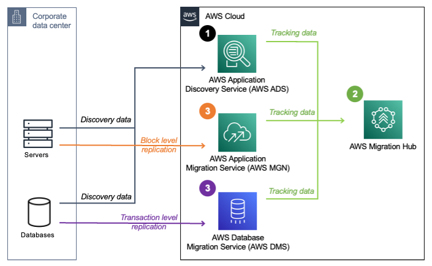

# AWS Migration Hub

## 1. Introduction

AWS Migration Hub is a centralized service designed to streamline and simplify your journey to the AWS Cloud. It acts as the single pane of glass for discovering, planning, executing, and tracking the migration of your on‑premises servers, databases, and applications. Below is a comprehensive overview of its key aspects.

## 2. Overview and Purpose

- **Centralized Migration Management:**  
    AWS Migration Hub provides one location to monitor the progress of your migration projects across multiple AWS Regions and accounts, regardless of the migration tool you use. It helps you manage the entire migration lifecycle from discovery to cutover and post-migration validation.
    
- **Integrated Toolset:**  
    It integrates with native AWS services—such as AWS Application Migration Service, AWS Server Migration Service, and AWS Database Migration Service—as well as partner tools. This integration ensures that status updates from each tool appear in a unified dashboard.
    
- **Discovery and Assessment:**  
    Before you even begin migrating, AWS Migration Hub allows you to discover your on‑premises assets using agents or agentless collectors. This data is then used to group servers into applications, identify dependencies, and generate recommendations for sizing and configuration (such as EC2 instance recommendations).

## 3. Key Features

- **Centralized Dashboard:**  
    View the migration status of all applications and assets from one place. The dashboard aggregates data from various migration tools and displays detailed status indicators, helping you track progress and troubleshoot issues in real time.
    
- **Application Discovery and Grouping:**  
    Using discovery tools like the AWS Discovery Agent, you can collect detailed information about your servers—including performance metrics and network dependencies—and group them logically into applications for more effective planning.
    
- **Migration Tracking:**  
    As you move resources to AWS, AWS Migration Hub tracks key steps (e.g., “replication starting,” “replication complete,” or “AMI created”) to keep you informed of the progress. This tracking applies to both rehosting and replatforming migrations.
    
- **EC2 Instance Recommendations:**  
    By analyzing collected performance data (CPU, memory, etc.), the service recommends the most cost‑effective EC2 instance type to run your workloads, allowing for informed right‑sizing decisions.
    
- **Strategy Recommendations and Modernization:**  
    Beyond simple migration tracking, the Hub offers guidance and templates to help you decide whether to rehost, replatform, or refactor your applications. For example, the Refactor Spaces feature supports incremental refactoring into microservices, minimizing risk while modernizing legacy applications.
    
- **Orchestration:**  
    AWS Migration Hub Orchestrator automates migration workflows using pre‑defined templates, which help reduce manual steps and ensure that dependencies between tasks and tools are managed efficiently. This orchestration accelerates the overall migration process.

## 4. How It Works

The following diagram illustrates how to manage your cloud journey from assessment to migration with AWS Migration Hub:

Here are the three steps necessary to migrate your first workload:

1. Use AWS Application Discovery Service to discover the workload environment, gather performance data and network connectivity details. This data will be sent to Migration Hub.
2. Use Migration Hub to analyze the collected data, identify and tag dependencies, group servers as applications, and generate recommendations for shared and dedicated Amazon Elastic Compute Cloud (Amazon EC2) environments.
3. Replicate onprem servers using AWS Application Migration Service and databases data using AWS Database Migration Service (AWS DMS) to move the workload to AWS. Migration Hub can be used to track the progress of the whole migration.

## 5. Use Cases and Benefits

- **Comprehensive Visibility:**  
    Get a full view of your entire application portfolio, including all on‑premises assets and their migration status, in one consolidated interface.
    
- **Streamlined Migration Process:**  
    By using AWS Migration Hub, you reduce the complexity of managing multiple migration tools and manual processes, accelerating your migration timeline.
    
- **Cost Efficiency:**  
    AWS Migration Hub is free to use for discovery and tracking. You only incur costs for the underlying migration services and any AWS resources provisioned during the migration.
    
- **Enhanced Collaboration:**  
    With a centralized tracking system, different teams within your organization can collaborate effectively, ensuring that migration tasks and responsibilities are clearly visible and managed.

## 6. Conclusion

AWS Migration Hub is a powerful service that centralizes every step of your migration journey. By combining discovery, assessment, execution, and post-migration modernization in a single interface, it minimizes the complexity of cloud migration while maximizing transparency and efficiency throughout the process.

If you’re planning a migration to AWS or need a more streamlined way to manage ongoing migrations, AWS Migration Hub offers the tools, guidance, and integrations needed to ensure a successful transformation to the cloud.