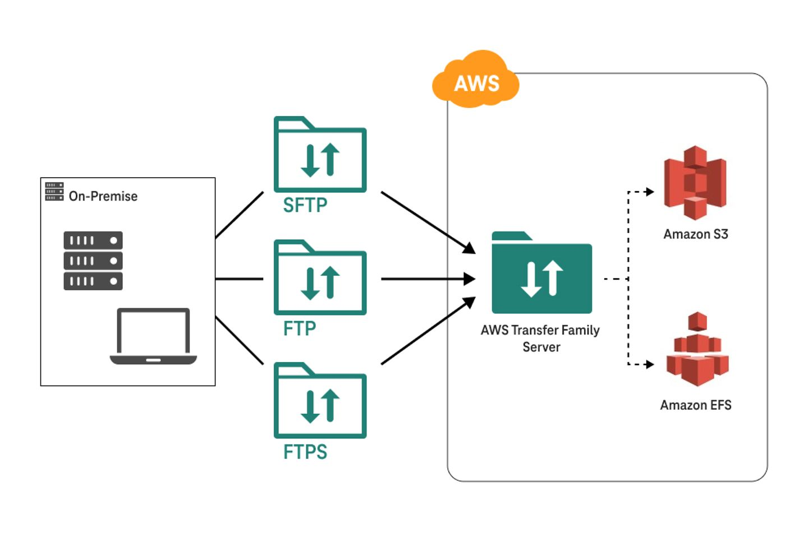

## AWS Transfer Family
## 1. Introduction

AWS Transfer Family is a fully managed service that lets you securely transfer files into and out of AWS storage services—specifically Amazon S3 and Amazon EFS—using industry‑standard protocols. Instead of using APIs or mounting file systems directly, many organizations prefer to use familiar legacy protocols such as FTP, FTPS, or SFTP. AWS Transfer Family enables these protocols as a fully managed solution, ensuring that existing client configurations remain unchanged while you modernize your file transfer workflows.

## 2. Core Protocols & Integration

AWS Transfer Family currently supports multiple file transfer protocols:

- **FTP (File Transfer Protocol):** An unencrypted protocol, typically used in internal or controlled environments.
- **FTPS (FTP over SSL/TLS):** Adds encryption to FTP, protecting data in transit.
- **SFTP (Secure File Transfer Protocol):** Uses SSH for secure file transfer.
- **AS2:** Designed for B2B exchanges where non‑repudiation is crucial, including support for Message Disposition Notifications (MDNs).
- **Web Apps:** Browser-based interfaces that allow users to interact with files stored in Amazon S3.

Regardless of the protocol, AWS Transfer Family forwards file operations directly to Amazon S3 or Amazon EFS. This seamless integration means you no longer need to modify legacy client applications or worry about managing underlying infrastructure.

## 3. Key Features and Benefits

### 3.1. Fully Managed, Elastic, and Highly Available

- **Managed Infrastructure:** AWS handles server provisioning, scaling, and maintenance.
- **Auto Scaling:** Automatically adjusts to meet changing workloads without manual intervention.
- **High Availability:** Designed with redundancy across multiple Availability Zones to ensure 24/7 availability.

### 3.2. Multi‑Protocol Support and Native Integration

- **Legacy Protocols Supported:** In addition to FTP, FTPS, and SFTP, support for AS2 and browser-based transfers means that nearly all file transfer workflows are accommodated.
- **AWS Storage Integration:** Files are stored as objects in Amazon S3 or as files in Amazon EFS, making them instantly available for data processing, analytics, or archival.
- **Security & Monitoring:** Integrated with AWS IAM for access control, AWS CloudWatch and CloudTrail for logging and monitoring, and various encryption options to protect data both in transit and at rest.

### 3.3. Workflow Automation and Managed Workflows

- **Event-Driven Processing:** AWS Transfer Family publishes transfer events to Amazon EventBridge, which can trigger downstream processing tasks such as decryption, tagging, or antivirus scanning.
- **Managed Workflows:** A no-code/low-code framework to define and execute a sequence of file processing steps automatically on every upload—ideal for consistent post-transfer operations.

## 4. Authentication & User Management

Controlling user access is flexible and critical to the security of file transfers. You can:

- **Store Credentials Internally:** Use the service-managed option for SFTP users.
- **Integrate External Identity Providers:** Options include Microsoft Active Directory, LDAP, Okta, Amazon Cognito, or even custom identity providers.
- **Customizable Access Policies:** Integration with AWS IAM enables fine-grained control over file and folder permissions.

By leveraging these authentication methods, you can apply consistent policies and secure your transfer workflows without altering your existing client configurations.

## 5. Endpoint Types and Configurations

When deploying AWS Transfer Family, you choose an endpoint type that best meets your connectivity and security requirements. There are three main options:

### 5.1. Public Endpoint

- Directly accessible from the internet.
- **Considerations:** AWS manages the IP address (which may change over time), so administrators should rely on the provided DNS name. While network-level filtering isn’t possible with ephemeral IPs, user-level security and encryption still protect data.

### 5.2. VPC Endpoint with Internal Access

- The server is deployed within your Virtual Private Cloud (VPC), and file transfers occur over private IP addresses.
- **Benefits:** Enhanced security via AWS security groups and network ACLs; ideal for internal applications or on-premises connectivity through VPN or AWS Direct Connect.

### 5.3. VPC Endpoint with Internet-Facing Access

- **Description:** A hybrid setup where the server resides in your VPC but is assigned an Elastic IP for external access.
- **Benefits:** Provides a stable public-facing IP address for firewall allow-listing, while still leveraging private VPC security controls.

These endpoint types offer the flexibility to balance ease of connectivity with the security requirements of your organization.

## 6. Pricing Model

AWS Transfer Family is priced on a pay‑as‑you‑go basis:

- **Hourly Charges:** Billed per hour for each server endpoint, regardless of the number of enabled protocols.
- **Data Transfer Fees:** Charges based on the volume of data uploaded and downloaded.
- **Additional Feature Costs:** Managed workflows and SFTP connectors may incur extra usage-based charges.

This pricing model enables cost-effective scaling without upfront investments.

## Conclusion

AWS Transfer Family is a robust, cloud-native managed file transfer service that enables organizations to modernize legacy file transfers without disrupting existing workflows. It provides:

- **Multi‑Protocol Support:** From FTP to SFTP, FTPS, AS2, and browser-based access.
- **Seamless Integration:** Directly connects to Amazon S3 and Amazon EFS, leveraging AWS’s powerful ecosystem.
- **Flexible Authentication & Endpoints:** Options to integrate with external identity providers and choose between public or VPC-based connectivity.
- **Operational Efficiency:** Fully managed infrastructure with auto-scaling, high availability, and built‑in automation for file processing.

This integrated overview—combining in-depth technical details with practical deployment and exam-focused insights—serves as a complete reference for designing, implementing, and securing file transfer solutions with AWS Transfer Family. Whether migrating from on-premises systems, exchanging data with partners, or automating file processing workflows, AWS Transfer Family offers the flexibility and scalability needed for modern, secure data transfers.  
