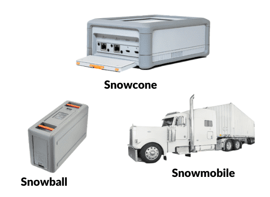

# AWS Snow Family

## 1. Introduction

The AWS Snow Family is a suite of physical devices designed to simplify and secure the transfer, migration, and processing of large volumes of data between on-premises environments and the AWS Cloud—even when network connectivity is limited or unavailable. They are also built with edge computing in mind, so you can run compute workloads right where your data is generated. 

## 2. AWS Snow Family Overview

The Snow Family consists of three main products, each tailored for different scales and scenarios:

- **AWS Snowcone:**  
    A small, rugged, and portable device perfect for edge computing, local data collection, and processing in remote or harsh environments. It’s light enough to carry in a backpack and typically comes with around 8 TB of usable storage, modest compute capabilities, and is available in HDD and SSD versions.  
    
- **AWS Snowball:**  
    A mid-sized appliance available in two variants—**Storage Optimized** (typically offering up to 80 TB of HDD storage plus additional SSD for block volumes) and **Compute Optimized** (geared toward more compute-intensive workloads with lower storage capacity). Snowball devices are used for moving terabytes to petabytes of data quickly, as well as for running edge applications where local processing is needed.  
    
- **AWS Snowmobile:**  
    For the most massive data migrations, Snowmobile is essentially a 45‑foot shipping container mounted on a truck. It’s designed to transfer exabyte-scale data (up to 100 PB per truck) from entire data centers to AWS, making it ideal for organizations with colossal datasets. 

## 3. Key Features & Benefits

- **Secure & Rugged Design:**  
    All Snow Family devices are built to endure harsh conditions and are equipped with tamper-resistant enclosures. They employ robust security measures like 256‑bit AES encryption, Trusted Platform Modules (TPM), and secure erasure protocols to protect data during transit and at rest.
    
- **Edge Computing Capabilities:**  
    Devices like Snowcone and Snowball Edge support local compute workloads. You can run applications—such as AWS IoT Greengrass functions or EC2 instances—directly on the device, enabling real-time data processing even in disconnected scenarios.
    
- **Efficient Data Transfer:**  
    They provide an offline method for data migration. Once you load your data onto the device, you ship it back to AWS, where the data is ingested into services like Amazon S3. This approach avoids the limitations of slow or unreliable network transfers for very large datasets.
    
- **Flexible Service Models:**  
    Depending on your project size and requirements, you can choose:
    - **Snowcone:** Best for small-scale, portable, and remote operations.
    - **Snowball:** Ideal for large-scale migrations and workloads requiring additional compute power.
    - **Snowmobile:** Suited for massive, data center-level migrations.

## 4. Use Cases

- **Cloud Migration:**  
    Move large datasets (from backups, archives, or entire data centers) into the AWS Cloud without relying on high-speed internet.
    
- **Disaster Recovery:**  
    Quickly replicate critical data and run edge applications in isolated environments to ensure business continuity.
    
- **Edge Data Processing:**  
    Deploy computing resources in remote locations—such as industrial sites, oil fields, or military operations—to process data locally before transferring to the cloud.
    
- **Content Distribution & Media:**  
    Collect and process high-resolution media files where network conditions might otherwise hinder timely uploads.

## 5. How It Works

1. **Ordering & Setup:**  
    You start by creating a job in the AWS Management Console, selecting the appropriate device based on your needs. AWS ships the device to your location.
    
2. **Local Data Loading:**  
    Once received, you connect the device to your local network. Using AWS OpsHub or other provided tools, you transfer your data to the device.
    
3. **Data Transfer to AWS:**  
    After the data is loaded, you ship the device back to AWS. Upon arrival, AWS ingests the data into your specified storage service (like S3) and securely erases the device for future reuse.
    
4. **Edge Operations (if applicable):**  
    For edge workloads, the device can run compute tasks locally, and later synchronize results with the cloud when connectivity is available.

## 6. Conclusion

The AWS Snow Family provides versatile solutions for organizations needing to manage large-scale data migrations and edge computing workloads. Whether you’re dealing with remote field data collection, migrating an entire data center, or running compute workloads where connectivity is limited, there’s a Snow device engineered to meet those needs. With its focus on security, rugged design, and seamless integration into the AWS ecosystem, the Snow Family has become an essential tool for modern data-driven enterprises.

By leveraging these devices, companies can reduce reliance on bandwidth-heavy internet transfers, speed up the migration process, and enhance their operational capabilities at the edge—all while maintaining robust security standards.