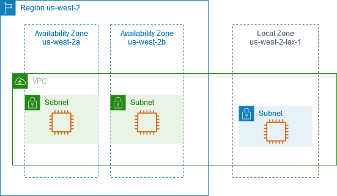

# AWS Local Zone

## 1. Introduction

AWS Local Zones have emerged as a solution for modern applications that demand ultra-low latency and rapid responsiveness. As businesses increasingly deploy real-time applications—such as interactive gaming, live video streaming, or other latency-sensitive workloads—ensuring that these applications operate near their users becomes critical. AWS Local Zones extend an existing AWS Region by placing a selected set of services closer to end users. This not only minimizes latency but also enables organizations to meet specific local data governance requirements, effectively bridging the gap between centralized cloud infrastructure and the localized performance needs of modern applications.

## 2. How AWS Local Zones Work

At its core, AWS Local Zones are an extension of an existing AWS Region. Typically, a region consists of multiple Availability Zones (AZs) that provide geographic redundancy and fault tolerance. However, these AZs are often located at considerable distances from major metropolitan centers, which may introduce unacceptable network latencies for certain applications. AWS Local Zones address this challenge by allowing customers to extend their AWS Regions into new, strategically located zones.

### 2.1. Key Concepts

- **Regional Extension:** A Local Zone is not a standalone region but an extension of a parent AWS Region. For example, a Local Zone labeled `us-east-1-bos-1` is part of the US-East-1 (Northern Virginia) region.
- **Service Availability:** Local Zones support a subset of AWS services that are critical for performance-sensitive applications. Common services available include Amazon EC2 for compute, Amazon EBS for block storage, Amazon RDS for relational databases, Amazon ECS for container orchestration, Amazon ElastiCache for in-memory caching, and AWS Direct Connect for dedicated network connectivity.
- **Geographical Placement:** By placing these services in or near major urban centers—such as Boston, Chicago, Dallas, Houston, or Miami—Local Zones ensure that applications have significantly reduced round-trip times for data communication, directly benefiting user experience.

### 2.2. Operational Mechanics

When a Local Zone is enabled within a region, it functions similarly to a standard Availability Zone in terms of service management and resource deployment. Organizations can extend their Virtual Private Cloud (VPC) across both standard AZs and Local Zones. This integration means that workloads deployed in a Local Zone remain part of the same overall AWS infrastructure, benefiting from consolidated security, centralized management, and seamless networking.

The use of Local Zones is particularly advantageous for latency-sensitive applications. By deploying resources—such as EC2 instances or RDS databases—in a Local Zone, end users experience lower network latencies compared to deployments in a distant primary Availability Zone. This design philosophy effectively brings the cloud closer to the user, enabling near on-premises performance levels.

## 3. Configuring AWS Local Zones

Successful deployment of AWS Local Zones involves two primary configuration steps: enabling the local zone via the AWS Console and extending your VPC subnets to incorporate the new zone.

### 3.1. Enabling Local Zones via AWS Console

The initial step in leveraging AWS Local Zones is to enable the desired local zone in your AWS region. Not all AWS Regions support Local Zones, so the process begins with selecting a region that offers them. For example, while the Europe (Ireland) region might provide only standard Availability Zones, the US-East-1 (Northern Virginia) region offers both standard AZs and additional Local Zones.

**Procedure Overview:**

1. **Region Selection:** Log in to the AWS Management Console and navigate to the EC2 dashboard. Choose a region—such as US-East-1—where Local Zones are available.
2. **Zone Listing:** Within the EC2 settings, review the list of zones. Here, you will notice a distinction between standard Availability Zones, Local Zones, and even specialized wavelength zones.
3. **Local Zone Identification:** Identify the desired Local Zone (for example, the Boston Local Zone) based on your end users’ geographical location.
4. **Enabling the Zone:** Through the zone management interface, update the zone group settings and explicitly enable the Local Zone. Once confirmed, the enabled zone will appear as part of your available infrastructure (e.g., `US-East-1-Boston-1`).

This enabling process allows your account to recognize and use the newly activated Local Zone for resource deployment, setting the stage for further VPC configuration.

### 3.2. Extending VPC Subnets to Local Zones

Once a Local Zone is enabled, integrating it with your existing network architecture is essential. This involves extending your Virtual Private Cloud (VPC) by creating dedicated subnets that reside in the Local Zone.

**Configuration Details:**

- **Subnet Creation:** Within the VPC configuration interface, you can create a new subnet explicitly associated with the enabled Local Zone. This subnet is assigned its own CIDR block, similar to the subnets in standard AZs.
- **IP Range Planning:** As with any VPC design, careful planning of CIDR blocks is critical. Each Local Zone subnet requires a dedicated IP range that does not conflict with existing subnets.
- **Instance Deployment:** With the new subnet in place, you can now launch resources (such as EC2 instances) directly into the Local Zone. This ensures that compute resources are deployed closer to end users, thereby reducing network latency.

While this process involves advanced networking configurations, the key takeaway is that AWS Local Zones integrate seamlessly into your existing VPC structure. This integration enables consistent network connectivity across both standard Availability Zones and Local Zones, allowing for a unified and efficient cloud infrastructure.

## 4. Use Cases and Benefits

AWS Local Zones offer significant advantages for a variety of scenarios, particularly those involving latency-sensitive workloads or specific regulatory requirements.

### 4.1. Key Use Cases

- **Ultra-Low Latency Applications:** For applications that demand immediate responsiveness—such as online gaming, live video streaming, or real-time analytics—deploying resources in a Local Zone ensures that data travels over shorter distances, minimizing delays.
- **Data Residency and Compliance:** Organizations with stringent data residency requirements can leverage Local Zones to ensure that data is stored and processed within specific geographic boundaries, thus adhering to local regulations.
- **Extended On-Premises Integration:** Companies looking to extend on-premises workloads to the cloud in areas not served by a full AWS Region can use Local Zones to bridge this gap. This hybrid approach allows seamless integration of cloud and on-premises resources.
- **Improved User Experience:** By reducing latency, businesses can deliver more responsive and reliable applications to users in metropolitan areas, enhancing overall customer satisfaction and engagement.

### 4.2. Benefits

- **Performance Optimization:** Deploying critical resources in a Local Zone reduces network round-trip times, which is essential for real-time processing and interactive applications.
- **Simplified Management:** Since Local Zones are integrated into the parent AWS Region, they benefit from centralized management, consolidated security policies, and unified billing.
- **Flexibility in Deployment:** Organizations can choose to enable Local Zones only where necessary, allowing them to balance cost and performance while meeting specific operational needs.
- **Enhanced Resiliency:** While Local Zones might offer fewer capacity options compared to main Availability Zones, they still provide the necessary infrastructure to support disaster recovery and high availability for localized applications.

## 5. Conclusion

In summary, AWS Local Zones offer a strategic advantage by delivering near on-premises performance within the cloud. They provide the necessary tools and configurations to ensure that your applications remain both resilient and responsive, no matter where your end users are located.