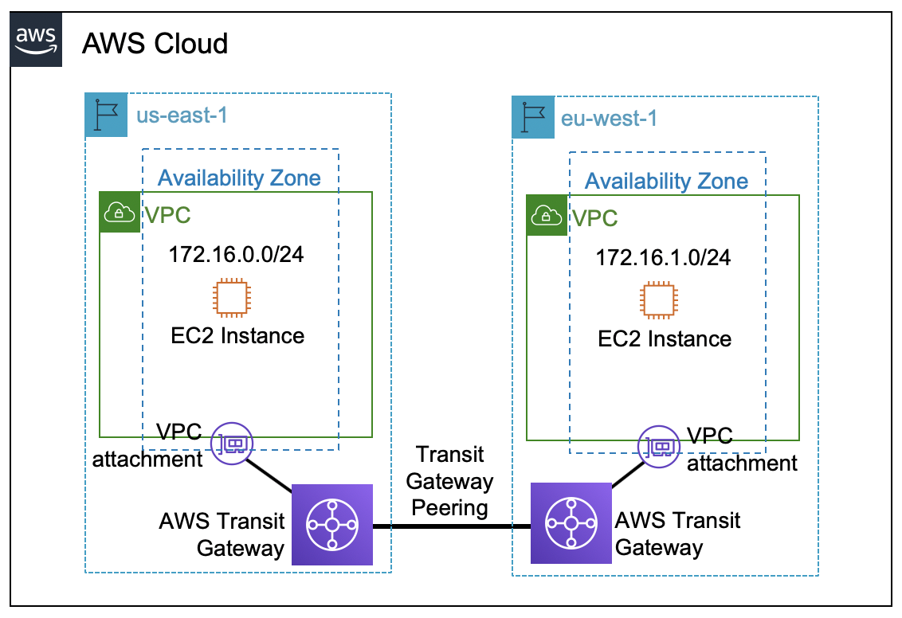

# AWS Transit Gateway

## 1. Introduction

The rapid growth of cloud infrastructure and the proliferation of VPCs in modern enterprises have increased the complexity of network connectivity. AWS Transit Gateway emerged as a response to these challenges by providing a scalable and centralized hub that interconnects VPCs, remote networks, and on-premises data centers.

Historically, organizations connected multiple VPCs using VPC peering. Although VPC peering works well for small deployments, it presents significant challenges as the number of VPCs grows. With VPC peering, each VPC-to-VPC connection is a one-to-one relationship, meaning that as you add more VPCs, the number of peering connections increases exponentially. Moreover, VPC peering does not support transitive routing—if VPC A is peered with VPC B and VPC B with VPC C, then VPC A cannot automatically reach VPC C. These limitations result in complex route management and increased operational overhead.

AWS Transit Gateway was designed to overcome these issues. By acting as a centralized hub, Transit Gateway allows you to attach multiple VPCs and other network entities (such as Direct Connect gateways and VPN endpoints) to a single gateway. This hub-and-spoke model eliminates the need for numerous point-to-point peering connections and enables transitive routing among all attached networks. As a result, network architects can achieve simplified connectivity, centralized route management, and the flexibility to extend network boundaries across regions and AWS accounts.

In the following sections, we delve deep into the core concepts and advanced features of AWS Transit Gateway, illustrating its role in building scalable, secure, and efficient networks.
## 2. Core Concepts

### 2.1 What is AWS Transit Gateway?

AWS Transit Gateway is a regional network transit hub that interconnects VPCs and on-premises networks through a central gateway. By consolidating multiple network connections into a single gateway, it streamlines the process of managing network routes and reduces operational complexity. Some key points about Transit Gateway include:

- **Origins and Evolution:** Introduced in 2018, Transit Gateway was created to address the shortcomings of traditional VPC peering by offering a scalable alternative for managing inter-VPC connectivity.
- **Regional Scope:** Transit Gateway is a regional resource, meaning that all VPCs attached to it must reside in the same AWS region. For cross-region connectivity, multiple Transit Gateways can be established and interconnected via peering.
- **Centralized Routing:** The gateway operates as a regional router, maintaining a default route table where routes from all attached networks are propagated. This centralized routing capability greatly simplifies the process of managing network traffic among multiple VPCs and hybrid networks.
- **Scalability and Flexibility:** With support for up to 5,000 attachments, Transit Gateway is designed to accommodate large-scale deployments, enabling enterprises to interconnect thousands of VPCs and remote networks.
- **Integration with Other AWS Services:** Transit Gateway seamlessly integrates with AWS Direct Connect, AWS Site-to-Site VPN, and third-party SD-WAN solutions, forming the backbone for diverse connectivity scenarios.

By abstracting the complexity of individual VPC-to-VPC connections, Transit Gateway not only simplifies network design but also provides a platform for implementing advanced routing and security strategies.

### 2.2 Key Features and Use Cases

Transit Gateway offers a rich set of features that make it a powerful component in modern network architectures. Some of the most important features and their typical use cases include:

- **VPC Attachments:** Enables the connection of multiple VPCs to the Transit Gateway. This allows for transitive routing among VPCs, meaning that every VPC can communicate with every other VPC through the centralized gateway.
- **VPN Attachments:** Provides the ability to terminate AWS-managed site-to-site VPN connections directly on the Transit Gateway. This is particularly useful for hybrid network architectures, where on-premises data centers or branch offices must securely connect to AWS.
- **Direct Connect Integration:** Supports integration with AWS Direct Connect through Transit VIFs (Virtual Interfaces), offering a high-throughput, low-latency link between on-premises networks and the AWS cloud.
- **Transit Gateway Connect:** Extends connectivity to third-party virtual appliances—such as SD-WAN routers—via GRE tunnels and BGP peering. This attachment type is essential when organizations want to integrate external network controllers or appliances with their AWS environment.
- **Transit Gateway Peering:** Facilitates private connectivity between Transit Gateways in different regions or accounts. This enables enterprises to establish global networks that span multiple AWS regions, ensuring secure and scalable connectivity.
- **Routing Domains and Propagation:** Transit Gateway provides a default route table where all attached network routes are automatically propagated. Network administrators can also create additional route tables (routing domains) to segment traffic, thereby isolating different parts of the network as needed.
- **Multicast Support:** For workloads that require one-to-many communication, Transit Gateway supports multicast traffic. This is especially valuable in scenarios such as live media streaming, real-time conferencing, and financial market data distribution.
- **Resource Sharing via AWS RAM:** Transit Gateway resources can be shared across AWS accounts using the AWS Resource Access Manager (RAM). This facilitates centralized network management in multi-account environments and ensures that organizations can enforce consistent policies across different business units.
- **Advanced Traffic Management:** With features such as appliance mode and flow hash algorithms, Transit Gateway optimizes traffic routing within and across availability zones, ensuring that stateful appliances like firewalls and IPS/IDS systems can operate effectively.

**Common Use Cases:**

- **Hybrid Cloud Connectivity:** By consolidating VPN and Direct Connect attachments, Transit Gateway serves as the hub for hybrid architectures, enabling seamless connectivity between on-premises data centers and AWS.
- **Centralized Security and Inspection:** Deploying network appliances in a centralized “hub” VPC allows enterprises to inspect, filter, and secure traffic flowing between VPCs and external networks.
- **Global Multi-Region Architectures:** Transit Gateway Peering enables organizations to extend their network architecture across multiple AWS regions while maintaining secure, private connectivity.
- **Scalable Inter-VPC Communication:** For organizations with hundreds or thousands of VPCs, Transit Gateway offers a scalable alternative to VPC peering, reducing the complexity of managing multiple one-to-one connections.

With these features and use cases in mind, the remainder of this chapter explores the design, deployment, and management of AWS Transit Gateway in detail.

## 3. Attachments and Routing

One of the key strengths of AWS Transit Gateway is its ability to connect diverse networks through various attachment types and to manage routing centrally. In this section, we examine how different attachments are created and how routing is performed within the Transit Gateway.

### 3.1 VPC Attachments: Connecting Virtual Private Clouds

A primary use case for Transit Gateway is connecting multiple VPCs in a region. By attaching VPCs to a Transit Gateway, you create a hub-and-spoke architecture where each VPC is a spoke connected to the central hub.

#### Establishing VPC Attachments

When you create a VPC attachment:

- **Selection of Subnets:** You must specify one subnet per availability zone (AZ) in which the VPC attachment will reside. These subnets are dedicated for Transit Gateway connectivity, and they host the Elastic Network Interfaces (ENIs) created by the Transit Gateway.
- **CIDR Non-Overlap Requirement:** The CIDR ranges of attached VPCs must not overlap. This is a critical prerequisite, ensuring that routing remains unambiguous and that each VPC’s address space is distinct.
- **Automatic Route Propagation:** Once a VPC is attached to a Transit Gateway, its CIDR is automatically propagated to the Transit Gateway’s default route table. For example, if you have VPC A (10.0.0.0/16), VPC B (10.1.0.0/16), and VPC C (10.2.0.0/16), the Transit Gateway route table will automatically include routes for each CIDR.

#### Routing Considerations for VPC Attachments

Although routes are automatically propagated to the Transit Gateway route table, additional configuration is required on the VPC side:

- **Static Routes in VPC/Subnet Route Tables:** While the Transit Gateway maintains its own routing, the VPCs must have corresponding static routes that direct traffic toward the Transit Gateway. For instance, a VPC’s main route table might have an entry such as “0.0.0.0/0 via Transit Gateway attachment,” ensuring that traffic destined for other VPCs is sent to the Transit Gateway.
- **Full Mesh Connectivity:** Once correctly configured, any VPC attached to the Transit Gateway can communicate with any other attached VPC. Traffic flows from the source VPC to the Transit Gateway, which then uses its route table to forward the traffic to the appropriate VPC attachment.
- **Segmentation with Routing Domains:** In certain architectures, you may wish to isolate traffic flows. By creating multiple route tables (routing domains) within the Transit Gateway, you can control which VPCs are allowed to communicate with one another. For example, you might configure one routing domain to permit full mesh connectivity among VPCs and a second to restrict east–west traffic while allowing connectivity to an on-premises network.

In practice, designing VPC attachments and associated route tables requires careful planning. You must balance the need for simplicity (using a common default route table) against the need for security and traffic segmentation (using multiple routing domains).

### 3.2 Routing Fundamentals: Route Tables, Propagation, and Prioritization

The transit gateway’s routing mechanism is central to its ability to interconnect diverse networks. In this section, we explore how route tables function within Transit Gateway, how routes are propagated, and the rules that determine traffic flow.

#### The Default Transit Gateway Route Table

When a Transit Gateway is created, it automatically includes a default route table. This table:

- **Aggregates Routes:** All VPC attachments automatically propagate their VPC CIDRs to the default route table. As new attachments are added, the default table is updated accordingly.
- **Enables Transitive Routing:** When traffic enters the Transit Gateway, the default route table determines the correct outbound attachment based on the destination CIDR. For example, if traffic originates in VPC A and is destined for VPC B, the Transit Gateway consults its route table to determine the corresponding attachment for VPC B’s CIDR.
- **Central Control Point:** The default route table can be used as-is in simple scenarios. However, for more granular control, you may create additional route tables and associate specific attachments with them.

#### Static vs. Propagated Routes

Two key concepts in Transit Gateway routing are static and propagated routes:

- **Propagated Routes:** These routes are automatically learned by the Transit Gateway from attached networks. For instance, when a VPC is attached, its CIDR is automatically added to the route table.
- **Static Routes:** In contrast, static routes must be manually added. On the VPC side, even though the Transit Gateway is aware of all propagated routes, each VPC’s route table does not automatically include routes for remote VPCs. You must manually configure routes in VPC route tables that forward traffic destined for remote CIDRs to the Transit Gateway attachment.

This two-layer routing approach ensures that both ends of the traffic flow—the Transit Gateway and the VPC—are properly configured. Failing to set up the static routes in the VPC route tables can result in dropped traffic, even if the Transit Gateway itself is correctly configured.

#### Routing Domains: Segmentation and Traffic Control

In more complex scenarios, you might need to segregate traffic flows so that certain VPCs do not communicate directly. This is accomplished by creating multiple routing domains (i.e., additional route tables) within the Transit Gateway:

- **Unified Routing Domain:** In a flat network design where all VPCs must communicate freely, you use a single, unified route table. Every propagated route is present, and traffic flows unrestricted between all attachments.
- **Segmented Routing Domains:** In cases where you require isolation—such as when different VPCs represent separate customers in a SaaS model—you can define segmented routing domains. For example, one routing domain might allow VPC-to-VPN traffic (connecting to on-premises networks) while preventing direct communication between the VPCs. This ensures that sensitive data or workloads remain isolated.

By carefully planning your routing domains, you gain precise control over which networks can interact. This level of granularity is particularly important in environments with stringent security or compliance requirements.

#### Prioritization and Route Matching

When a packet arrives at the Transit Gateway, the gateway’s route table is consulted to determine the best match:

- **Longest Prefix Match:** Like traditional IP routing, Transit Gateway uses the longest prefix match algorithm. This means that if multiple routes could apply to a given destination, the route with the most specific (longest) prefix is selected.
- **Static vs. Propagated Preference:** In some cases, both static and propagated routes might be available for the same destination. Administrators must be aware of these interactions to ensure that the desired routing behavior is achieved.
- **Custom Route Tables:** You can associate different attachments with specific route tables. This means that even if a VPC is attached to the Transit Gateway, it can be limited to a particular routing domain. As a result, traffic may be restricted or directed in ways that differ from the default behavior.

Understanding these routing fundamentals is essential for designing reliable and secure network architectures. Whether you are creating a simple flat network or a complex segmented architecture, careful planning of route propagation and static routes will ensure that traffic flows efficiently and securely.

## 4. Network Design Patterns

AWS Transit Gateway provides a flexible platform for implementing a variety of network design patterns. In this section, we discuss the most common patterns used in AWS architectures and how Transit Gateway can be leveraged to support them.

### 4.1 Hub-and-Spoke Architecture

The hub-and-spoke model is one of the most popular network designs enabled by Transit Gateway. In this pattern:

- **Central Hub:** The Transit Gateway serves as the central hub that connects all VPCs and external networks.
- **Spoke VPCs:** Each VPC acts as a spoke, attaching to the Transit Gateway. This configuration simplifies the network topology by reducing the number of point-to-point connections.
- **Centralized Services:** In many designs, the hub is also the location for centralized resources such as internet gateways, NAT gateways, firewall appliances, and load balancers. This centralization allows for consistent policy enforcement and easier traffic management.

**Advantages of the Hub-and-Spoke Model:**

- **Simplicity:** Instead of configuring a full mesh of VPC peering connections, you attach each VPC to the hub, and all routing is managed centrally.
- **Scalability:** As your organization grows, you can add more spoke VPCs without the overhead of managing numerous individual peering connections.
- **Security:** Centralized inspection points (such as firewalls or IDS/IPS appliances) can be deployed in the hub to monitor and control traffic between spokes.
- **Cost Efficiency:** By reducing the number of connections, you can simplify management and potentially reduce data transfer costs.

**Design Considerations:**

- **Route Table Management:** In the hub-and-spoke model, the Transit Gateway’s route table is the focal point. Administrators must carefully manage which routes are propagated and which static routes are defined in each spoke.
- **Traffic Flow Optimization:** Depending on your requirements, you may need to design separate routing domains to ensure that only certain traffic flows from spokes to on-premises networks or the internet.
- **Centralized Resource Placement:** Placing shared resources in the hub allows for uniform policy enforcement. However, this design also means that the hub can become a single point of failure if not designed with redundancy in mind.

### 4.2 Multi-Region and Cross-Account Strategies

As organizations expand globally, the need for multi-region and cross-account connectivity becomes critical. AWS Transit Gateway facilitates these strategies in several ways.

#### Multi-Region Architectures

- **Transit Gateway Peering:** While a single Transit Gateway is regional, you can peer Transit Gateways across different regions to enable global connectivity. In a multi-region architecture, each region hosts its own Transit Gateway, and peering connections between these gateways provide secure, private, and encrypted connectivity.
- **Static Route Management:** Because Transit Gateway peering does not support dynamic routing protocols such as BGP, you must manage static routes on both sides of the peering connection. This means carefully planning which routes are advertised and ensuring that they are kept in sync.
- **Resilience and Redundancy:** Multi-region architectures provide geographic redundancy. If one region experiences an outage, traffic can be rerouted to another region, ensuring business continuity.

#### Cross-Account Connectivity

- **Resource Sharing with AWS RAM:** In large organizations with multiple AWS accounts (whether as part of an AWS Organization or as separate entities), Transit Gateway sharing is enabled via AWS Resource Access Manager (RAM). This allows a central account to own the Transit Gateway while sharing it with other accounts, enabling seamless interconnectivity without duplicating infrastructure.
- **Centralized Control vs. Distributed Access:** Although VPCs in different accounts can attach to a shared Transit Gateway, the control of route propagation and routing policies remains with the Transit Gateway owner. This centralization ensures consistent network policies but may also require coordination among teams.
- **Standardized Networking Policies:** With a shared Transit Gateway, organizations can enforce standardized routing, security, and monitoring policies across all accounts, leading to more predictable network behavior and enhanced security posture.

**Practical Applications:**

- **Global Enterprises:** Large multinational companies can use Transit Gateway peering to connect their regional AWS deployments, providing a seamless, global network architecture.
- **Multi-Tenant Environments:** Service providers that host VPCs for multiple customers can use cross-account Transit Gateway sharing to isolate customer environments while still benefiting from centralized management.
- **Hybrid Cloud Architectures:** Combining on-premises connectivity with multi-region AWS deployments allows enterprises to extend their data centers into the cloud while maintaining control over data routing and security.

## 5. Availability Zone Strategies

Designing an AWS Transit Gateway solution is not only about connecting networks but also about ensuring high availability, fault tolerance, and optimal performance. The deployment of Transit Gateway attachments in relation to Availability Zones (AZs) plays a critical role in achieving these goals.

### 5.1 AZ Considerations: Redundancy and Performance

When you attach a VPC to a Transit Gateway, you must choose one subnet per AZ. This requirement leads to several important design considerations:

#### Dedicated Subnets for Transit Gateway Attachments

- **ENI Placement:** Each Transit Gateway attachment creates an Elastic Network Interface (ENI) in the designated subnet. This ENI is responsible for sending and receiving traffic between the VPC and the Transit Gateway.
- **Subnet Isolation:** It is best practice to dedicate specific subnets for Transit Gateway attachments rather than using general-purpose subnets. This separation ensures that routing, security, and performance optimizations are consistently applied.
- **IP Address Planning:** When designing the subnets for Transit Gateway attachments, you typically choose a /28 subnet to balance the need for sufficient IP addresses (11 usable addresses) against the risk of wastage.

#### AZ Redundancy and Fault Tolerance

- **Multiple AZ Attachments:** To ensure high availability, you should create Transit Gateway attachments in multiple Availability Zones. If one AZ experiences an outage, the other attachments continue to route traffic, ensuring uninterrupted connectivity.
- **Consistent Performance:** Traffic between VPCs attached to the Transit Gateway is routed through the ENI in the same AZ if available. This localized routing minimizes latency and avoids additional cross-AZ data transfer charges.
- **Designing for Load Distribution:** By carefully selecting subnets in multiple AZs, you distribute the network load, preventing any single AZ from becoming a bottleneck. This is especially important for applications that require high throughput and low latency.

#### Considerations for On-Premises Connectivity

When extending connectivity from AWS to on-premises networks (via VPN or Direct Connect), the AZ placement of Transit Gateway attachments can also affect performance:

- **Consistency in Routing:** On-premises devices or customer gateways must be aware of the AZ-specific endpoints to avoid asymmetric routing. Proper route table configuration and static route entries in VPCs help ensure that traffic remains within the same AZ as much as possible.
- **Cost Implications:** Data transferred between AZs may incur additional charges. By designing your architecture so that most traffic remains within a single AZ, you can optimize costs without sacrificing availability.

### 5.2 AZ Affinity and Appliance Mode: Traffic Optimization

AWS Transit Gateway includes mechanisms designed to optimize traffic flow between attachments, especially when stateful appliances (such as firewalls or packet inspectors) are involved. Two important concepts in this regard are AZ affinity and appliance mode.

#### AZ Affinity

- **Default Behavior:** Transit Gateway is designed to maintain AZ affinity, meaning that if a packet originates in a particular AZ, the gateway will, by default, attempt to deliver the packet to an endpoint within the same AZ. This minimizes cross-AZ traffic, which can lead to higher latency and additional costs.
- **Benefits:** Keeping traffic within the same AZ offers significant advantages:
    - **Reduced Latency:** Localized traffic minimizes the network path, resulting in faster response times.
    - **Cost Savings:** Avoiding cross-AZ data transfer can lead to lower networking costs.
    - **Simplified Troubleshooting:** When traffic is contained within one AZ, it is easier to isolate and resolve issues.

#### Appliance Mode

While AZ affinity is beneficial for most scenarios, complications can arise when using stateful network appliances. These appliances often require that traffic follow a symmetric path—meaning that packets in both directions should traverse the same ENI (or network path) to ensure that connection state is maintained. Here’s where appliance mode comes into play:

- **Flow Hash Algorithm:** By default, Transit Gateway uses a flow hash algorithm to determine the outbound path. This algorithm considers various factors such as source and destination IP addresses, ports, and protocol. However, this algorithm may choose different ENIs for outgoing and incoming traffic when endpoints reside in different AZs.
- **Enabling Appliance Mode:** When you enable appliance mode on a Transit Gateway attachment, the gateway “sticks” to the initial ENI selected for a given flow, regardless of AZ. This ensures symmetric routing, which is crucial for stateful appliances that track connection state.
- **Use Cases:** Appliance mode is typically enabled when:
    - You deploy third-party firewall or IDS/IPS solutions that require symmetric traffic flows.
    - You implement centralized packet inspection or traffic monitoring systems.
    - You require the traffic to consistently traverse a specific appliance for compliance or performance reasons.
- **Configuration:** Appliance mode can be enabled during the creation of a Transit Gateway VPC attachment or modified later using AWS CLI or SDK. By setting the option `ApplianceModeSupport=enable`, you ensure that the Transit Gateway maintains a consistent path for the life of the flow.

## 6. Connectivity Options

AWS Transit Gateway is versatile in the types of connectivity it supports. In addition to VPC attachments, Transit Gateway can connect to on-premises networks and external devices using various attachment types. This section discusses the different connectivity options available, including Transit Gateway Peering, Connect attachments for SD-WAN integration, VPN attachments for site-to-site connectivity, and Direct Connect integration for hybrid cloud networking.

### 6.1 Cross-Account and Cross-Region Peering

Transit Gateway Peering extends the connectivity provided by a Transit Gateway beyond a single region or AWS account.

#### How Transit Gateway Peering Works

- **Establishing a Peering Connection:** Similar to VPC peering, one Transit Gateway sends a request to peer with another Transit Gateway, which may reside in a different region or account. The receiving Transit Gateway must accept the peering request.
- **Routing Considerations:** Routes for peered Transit Gateways are not dynamically exchanged via BGP. Instead, you must manually configure static routes on each Transit Gateway to direct traffic toward the peering attachment.
- **Security and Encryption:** Transit Gateway Peering connections are private and encrypted by default. They allow secure transmission of data between AWS regions or accounts without traversing the public internet.
- **Bandwidth and Performance:** Peering supports high-throughput connectivity (up to 50 Gbps per attachment) and is well suited for applications that require significant data transfer between regions.

#### Use Cases

- **Global Enterprise Networks:** Large organizations with multi-region AWS deployments can use Transit Gateway Peering to build a cohesive, global network.
- **Customer and Partner Connectivity:** Businesses can securely connect their AWS infrastructure to customers’ or partners’ networks, even if those networks are in different AWS accounts or regions.
- **Centralized Hybrid Architectures:** By combining Transit Gateway Peering with other connectivity options, enterprises can achieve a unified hybrid architecture that spans cloud and on-premises environments.

### 6.2 Connect Attachments: SD-WAN Integration

Transit Gateway Connect attachments are designed for integrating third-party virtual appliances—often used in SD-WAN (Software-Defined Wide Area Network) architectures—with AWS Transit Gateway.

#### Key Concepts of Connect Attachments

- **GRE Tunnels and BGP:** To establish a Connect attachment, a Generic Routing Encapsulation (GRE) tunnel is created between the Transit Gateway and the virtual appliance. Along with the GRE tunnel, a Border Gateway Protocol (BGP) session is established to exchange routing information.
- **Transport Attachment:** Before the GRE tunnel is set up, there must be a transport mechanism in place. This can be a VPC attachment (if the appliance is deployed within AWS) or a Direct Connect attachment (if the appliance is on-premises).
- **Bandwidth Considerations:** Each GRE tunnel typically supports up to 5 Gbps. Moreover, you can configure up to four Connect peers on the same attachment, thereby achieving an aggregated bandwidth of up to 20 Gbps.
- **Stateful vs. Stateless Operations:** Unlike VPN attachments, Connect attachments rely solely on BGP for dynamic routing. Static routing is not supported, so a proper BGP configuration is essential.

#### Use Cases and Benefits

- **SD-WAN Integration:** Enterprises that are already using SD-WAN solutions in their on-premises networks can extend these networks into AWS using Connect attachments. This ensures that traffic continues to be routed efficiently and securely, leveraging existing network appliances.
- **Enhanced Performance:** With higher throughput and the ability to aggregate bandwidth, Connect attachments are ideal for applications that require robust performance across cloud and on-premises environments.
- **Simplified Management:** By integrating virtual appliances directly into the Transit Gateway architecture, network administrators can centralize route management and monitoring, reducing operational complexity.

### 6.3 VPN Attachments: Site-to-Site Connectivity

AWS Transit Gateway also supports VPN attachments, enabling the termination of AWS-managed site-to-site IPsec VPN tunnels on the Transit Gateway.

#### Overview of VPN Attachments

- **Managed VPN Connectivity:** AWS provides a managed site-to-site VPN service that allows you to securely connect your on-premises network or branch offices to AWS.
- **Termination on Transit Gateway:** Instead of terminating VPN tunnels on a Virtual Private Gateway (VGW) within a VPC, you can terminate them directly on the Transit Gateway. This allows you to aggregate multiple VPN connections on a single Transit Gateway.
- **Static vs. Dynamic Routing:** With VPN attachments, dynamic routing using BGP can be enabled, allowing the exchange of routes between your on-premises devices and the Transit Gateway. In cases where static routing is used, you must manually configure the required routes.
- **Accelerated VPN with Global Accelerator:** AWS Global Accelerator can be used to optimize the network path of VPN traffic. In this configuration, traffic from the on-premises network is first routed to the nearest AWS edge location before entering the Transit Gateway over a dedicated VPN connection, thereby reducing latency and improving performance.

#### Aggregated Bandwidth and ECMP

- **Multiple VPN Tunnels:** For higher throughput, you can establish multiple VPN tunnels terminating on the same Transit Gateway. While each individual tunnel has a bandwidth limit (typically 1.25 Gbps per tunnel), enabling Equal Cost Multi-Path (ECMP) routing allows traffic to be load balanced across multiple tunnels.
- **Per-Flow Bandwidth Limits:** Although the total aggregated bandwidth may exceed the limit of a single tunnel, individual TCP flows remain constrained by the per-tunnel bandwidth cap.

#### Use Cases

- **Hybrid Connectivity:** VPN attachments are essential for scenarios where an enterprise needs to establish secure, encrypted connectivity between on-premises networks and AWS.
- **Resilient Failover:** With multiple VPN tunnels in place, organizations can achieve redundancy. If one tunnel fails, traffic is automatically rerouted to an alternate, active tunnel.
- **Cost-Effective Solutions:** For smaller-scale deployments or branch office connections, VPN attachments provide a cost-effective solution compared to Direct Connect, while still meeting security and performance requirements.

### 6.4 Direct Connect Integration: Hybrid Cloud Networking

For organizations that require dedicated, high-throughput connectivity between on-premises data centers and AWS, AWS Direct Connect is the preferred solution. Transit Gateway integrates with Direct Connect to offer scalable hybrid cloud networking.

#### Transition from Private VIF to Transit VIF

- **Traditional Direct Connect Architecture:** Without Transit Gateway, Direct Connect typically involves creating a Private Virtual Interface (VIF) that connects to a Virtual Private Gateway in a single VPC. However, this architecture has limitations—most notably, the maximum number of VPCs that can be attached.
- **Using Transit VIF:** By creating a Transit VIF, you can attach a Direct Connect connection to a Transit Gateway. This not only overcomes the limits of VPC peering but also allows you to scale connectivity across hundreds or even thousands of VPCs.
- **Multi-Region and Cross-Account:** Transit Gateway integration with Direct Connect is flexible enough to support connections spanning multiple regions and AWS accounts. Although there are certain quota limits (such as the number of Transit Gateways per Direct Connect gateway), this approach offers significant scalability for large enterprises.

#### Encryption and Hybrid Scenarios

- **Optimized Network Paths:** In cases where traffic security is paramount, you can combine Direct Connect with an IPsec VPN to ensure that data remains encrypted even over the dedicated connection. This is typically achieved by establishing a Public VIF and terminating an IPsec VPN on the Transit Gateway.
- **Cost and Performance Trade-Offs:** While Direct Connect offers higher performance and lower latency compared to internet-based VPN connections, it also introduces additional Transit Gateway processing charges. Therefore, it is important to balance performance needs against cost considerations.

#### Use Cases

- **Enterprise-Grade Hybrid Clouds:** Organizations that run mission-critical workloads on-premises and in the cloud can leverage Transit Gateway with Direct Connect to create a unified, high-performance hybrid cloud environment.
- **Scalable Interconnectivity:** For enterprises with hundreds of VPCs that need to connect to on-premises data centers, this architecture offers the scalability that traditional Direct Connect configurations cannot match.
- **Security-Driven Designs:** When compliance or regulatory requirements dictate that all traffic be encrypted at the IP layer, combining Direct Connect with VPN termination on Transit Gateway becomes a compelling solution.

## 7. Advanced Features

Beyond the basic connectivity and routing functions, AWS Transit Gateway offers advanced features that support complex networking scenarios. This section covers multicast support and resource sharing with AWS RAM.

### 7.1 Multicast Support: Efficient Group Communication

Multicast is a communication method that allows a single packet to be delivered to multiple destinations simultaneously. AWS Transit Gateway supports multicast, which is particularly valuable for use cases such as live media streaming, real-time conferencing, and distribution of financial data.

#### Understanding Multicast

- **Basic Concepts:** Multicast works by sending data packets to a multicast IP address (a Class D address). Devices that are configured to join the multicast group receive the packets. Unlike unicast communication (one-to-one), multicast is inherently one-to-many.
- **Group Membership:** Devices can dynamically join or leave multicast groups using the Internet Group Management Protocol (IGMP). Alternatively, static membership can be configured via the AWS console or CLI.
- **Source and Destination Rules:** Multicast groups have a defined set of source addresses and group memberships. Only designated sources can transmit multicast traffic if the multicast domain is configured with source restrictions.

#### Multicast in Transit Gateway

- **Enabling Multicast:** When creating a Transit Gateway, you must enable multicast support at creation time. This option cannot be added later.
- **Multicast Domains and Groups:** A multicast domain is established within the Transit Gateway. Within that domain, you create multicast groups and assign endpoints (ENIs from VPC attachments) as group members.
- **Static and Dynamic Membership:** You can manage multicast group membership statically or allow endpoints to join dynamically using IGMP. The Transit Gateway periodically sends IGMP query messages to refresh group membership.
- **Hybrid Integration:** In scenarios where multicast traffic originates on-premises, you can extend the multicast domain using GRE tunnels. A virtual router in your VPC can terminate the GRE tunnel, allowing on-premises multicast sources to communicate with AWS endpoints.

#### Operational Considerations

- **Security:** Network ACLs and security groups must be configured to allow IGMP traffic, as well as UDP traffic for the actual multicast data.
- **Source Limitations:** Only Nitro System instances are supported as multicast senders. Non-Nitro instances can receive multicast traffic but require the source/destination check to be disabled.
- **Use Cases:** Typical applications include streaming video to multiple viewers, real-time financial data feeds, and collaborative conferencing systems.

### 7.2 Resource Sharing with AWS RAM (Resource Access Manager)

In large, multi-account environments, the ability to share resources across accounts can greatly simplify network management. AWS Resource Access Manager (RAM) allows Transit Gateway resources to be shared securely and efficiently.

#### How RAM Works with Transit Gateway

- **Resource Sharing:** Using AWS RAM, you can share a Transit Gateway with other AWS accounts within your organization or even with external partner organizations. The owner of the Transit Gateway retains full control over its configuration.
- **Permissions and Boundaries:** When sharing a Transit Gateway, you define what actions the recipient accounts are permitted to perform. Typically, while they can attach their VPCs to the shared Transit Gateway, they cannot modify its route tables or propagation settings.
- **Cross-Account Attachments:** Even though the Transit Gateway is owned by one account, VPCs from other accounts can attach to it. This centralizes network management while maintaining security boundaries.

#### Design Considerations

- **Route Table Control:** The Transit Gateway owner maintains control over routing policies. This centralization ensures that all attached VPCs, regardless of account, adhere to the same network rules.
- **Availability Zone Consistency:** When connecting VPCs across accounts, it is important to use Availability Zone (AZ) IDs rather than AZ names. AZ IDs remain consistent across accounts, avoiding mismatches that could lead to suboptimal routing or additional cross-AZ charges.
- **Security and Governance:** Sharing Transit Gateway resources via AWS RAM helps enforce centralized security policies and provides an audit trail for cross-account resource usage.

#### Use Cases

- **Centralized Network Management:** Large enterprises can use a shared Transit Gateway to interconnect VPCs from multiple business units, ensuring consistent security and routing policies.
- **Cost Optimization:** By centralizing connectivity, organizations can optimize their Transit Gateway usage and avoid duplicate infrastructure in each account.
- **Multi-Organizational Connectivity:** Service providers or partners can leverage Transit Gateway sharing to build collaborative, multi-tenant architectures.

## 8. Comparisons and Best Practices

When designing your AWS network architecture, you often face the choice between using Transit Gateway and VPC peering. In this section, we compare these options and provide best practices for cost optimization and security.

### 8.1 Choosing Between Transit Gateway and VPC Peering

Both Transit Gateway and VPC peering have their merits. However, they differ significantly in terms of scalability, manageability, and features.

#### Architectural Differences

- **VPC Peering:**
    - **One-to-One Connections:** VPC peering creates a direct, one-to-one connection between two VPCs. While this is simple for a small number of VPCs, it becomes complex as the number increases.
    - **No Transitive Routing:** VPC peering does not support transitive routing. If VPC A is peered with VPC B and VPC B with VPC C, VPC A cannot communicate with VPC C.
    - **Security Group References:** With VPC peering, security groups can reference resources across peered VPCs, simplifying security management in small-scale deployments.
- **Transit Gateway:**
    - **Hub-and-Spoke Model:** Transit Gateway supports thousands of attachments through a centralized hub, simplifying the management of large networks.
    - **Transitive Routing:** Because the Transit Gateway functions as a regional router, it supports transitive routing between all attached networks, enabling seamless connectivity.
    - **Centralized Policy Control:** With Transit Gateway, route tables and propagation rules are managed centrally, providing consistent security and routing policies across all attachments.
    - **Additional Costs:** Transit Gateway introduces additional processing and attachment charges, so organizations must weigh these costs against the operational simplicity it provides.

#### Performance and Latency Considerations

- **Latency:** VPC peering typically offers lower latency since it establishes a direct connection between VPCs. In contrast, Transit Gateway introduces an extra hop (via the ENI in the Transit Gateway) which may add minimal latency.
- **Bandwidth:** VPC peering does not impose its own bandwidth limits; performance is largely determined by the underlying network. Transit Gateway attachments have a maximum throughput (up to 50 Gbps per attachment), which is more than sufficient for most applications but should be considered in high-throughput scenarios.

#### When to Use Each Option

- **Small-Scale Deployments:** For a handful of VPCs that require simple connectivity, VPC peering is straightforward, cost-effective, and provides low latency.
- **Large-Scale and Complex Architectures:** When connecting dozens or hundreds of VPCs, or when integrating with on-premises networks, Transit Gateway is the better choice due to its scalability, transitive routing, and centralized management capabilities.
- **Hybrid Environments:** For environments that mix cloud and on-premises connectivity (via VPN or Direct Connect), Transit Gateway provides the necessary integration points that VPC peering cannot offer.

### 8.2 Cost Optimization and Security Considerations

In designing your AWS network architecture, it is important to consider not only the technical requirements but also the cost and security implications of your choices.

#### Cost Optimization

- **Data Processing Charges:** AWS charges per GB of data processed by the Transit Gateway. For high-volume data transfers—especially those crossing AZ boundaries—it is important to carefully architect your routing to minimize unnecessary data movement.
- **Attachment Costs:** Each Transit Gateway attachment incurs an hourly cost. In scenarios where a large number of VPCs are attached, these costs can add up. Consolidating connectivity through a single Transit Gateway often provides overall cost savings compared to managing multiple direct connections.
- **Choosing the Right Connectivity Option:** Evaluate whether VPC peering or Transit Gateway is more cost-effective for your specific use case. For small-scale deployments with limited connectivity requirements, VPC peering might be more economical. In contrast, for complex environments with extensive routing needs, the additional cost of Transit Gateway may be justified by the operational benefits.

#### Security Considerations

- **Centralized Control:** With Transit Gateway, network administrators have centralized control over routing policies, which enhances security by ensuring that all attached networks adhere to consistent security guidelines.
- **Isolation via Routing Domains:** Use multiple route tables (routing domains) to segment traffic between different environments (e.g., production vs. development, or different customer networks). This helps prevent unauthorized access and minimizes the risk of lateral movement in the event of a security breach.
- **Encryption:** When using VPN attachments, consider leveraging AWS Global Accelerator to optimize and secure traffic paths. For Direct Connect, combining the connection with an IPsec VPN can provide an additional layer of encryption if required by compliance mandates.
- **Shared Resources:** If you share Transit Gateway resources across AWS accounts using RAM, ensure that appropriate IAM policies and resource permissions are in place. The Transit Gateway owner retains control over route propagation and routing policies, but recipients should only be granted the minimum permissions necessary to attach their VPCs.
- **Monitoring and Logging:** Implement comprehensive logging and monitoring using AWS CloudWatch and VPC Flow Logs to track traffic flows and detect anomalies. Centralized monitoring helps quickly identify and respond to potential security incidents.

## 9. Conclusion

AWS Transit Gateway represents a significant advancement in the way organizations design and manage cloud networking. By providing a centralized hub for interconnecting VPCs, on-premises networks, and third-party virtual appliances, Transit Gateway simplifies what was once an overwhelmingly complex network architecture.