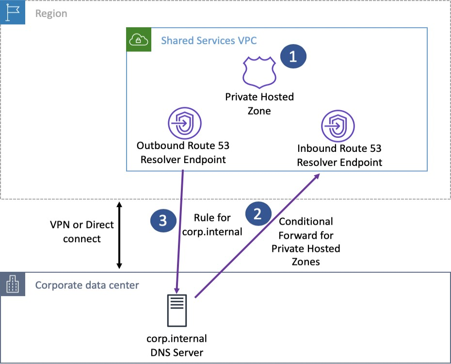
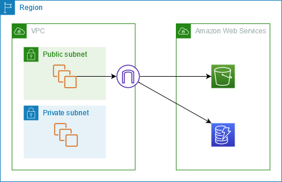

# AWS Virtual Private Cloud (VPC)

## 1. Introduction

Amazon VPC is the foundation for virtually every network deployment on AWS. It gives you your own isolated “private cloud” inside the AWS environment. In this chapter, we embark on a comprehensive exploration of VPC technology—from the basic concepts and architecture to advanced configuration, security, and connectivity features. 

## 2. Core VPC Architecture

### 2.1 What is Amazon VPC?

Amazon Virtual Private Cloud (VPC) is a logically isolated section of the AWS Cloud where you can launch AWS resources in a virtual network that you define. Much like setting up your own physical data center, a VPC provides you with control over a virtual network environment—including selection of IP address range, creation of subnets, configuration of route tables, and network gateways. In a VPC you get your own private networking space, enabling you to launch Amazon EC2 instances, RDS databases, and many other services in a secure and controlled manner.

At its core, VPC is designed to emulate the architecture of a traditional network:

- **Isolation:** Each VPC is logically separated from all other VPCs and other AWS customers.
- **Customization:** You choose the IP addressing (using CIDR notation), create one or more subnets in different AZs, and design routing rules that determine how traffic flows.
- **Connectivity:** With VPC, you can connect your AWS environment to your on-premises data center or even peer with other VPCs, all while keeping traffic private.

### 2.2 Scope and Boundaries: AWS Accounts, Regions, and Availability Zones

Understanding how VPCs fit into the overall AWS architecture is essential. The top-level boundary in AWS is your AWS account, which gives you access to multiple AWS regions. Each region is a separate geographic area that consists of multiple Availability Zones. When you create a VPC, you do so within a specific region. The VPC itself is confined to that region; if you require similar connectivity in another region, you must create a separate VPC.

Within a region, each Availability Zone represents an independent data center with its own power, cooling, and networking. When designing high availability and fault tolerance, you can distribute your subnets across multiple AZs. For instance, if you launch EC2 instances in three different subnets spread over three AZs, even if one AZ becomes unavailable, your application remains accessible through the remaining zones.

Key points:

- **AWS Account:** The top-level container for your resources.
- **Region:** A geographic area (e.g., US East, EU West) where VPCs are created.
- **Availability Zone (AZ):** Physically separate locations within a region that provide isolation and high availability.
- **VPC Placement:** A VPC is created in a region; subnets are then associated with specific AZs.

### 2.3 VPC Building Blocks


The fundamental components that form a VPC are analogous to elements in a physical network:

- **IP Address Range:** When you create a VPC, you assign it an IP address range using Classless Inter-Domain Routing (CIDR) notation (for example, 10.0.0.0/16). This range becomes the pool from which private IP addresses are allocated.
- **Subnets:** A subnet is a segment of the VPC’s IP address range. You divide your VPC into one or more subnets, each associated with a particular AZ. Subnets can be designated as public (with direct internet access) or private (without direct internet exposure).
- **Route Tables:** Route tables control the traffic flow within a VPC by defining paths for outbound and inbound traffic. By default, a main route table is created for every VPC, but you can create custom route tables for granular control.
- **Internet Gateway (IGW):** An IGW is a horizontally scaled, redundant, and highly available VPC component that enables communication between instances in your VPC and the internet.
- **NAT Devices:** If you wish to allow outbound internet access from private subnets, you use Network Address Translation (NAT) devices (either NAT gateways or NAT instances).
- **Security Mechanisms:** Security groups (instance-level, stateful firewalls) and network ACLs (subnet-level, stateless filters) enforce security policies at different layers of the network.
- **DNS and DHCP:** Every VPC comes with a built-in DNS resolver (the Amazon provided DNS server, also known as the Route 53 resolver) and DHCP options sets to automatically assign IP configuration details to instances.

In summary, the core architecture of VPC allows you to define a complete, customizable virtual network that replicates many aspects of a traditional on-premises network while providing the scalability, reliability, and flexibility of the AWS Cloud.

## 3. IP Addressing and Subnet Design

### 3.1 CIDR Fundamentals: Designing VPC IP Ranges

When planning your VPC, one of the first decisions is how to allocate its IP address range. CIDR notation (e.g., 10.0.0.0/16) is used to define the size of the network. In CIDR, the “/16” indicates that the first 16 bits are used for the network portion, leaving the remaining bits for host addresses. In a /16 network, you can have up to 2^16 (65,536) addresses. When you later create subnets, you carve out smaller ranges from the VPC’s overall CIDR block.

For example:

- A VPC with CIDR 10.0.0.0/16 offers 65,536 addresses.
- You might then create subnets with CIDR blocks like 10.0.1.0/24, which provide 256 addresses per subnet.

Remember that AWS reserves five IP addresses in each subnet (the first four and the last address) for internal networking purposes, so the number of usable addresses is slightly lower than the theoretical maximum.

Understanding the trade-offs:

- A larger CIDR block (e.g., /16) gives you room to create many subnets.
- Smaller subnet sizes (e.g., /28) may be used when you need only a few IP addresses per subnet, but with a minimum of 16 total addresses (11 usable).
- Planning ahead for growth and avoiding overlapping IP ranges (especially in multi-VPC or hybrid scenarios) is critical.

### 3.2 IPv4 vs. IPv6: Dual-Stack Support and Use Cases

Although IPv4 is still widely used, its address space is limited. AWS supports both IPv4 and IPv6 in VPCs:

- **IPv4:** Uses 32-bit addresses (e.g., 10.0.0.0/16). It is used for most internal communications and many legacy systems.
- **IPv6:** Uses 128-bit addresses, offering an astronomically larger address space. In AWS, IPv6 addresses are globally unique and are typically used for internet-facing applications where a vast address space is required.

AWS allows you to run dual-stack environments where instances can have both IPv4 and IPv6 addresses. This is particularly useful for:

- Future-proofing your network.
- Ensuring compatibility with systems that require IPv6.
- Applications that need a large pool of unique addresses.

However, note that while IPv4 supports both private and public addressing, IPv6 in AWS is designed to be public by default (though you can still control accessibility via security groups).

### 3.3 IP Address Types: Private, Public, and Elastic IPs

Within AWS, there are several types of IP addresses that play different roles:

- **Private IP Addresses:** Allocated from your VPC’s CIDR block, these addresses are used for communication within the VPC. They remain fixed and are not directly accessible from the internet. They are drawn from a globally recognized set of ranges:
	
	- `10.0.0.0` to `10.255.255.255` (CIDR `10.0.0.0/8`)  
	- `172.16.0.0` to `172.31.255.255` (CIDR `172.16.0.0/12`)  
	- `192.168.0.0` to `192.168.255.255` (CIDR `192.168.0.0/16`)

	Any IP address that falls outside these ranges is considered public. 

- **Public IP Addresses:** These addresses are assigned from Amazon’s pool when you launch an instance with public accessibility. They allow direct internet access, but by default, they are ephemeral—changing if the instance is stopped and restarted.

- **Elastic IP Addresses (EIPs):** These are static public IP addresses that you can allocate to your account. Once associated with an instance, they persist even if the instance is stopped and restarted. Elastic IPs are useful for applications that require a constant public endpoint.

When designing your network, it’s important to choose the appropriate IP address types for your use cases. For example, databases and internal application servers typically use only private IP addresses, while web servers facing the internet might use Elastic IPs for stability and consistency.

## 4. Routing and Traffic Control

### 4.1 Route Tables: Configuring Paths for Traffic

Route tables are at the very core of your VPC’s design because they determine how network traffic is directed both within your VPC and to external destinations. Here are all the details:

- **Default Route Table Creation:**  
    When you create a VPC, AWS automatically creates a main (default) route table. Every subnet that is not explicitly associated with a custom route table will use this main table. This table always includes an immutable “local” route that allows traffic to flow between all resources within the VPC’s CIDR block.
    
- **Custom Route Tables:**  
    For greater control, you can create custom route tables and associate them with specific subnets. For example, you might want public subnets (hosting web servers) to have routes to an Internet Gateway (IGW) while keeping private subnets (hosting databases) isolated from direct internet access. 
	
    When you create a custom route table, you must:
    
    - Add a route for the VPC’s CIDR (the local route), which you cannot remove.
    - Add additional routes, for example, 0.0.0.0/0 with a target of an IGW for public subnets or a NAT device for private subnets.

- **Granular Routing:**  
	Custom route tables enable you to control the flow of traffic from each subnet. For example, you can design a scenario where one subnet’s route table directs outbound traffic through a NAT Gateway, while another (for a DMZ or web tier) sends traffic directly to the IGW.
    
- **Key Considerations:**
    - All changes to routes are effective immediately for any new traffic that is processed.
    - If you later modify the main route table, any subnet still using it will immediately adopt the new routes.
    - In multi-tier environments, segregating routing rules (by assigning different route tables to different subnets) helps isolate workloads and secure sensitive resources.

### 4.2 NAT Solutions for Internet Access

Instances in private subnets do not have a direct route to the internet. To allow these instances to access the internet (for instance, to download software updates or call external APIs) without exposing them to inbound internet traffic, you need a NAT solution. Two approaches are provided by AWS:

#### 4.2.1 NAT Gateway: Managed, High-Availability Outbound Traffic

- **Overview:**  
    A NAT Gateway is a fully managed AWS service designed to allow instances in a private subnet to initiate outbound connections to the internet. It abstracts the complexity of managing your own NAT solution.
    
    
- **Deployment:**
    - **Location:** A NAT Gateway must be launched in a public subnet.
    - **Elastic IP Requirement:** It requires an associated Elastic IP address, which becomes the public IP used for all outbound traffic from private instances.
    - **Route Table Configuration:** For private subnets, you add a route in the route table with destination 0.0.0.0/0 (for IPv4) pointing to the NAT Gateway. This directs all outbound internet traffic through the gateway.

- **Key Features:**
    - **High Availability:** NAT Gateways are designed to be highly available within a given Availability Zone. In high-availability designs, you create a NAT Gateway in each AZ.
    - **Scalability:** They automatically scale to handle increased traffic, with performance scaling from 5 Gbps up to 100 Gbps based on load.
    - **Simplicity:** Because AWS manages NAT Gateway, there is no need to worry about patching, load balancing, or failure detection.
    - **Cost Considerations:** NAT Gateways incur both hourly charges and data processing charges. They are recommended for production workloads because of their performance and management simplicity.
    - **Security:** NAT Gateways do not support security groups; thus, traffic filtering must be enforced via Network ACLs at the subnet level.

#### 4.2.2 NAT Instances: EC2-Based Custom NAT (Legacy)

- **Overview:**  
    NAT Instances are EC2 instances that you configure as NAT devices. Although they are considered a legacy approach, they offer a high degree of customization.
    
- **Deployment & Configuration:**
    - **AMI Selection:** You must launch a NAT AMI from the community (or use your own custom image).
    - **Public Subnet:** The NAT Instance must be placed in a public subnet and assigned a public IP address (or Elastic IP) for outbound connectivity.
    - **Route Table Changes:** Update the private subnet’s route table so that outbound internet traffic is routed to the NAT Instance.
    - **Source/Destination Check:** Crucially, you must disable the source/destination check on the NAT Instance. By default, an EC2 instance only accepts traffic destined for its own IP. Disabling the check allows the instance to forward traffic not explicitly addressed to it.

- **Key Considerations:**
    - **Customization:** NAT Instances allow you to install additional software (for example, intrusion detection systems) or modify firewall rules as needed.
    - **Management Overhead:** Unlike NAT Gateways, you are responsible for managing, patching, scaling, and ensuring the high availability of NAT Instances.
    - **Performance:** They may be less performant under high loads compared to managed NAT Gateways.
    - **Use Cases:** NAT Instances can be a cost-effective solution for development or testing environments where traffic volume is low and customization is required.

### 4.3 Extending VPC Address Space with Secondary CIDRs

Sometimes your VPC’s primary IP address range is not sufficient—either because you have exhausted available addresses or you need to avoid overlapping IPs with an on-premises network. AWS allows you to add secondary CIDR blocks to an existing VPC:

- **Purpose and Use Cases:**
    - **Address Exhaustion:** When your current VPC (e.g., 10.0.0.0/16) is running out of available IPs, you can add an additional CIDR block (such as 10.1.0.0/16) to expand your address space.
    - **Hybrid Connectivity:** If your on-premises network uses a CIDR that overlaps with your VPC’s primary CIDR, you can add a secondary CIDR from a non-overlapping range to enable seamless VPN or Direct Connect integration.

- **Rules and Restrictions:**
    - **Non-Overlapping Requirement:** The secondary CIDR must not overlap with the primary CIDR or any other secondary CIDRs already associated with the VPC.
    - **RFC 1918 Consistency:** If you are using an RFC 1918 address space (such as 10.x.x.x), the secondary CIDR should be from the same range rather than a different private range (like 192.168.x.x or 172.16.x.x).
    - **Route Table Considerations:** Any routes defined in your VPC (or “root” route tables) must not conflict with the new CIDR block. For instance, if a route already exists for a specific range within your VPC, you cannot add a secondary CIDR that is larger than or overlaps with that route.
    - **Limits:** You can associate up to five IPv4 CIDR blocks and one IPv6 CIDR block with a single VPC.

By properly extending your VPC address space, you ensure that your network can grow as your application and infrastructure needs expand without needing to rearchitect your VPC later.

## 5. Securing the VPC

Security is built into every layer of your AWS networking architecture. Two primary mechanisms—security groups and network ACLs—form the basis of firewall control in your VPC.

### 5.1 Security Groups: Stateful Firewalls for Instances


Security groups serve as virtual firewalls that control inbound and outbound traffic at the instance (ENI) level. **They only support “allow” rules.** Key details include:

- **Statefulness:**
    - Security groups are stateful, meaning that if an inbound rule allows traffic (for example, TCP traffic on port 80), the return traffic is automatically allowed without needing a corresponding outbound rule. This simplifies rule management.

- **Rule Configuration:**
    - You define rules based on protocol (TCP, UDP, ICMP), port ranges, and source/destination IP addresses or CIDR blocks.
    - You can also reference other security groups within the same VPC, which is useful for tiered architectures (e.g., allowing web servers to communicate with application servers by referencing their security group).

- **Default Behavior:**
    - By default, security groups deny all inbound traffic and allow all outbound traffic. You then add specific allow rules for the inbound traffic you wish to permit.

- **Association with ENIs:**
    - Security groups are actually attached to the Elastic Network Interfaces (ENIs) of your instances, meaning that if an instance has multiple ENIs, each ENI can have its own set of security group rules.

- **Granularity and Flexibility:**
    - They provide fine-grained control over network access and are essential for implementing a least-privilege model.
    - Security group rules are evaluated as a whole (i.e., there is no rule order) and if any rule permits traffic, the traffic is allowed.

### 5.2 Network ACLs (NACLs): Stateless Subnet-Level Security


Network ACLs provide an additional layer of security at the subnet level. **They offer both “allow” and “deny” rules.** They differ from security groups in several ways:

- **Stateless Filtering:**
    - Unlike security groups, NACLs are stateless. This means that you must specify both inbound and outbound rules. Return traffic is not automatically allowed; you must create separate rules for responses.

- **Allow and Deny Rules:**
    - NACLs support both “allow” and “deny” rules. This allows you to explicitly block traffic from certain IP addresses or ranges—a capability that security groups do not have.

- **Rule Evaluation Order:**
    - Rules in a NACL are evaluated in order based on rule numbers. The first matching rule is applied, and evaluation stops after that. This makes rule numbering important and requires careful planning when inserting new rules.

- **Default Behavior:**
    - The default NACL for a subnet allows all inbound and outbound traffic. However, you can modify it or create custom NACLs to restrict traffic as needed.

- **Application:**
    - Because NACLs apply at the subnet level, any resource within the subnet is subject to the same ACL rules, regardless of the instance-specific security group settings.

### 5.3 VPC Firewall Best Practices: SG vs. NACL Use Cases

A layered security approach is essential for protecting your VPC. Here’s how to best leverage security groups and NACLs together:

- **Security Group (Instance-Level):**
    - Use security groups to allow only the specific traffic required by each instance. Their stateful nature and granular rule definitions make them ideal for protecting individual workloads.
    - Since security groups do not support deny rules, they are best for positive access control.

- **Network ACL (Subnet-Level):**
    - Use NACLs to add an extra layer of security at the subnet level. They are especially useful for blocking known malicious IPs or for enforcing broad security policies that apply to all instances in a subnet.
    - Their stateless and rule-ordered nature means they can be used to catch misconfigurations that might allow unwanted traffic.

- **Layered Defense (Defense-in-Depth):**
    - Combine both: Security groups handle the fine-grained instance-level filtering, while NACLs provide coarse-grained, subnet-wide restrictions. This approach minimizes the blast radius in the event of a misconfiguration.

- **Troubleshooting:**
    - When diagnosing connectivity issues, check both the security group settings and the NACL rules. For example, if outbound traffic is being blocked despite a security group rule allowing it, the NACL may be missing a corresponding rule for return traffic.
## 6. Advanced Networking Components

As your AWS environment grows in complexity, advanced networking components become essential to achieve flexibility, high availability, and operational efficiency.

### 6.1 Elastic Network Interfaces (ENIs): Multi-IP Configurations and Use Cases


ENIs are the virtual network adapters that provide network connectivity for your EC2 instances. They are fundamental to AWS networking for the following reasons:

- **Primary and Secondary ENIs:**
    - Every EC2 instance automatically gets a primary ENI (typically labeled as eth0) at launch, which includes the instance’s primary private IP address.
    - You can attach additional (secondary) ENIs to an instance if you need more than one network interface. This can support multi-homing (dual NIC configurations) or separate traffic for different applications running on the same instance.

- **Multiple IP Addresses:**
    - Each ENI can have one primary IP address and multiple secondary private IP addresses. This is particularly useful in containerized environments (such as when using Kubernetes) where pods may receive IP addresses from the ENI.

- **Security Group Association:**
    - Security groups are associated directly with ENIs. This means that the security settings applied to an instance come from the ENIs attached to it.

- **Portability:**
    - Secondary ENIs can be detached from one instance and reattached to another. This is useful for high-availability designs, such as preserving a MAC address to maintain software licenses or for quick failover.

- **AZ Boundaries:**
    - ENIs are bound to a specific Availability Zone. You cannot move an ENI to an instance in a different AZ.

- **Limits:**
    - The maximum number of ENIs and the number of IP addresses per ENI vary depending on the instance type. AWS documentation provides the limits per instance type.

- **Source/Destination Check:**
    - For certain use cases (such as configuring a NAT instance), you may need to disable the source/destination check on an ENI so that it can forward traffic not addressed to its own IP.
### 6.2 Bring Your Own IP (BYOIP): Custom IP Address Management

AWS allows you to “bring your own IP” (BYOIP) addresses to your AWS environment. This is especially important for organizations that:

- **Have Established IP Reputation:** If you’ve built a strong reputation or whitelist status with third parties, reusing your existing IP addresses prevents the need to start from scratch.
- **Need to Maintain Consistent IP Addressing:** Applications with hard-coded IP addresses or legacy integrations that cannot easily be reconfigured benefit from using your existing public IP addresses.
- **Hybrid Deployments:** When migrating applications from on-premises to AWS, keeping the same public IP addresses minimizes disruption.

Key requirements and considerations for BYOIP include:

- **IP Ownership:** The IP addresses must be publicly routable and registered with a Regional Internet Registry (such as ARIN, RIPE, or APNIC).
- **Clean History:** AWS requires that the IP addresses have not been used for malicious activities (i.e., they must have a clean reputation).
- **CIDR Block Size:** For IPv4 BYOIP, the smallest allowed block is typically /24.
- **AWS Advertisement:** Once you bring your IP addresses into AWS, AWS will advertise them on your behalf using its own Autonomous System Numbers (ASNs).

BYOIP provides additional flexibility and control over your network identity in the AWS cloud.

## 7. DNS and DHCP in VPC

Networking is not only about routing and firewalls—it also depends on correct domain name resolution and IP configuration. Within a VPC, DNS and DHCP settings are critical for both internal resource discovery and external communications.

### 7.1 DNS Fundamentals: How DNS Works in AWS

The Domain Name System (DNS) translates human-friendly domain names into IP addresses. In the context of AWS:

- **Public DNS Resolution:** When a user enters a URL (such as [www.example.com](http://www.example.com/)), the DNS system resolves it to a public IP address.
- **Private DNS Resolution:** Within a VPC, private DNS resolution allows resources to refer to each other by name rather than by IP. AWS automatically assigns private DNS names to EC2 instances (using a format like ip-10-0-1-15.region.compute.internal).
- **Caching and Recursion:** The DNS resolver caches results to speed up repeat queries and performs recursive lookups to resolve domain names that are not hosted locally.

AWS provides a built-in DNS server for every VPC. This Amazon-provided DNS server (often called the Route 53 Resolver) runs at the VPC base address plus two (for example, if your VPC’s CIDR is 10.0.0.0/16, the DNS server is at 10.0.0.2). This resolver supports both private hosted zones and public resolution.

### 7.2 Route 53 Resolver: VPC DNS Configuration

Route 53 Resolver is the core DNS service used within VPCs:

- **Default Configuration:** By default, every VPC has DNS resolution enabled through the Route 53 Resolver. This means that DNS queries from instances are directed to the resolver at the VPC base address plus two.
- **Private Hosted Zones:** You can create Route 53 private hosted zones to manage your internal DNS records (e.g., app.example.internal). These zones allow you to define custom domain names that resolve only within your VPC.
- **Integration with DHCP:** When an EC2 instance boots, it receives DHCP options that include the DNS server IP. Typically, these options point to the Route 53 Resolver.
- **DNS Resolution Order:** When resolving a domain name, the resolver first checks for matches in private hosted zones, then the VPC’s internal DNS records, and finally it forwards the query to public DNS servers if no match is found.

### 7.3 Hybrid DNS with Route 53 Resolver Endpoints

In hybrid environments where you have on-premises networks connected to your VPC via VPN or AWS Direct Connect, you may need DNS resolution across boundaries:



- **Inbound Resolver Endpoints:** These allow DNS queries originating outside the VPC (for example, from an on-premises DNS server) to be forwarded to the Route 53 Resolver inside your VPC.
- **Outbound Resolver Endpoints:** These endpoints forward DNS queries from within the VPC to an on-premises DNS server.
- **Bidirectional DNS Resolution:** With both inbound and outbound endpoints configured, you can achieve hybrid DNS resolution, enabling consistent name resolution across your AWS and on-premises networks.

This capability is essential for seamless integration in hybrid architectures.

### 7.4 Custom DHCP: Configuring DHCP Option Sets

Every VPC comes with a DHCP options set that provides configuration parameters to instances when they boot:


- **Default Options:** The default DHCP option set assigns the Amazon-provided DNS server (the Route 53 Resolver) as the primary DNS.
- **Custom Domain Names:** You can customize the DHCP options to define your private domain name (for example, “finance.internal”), which affects how EC2 instances form their hostnames.
- **Additional Parameters:** DHCP option sets can also specify NTP servers, NetBIOS settings, and more.
- **One-Per-VPC Rule:** Each VPC can be associated with only one DHCP option set at a time. To modify settings, you must create a new option set and associate it with the VPC; the changes take effect after the DHCP lease is renewed on each instance.

Correctly configuring DNS and DHCP is critical for ensuring that your applications can locate and communicate with each other reliably.

## 8. Monitoring, Analysis, and Troubleshooting

Operational excellence depends on visibility into your network’s performance and behavior. AWS offers several built-in tools to monitor, analyze, and troubleshoot VPC traffic.
### 8.1 VPC Flow Logs: Capturing Traffic for Security and Audits


VPC Flow Logs are a critical tool for capturing and analyzing network traffic metadata within your VPC. They provide insight into what traffic is flowing to and from your resources:

- **Scope and Levels:**
    - Flow logs can be enabled at the VPC level (capturing all traffic across all ENIs), at the subnet level, or on individual ENIs.

- **Log Contents:**
    - Each flow log record includes a range of fields such as:
        - **Version:** (e.g., version 2 or version 5 for custom formats)
        - **Account ID** and **ENI ID**
        - **Source IP address** and **destination IP address**
        - **Source port** and **destination port**
        - **Protocol:** (e.g., TCP is represented as “6”)
        - **Packet and byte counts:** Number of packets and bytes transferred during the flow
        - **Start and end times:** Timestamps for the flow log record
        - **Action:** Indicates whether the traffic was “ACCEPT” or “REJECT”
        - **Log Status:** (e.g., “OK” indicating successful log delivery)
    - In custom (v5) formats, additional fields such as VPC ID, Subnet ID, Instance ID, Region, Availability Zone, and even original packet source/destination (useful for NAT scenarios) can be included.

- **Delivery and Analysis:**
    - VPC flow logs can be delivered to CloudWatch Logs for real-time monitoring and analysis or to Amazon S3 for archival and further processing.
    - Tools like CloudWatch Logs Insights allow you to query, filter, and aggregate flow log data to troubleshoot connectivity issues, monitor bandwidth usage, or detect anomalies (such as repeated access attempts from malicious IPs).

- **Usage Considerations:**
    - Flow logs do not capture actual packet payloads, but they do provide enough metadata to help you diagnose security or performance issues.
    - Certain traffic types (for example, traffic to the Amazon-provided DNS server at VPC base address +2) are not logged.

#### 8.1. Flow Logs Examples

**Accepted and rejected traffic**

- _SSH Traffic Allowed:_  
    The following record shows that SSH traffic (TCP port 22) from IP address 172.31.16.139 to a network interface (private IP 172.31.16.21, ID `eni-1235b8ca123456789`) was allowed:
    
```yaml
2 123456789010 eni-1235b8ca123456789 172.31.16.139 172.31.16.21 20641 22 6 20 4249 1418530010 1418530070 ACCEPT OK
```
    
- _RDP Traffic Rejected:_  
    In this record, RDP traffic (TCP port 3389) to the same network interface was rejected:

```yaml
2 123456789010 eni-1235b8ca123456789 172.31.9.69 172.31.9.12 49761 3389 6 20 4249 1418530010 1418530070 REJECT OK
```

**No data and skipped records**

- _No Data Recorded:_  
    If no traffic is captured during an aggregation interval, the log might look like this:

```yaml
2 123456789010 eni-1235b8ca123456789 - - - - - - - 1431280876 1431280934 - NODATA
```
	
- _Skipped Records:_  
    When the log system exceeds its capacity during an aggregation interval, a record similar to the following is produced:

```yaml
2 123456789010 eni-11111111aaaaaaaaa - - - - - - - 1431280876 1431280934 - SKIPDATA
```

**Security group and network ACL rules**

Consider a scenario where a ping command is issued from a home computer (203.0.113.12) to an instance (172.31.16.139). Because security groups are stateful, the initial ICMP request is allowed even if the security group only permits inbound ICMP. However, if the network ACL (which is stateless) does not allow outbound ICMP, the reply is dropped. The flow log records might appear as:

- _Ping Request (Allowed):_
    
```yaml
2 123456789010 eni-1235b8ca123456789 203.0.113.12 172.31.16.139 0 0 1 4 336 1432917027 1432917142 ACCEPT OK
```
    
- _Ping Reply (Rejected by NACL):_

```yaml
2 123456789010 eni-1235b8ca123456789 172.31.16.139 203.0.113.12 0 0 1 4 336 1432917094 1432917142 REJECT OK
```

**IPv6 traffic**

For IPv6, the flow log format is similar. For example, the following record shows SSH traffic on port 22 from an IPv6 address:

```yaml
2 123456789010 eni-1235b8ca123456789 2001:db8:1234:a100:8d6e:3477:df66:f105 2001:db8:1234:a102:3304:8879:34cf:4071 34892 22 6 54 8855 1477913708 1477913820 ACCEPT OK
```

**Traffic through a NAT gateway**

When an instance in a private subnet accesses the internet via a NAT gateway, the flow log may capture different addresses for the NAT gateway interface versus the final destination. For example:

- _Traffic from Instance to NAT Gateway:
	
	Here, the instance (10.0.1.5) sends traffic that first appears with a destination of the NAT gateway’s private IP (10.0.0.220), while the packet’s actual destination (pkt-dstaddr) is the public host (203.0.113.5).
	
```yaml
- eni-1235b8ca123456789 10.0.1.5 10.0.0.220 10.0.1.5 203.0.113.5
```

- _Response Traffic from NAT Gateway to Instance:_

```yaml
- eni-1235b8ca123456789 10.0.0.220 10.0.1.5 203.0.113.5 10.0.1.5
```

**Traffic through a transit gateway**

In scenarios where traffic flows between VPCs via a transit gateway, flow log records capture traffic on different ENIs corresponding to the transit gateway:

- _Request Traffic from a Client:_

```yaml
3 eni-33333333333333333 123456789010 vpc-abcdefab012345678 subnet-22222222bbbbbbbbb i-01234567890123456 10.20.33.164 10.40.2.236 39812 80 6 3 IPv4 10.20.33.164 10.40.2.236 ACCEPT OK
```

- _Response Traffic from the Server:_

```yaml
3 eni-33333333333333333 123456789010 vpc-abcdefab012345678 subnet-22222222bbbbbbbbb i-01234567890123456 10.40.2.236 10.20.33.164 80 39812 6 19 IPv4 10.40.2.236 10.20.33.164 ACCEPT OK
```

For traffic passing through the transit gateway’s requester-managed interfaces, a sample record may show a '-' for the instance-id field, indicating that the interface belongs to the transit gateway rather than a customer instance:

```yaml
3 eni-11111111111111111 123456789010 vpc-abcdefab012345678 subnet-11111111aaaaaaaaa - 10.40.1.175 10.40.2.236 39812 80 6 3 IPv4 10.20.33.164 10.40.2.236 ACCEPT OK
```
### 8.2 Traffic Mirroring: Deep Packet Inspection for Analysis


Traffic Mirroring is a feature that allows you to capture a real-time copy of network traffic from an ENI and send it to a designated monitoring appliance:

- **Purpose:**
    - It enables deep packet inspection and real-time analysis for security monitoring (such as intrusion detection systems) or troubleshooting.
    - Because the mirrored traffic is a copy, the live production traffic is not interrupted.

- **Configuration Components:**
    - **Mirror Source:** The ENI from which traffic is to be mirrored (for example, the ENI of a critical EC2 instance).
    - **Mirror Target:** The destination where the mirrored traffic is sent. This can be:
        - Another ENI (attached to a monitoring EC2 instance), or
        - A Network Load Balancer (NLB) that directs traffic to one or more monitoring appliances.
    - **Mirror Filters:** Optional filters that let you define which traffic to mirror based on criteria such as protocol, port ranges, and CIDR blocks. For example, you might choose to mirror only HTTP/HTTPS traffic or traffic from a particular source IP range.

- **Deployment Considerations:**
    - Mirroring sessions are configured per ENI and are subject to certain scaling and pricing considerations.
    - When using an NLB as the mirror target, ensure that UDP port 4789 (used by VXLAN encapsulation) is open so that the traffic can be forwarded correctly.
    - The source and target of traffic mirroring typically must be in the same region; however, in some advanced architectures, they can reside in different VPCs (often connected via VPC peering or Transit Gateway).

### 8.3 VPC Reachability Analyzer: Diagnosing Network Paths


The VPC Reachability Analyzer is a tool that helps you verify whether traffic can flow between specified source and destination endpoints in your VPC:

- **Functionality:** It analyzes the configuration of route tables, security groups, network ACLs, and other connectivity components to determine whether a valid path exists.
- **Visualization:** The analyzer produces a step-by-step “hop-by-hop” path that shows how traffic would flow (or where it is blocked).
- **Use Cases:** This tool is ideal for troubleshooting connectivity issues (for example, if an EC2 instance in one subnet cannot reach a database in another subnet), verifying VPC peering setups, or testing hybrid connectivity between AWS and on-premises networks.
- **Non-Intrusive:** Importantly, the reachability analyzer does not send actual traffic; it only inspects configuration, making it safe to use in production environments.

Together with flow logs and traffic mirroring, the reachability analyzer gives you a comprehensive toolkit for network troubleshooting and compliance verification.

## 9. Network Connectivity and Hybrid Scenarios

AWS provides multiple options to connect VPCs to each other and to external networks without exposing sensitive resources to the public internet.

### 9.1 VPC Peering: Connecting VPCs Securely


VPC peering establishes a private link between two VPCs over the AWS internal network. When two VPCs are peered:

- They can exchange traffic as though they were within the same network segment.
- Each VPC must have non-overlapping IPv4 or IPv6 CIDRs to form a valid peering connection.
- After establishing the peering, route tables in each VPC must be updated so that each subnet knows how to reach the other VPC’s CIDR blocks.

A typical use case involves connecting multiple applications or microservices residing in separate VPCs, enabling them to communicate securely and directly with minimal latency.

#### 9.1.1. Constraints and Key Characteristics

##### 9.1.1.1. No Overlapping CIDR Blocks

If two VPCs share any portion of their CIDR ranges, peering is disallowed. Even if only one of several CIDRs in either VPC overlaps, the peering connection cannot be established. This rule applies for both IPv4 and IPv6. Hence, it is crucial to plan IP addressing schemes carefully, especially for multi-account or large-scale deployments.

##### 9.1.1.2. Route Tables and Longest Prefix Match

When traffic is sent between peered VPCs, AWS will look for the most specific (longest) prefix in the route table. For example:

- Suppose VPC A has a route table with two routes targeting the same range (10.0.0.0/16) but with one route specifically matching 10.0.0.77/32.
- Traffic destined for 10.0.0.77 will follow the /32 route because it is the longest, most specific prefix, overriding the broader /16 route.

Understanding longest prefix match is critical when you have multiple peering connections and need precise traffic routing.

##### 9.1.1.3. Not Transitive

One of the most crucial limitations is that VPC peering is **not** transitive. If VPC A is peered with VPC B, and VPC B is peered with VPC C, that does **not** imply that A can communicate with C through B. You would need a direct peering connection between A and C for traffic to flow between them.

Exam Tip: For multi-VPC topologies where each VPC needs to talk to every other, you must either:

- Create a fully meshed peering model (each VPC peered with every other VPC), or
- Consider alternative approaches like AWS Transit Gateway for hub-and-spoke architectures.

##### 9.1.1.4. No Edge-to-Edge Routing

Beyond the lack of transitivity, there is also no “edge-to-edge” routing through a peered VPC. Common examples include:

- You cannot route traffic from VPC B to an on-premises network via VPC A’s Direct Connect or VPN connection.
- You cannot route traffic from VPC B to the internet through VPC A’s Internet Gateway or NAT Gateway.
- Similarly, you cannot use a peered VPC’s gateway endpoints (S3, DynamoDB, etc.) over the peering connection.

This restriction prevents the creation of centralized NAT or internet gateways in one VPC that other peered VPCs can share. If the goal is to provide a central egress/ingress point for multiple VPCs, you must explore other architectures (such as AWS Transit Gateway).

##### 9.1.1.5. Peering Across Regions and Accounts

VPC peering can operate:

- **Inter-Region**: You can peer VPCs residing in different AWS Regions.
- **Cross-Account**: A VPC in one account can peer with a VPC owned by another account, as long as the owners accept the peering request and no CIDRs overlap.

Security groups can reference security group IDs in a peered VPC, including cross-account scenarios. This can simplify security management by treating remote resources as a single entity rather than specifying individual IP addresses.

### 9.2 VPC Endpoints: Private AWS Service Access

VPC endpoints provide a way for you to privately connect your VPC to supported AWS services without needing to traverse the public internet. By using endpoints, you can avoid the need for an Internet Gateway (IGW), NAT gateway, VPN, or AWS Direct Connect for certain service communications. This approach enhances security, reduces latency, and can lower data transfer costs.

Key points:

- **Private Connectivity:** Endpoints ensure that traffic between your VPC and supported AWS services stays within the AWS network.
- **Improved Security & Compliance:** Since traffic doesn’t leave the AWS backbone, it is less exposed to the internet, which minimizes risks and can help meet compliance requirements.
- **Cost Benefits:** For private access to services (e.g., S3 or DynamoDB), you can avoid the per-hour and per-GB charges associated with NAT gateways.
- **DNS Integration:** Endpoints integrate with AWS DNS. For example, when you create an interface endpoint, AWS automatically updates your DNS settings so that the service’s domain name resolves to the endpoint’s private IP address.
- **Endpoint Policies:** You can attach policies directly to VPC endpoints. These policies allow you to restrict access to only specific resources (for example, allowing access to only one S3 bucket or a specific DynamoDB table).

There are two types of VPC endpoints:

- **Gateway Endpoints:** Currently available only for Amazon S3 and DynamoDB.
- **Interface Endpoints (AWS PrivateLink):** Provide private connectivity for many AWS services and supported third-party applications.

#### 9.2.1 Gateway Endpoints (S3, DynamoDB)



Gateway endpoints are the simplest form of VPC endpoints and are designed specifically for connecting your VPC privately with Amazon S3 and DynamoDB.

**How They Work:**

- **Route Table Integration:** When you create a gateway endpoint, you add a new route to one or more of your VPC’s route tables. Instead of sending traffic destined for S3 or DynamoDB over the internet (or through a NAT), the route directs it to the endpoint.
- **Prefix Lists:** AWS manages a prefix list that contains the range of IP addresses used by the target service (S3 or DynamoDB). In your route table, the destination is specified as this prefix list. This mechanism abstracts the actual IP addresses and makes routing maintenance easier.
- **No Additional Charges:** Gateway endpoints are provided at no additional cost. There are no hourly charges or data processing fees associated with gateway endpoints.

**Configuration & Use Cases:**

- **Private Access for S3/DynamoDB:** They enable instances in private subnets to access S3 or DynamoDB without needing a NAT gateway. This not only improves security by keeping the traffic within AWS’s network but also reduces costs.
- **Policy Restrictions:** You can attach an endpoint policy to a gateway endpoint. For instance, you can restrict access so that only a specific S3 bucket or a subset of DynamoDB tables is accessible through the endpoint. This provides an extra layer of security and fine-grained control.
- **Route Table Updates:** Once the gateway endpoint is created, you must update the route tables for the subnets where you need access. The new route uses the prefix list as the destination, and its target is the VPC gateway endpoint.
- **Security Group Considerations:** Although gateway endpoints do not require an Elastic Network Interface (ENI), you must ensure that any security group rules on your instances (or other resources) allow outbound traffic to the AWS-managed prefix list if you’re enforcing custom outbound rules.

**Example Scenario:** An application running on EC2 instances in private subnets needs to read and write data to an S3 bucket. Instead of routing traffic through a NAT gateway (which would incur extra cost and expose traffic to the public internet), you create a gateway endpoint for S3. You then update your route tables to direct traffic destined for the S3 prefix list through this endpoint. Optionally, you attach a policy to the endpoint to allow only operations on a specific S3 bucket. This setup ensures secure, scalable, and cost-effective access to S3.

#### 9.2.2 Interface Endpoints (AWS PrivateLink)

Interface endpoints use AWS PrivateLink technology to provide private connectivity to a wide range of AWS services and supported third-party applications. Unlike gateway endpoints—which work only for S3 and DynamoDB—interface endpoints are available for many services such as API Gateway, SQS, SNS, Kinesis, and more.

**How They Work:**

- **Elastic Network Interfaces (ENIs):** When you create an interface endpoint, AWS provisions one or more ENIs within your selected subnet. These ENIs are assigned private IP addresses from your VPC’s CIDR range.
- **DNS Configuration:** AWS automatically updates your VPC DNS so that the domain name of the target service resolves to the private IP addresses of the endpoint’s ENI. This means that when your applications call the service endpoint, the traffic stays within the AWS network.
- **Endpoint Policies:** Like gateway endpoints, you can attach an endpoint policy to an interface endpoint to control which operations or resources can be accessed through the endpoint.
- **Pricing Model:** Interface endpoints are not free. They incur hourly charges for the endpoint and data processing fees based on the amount of data processed by the endpoint. However, the benefits of private connectivity and improved security often outweigh these costs for many use cases.

**Configuration & Use Cases:**

- **Broad Service Support:** Interface endpoints can be used with over 40 AWS services (and an ever-growing list) as well as some third-party services available through AWS Marketplace.
- **Private Connectivity for Application Components:** They are ideal for accessing services that are not supported by gateway endpoints. For example, if an EC2 instance in a private subnet needs to call an API on API Gateway or retrieve messages from SQS, you can create an interface endpoint.
- **Enhanced Security:** Since the traffic does not traverse the public internet, you reduce exposure to external threats. You can also use endpoint policies to restrict access further.
- **DNS and Routing:** With interface endpoints, you do not modify your route tables. Instead, AWS manages the redirection via DNS, so that requests to the service domain name automatically resolve to the endpoint’s private IP.
- **Hybrid Environments:** Interface endpoints can also support scenarios where on-premises systems (via VPN or Direct Connect) need to access AWS services privately by ensuring that DNS resolution returns private IP addresses.

**Example Scenario:** A microservices architecture requires that several services (such as a messaging queue, API endpoints, and data streams) communicate securely with each other without exposing any traffic to the public internet. Instead of routing requests through a NAT gateway, you create interface endpoints for each required AWS service. The DNS resolution within your VPC now directs requests to these endpoints’ ENIs, and your security teams can further refine access using endpoint policies. Although there is a cost associated with interface endpoints, the benefits of reduced latency and enhanced security make them the preferred option for sensitive or latency-critical applications.

### 9.3 Accessing VPC Endpoints from On-Premises Networks

VPC gateway endpoints let resources _inside your VPC_ (like EC2 instances) connect privately to AWS services like S3 or DynamoDB. But if you try to access these endpoints **from your on-premises network** (like your office servers connected via VPN or Direct Connect), **it won’t work**. Here’s why:

1. **Routing Rules Only Apply Inside the VPC**:
    
    - Gateway endpoints work by adding a special route in your VPC’s route tables (like a shortcut).
    - This shortcut **only works for traffic coming from inside the VPC** (e.g., an EC2 instance).
    - Traffic from your on-premises network enters the VPC but doesn’t follow these internal shortcuts.

2. **No "Door" for On-Premises to Knock On**:
    
    - Gateway endpoints don’t create a virtual network card (ENI) in your VPC. They’re just routing shortcuts.
    - Without a network interface, your on-premises systems have no way to directly talk to the endpoint.

3. **Traffic Takes the Wrong Path**: On-premises traffic to S3/DynamoDB either:
	- Goes over the public internet (risky/slower), or
	- Uses Direct Connect but skips the VPC’s internal shortcut.

To privately connect your on-premises network to AWS services like S3/DynamoDB, you have two options:

**Option 1: Use AWS PrivateLink (Interface Endpoints)**
- Creates a "virtual network card" (ENI) in your VPC that acts like a private door to AWS services.
- Your on-premises network can use this door.
- **How to set it up**:
    - Create an interface endpoint for S3/DynamoDB in your VPC.
    - Update your on-premises DNS to point to this endpoint’s private address.
    - Allow on-premises IPs in the VPC’s security rules.

**Option 2: Route Traffic Through the VPC**
- **Example**:
    - Set up a proxy server or NAT gateway _inside your VPC_.
    - Send all on-premises traffic for S3/DynamoDB through this proxy.
    - The proxy uses the VPC’s gateway endpoint, so traffic stays private.

## 10. The Default VPC

Every AWS region automatically provisions a Default VPC to simplify initial deployments and provide immediate network connectivity for new accounts. Although the Default VPC is designed for quick experimentation and prototyping, it is important to understand its structure, behavior, and limitations before deciding whether to use it in production environments.

### 10.1 Purpose and Behavior

- **Automatic Provisioning:**  
    When you create an AWS account, every region comes with one Default VPC that is automatically configured. This ensures that if you launch an EC2 instance without specifying a VPC, it is automatically deployed into the Default VPC.
- **Immediate Connectivity:**  
    The Default VPC is preconfigured so that instances launched within it can communicate with each other and, if they have public IP addresses, with the internet. This “plug-and-play” functionality reduces setup time for initial experiments and development.

### 10.2 Default Configuration

- **CIDR Block:**  
    The Default VPC is assigned a fixed private IP address range—typically **172.31.0.0/16**. This large address block is reserved exclusively for your Default VPC in each region.
    
- **Subnets Across Availability Zones:**  
    The Default VPC is automatically subdivided into one subnet per Availability Zone (AZ) in the region. For example:
    
    - In the **Mumbai** region (with three AZs), three subnets are created by default.
    - In the **North Virginia** region (with six AZs), six subnets are provisioned.
    
    These subnets are created with a **/20** CIDR block each. This configuration provides each subnet with:
    
    - **4096 IP addresses per subnet** (since 2^12 = 4096 for a /20),
    - Of which **5 addresses are reserved** (the first four and the last IP are not assignable), leaving **4091 usable addresses** per subnet.

- **Internet Gateway (IGW):**  
    A Default VPC includes a single Internet Gateway that is attached automatically. The Default VPC’s main route table includes an entry with the destination **0.0.0.0/0** that routes all internet-bound traffic to the IGW. This configuration makes every subnet in the Default VPC effectively a public subnet.
    
- **Route Tables:**  
    Instead of creating individual route tables for each subnet, the Default VPC comes with one main route table that is automatically associated with all subnets. This route table includes the local route for intra-VPC traffic as well as the route that directs outbound traffic to the IGW.

### 10.3 Benefits and Considerations

- **Ease of Use:**  
    The Default VPC is intended to simplify the process of launching EC2 instances and other resources by removing the need for manual network setup. It is ideal for testing, learning, and quick deployments.
    
- **Limitations for Production:**  
    Although convenient, the Default VPC is a one-size-fits-all configuration. For production workloads, best practices recommend designing a custom VPC that meets your specific security, performance, and organizational requirements. Custom VPCs allow you to tailor IP addressing, subnet segmentation (public and private), security group rules, route tables, and connectivity options (e.g., VPN, VPC peering) more precisely.
    
- **Accidental Deletion and Re-Creation:**  
    It is possible to accidentally delete the Default VPC. Fortunately, AWS provides an option to recreate a Default VPC via the VPC console if needed. However, since its settings are fixed and managed by AWS, relying on the Default VPC for mission-critical applications is generally not advised.

### 10.4 When to Use the Default VPC

- **Prototyping and Testing:**  
    The Default VPC is perfect for quick experiments, initial learning, and development where immediate access and simplicity are paramount.
- **Non-Critical Applications:**  
    For applications that do not require granular control over network configurations or heightened security controls, the Default VPC can be used to reduce setup overhead.
- **Transition to Custom Architectures:**  
    Even if you start in the Default VPC, consider planning for a migration to a custom VPC if your requirements grow. Customizing your network architecture early on is recommended for long-term scalability and security.

## 11. Conclusion

AWS Virtual Private Cloud (VPC) serves as the backbone of your secure, scalable, and customizable AWS networking environment, enabling you to design isolated networks, manage IP addressing, configure routing, and enforce layered security with tools such as security groups and network ACLs; by integrating advanced components like NAT solutions, VPC endpoints, and hybrid DNS with Route 53 Resolver, you can optimize both internal and external connectivity, ensuring robust performance and seamless integration across regions and on-premises systems, while monitoring tools like flow logs, traffic mirroring, and reachability analyzers provide essential insights for troubleshooting and maintaining compliance.