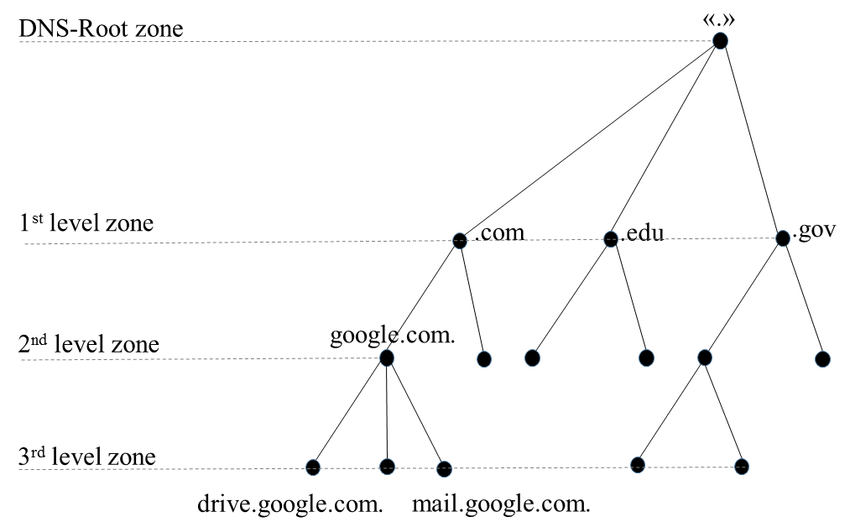
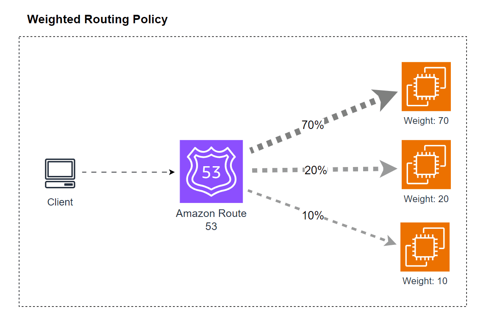
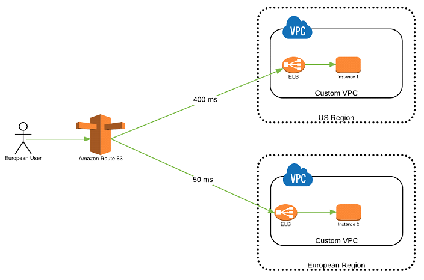
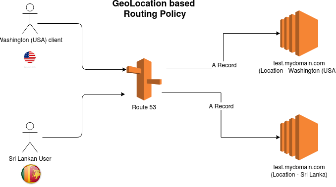
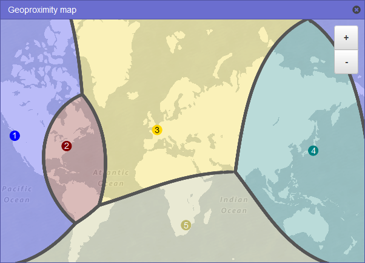
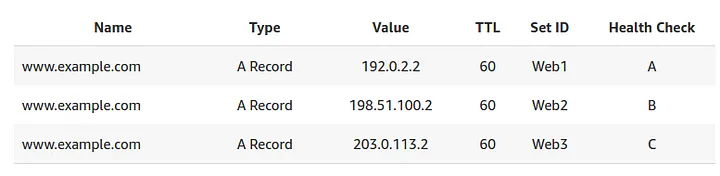
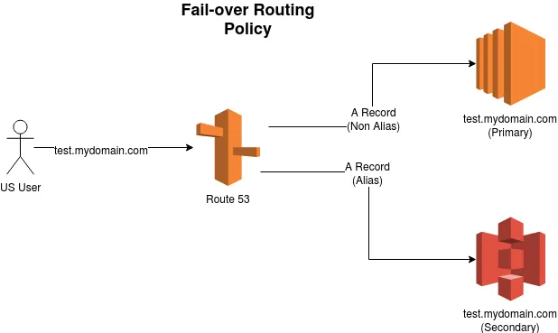
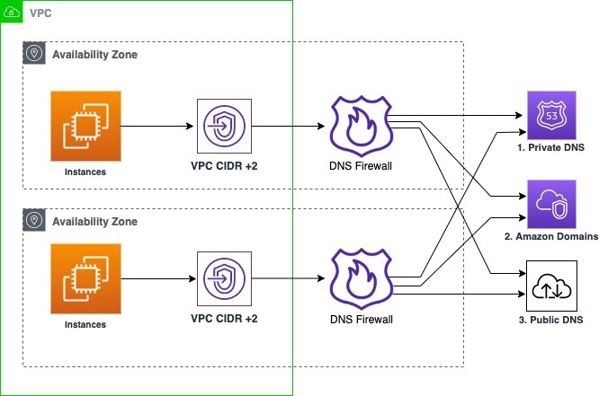
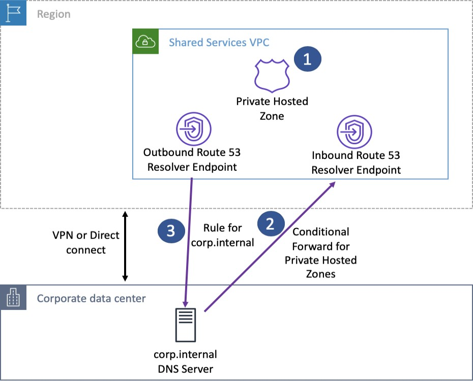

# AWS Route 53

## **1. Introduction**

AWS Route 53 is a fully managed, highly available, and scalable Domain Name System (DNS) service provided by Amazon Web Services (AWS). It has become the cornerstone for many organizations because it delivers authoritative DNS responses, domain registration, and advanced routing capabilities through a single integrated solution. In this chapter, we will explore in depth how Route 53 empowers customers to route end-user requests reliably to endpoints—whether those endpoints are hosted on AWS or elsewhere. We will examine its features and how these features can be combined to design a robust, secure, and cost-effective DNS solution.

## **2. DNS Fundamentals**

### **2.1 What is DNS?**

The Domain Name System (DNS) is a hierarchical, decentralized naming system for computers, services, or any resource connected to the Internet or a private network. It translates human-friendly domain names, such as _[www.example.com](http://www.example.com/)_, into numerical IP addresses (for example, 192.0.2.1) that computers use to identify each other on the network. Without DNS, users would have to remember complex numeric addresses rather than simple, easy-to-remember names.

DNS functions as the backbone of Internet communication, and its design is based on a tree-like hierarchical structure. At the top of this hierarchy is the root zone, represented by a dot ("."). Below the root are top-level domains (TLDs) like .com, .org, and .gov, followed by second-level domains (for example, _example.com_), and potentially subdomains (such as _[www.example.com](http://www.example.com/)_ or _api.example.com_).

Key points to remember:

- **Hierarchical Structure:** The domain name hierarchy is crucial for delegation and management. Each level in the hierarchy can be managed by different organizations.
- **Translation Process:** When a client types a domain name into a web browser, the request is forwarded to local DNS resolvers, which then query root servers, TLD servers, and authoritative name servers until the correct IP address is returned.
- **Caching:** To reduce latency and load on DNS servers, responses are cached by local resolvers for a duration specified by the Time-to-Live (TTL) value.

### **2.2 Key DNS Concepts: Zones, Records, and Nameservers**

Before diving into AWS Route 53, it is essential to understand the core terminology and components of DNS:

- **Domain Registrar:** A service where you register your domain name. Registrars such as Amazon Route 53, GoDaddy, or Google Domains allow you to secure a domain (for example, _example.com_) and generally offer DNS management tools.
    
- **DNS Records:** These are entries that map domain names to IP addresses or other domain names. The most common record types include:
    
    - **A Records:** Map a domain name to an IPv4 address.
    - **AAAA Records:** Map a domain name to an IPv6 address.
    - **CNAME Records:** Alias one domain name to another.
    - **NS Records:** Specify the authoritative name servers for a domain.
    - **MX Records:** Define mail exchange servers for email delivery.

- **Zone File:** A file containing all the DNS records for a particular domain or zone. This file is maintained by the authoritative DNS servers.
    
- **Nameservers:** Servers that host the zone file and respond to DNS queries. When you register a domain, the registrar provides nameservers that will eventually resolve the DNS queries for that domain.
    
- **Fully Qualified Domain Name (FQDN):** A complete domain name that specifies its exact location within the DNS hierarchy. For example, _api.[www.example.com](http://www.example.com/)._ (with a trailing dot indicating the root).
    

Understanding these fundamentals is crucial because Route 53 extends and automates many of these DNS operations, making it easier to manage domain names and resolve queries efficiently.

## **3. Introduction to Route 53**

### **3.1 Route 53 Overview: Managed DNS and Beyond**

AWS Route 53 is a highly available and scalable DNS service designed to provide reliable routing and domain registration. It is an authoritative DNS service—meaning that once you update your DNS records in Route 53, you have full control over your domain’s resolution. This authoritative nature allows you to update records quickly and with confidence, ensuring that your users always connect to the correct endpoints.

Route 53 offers several advantages:

- **Full Management of DNS Records:** You can manage A, AAAA, CNAME, MX, TXT, and more record types.
- **Domain Registration:** Route 53 can serve as your domain registrar, enabling you to manage both your registration and DNS records within a single service.
- **Routing Capabilities:** With features like weighted routing, latency-based routing, geolocation routing, and failover routing, Route 53 allows you to tailor DNS responses based on your application’s requirements.
- **Health Checking:** Integrated health checks enable automatic failover when resources become unhealthy.
- **Security:** Advanced security features such as DNSSEC (Domain Name System Security Extensions) and DNS Firewall help protect your DNS infrastructure from spoofing and poisoning attacks.
- **Integration with AWS Ecosystem:** Being an AWS service, Route 53 integrates seamlessly with other AWS products such as Elastic Load Balancing (ELB), CloudFront, S3, and API Gateway.

The service name “Route 53” itself is a nod to the well-known port 53 used by DNS, while also emphasizing its routing capabilities beyond basic name resolution.

### **3.2 Route 53 Core Features: Domain Registration, Routing, and Health Checks**

Route 53’s capabilities are divided into several key areas:

- **Domain Registration:** You can purchase and manage domain names directly within Route 53. Once a domain is registered, you automatically get a hosted zone to manage its DNS records.
- **DNS Record Management:** Within hosted zones, you create and update various DNS records. The flexibility to use both standard DNS record types (such as A, AAAA, and CNAME) as well as AWS-specific alias records gives you a powerful tool for traffic routing.
- **Routing Policies:** Route 53 supports multiple routing policies that determine how DNS queries are answered. Whether you need a simple single-value response, weighted distribution for load balancing, or geographic control over traffic distribution, Route 53 has you covered.
- **Health Checks and Automated Failover:** Integrated health-check mechanisms monitor endpoints and ensure that DNS responses only include healthy resources. If a primary resource becomes unavailable, Route 53 can automatically fail over to a backup resource.
- **Scalability and SLA:** Route 53 is designed for high availability and is backed by a 100% availability service-level agreement (SLA), ensuring that DNS queries are answered reliably.

In the sections that follow, we will examine how to manage DNS records, configure advanced routing policies, and secure your DNS infrastructure using Route 53.

## **4. Route 53 Record Management**

DNS records define how your domain names map to IP addresses and other resources. In Route 53, every record contains important attributes such as record type, value, TTL, and, if applicable, routing policy. In this section, we cover the nuances of record management in Route 53.

### **4.1 Understanding Time-to-Live (TTL)**

TTL stands for “Time-to-Live” and is a critical parameter in DNS that defines how long a DNS record is cached by resolvers. When a client requests a domain name, the DNS response is cached for the duration specified by the TTL. While a high TTL reduces the number of DNS queries (and thus the cost and load on Route 53), it also means that changes to DNS records propagate slowly. Conversely, a low TTL increases DNS query frequency but allows for quicker updates.

Key considerations:

- **Caching Behavior:** Once a DNS resolver caches a record, it will serve that record until the TTL expires. Even if you update the record in Route 53, the cached copy might persist.
- **Strategy for Record Changes:** For resources that may change frequently (for example, during a migration or upgrade), temporarily lowering the TTL can help ensure a smooth transition.
- **Cost Implications:** Since AWS charges for DNS queries, longer TTLs can help reduce cost by lowering the query rate.

Practical best practices include setting a moderate TTL for production systems and temporarily reducing TTL values during planned updates or migrations.

### **4.2 Record Types: CNAME vs. Alias (AWS-Specific Optimization)**

Route 53 supports both standard DNS record types and AWS-specific alias records:

- **CNAME Records:** A canonical name (CNAME) record maps one domain name to another. For example, you can alias _app.example.com_ to _myapp.loadbalancer.amazonaws.com_. CNAME records are only allowed on subdomains; they cannot be used at the zone apex (the root domain).
- **Alias Records:** Alias records are Route 53–specific and allow you to map a domain name to AWS resources (such as an Application Load Balancer, CloudFront distribution, or S3 website endpoint). Alias records have several advantages:
    - They can be created at the zone apex.
    - They are free of charge (queries to alias records are not billed separately).
    - They automatically reflect changes in the underlying AWS resource.
    - TTLs for alias records are managed automatically by Route 53.

When designing your DNS strategy, the choice between CNAME and alias records depends on your specific requirements. For AWS resources, alias records are generally preferred due to their native integration and flexibility.

## **5. Routing Policies for Traffic Management**

Route 53 provides multiple routing policies that allow you to control how DNS queries are answered based on your application’s needs. In this section, we describe each routing policy in detail and explain when and how to use them.

### **5.1 Simple Routing Policy**

The simple routing policy is the most basic method available in Route 53. With this policy, you associate a single DNS record with one resource. However, you can also provide multiple values (for example, several IP addresses) for a record. In cases where multiple values are returned, the client typically chooses one of the IP addresses at random.

Use cases for simple routing include:

- Direct mapping of a domain name to a single resource.
- Scenarios where the resource is not expected to change frequently.
- Situations where health checks are not needed, since simple records cannot be directly linked to health-check monitoring.

### **5.2 Weighted Routing Policy**

The weighted routing policy lets you distribute traffic among multiple resources based on assigned weights. For example, if you assign weights of 70, 20, and 10 to three different endpoints, Route 53 will direct approximately 70% of the traffic to the first endpoint, 20% to the second, and 10% to the third.

Key details:

- **Relative Weighting:** The weights are relative, meaning they do not have to sum to 100. Instead, the traffic percentage is calculated by dividing each record’s weight by the total weight.
- **Health Checks:** Weighted records can be associated with health checks so that only healthy resources are returned.
- **Dynamic Adjustments:** Weighted routing is useful for performing A/B tests, gradual rollouts, or load balancing across multiple regions.

### **5.3 Latency-Based Routing Policy**

Latency-based routing directs users to the AWS endpoint that provides the lowest latency. This is determined by measuring the network latency between the user’s location and the available AWS regions. The primary benefit of this policy is improved performance and user experience.

Considerations include:

- **User Location:** Latency-based routing is highly dependent on the geographic location of the user.
- **Endpoint Health:** While latency is the primary factor, you can also integrate health checks to ensure that traffic is only routed to healthy endpoints.

### **5.4 Geolocation Routing Policy**

Geolocation routing allows you to route traffic based on the geographic location of your users. You can specify regions, countries, or even states. For example, you might configure DNS so that users in Sri Lanka are directed to a server hosting a localized version of your website, while users in the United States are sent to a different endpoint.

Important points:

- **Default Routing:** Because not all user locations may match a specific geolocation record, you should create a default record to handle unmatched locations.
- **Content Localization:** This routing policy is ideal for serving region-specific content and managing regulatory or compliance requirements.

### **5.5 Geoproximity Routing Policy (Traffic Flow)**

Geoproximity routing is similar to geolocation routing but adds an additional layer of control by using a “bias” value. With geoproximity routing, you can shift the proportion of traffic between endpoints based on the relative distance of users to each endpoint, adjusted by a bias factor. Increasing the bias value for a particular endpoint effectively “expands” its influence area, directing more traffic to it.

Key elements:

- **Bias Value:** A positive bias shifts traffic in favor of an endpoint, while a negative bias reduces its share.
- **Advanced Traffic Flow:** This policy leverages Route 53 Traffic Flow’s graphical editor, making it easier to visualize and adjust geographic boundaries.

### **5.6 IP-Based Routing Policy**

The IP-based routing policy is designed for scenarios where you need to direct traffic based on the IP address of the client. With this policy, you define CIDR blocks and associate them with specific endpoints. When a DNS query is received, the client’s IP address is compared against the defined CIDRs to determine the appropriate target.

Use cases include:

- **Network Optimization:** Directing traffic to endpoints based on the client’s Internet Service Provider or network segment.
- **Cost Management:** Optimizing network costs by routing traffic through specific gateways or regions.

### **5.7 Multi-Value Answer Routing Policy**

Multi-value answer routing allows you to return multiple healthy records in response to a DNS query. With this policy, Route 53 returns up to eight IP addresses (or other values) if they pass the associated health checks. This is particularly useful when you want client-side load balancing while ensuring that only healthy endpoints are served.

Differences from simple routing:

- **Health-Checked Responses:** Unlike simple routing, multi-value routing can filter out unhealthy endpoints.
- **Client-Side Load Balancing:** Clients receive multiple responses and choose one, providing redundancy without requiring an external load balancer.

### **5.8 Failover Routing Policy (Active-Passive)**

Failover routing is a specialized policy designed for disaster recovery. Under this policy, you designate one endpoint as “primary” and another as “secondary.” Health checks are required for the primary endpoint. If the primary endpoint becomes unhealthy, Route 53 automatically directs traffic to the secondary endpoint.

Important aspects:

- **Health Check Dependency:** The primary record must be associated with a health check to ensure accurate failover.
- **Automatic Recovery:** Once the primary endpoint recovers, traffic will revert according to your configured TTL and health check intervals.

## **6. Traffic Management and Reliability**

Ensuring that end-user traffic is reliably delivered to the correct resource is a top priority for any DNS infrastructure. AWS Route 53 enhances traffic management by incorporating health checks and automating failover processes. In this section, we detail how health checks work and how they integrate with routing policies.

### **6.1 Route 53 Health Checks: Monitoring Endpoint Availability**

Health checks are used to monitor the availability and performance of your endpoints (such as web servers, load balancers, or API endpoints). Route 53 health checks periodically send requests to your endpoints, evaluating the response against expected criteria (such as HTTP status codes, response time, and content verification).

Key features include:

- **Global Health Checkers:** Route 53 uses a network of health checkers deployed globally. These checkers probe your endpoints from multiple locations, ensuring that the evaluation is comprehensive.
- **Configurable Intervals:** Health checks can be configured to run at regular intervals (e.g., every 30 or 10 seconds) depending on the desired responsiveness.
- **Protocols and Port Support:** Health checks support HTTP, HTTPS, and TCP, allowing you to monitor various types of endpoints.
- **Text Matching:** For HTTP/HTTPS health checks, you can specify a string that must appear in the first 5,120 bytes of the response. This enables you to validate not only availability but also content integrity.
- **Threshold Settings:** You can define how many consecutive successful or failed checks are required before an endpoint is marked as healthy or unhealthy.

### **6.2 Integrating Health Checks with Routing Policies**

Health checks are a critical component of several Route 53 routing policies, including failover, weighted, and multi-value answer routing. When health checks are associated with a record:

- Only healthy endpoints are returned in DNS responses.
- In the event of an endpoint failure, Route 53 can automatically redirect traffic to a backup resource.
- For weighted routing, unhealthy endpoints are excluded from the distribution of traffic, ensuring that clients only receive viable responses.

For example, in a failover configuration, if the primary resource becomes unreachable due to a network or application failure, the health check will mark it as unhealthy. Route 53 will then serve the secondary (backup) resource automatically, minimizing downtime and ensuring continuity of service.

Health checks also provide valuable insight into system performance. By monitoring metrics such as response time and failure rates through CloudWatch, administrators can proactively address issues before they affect end-user experience.

## **7. Domain Management with Route 53**

Domain management in Route 53 covers not only the registration of new domain names but also the efficient migration and delegation of DNS records. This section explains how to use Route 53 as both a domain registrar and a DNS service provider.

### **7.1 Using 3rd-Party Domains with Route 53**

Even if you register your domain with a third-party registrar (such as GoDaddy or Google Domains), you can still use Route 53 to manage your DNS records. The process involves:

- **Creating a Public Hosted Zone:** In Route 53, create a hosted zone for your domain (e.g., _example.com_).
- **Updating Name Server (NS) Records:** In your domain registrar’s settings, update the NS records to point to the name servers provided by Route 53.
- **Managing DNS Records:** Once the name servers are updated, Route 53 becomes the authoritative source for DNS resolution for your domain. You can then manage records (A, AAAA, CNAME, etc.) directly from the Route 53 console.

This flexibility allows organizations to leverage the advanced features of Route 53 while continuing to use their preferred domain registrar.

### **7.2 DNS Migration to Route 53: Strategies and Best Practices**

Migrating an existing DNS service to Route 53 involves several careful steps to minimize downtime:

1. **Export Current DNS Configuration:** Retrieve all existing DNS records from your current provider.
2. **Create a New Hosted Zone:** In Route 53, create a public hosted zone for your domain and import or manually recreate all DNS records.
3. **Lower TTLs:** Prior to switching name servers, lower the TTL values on your existing records. This ensures that DNS resolvers will pick up changes faster.
4. **Update Name Servers:** Change the NS records at your domain registrar to point to the Route 53 name servers.
5. **Monitor Traffic and Performance:** Use CloudWatch and Route 53 query logging to ensure that DNS queries are being resolved correctly.
6. **Rollback Strategy:** Always have a rollback plan in case unexpected issues arise during the migration.

Best practices include testing the new configuration thoroughly in a staging environment and scheduling migrations during off-peak hours.

### **7.3 Subdomain Delegation: Hosted Zones for Subdomains**

Subdomain delegation is the process of assigning authority for a subdomain (such as _acme.example.com_) to a different hosted zone or even a different AWS account. This is especially useful in large organizations where different teams manage their own DNS records independently.

To delegate a subdomain:

- **Create a New Hosted Zone for the Subdomain:** For example, create a hosted zone for _acme.example.com_.
- **Create NS Records in the Parent Zone:** In the parent domain’s hosted zone (_example.com_), create an NS record for the subdomain that points to the name servers of the subdomain’s hosted zone.
- **Security and Administrative Benefits:** Delegating subdomains allows you to assign specific IAM permissions to teams or external partners without exposing the entire parent domain.

Subdomain delegation provides operational flexibility and can simplify the management of large, complex DNS infrastructures.

## **8. Advanced DNS Security**

As the Internet has evolved, the security of DNS has become increasingly important. In this section, we examine advanced DNS security measures available in Route 53, including DNSSEC and DNS Firewall, and explain how they protect against common attacks.

### **8.1 DNSSEC: Domain Name System Security Extensions**

DNSSEC (DNS Security Extensions) is a set of protocols that add an extra layer of security to DNS. It protects against DNS spoofing and cache poisoning by enabling DNS responses to be digitally signed. With DNSSEC:

- **Data Integrity and Authenticity:** Each DNS record is cryptographically signed using a private key, and resolvers use a corresponding public key to verify that the record has not been tampered with.
- **Key Signing Key (KSK) and Zone Signing Key (ZSK):** The KSK is managed by the customer and stored in AWS Key Management Service (KMS), whereas the ZSK is managed by Route 53. Together, they ensure that the DNS records are securely signed.
- **Chain of Trust:** DNSSEC creates a chain of trust from the root zone down to the individual hosted zones. This is established by publishing a Delegation Signer (DS) record in the parent zone that contains a hash of the child zone’s KSK.

To enable DNSSEC in Route 53:

1. **Preparation:** Ensure that your hosted zone is stable and that you lower TTL values to facilitate rapid propagation.
2. **Key Generation:** Create and manage the KSK in KMS and enable DNSSEC signing in the Route 53 console or via AWS CLI.
3. **DS Record Publication:** Publish the DS record in the parent domain so that resolvers can verify the authenticity of DNS responses.
4. **Monitoring:** Set up CloudWatch alarms to monitor DNSSEC metrics such as internal failures or key signing issues.

DNSSEC is crucial for defending against attacks that attempt to inject false DNS records, ensuring that end users are always directed to the correct, trusted endpoints.

### **8.2 Route 53 DNS Firewall: Filtering Malicious Queries**

The Route 53 DNS Firewall is a managed security feature that filters outbound DNS queries from your VPC. It allows you to define rules to block or allow queries based on domain names. With DNS Firewall, you can:

- **Implement Blacklists and Whitelists:** Block queries to domains known to be malicious or allow only queries to trusted domains.
- **Prevent Data Exfiltration:** Stop DNS-based data exfiltration by filtering out suspicious DNS queries.
- **Choose Failover Modes:** Configure the firewall in either “fail-close” mode (where queries are blocked if the firewall is unavailable) or “fail-open” mode (where queries are allowed if the firewall fails). The choice between these modes depends on whether security or availability is your primary concern.
- **Integration with AWS Firewall Manager:** Manage and deploy firewall rules centrally across your organization.

By filtering DNS traffic, the DNS Firewall enhances the overall security posture of your network while providing detailed logging and reporting capabilities.

## **9. Monitoring and Compliance**

Effective DNS management is not just about configuration—it also involves continuous monitoring and logging to ensure compliance and to detect issues early. In this section, we discuss how Route 53 integrates with AWS monitoring tools and logging services.

### **9.1 Route 53 Logging: Query Logs and CloudWatch Integration**

Route 53 provides robust logging features that allow you to capture detailed information about DNS queries:

- **DNS Query Logging:** For public hosted zones, you can log DNS query data to CloudWatch Logs. The log format includes timestamps, hosted zone IDs, query names, query types, response codes, protocol details, and the client’s EDNS subnet.
- **Resolver Query Logging:** For queries originating from your VPC (using the Route 53 Resolver), you can log these queries to CloudWatch Logs, Amazon S3, or Amazon Kinesis Data Firehose. This is particularly useful for auditing and forensic analysis.
- **Integration with CloudWatch:** By integrating with CloudWatch, you can set up alarms and dashboards to monitor DNS query volumes, failure rates, and performance metrics. These insights can help you identify potential security issues or misconfigurations.
- **Centralized Management:** For multi-account setups, AWS Resource Access Manager (RAM) can be used to share query logging configurations across different accounts, ensuring a centralized logging strategy.

Maintaining detailed DNS logs is essential for compliance, troubleshooting, and optimizing the performance of your DNS infrastructure.

## **10. Hybrid and Enterprise DNS**

Many organizations operate in a hybrid environment where resources are spread across on-premises data centers and the AWS cloud. AWS Route 53 provides tools to create a seamless DNS experience across these boundaries using Route 53 Resolvers.

### **10.1 Route 53 Resolvers: Bridging On-Premises and Cloud DNS**

Route 53 Resolvers enable DNS queries to be resolved between your VPC and on-premises or external networks. There are two primary components:

- **Inbound Endpoints:** These endpoints allow external DNS resolvers (for example, on-premises servers) to forward DNS queries to your Route 53 Resolver. This enables on-premises clients to resolve DNS names for AWS resources hosted in private hosted zones.
- **Outbound Endpoints:** These endpoints enable DNS queries initiated from within your VPC to be forwarded to on-premises DNS resolvers. This is useful when you want AWS resources to resolve domain names for services that are hosted on-premises.

### **10.2 Hybrid DNS Architectures with Route 53 Resolver Endpoints**

When designing a hybrid DNS architecture, several key design considerations must be taken into account:

- **High Availability:** Configure inbound and outbound endpoints in multiple Availability Zones (AZs) to ensure resilience. Each endpoint is associated with Elastic Network Interfaces (ENIs) in your VPC.
- **Conditional Forwarding:** Use resolver rules to specify which DNS queries should be forwarded to on-premises resolvers. These rules can be highly specific, directing only certain domain queries to your local DNS infrastructure.
- **Centralized Management:** In multi-account environments, share resolver endpoints and rules using AWS RAM. This minimizes the administrative overhead and ensures consistency across your organization.
- **Security and Access Control:** Use VPC security groups and network ACLs to restrict access to resolver endpoints. Ensure that only trusted sources can query your DNS infrastructure.
- **Performance and Scalability:** Each resolver endpoint can handle up to 10,000 queries per second per IP address. If additional capacity is needed, scale out by adding more IP addresses to the endpoint configuration.

The hybrid DNS solution provided by Route 53 Resolvers offers a unified namespace that spans both AWS and on-premises environments, facilitating a consistent experience for internal and external users alike.

## **11. Solution Architectures**

Designing DNS architectures that are both robust and flexible is critical in today’s dynamic IT environments. In this section, we explore several common scenarios and solution architectures that leverage the full suite of Route 53 capabilities.

### **11.1 Common Route 53 Scenarios**

There are several typical scenarios where Route 53 excels:

- **Single-Resource Mapping:** A simple A record maps a domain name to an EC2 instance or elastic IP. This is the most basic DNS configuration.
- **Multi-Region Deployments:** Use weighted or latency-based routing to distribute traffic across resources deployed in different AWS regions. This can improve performance and availability.
- **Disaster Recovery (Failover):** Configure primary and secondary endpoints with failover routing. Health checks ensure that if the primary resource fails, traffic is automatically redirected to a backup resource.
- **Content Localization:** Employ geolocation routing to serve different content based on the user’s region, ensuring compliance with local regulations or language preferences.
- **Client-Side Load Balancing:** Use multi-value answer routing to return multiple healthy IP addresses for client-side load balancing, thereby increasing fault tolerance.

### **11.2 Solution Architectures for DNS**

The following architectures demonstrate how Route 53 can be used in complex deployments:

#### **Enterprise Multi-Region Architecture**

In a multi-region architecture, traffic is distributed across various AWS regions using latency-based and weighted routing policies. Health checks monitor each endpoint, and failover configurations are in place to automatically redirect traffic in the event of an outage. This architecture can support global applications that require high performance and resilience.

Key components:

- **Global Load Balancing:** Combine latency-based routing with weighted policies to optimize traffic flow.
- **Health Monitoring:** Integrate health checks with failover routing to ensure high availability.
- **Centralized Logging:** Use CloudWatch for real-time monitoring and query logging to maintain operational visibility.

#### **Hybrid DNS Architecture**

A hybrid DNS architecture integrates on-premises data centers with AWS resources. Using Route 53 Resolvers (both inbound and outbound), DNS queries flow seamlessly between your on-premises network and AWS. This architecture is ideal for organizations that maintain legacy systems on-premises while also leveraging cloud services.

Key components:

- **Inbound Resolver Endpoints:** Enable on-premises systems to resolve AWS-hosted private DNS records.
- **Outbound Resolver Endpoints:** Allow AWS resources to resolve on-premises domain names.
- **Conditional Forwarding Rules:** Direct specific DNS queries to the appropriate resolver based on the domain name.

#### **Multi-Account DNS Management**

For large organizations, managing DNS across multiple AWS accounts is a common challenge. By leveraging subdomain delegation, AWS Resource Access Manager (RAM), and centralized resolver rules, you can implement a multi-account DNS architecture where each account manages its own private hosted zones while a central account oversees shared resources and forwarding rules.

Key components:

- **Subdomain Delegation:** Delegate control of subdomains to different accounts while maintaining a unified domain.
- **Shared Resolver Rules:** Use AWS RAM to share resolver rules and endpoints among accounts.
- **Consistent Policies:** Apply uniform security and routing policies across the organization for streamlined management.

#### **Security-Enhanced DNS Architecture**

In this solution, DNS security is paramount. By enabling DNSSEC, deploying the Route 53 DNS Firewall, and integrating comprehensive logging, you create a hardened DNS infrastructure resistant to spoofing and other attacks. This is particularly important for financial institutions, government agencies, or any organization that demands a high level of security.

Key components:

- **DNSSEC Signing:** Ensure data integrity and authenticity for public hosted zones.
- **DNS Firewall:** Block malicious queries and prevent data exfiltration.
- **Comprehensive Logging and Monitoring:** Use CloudWatch and CloudTrail to track all DNS activities and respond rapidly to security incidents.

These solution architectures illustrate the versatility of AWS Route 53 and demonstrate how its features can be combined to meet the needs of diverse applications and enterprise environments.

## **12. Conclusion**

This chapter has provided a comprehensive exploration of AWS Route 53 and its many capabilities. Starting from the basic concepts of DNS, we delved into the details of Route 53 record management, explored a variety of routing policies that enable fine-grained control over traffic flow, and examined how health checks and failover mechanisms ensure high availability and reliability. We also covered domain management strategies—including migration and subdomain delegation—as well as advanced DNS security features such as DNSSEC and the DNS Firewall.