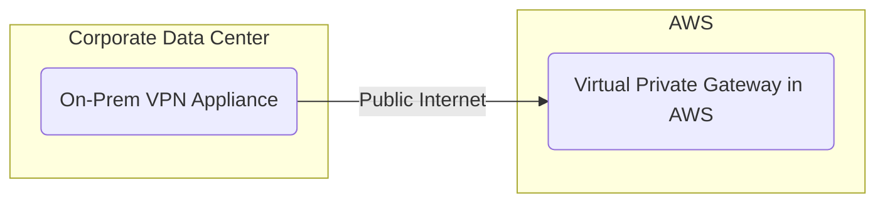
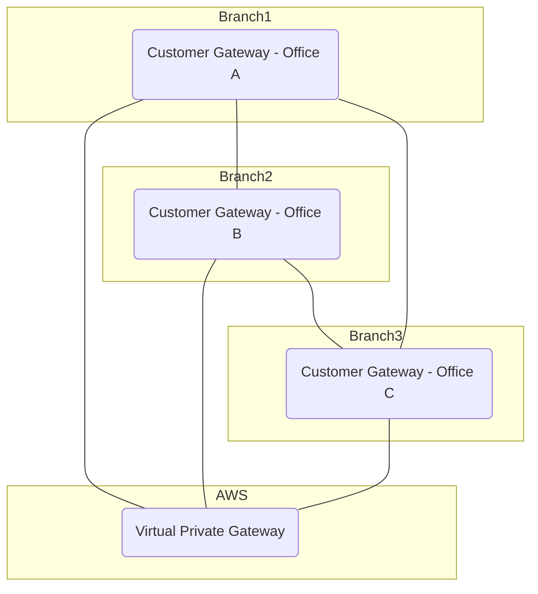
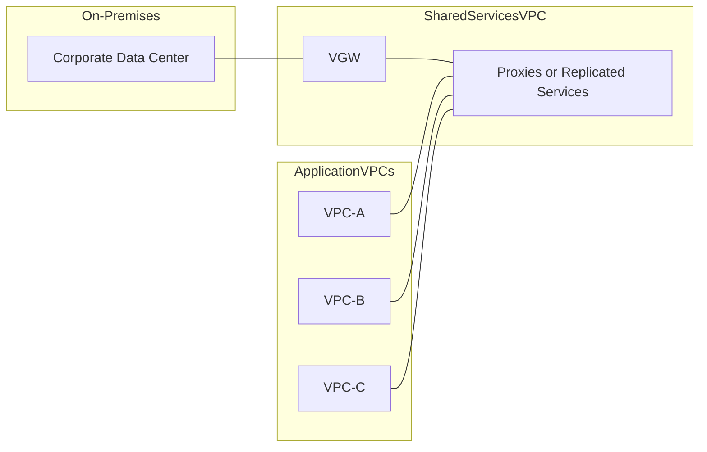

# Secure Connectivity in Hybrid Environments

## Introduction

Establishing secure connections between on-premises data centers and Amazon Virtual Private Clouds (VPCs) is a core responsibility for an advanced cloud architect. By configuring virtual private gateways, customer gateways, and robust routing strategies, you can create a unified network fabric spanning your data center and the AWS Cloud. This chapter explores the fundamental concepts, configurations, and design scenarios for VPN-based connectivity and related hybrid strategies, helping you prepare for practical implementations and professional-level certification.

## Overview of Site-to-Site VPN

A site-to-site VPN allows encrypted communication over the public internet between your corporate data center (on-premises) and AWS. When properly configured, resources on both sides can securely exchange traffic via private IP addresses—effectively extending your local network into the cloud.

Key building blocks:

- **Customer Gateway (CGW):** Represents your on-premises VPN appliance (hardware or software) that must have a public IP.
- **Virtual Private Gateway (VGW):** An AWS endpoint attached to your VPC that completes the VPN tunnel on the AWS side.
- **VPN Connection:** Binds the CGW and VGW together with two encrypted tunnels for redundancy.
- **Traffic Encryption:** Uses IPsec for protection and confidentiality over the public internet.

A typical site-to-site VPN deployment requires:

1. A CGW resource referencing the public IP address of your on-premises VPN appliance.
2. A VGW attached to your VPC.
3. A VPN connection resource that associates both gateways and establishes two IPsec tunnels.

Below is a conceptual diagram illustrating the basic site-to-site VPN architecture, including the redundant tunnels from on-premises to AWS:





## Routing and Route Propagation

Once the site-to-site VPN is up, proper routing ensures traffic can flow between on-premises workloads and AWS-based instances.

### Static Routing

You can configure static routes in the route tables of both sides:

- **On-premises router:** Forwards traffic destined for the VPC’s IP range to the CGW.
- **VPC subnet route tables:** Forwards traffic to the VGW for destination CIDRs representing on-premises.

Static routing works well for smaller or stable networks but lacks flexibility if new subnets or CIDR ranges appear.

### Dynamic Routing (BGP)

For large or frequently changing networks, dynamic routing can be enabled through the Border Gateway Protocol (BGP). Each side advertises IP prefixes to its peer, eliminating manual route management. You only need to:

- Assign an Autonomous System Number (ASN) to your CGW (on-premises).
- Assign an ASN to your VGW (in AWS).

When enabled, BGP automatically exchanges route updates, simplifying network management as you scale.

#### Sample JSON Configuration for a Customer Gateway

Below is a simplified example of defining a customer gateway via an infrastructure-as-code template. Adjust properties (such as IP address and ASN) to match your environment:


```json
{
  "Resources": {
    "MyCustomerGateway": {
      "Type": "AWS::EC2::CustomerGateway",
      "Properties": {
        "BgpAsn": 65000,
        "IpAddress": "198.51.100.10",
        "Type": "ipsec.1",
        "Tags": [
          {
            "Key": "Name",
            "Value": "CorporateCustomerGateway"
          }
        ]
      }
    }
  }
}
```

## VPN Internet Traffic Scenarios

Sometimes, on-premises servers need internet access through AWS, or AWS instances require the internet through on-premises. These paths are not always straightforward.

### Using a NAT Gateway

A NAT gateway in a public subnet typically allows private subnets in a VPC to reach the internet. However, traffic originating from on-premises via the site-to-site VPN **cannot** route out through the NAT gateway. AWS imposes this limitation so that addresses from on-premises subnets cannot be masqueraded through a NAT gateway and out to the internet.

### Using a NAT Instance

A NAT instance is an Amazon EC2 instance configured to forward traffic. Unlike the NAT gateway, a NAT instance **can** be customized to forward on-premises traffic to the internet. You control the instance’s operating system and routing policies, so this approach can enable cross-VPN traffic to exit through AWS. It does, however, require more maintenance and management than a NAT gateway.

### Routing On-Premises Traffic to the Internet via Your Data Center

Instead of sending on-premises traffic to the public internet via AWS, some organizations prefer routing AWS private subnet traffic back to on-premises and out through a local NAT solution. This approach centralizes egress control and may align with specific compliance policies or security filtering requirements.

## VPN CloudHub

When multiple branch offices need secure connectivity with each other and a VPC, you can set up a multi-site solution known as “CloudHub.” Each branch location (each with its own CGW) connects to a single VGW in AWS. This forms a hub-and-spoke topology, allowing the branches to communicate via IPsec tunnels traversing the public internet—encrypted and managed centrally through AWS.





Advantages:

- Low-cost failover or primary network.
- Encrypted, secure inter-branch communications.
- Redundant tunnels for resiliency.

This is especially useful as a backup network if the primary connections between branch offices fail, or for organizations that prefer a simple, centralized approach.

## Scaling Across Multiple VPCs

Managing separate site-to-site VPN connections for many VPCs can quickly become cumbersome. Each VPC requires its own VGW and corresponding VPN link to on-premises. Two common solutions:

### Direct Connect Gateway

When the number of VPCs grows, AWS Direct Connect combined with a Direct Connect gateway often becomes more efficient. However, that is a separate managed service and is typically used when you need predictable, dedicated bandwidth.

### Shared Services VPC

A frequently adopted pattern is to configure a single VPN connection into one “Shared Services VPC,” which then handles on-premises connectivity and proxying:

1. **VPN Terminates in a Shared Services VPC:** This VPC includes a VGW and resources (or proxies) that mirror or communicate with on-premises services.
2. **Peering with Other VPCs:** Other application VPCs establish VPC peering links to the Shared Services VPC. Because VPC peering isn’t transitive, the direct link to on-premises remains in the Shared Services VPC.
3. **Proxies or Replication:** Either replicate essential workloads from on-premises to the Shared Services VPC or deploy proxies that relay traffic to on-premises.

This strategy consolidates all hybrid connectivity in a single location, reducing the complexity of multiple site-to-site VPN tunnels.





## Exam Tips and Best Practices

- **Redundancy:** Each site-to-site VPN automatically provisions two tunnels for high availability.
- **Non-Overlapping CIDRs:** Ensure your on-premises IP address ranges do not overlap with your VPC CIDR; otherwise, routing conflicts arise.
- **Routing Choice:**
    - **Static Routing** for smaller, stable environments.
    - **BGP (Dynamic Routing)** for larger, rapidly changing networks.
- **NAT Gateway Limitation:** On-premises traffic reaching AWS via a site-to-site VPN cannot simply go out to the internet through a NAT gateway. Consider a NAT instance or an on-premises NAT solution if that scenario is required.
- **Scaling Strategy:** If you plan to connect multiple VPCs, evaluate consolidated designs like the Shared Services VPC pattern or consider AWS Direct Connect for higher throughput.

## Conclusion

A site-to-site VPN is a foundational building block for hybrid cloud architectures, enabling secure, IPsec-encrypted communication between on-premises locations and AWS VPCs over the public internet. From essential routing choices (static vs. dynamic) to specialized scenarios involving NAT gateways, NAT instances, and multi-branch connectivity (CloudHub), the decisions you make at this layer have a profound impact on performance and manageability. In more complex environments, techniques such as Shared Services VPCs or Direct Connect can enhance scalability. By mastering these concepts and configurations, you are well-prepared to design robust hybrid architectures for enterprise-grade solutions.