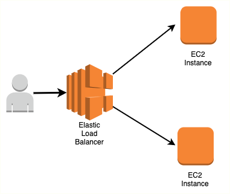
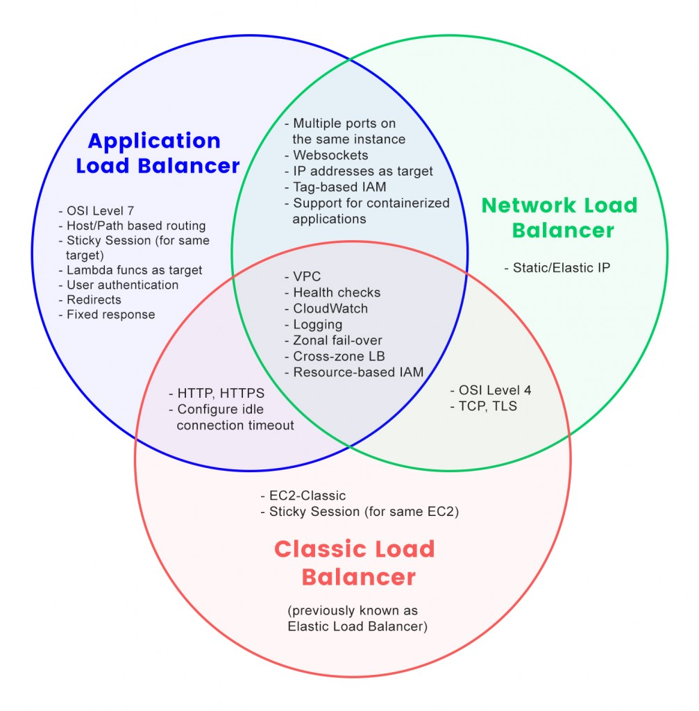
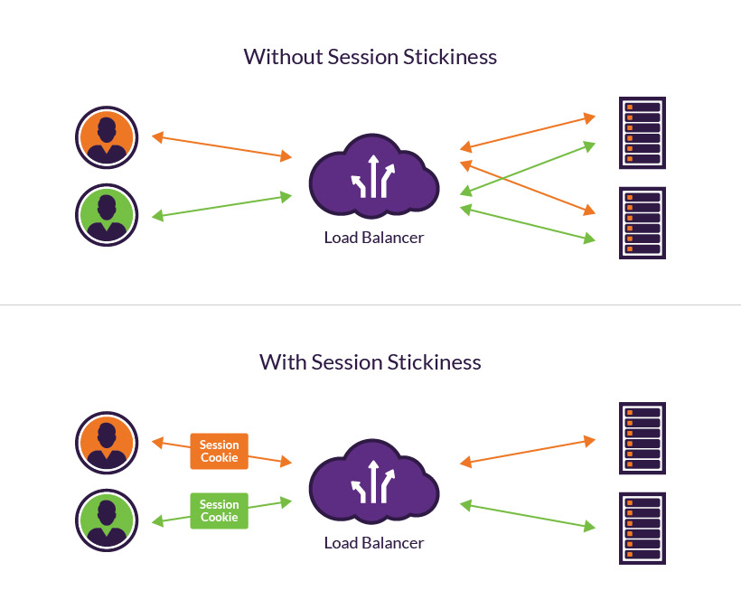
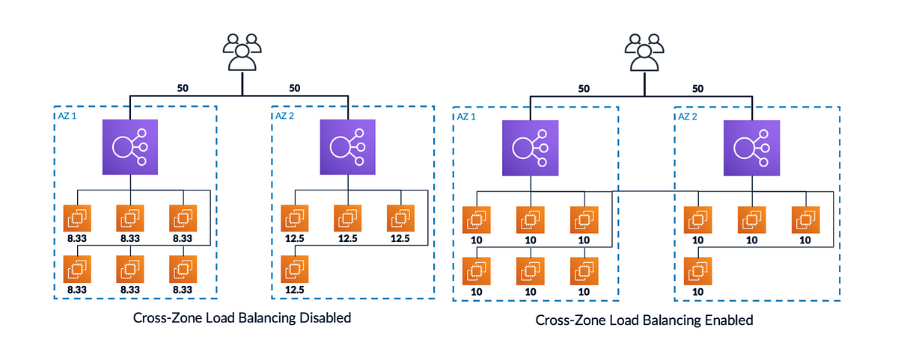
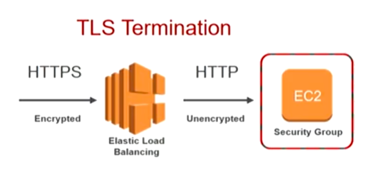

# AWS Elastic Load Balancing

## 1. Introduction

The evolution of modern web applications demands that network infrastructure be robust, scalable, and fault-tolerant. At the heart of these requirements lies the concept of load balancing—a technique used to distribute incoming network traffic across multiple backend servers or resources. AWS Elastic Load Balancing embodies this concept by automatically distributing incoming application traffic and seamlessly handling failures of backend targets.

## 2. ELB Fundamentals

Understanding the fundamentals of Elastic Load Balancing is essential before moving into the more advanced configurations and use cases. In this section, we provide a comprehensive overview of ELB, its core features, and an analysis of the various load balancer types available on AWS.

### 2.1 ELB Overview: Purpose and Key Features

At its core, a load balancer is a server—or a collection of servers—that distributes incoming network traffic across multiple backend targets (such as EC2 instances, containers, or even on-premises servers). The primary purpose of a load balancer is to:

- **Distribute Traffic Evenly:** Whether you have three or thirty instances, the load balancer ensures that user requests are distributed to prevent any single instance from becoming a bottleneck.
- **Improve Fault Tolerance:** With built-in health checks, ELB can automatically detect unhealthy instances and stop routing traffic to them until they recover.
- **Simplify Client Connectivity:** Clients connect to a single endpoint, abstracting the complexities of the underlying server infrastructure.
- **Enhance Security:** ELB can offload tasks such as SSL termination and provide integrated security with features like security group associations and managed certificates.
- **Integrate Seamlessly with AWS:** AWS manages the underlying infrastructure of the ELB, including upgrades, maintenance, and scaling, freeing up your operational overhead.

From a high-level perspective, the architecture of AWS ELB involves three critical layers:

1. **Client to Load Balancer:** The client establishes a connection with the load balancer using protocols such as HTTP, HTTPS, TCP, or even UDP.
2. **Load Balancer Processing:** The load balancer then processes the incoming request. It applies health checks, routing algorithms, and security policies (e.g., SSL termination, header insertion).
3. **Load Balancer to Backend Targets:** Finally, the load balancer forwards the request to one or more backend targets that are registered with it. These targets could be in an Auto Scaling group, a container service like Amazon ECS, or even Lambda functions.

The advantages of using ELB extend beyond just distributing load; by incorporating features such as session stickiness, connection draining, and advanced routing algorithms, AWS ELB provides a robust platform that supports both simple web applications and complex microservice architectures.

### 2.2 Types of Load Balancers

AWS offers several types of load balancers, each tailored for different use cases, protocols, and performance characteristics. The main variants are the Classic Load Balancer (CLB), the Application Load Balancer (ALB), and the Network Load Balancer (NLB). (There is also the Gateway Load Balancer (GWLB), which primarily operates at the network layer, but our focus here will be on the three primary types relevant for most workloads.)

#### 2.2.1 Classic Load Balancer (CLB): Legacy Use Cases

The Classic Load Balancer represents the first generation of AWS load balancing technology. Although it is now considered legacy and is being phased out in favor of more modern solutions, the CLB played a crucial role in the evolution of load balancing on AWS.

**Key Characteristics of the CLB:**

- **Protocol Support:**  
    The CLB supports multiple protocols, including HTTP, HTTPS, TCP, and SSL (also known as Secure TCP). This versatility allowed users to configure the load balancer for a wide range of applications.
    
- **Health Checks:**  
    Health checks in a CLB are critical for ensuring that only healthy backend instances receive traffic. The CLB supports HTTP, HTTPS, and TCP health checks. A typical configuration involves specifying a port and a URL path (such as `/health`) that the CLB will use to verify instance health. If a backend instance fails to respond with an acceptable status code (commonly HTTP 200), it is marked as unhealthy and traffic is no longer directed to it.
    
- **Listener Architecture:**  
    In a CLB, a listener defines the protocol and port on which the load balancer accepts incoming traffic. The listener is responsible for establishing the connection with the client, and then forwarding the traffic to the appropriate backend instances. The CLB supports both encrypted (HTTPS/SSL) and unencrypted (HTTP/TCP) connections.
    
- **Backend Instance Registration:**  
    With CLB, backend instances are registered directly with the load balancer. There is no abstraction layer like “target groups,” which were introduced later in the evolution of AWS load balancing. This direct registration is one of the factors that have contributed to the CLB’s classification as legacy.
    
- **EC2-Classic Network:**  
    The CLB was originally designed to work with the EC2-Classic network, a now-deprecated network model. Even though CLB can also be used within a Virtual Private Cloud (VPC), its original design was for a less secure, flat network architecture.
    
- **Security and SSL Termination:**  
    While the CLB supports SSL termination—where the load balancer decrypts incoming HTTPS traffic and then passes unencrypted HTTP traffic to the backend—it requires careful configuration. For end-to-end encryption (where SSL termination happens at the backend), certificates must be installed on each EC2 instance.
    
- **Operational Limitations:**  
    As the first-generation load balancer, the CLB lacks several advanced features available in ALB and NLB. For instance, it does not support features like advanced routing based on URL path or hostname, dynamic port mapping for containerized environments, or the modern handling of WebSockets and HTTP/2.
    

**Use Cases and Legacy Considerations:**

Although AWS encourages users to migrate to the ALB or NLB, the CLB is still in use for legacy applications or scenarios where the original architecture was built using EC2-Classic. For exam purposes and in historical contexts, it is important to understand the CLB’s behavior, particularly its handling of SSL termination, connection routing, and the absence of target groups.

#### 2.2.2 Application Load Balancer (ALB): Layer 7 Routing

The Application Load Balancer is a modern, feature-rich load balancing solution that operates at the application layer (Layer 7) of the OSI model. ALB was introduced to address the needs of HTTP/HTTPS applications and microservices architectures.

**Key Characteristics of the ALB:**

- **Layer 7 Intelligence:**  
    Operating at Layer 7, the ALB understands HTTP and HTTPS protocols in detail. This allows it to make routing decisions based on the content of the request, such as URL path, HTTP headers, query parameters, and even the host header.
    
- **Multiple Listeners and Rules:**  
    An ALB can have multiple listeners configured on different ports (e.g., 80 for HTTP and 443 for HTTPS). Each listener can have one or more rules that define how to route traffic. Rules are evaluated in order, and each rule can specify conditions (such as path patterns or query strings) along with an associated action—typically forwarding to a target group.
    
- **Target Groups:**  
    Unlike the CLB, the ALB uses target groups to abstract backend endpoints. A target group contains one or more targets (such as EC2 instances, IP addresses, Lambda functions, or containers running in ECS). Health checks are configured at the target group level, and targets can be shared among different rules.
    
- **Dynamic Port Mapping:**  
    ALB supports dynamic port mapping, making it ideal for containerized applications. With this feature, an ALB can route traffic to a container running on an arbitrary port on an EC2 instance, as defined by the ECS task.
    
- **Protocol Support and Advanced Features:**  
    The ALB supports HTTP, HTTPS, WebSockets, HTTP/2, and gRPC. In particular, gRPC support enables efficient communication in microservices architectures by leveraging the modern HTTP/2 protocol.
    
- **Session Stickiness:**  
    ALB allows for sticky sessions (also known as session affinity). When enabled, the ALB uses cookies (either generated by the load balancer or by the application) to ensure that subsequent requests from the same client are routed to the same target.
    
- **SSL/TLS Offloading and SNI:**  
    With ALB, SSL/TLS termination can occur at the load balancer. This means that incoming HTTPS traffic is decrypted at the ALB and forwarded as HTTP (or re-encrypted for end-to-end encryption) to the backend targets. ALB also supports Server Name Indication (SNI), which allows multiple SSL certificates to be served on a single load balancer.
    
- **Content-Based Routing:**  
    One of the most powerful features of ALB is its ability to route traffic based on the content of the request. For instance, you can route requests to `/user/*` to one target group and `/admin/*` to another, or use host-based routing to direct traffic based on the requested domain name.
    
- **Custom HTTP Responses and Redirects:**  
    ALB can generate custom HTTP responses (e.g., a fixed 404 response) or automatically redirect requests from HTTP to HTTPS, enhancing both security and user experience.

**Use Cases for the ALB:**

The ALB is particularly well-suited for modern web applications that require advanced routing and for microservices architectures where different services may be running on a single set of instances or containers. Its integration with Amazon ECS and Lambda functions further expands its applicability to serverless and containerized deployments.

#### 2.2.3 Network Load Balancer (NLB): Ultra-Low Latency

The Network Load Balancer is designed for high performance and ultra-low latency. Operating at the transport layer (Layer 4), the NLB is ideal for use cases that require extreme performance and the ability to handle millions of requests per second.

**Key Characteristics of the NLB:**

- **Layer 4 Operation:**  
    The NLB works at Layer 4, meaning it deals directly with TCP, UDP, and TLS protocols. Unlike the ALB, which inspects the content of HTTP requests, the NLB operates at a lower level, making it faster and better suited for latency-sensitive applications.
    
- **Static IP Addresses and ENIs:**  
    Each Availability Zone (AZ) in which the NLB is deployed has a fixed IP address associated with the load balancer. These IP addresses are assigned to Elastic Network Interfaces (ENIs) that remain static for the life of the NLB. In internet-facing configurations, you can also assign Elastic IPs for easier whitelisting in firewalls.
    
- **High Throughput and Low Latency:**  
    The NLB is optimized for performance. With the ability to handle hundreds of thousands of simultaneous connections per minute, it is ideal for applications that require high throughput. Typical latencies for the NLB are in the low hundreds of milliseconds—significantly lower than those for the ALB.
    
- **Support for TCP, TLS, UDP, and TCP_UDP:**  
    The NLB supports a wide range of protocols. This makes it a versatile option for applications that may not use HTTP/HTTPS, such as gaming servers, VoIP services, or custom TCP/UDP applications.
    
- **Preservation of Client IP Address:**  
    One of the critical features of the NLB is its ability to preserve the original client IP address. When a backend target is registered using an instance ID, the target receives the client’s IP address directly. If targets are registered by IP address, certain protocols (TCP or TLS) may require the Proxy Protocol to forward the original IP information.
    
- **Proxy Protocol Support:**  
    In scenarios where the client IP is not preserved by default, the NLB supports the Proxy Protocol. This protocol prepends a header with the originating client’s IP address and port number to the TCP payload, ensuring that backend targets can still determine the original source of the connection.
    
- **Zonal and Regional DNS Naming:**  
    The NLB provides both regional DNS names—which resolve to all node IPs in enabled AZs—and zonal DNS names, which allow clients to target a specific AZ. This can be particularly useful in applications where minimizing inter-AZ data transfer is critical.
    
- **Advanced Use Cases:**  
    In addition to serving traditional backend instances, the NLB can be used with containerized workloads (leveraging dynamic port mapping) and in cross-region or inter-VPC deployments. However, it is important to note that some advanced features (such as content-based routing) available in the ALB are not supported in the NLB due to its focus on raw performance and low-level protocol handling.
    

**When to Use the NLB:**

The NLB is the best choice for applications that demand ultra-low latency, extremely high throughput, and protocols that extend beyond HTTP/HTTPS. For instance, custom TCP-based applications or services requiring UDP communication can benefit significantly from the NLB’s architecture. Furthermore, when the preservation of the client IP is critical for logging or security, the NLB’s capabilities make it an ideal candidate.

## 3. Configuration and Connection Management

Proper configuration and management of connections are paramount for ensuring that your load balancer performs optimally under varying workloads. In this section, we dive into the details of managing connection lifecycles, routing strategies, and cross-zone traffic distribution.

### 3.1 Connection Lifecycle: Idle Timeout and Connection Draining

Managing how long a connection stays open—and gracefully handling the removal of backend targets—is key to maintaining application responsiveness and ensuring resource efficiency.

#### 3.1.1 Connection Idle Timeout

The connection idle timeout is the duration a connection is allowed to remain inactive before it is closed. This setting applies at two points in the load balancing architecture:

- **Between the Client and the Load Balancer:**  
    If no data is transmitted between the client and the load balancer for a specified period (default is typically 60 seconds for ALB and CLB), the connection is closed. This helps free up resources and prevents hanging connections.
- **Between the Load Balancer and the Backend Targets:**  
    Similarly, if there is no data exchange between the load balancer and an EC2 instance (or other target) for the same period, that connection will also be terminated.

It is essential to tune the idle timeout based on your application’s behavior. For instance, applications that involve large file uploads or long-lived sessions might benefit from increasing the idle timeout to prevent premature disconnections. Conversely, for short-lived connections, a lower timeout can help conserve resources.

_Note:_ For the Network Load Balancer, idle timeout settings differ slightly. TCP connections in the NLB are typically fixed at 350 seconds, while UDP connections default to 120 seconds. The NLB does not offer the same level of configurability for the idle timeout as the ALB or CLB.

#### 3.1.2 Connection Draining (Deregistration Delay)

Connection draining—referred to as “deregistration delay” in ALB and NLB contexts—is the mechanism that allows an instance to finish processing in-flight requests before it is removed from service. This feature is crucial during:

- **Instance Termination:**  
    When an instance is taken out of service (for example, as part of an Auto Scaling event), connection draining ensures that any active connections can complete their tasks rather than being abruptly terminated.
- **Target Group Reconfiguration:**  
    If a backend target is marked unhealthy or is being replaced, connection draining provides a grace period (which can be configured from 1 to 3,600 seconds) for existing sessions to finish processing before new connections are redirected to healthy targets.

During the deregistration delay, the load balancer stops sending new requests to the instance being drained. However, it continues to forward requests for connections that were already established until the defined timeout is reached or the connections are closed naturally.

Proper configuration of connection draining is especially important for applications with long-running requests, ensuring that critical transactions are not interrupted mid-stream.

### 3.2 Routing Strategies

How a load balancer routes traffic to backend targets is determined by the routing algorithms and strategies that are configured. In this section, we discuss both the methods used to distribute load and the mechanisms that maintain session affinity when needed.

#### 3.2.1 Request Routing Algorithms

Different routing algorithms can be employed to distribute incoming requests efficiently:

- **Round Robin:**  
    In the round-robin algorithm, requests are distributed equally among the backend targets in a cyclic order. For example, if you have three targets, the first request goes to target 1, the second to target 2, the third to target 3, and then the cycle repeats. This method is straightforward and ensures an even distribution when all targets have equal capacity.
    
- **Least Outstanding Requests:**  
    This algorithm directs each new request to the backend instance that currently has the fewest outstanding (pending or incomplete) requests. By dynamically assessing the load on each instance, this method can lead to a more balanced distribution, especially when the processing time for requests is variable.
    
- **Flow Hash:**  
    Used primarily by the NLB, the flow hash algorithm considers various elements of the connection (including protocol, source and destination IP addresses and ports, and even the TCP sequence number) to compute a hash value. This hash determines which target will handle the connection, ensuring that a given TCP or UDP connection is always routed to the same backend target for its entire duration. This is crucial for maintaining session state in protocols that do not support higher-layer session affinity.

Each algorithm is chosen based on the application’s characteristics and workload patterns. For example, round robin is effective in homogeneous environments, while least outstanding requests is preferred when backend instances exhibit varying performance characteristics.

#### 3.2.2 Session Affinity: Configuring Sticky Sessions

Session affinity, or sticky sessions, ensures that subsequent requests from the same client are directed to the same backend instance. This is particularly important when session state is maintained locally on the backend rather than in a shared store.

**How Sticky Sessions Work:**

- **Cookie-Based Mechanism:**  
    When sticky sessions are enabled, the load balancer uses cookies to “remember” which backend instance handled a client’s initial request. There are two types of cookies:
    - **Load Balancer–Generated Cookies:**  
        These are automatically generated by the load balancer (with names such as AWSALB or AWSELB, depending on the load balancer type) and have a configurable expiration time. Once the cookie is set, subsequent requests from the client include this cookie, allowing the load balancer to route the connection to the same target.
    - **Application-Based Cookies:**  
        Alternatively, an application can generate its own cookie that contains session information. In this scenario, the load balancer must be configured to recognize the custom cookie name.
- **Configuration and Expiration:**  
    The duration for which sticky sessions remain active is configurable. A shorter duration might lead to a more even load distribution over time, while a longer duration ensures that the session state is maintained consistently throughout the user’s interaction with the application.

Sticky sessions can introduce load imbalances if a single backend becomes “sticky” for a disproportionate number of users. Therefore, it is critical to analyze application behavior and adjust the cookie expiration settings appropriately.

### 3.3 Cross-Zone Load Balancing: Optimizing Traffic Distribution

Cross-zone load balancing refers to the ability of a load balancer to distribute traffic evenly across backend targets that are located in different Availability Zones (AZs). This capability is vital for ensuring that traffic is not inadvertently concentrated in a single AZ, particularly in environments where the number of instances per AZ may differ.

**How Cross-Zone Load Balancing Works:**

- **Even Distribution of Traffic:**  
    With cross-zone load balancing enabled, a load balancer instance in any given AZ will distribute its traffic across all available targets, regardless of the zone in which they reside. For example, if you have two AZs with a total of 10 instances (2 in one AZ and 8 in the other), each load balancer node will forward traffic evenly across all 10 instances rather than limiting its distribution to the two local targets.
    
- **Configuration Considerations:**
    
    - **ALB:**  
        Cross-zone load balancing is enabled by default for Application Load Balancers. In ALB, even if a load balancer node receives 50% of the incoming traffic, it will evenly distribute that traffic across all registered targets.
    - **NLB and GWLB:**  
        For Network Load Balancers and Gateway Load Balancers, cross-zone load balancing is disabled by default. Enabling it is possible but may incur additional data transfer charges because traffic may cross AZ boundaries.
    - **CLB:**  
        With the Classic Load Balancer, cross-zone load balancing is disabled by default but can be enabled if desired. When enabled, the CLB distributes incoming traffic evenly across all instances in all AZs.
- **Impact on Data Transfer Costs:**  
    In AWS, data transfer between Availability Zones can incur additional charges. When configuring cross-zone load balancing, it is important to understand these cost implications. For the ALB, even though cross-zone load balancing is enabled by default, inter-AZ data transfer fees are not applied because of the way traffic is managed. However, for NLB and GWLB, enabling cross-zone load balancing can lead to charges due to traffic crossing AZ boundaries.

**Benefits of Cross-Zone Load Balancing:**

- **Improved Resource Utilization:**  
    Ensuring that all backend targets receive traffic in proportion to their capacity can lead to more efficient resource utilization and better overall performance.
- **Enhanced Fault Tolerance:**  
    Even if one AZ experiences issues, the load balancer can still route traffic to targets in other zones, thereby maintaining high availability.

## 4. Traffic Handling and Protocol Support

The capability of AWS Elastic Load Balancing to handle diverse traffic types and protocols is one of its greatest strengths. In this section, we cover how ELB manages secure connections, processes HTTP headers, preserves client IP information, and supports advanced protocols such as gRPC.

### 4.1 SSL/TLS Termination: Certificate Management and Encryption

Security is paramount for any web application. ELB can offload the computationally intensive task of SSL/TLS encryption and decryption from the backend servers. This process—known as SSL/TLS termination—ensures that client connections are secure while relieving backend instances of the overhead associated with cryptographic operations.

#### 4.1.1 SSL/TLS Termination at the Load Balancer

When SSL/TLS termination is configured on a load balancer:

- **Client Connection:**  
    Clients establish an HTTPS connection with the load balancer.
- **Decryption at the ELB:**  
    The load balancer decrypts the incoming request using an SSL/TLS certificate that has been installed on it.
- **Forwarding to Backends:**  
    The decrypted (or optionally re-encrypted) traffic is then forwarded to the backend targets, which may receive traffic over HTTP or HTTPS.

This process not only simplifies certificate management (since the certificates are managed centrally on the load balancer) but also improves performance by reducing the cryptographic load on backend servers.

#### 4.1.2 Certificate Management with AWS Certificate Manager (ACM)

AWS Certificate Manager (ACM) is used to manage SSL/TLS certificates for load balancers:

- **Certificate Provisioning:**  
    You can request a public certificate directly from ACM at no additional cost or import your own certificates.
- **Automatic Renewal:**  
    ACM can automatically renew certificates that it issues, ensuring uninterrupted secure communications.
- **Multi-Domain and SNI:**  
    Application Load Balancers and Network Load Balancers support multiple certificates using Server Name Indication (SNI). SNI allows the load balancer to present the correct certificate based on the hostname requested by the client.

#### 4.1.3 Security Policies and Compliance

For applications that require strict compliance, load balancers support predefined security policies:

- **Predefined Security Policies:**  
    AWS offers several security policies (e.g., ELBSecurityPolicy-2016-08, ELBSecurityPolicy-FS) that specify the supported SSL/TLS protocols, ciphers, and server order preferences.
- **Custom Policies:**  
    In some cases, organizations may require custom policies to meet internal security standards. These policies can be configured on the load balancer to ensure that only compliant connections are allowed.

### 4.2 HTTP Headers: Using X-Forwarded-For and X-Forwarded-Proto

When a load balancer terminates SSL/TLS or otherwise proxies HTTP traffic, it must ensure that the backend servers can determine the original client information. AWS ELB uses custom HTTP headers for this purpose:

- **X-Forwarded-For:**  
    This header contains the IP address of the original client. Even though the backend server sees the request coming from the load balancer’s private IP, this header ensures that the client’s public IP is not lost.
- **X-Forwarded-Proto:**  
    This header indicates the protocol (HTTP or HTTPS) that the client used to connect to the load balancer. This is especially useful when the load balancer terminates SSL/TLS and forwards traffic as HTTP.
- **X-Forwarded-Port:**  
    In some configurations, the port used by the client to connect to the load balancer is included in this header.

Using these headers, backend servers can log accurate client information, enforce protocol-specific behavior, and perform security checks based on the originating connection parameters.

### 4.3 Proxy Protocol: Preserving Client IP Information (Layer 4)

For load balancers operating at Layer 4, such as the Network Load Balancer, preserving the original client IP address may not be straightforward because the load balancer does not perform application-layer processing. To address this, AWS offers the Proxy Protocol.

#### 4.3.1 How the Proxy Protocol Works

- **Header Insertion:**  
    When the Proxy Protocol is enabled, the load balancer prepends a small header to the TCP payload. This header includes the client’s IP address, port number, and other connection details.
- **Backend Parsing:**  
    The backend target must be configured to parse the Proxy Protocol header to extract the client information. Once extracted, the application can log the client’s IP and make routing or security decisions based on it.

#### 4.3.2 Versions and Use Cases

- **Proxy Protocol v1 vs. v2:**  
    The Classic Load Balancer and Network Load Balancer use different versions of the Proxy Protocol. For example, the CLB uses version 1, while the NLB uses version 2.
- **When to Enable:**  
    If backend targets are registered by IP addresses (rather than by instance ID) for TCP or TLS connections, the Proxy Protocol is essential to preserve the original client IP. For protocols such as UDP or TCP_UDP, the client IP is preserved by default.

By leveraging the Proxy Protocol, you ensure that even in a pure Layer 4 environment, backend applications have access to critical client connection details for logging, monitoring, and security purposes.

### 4.4 Advanced Protocol Support: gRPC with ALB

Modern microservices architectures are increasingly adopting gRPC—a high-performance, open-source universal RPC framework that uses HTTP/2 for transport. The Application Load Balancer has been enhanced to support gRPC traffic natively.

#### 4.4.1 Overview of gRPC

gRPC is designed for:

- **Efficient Communication:**  
    gRPC uses HTTP/2, which supports multiplexing of requests, header compression, and bidirectional streaming. This leads to significant performance improvements, especially for microservices.
- **Strongly Typed Contracts:**  
    With Protocol Buffers as the interface definition language, gRPC ensures that service contracts are well-defined and strictly enforced.
- **Streaming Capabilities:**  
    gRPC supports various types of streaming (client, server, and bidirectional), enabling real-time data exchange for applications that require continuous communication.

#### 4.4.2 gRPC Integration with ALB

The ALB’s support for gRPC brings several advantages:

- **Native HTTP/2 Support:**  
    Since gRPC relies on HTTP/2, the ALB’s native support for HTTP/2 makes it an ideal choice for routing gRPC traffic.
- **Advanced Routing:**  
    With content-based routing capabilities, the ALB can direct gRPC requests to the appropriate backend services based on request metadata.
- **Unified Health Checks:**  
    The ALB can perform health checks on gRPC endpoints just as it does for HTTP/HTTPS targets, ensuring that only healthy microservices receive traffic.

This advanced protocol support simplifies the deployment of microservices architectures on AWS, enabling developers to build high-performance, scalable, and resilient applications.

## 5. Advanced Deployment Scenarios

As organizations evolve their IT infrastructure, hybrid environments that bridge on-premises data centers and AWS cloud environments have become increasingly common. In this section, we explore how AWS Elastic Load Balancers can be deployed in advanced scenarios, including hybrid connectivity and multi-VPC architectures.

### 5.1 Hybrid Connectivity: Bridging On-Premises and AWS Workloads

Hybrid deployment scenarios involve connecting on-premises environments with AWS, allowing organizations to leverage both legacy systems and cloud-native services seamlessly. ELB plays a pivotal role in such architectures.

#### 5.1.1 Establishing Connectivity

To enable a hybrid deployment, you must first establish secure connectivity between your on-premises data center and AWS. This can be achieved through:

- **VPN Connections:**  
    A Virtual Private Network (VPN) can securely link your on-premises network to an Amazon VPC over the public Internet.
- **AWS Direct Connect:**  
    For higher bandwidth and lower latency, AWS Direct Connect provides a dedicated network connection between your on-premises data center and AWS.

Once connectivity is established, the next step is to integrate your on-premises workloads with AWS load balancing.

#### 5.1.2 Configuring Target Groups for On-Premises Servers

When using an Application Load Balancer in a hybrid scenario:

- **Private IP Targets:**  
    Backend targets for on-premises servers must be registered using their private IP addresses. This ensures that traffic is routed over the secure, private connectivity established between your data center and AWS.
- **Health Checks Across the Hybrid Environment:**  
    Health checks can be configured to monitor the availability of on-premises servers. The load balancer can then intelligently route traffic only to healthy endpoints.
- **Routing Considerations:**  
    Depending on the latency and performance requirements, you may choose to create separate target groups for on-premises and AWS-based workloads. Advanced routing rules can then direct traffic appropriately, enabling a seamless user experience.

#### 5.1.3 VPC Peering and Inter-Region Connectivity

In addition to hybrid on-premises connectivity, AWS also supports multi-VPC and inter-region deployments:

- **VPC Peering:**  
    VPC peering allows two or more VPCs to communicate as if they were within the same network. When an Application Load Balancer in one VPC needs to route traffic to EC2 instances in another peered VPC, target groups are defined with the private IP addresses of the instances.
- **Inter-Region Load Balancing:**  
    Although more complex, it is possible to configure load balancing across AWS regions using features like Route 53 and global accelerator services. This ensures that users are directed to the closest available region, thereby reducing latency.

#### 5.1.4 Internet-Facing vs. Internal Load Balancers

Understanding the differences between internet-facing and internal load balancers is essential when designing hybrid solutions:

- **Internet-Facing Load Balancers:**  
    These load balancers have public IP addresses and are deployed in public subnets. They are used to serve traffic from the Internet, often routing it to backend instances located in private subnets.
- **Internal Load Balancers:**  
    Internal load balancers are deployed in private subnets and are not accessible directly from the Internet. They are used to route traffic between applications within the AWS network or between AWS and on-premises environments.
- **Dual-Stack Support:**  
    Internet-facing load balancers can be configured with dual-stack (IPv4 and IPv6) endpoints. Although client connections may use IPv6, traffic to the backend remains IPv4, ensuring compatibility with legacy systems.

## 6. Security and Network Controls

A secure and well-managed network is a cornerstone of any production environment. In this section, we examine the security measures that are integral to AWS Elastic Load Balancing, including security groups, outbound rules, and the use of managed prefix lists.

### 6.1 Securing ELB: Security Groups for Inbound/Outbound Traffic

Security groups act as virtual firewalls that control inbound and outbound traffic for AWS resources, including load balancers and backend instances.

#### 6.1.1 Configuring Security Groups for Load Balancers

- **Inbound Rules for ELB:**  
    For internet-facing load balancers, security groups are typically configured to allow inbound traffic on ports 80 (HTTP) and 443 (HTTPS) from any IP address (0.0.0.0/0). This ensures that clients from anywhere can access your application.
- **Outbound Rules for ELB:**  
    Outbound rules determine where the load balancer can send traffic. By default, these rules may allow traffic to any destination. However, for enhanced security, you can restrict outbound traffic to specific CIDR blocks or destinations, such as Amazon S3 endpoints.

#### 6.1.2 Securing Backend Instances

- **Restricting Traffic Sources:**  
    Backend EC2 instances should be configured with security groups that only allow traffic originating from the load balancer’s security group. This ensures that the instances are not exposed directly to the public Internet.
- **Layered Security:**  
    Employing a layered security approach, where both the load balancer and the backend instances are protected by security groups with strict rules, greatly enhances the overall security posture.

#### 6.1.3 Best Practices

- **Least Privilege Principle:**  
    Configure security groups to allow only the minimum necessary traffic. For example, if a backend instance only needs to accept traffic from the load balancer, specify the load balancer’s security group as the only source.
- **Regular Audits:**  
    Regularly review and update security group rules to ensure they comply with evolving security requirements and best practices.

### 6.2 Managed Prefix Lists: Simplifying IP Allowlisting

Managing IP address ranges manually in security groups and route tables can be cumbersome and error-prone, especially in large environments. AWS Managed Prefix Lists provide a solution for simplifying IP allowlisting and network management.

#### 6.2.1 What Are Prefix Lists?

A prefix list is a collection of CIDR blocks that represent a set of IP addresses. AWS offers two types of prefix lists:

- **AWS-Managed Prefix Lists:**  
    These lists contain IP ranges for AWS services (e.g., Amazon S3, Amazon CloudFront, DynamoDB). They cannot be modified by users but can be referenced in security group rules.
- **Customer-Managed Prefix Lists:**  
    You can create and manage your own prefix lists, allowing you to group together frequently used CIDRs and reference them across multiple security groups and route tables. This centralization simplifies network administration and ensures consistency.

#### 6.2.2 Benefits of Using Prefix Lists

- **Simplified Management:**  
    Instead of specifying multiple individual CIDR blocks in each security group rule, you can reference a single prefix list.
- **Centralized Updates:**  
    When a prefix list is updated, all security groups that reference that list automatically inherit the changes, reducing administrative overhead.
- **Enhanced Security:**  
    Using prefix lists helps enforce strict network segmentation and access control by providing a clear and manageable way to allow or deny traffic from specific IP ranges.

#### 6.2.3 Implementation Considerations

- **Inter-Account Sharing:**  
    Customer-managed prefix lists can be shared across multiple AWS accounts. This is particularly useful in multi-account organizations where consistent network policies must be applied.
- **Integration with AWS Services:**  
    Managed prefix lists are supported in security group configurations, VPC route tables, and other network-related settings, providing a cohesive mechanism for network security management.

## 7. Conclusion

In this chapter, we have explored the breadth and depth of AWS Elastic Load Balancing. From its fundamental concepts to the intricacies of connection management, advanced protocol support, and hybrid deployment scenarios, AWS ELB is shown to be a versatile and powerful tool for modern application architectures.
