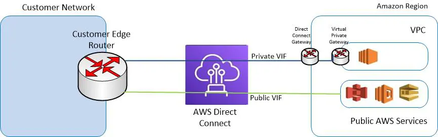
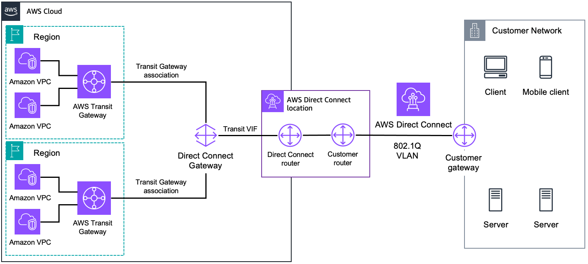
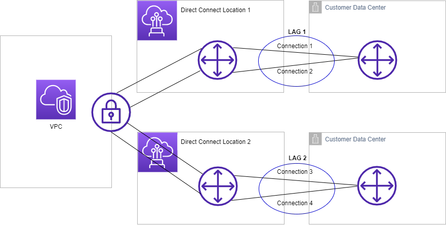
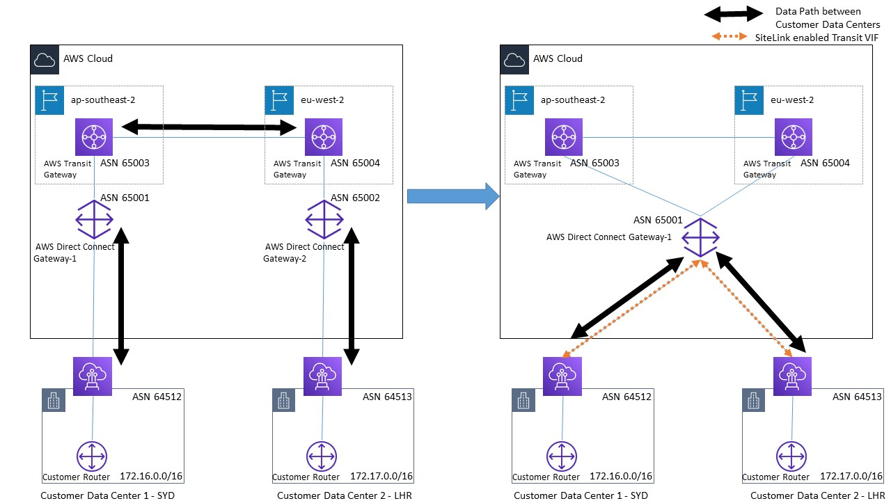

# AWS Direct Connect

## 1. Introduction

In today’s era of cloud computing, many organizations are embracing a hybrid strategy in which critical workloads and data are split between on‑premises data centers and cloud environments. AWS Direct Connect plays a pivotal role in this strategy by offering a dedicated physical network link that bypasses the public Internet. This chapter begins by introducing the importance of hybrid connectivity, explains the unique characteristics of Direct Connect, and discusses its role in modern enterprise architectures.

Direct Connect is not a “virtual” service you can simply spin up on a console—it requires physical network ports, fiber connections, and coordination with third‑party colocation facilities. These realities mean that while many cloud services (like creating a VPC) are software‑defined, Direct Connect involves tangible, physical infrastructure. In today’s competitive market, where latency and consistent bandwidth can be critical to performance, the benefits of a dedicated link are significant: reduced latency, lower data transfer costs, and improved network reliability.

In the following sections, we will describe in detail the concepts and procedures you need to understand before you plan your Direct Connect deployment. We will explain the technical requirements, describe the different connection types available (dedicated versus hosted), and cover every aspect from physical wiring and cross‑connects to virtual interfaces and routing mechanisms.

## 2. Core Concepts and Requirements

AWS Direct Connect is built on well‑established networking principles. In this section, we cover the fundamental requirements—from the physical layer up through the network protocols—that enable Direct Connect to function seamlessly in a hybrid environment.

### 2.1 Introduction to AWS Direct Connect: Use Cases and Benefits

AWS Direct Connect is used to create a private, dedicated connection between an organization’s corporate data center and the AWS Cloud. Some of its primary benefits include:

- **Consistent Bandwidth and Low Latency:** By avoiding the variability of the public Internet, Direct Connect ensures that the connection has predictable performance.
- **Cost Savings:** Data transfer rates via Direct Connect are typically lower than standard Internet data transfer charges, which is especially significant for large‑scale or high‑volume data movements.
- **Enhanced Security:** Since the connection is private, the risk associated with Internet‑exposed links is mitigated.
- **Support for Hybrid Architectures:** Direct Connect is essential for scenarios where on‑premises systems must reliably connect to AWS services (both public services such as S3 and private resources inside a VPC).

These benefits make Direct Connect an indispensable component of any hybrid network design where predictable performance and security are paramount.

### 2.2 Network Requirements for Direct Connect

Before provisioning Direct Connect, organizations must meet several technical prerequisites:

- **Physical Connectivity:** A dedicated fiber link must be provisioned from your data center to an AWS Direct Connect location. This connection uses single‑mode fiber cables, with the exact cable type determined by the port speed (e.g., 1 Gbps, 10 Gbps, or 100 Gbps).
- **Layer 2 Considerations:** The connection uses Ethernet at layer 2. In particular, the 802.1Q standard for VLAN tagging is used to segregate traffic. VLAN tags let you divide a single physical link into multiple logical interfaces (Virtual Interfaces, or VIFs).
- **Port Configuration:** For connections with speeds greater than 1 Gbps, auto‑negotiation on the ports must be disabled to ensure that both endpoints agree on speed and duplex mode.
- **IP and BGP Requirements:** A valid IP addressing scheme must be in place. AWS uses Border Gateway Protocol (BGP) to exchange routes between your on‑premises router and AWS devices. Your equipment must support BGP, including MD5 authentication for added security. Optionally, Bidirectional Forwarding Detection (BFD) may be enabled for rapid failure detection.
- **Routing Protocols:** BGP is used not only for route exchange but also for path selection (using attributes such as AS_PATH, MED, and local preference). Familiarity with these concepts is essential for configuring and troubleshooting Direct Connect.

### 2.3 BGP Fundamentals: Autonomous Systems (AS) and ASNs

BGP plays a central role in Direct Connect. In BGP terminology, an Autonomous System (AS) is a collection of IP prefixes under a common routing policy. An Autonomous System Number (ASN) uniquely identifies your AS. Key points include:

- **Public vs. Private ASNs:** Public ASNs are allocated by IANA and are globally unique. For Direct Connect, you may use either a public ASN (if you already own one) or a private ASN. The choice can affect how your routes are advertised and filtered.
- **16‑bit vs. 32‑bit ASNs:** Historically, ASNs were 16 bits; however, 32‑bit ASNs are now supported. AWS may have limitations on which ranges can be used on specific interfaces.
- **BGP Peering:** When you create a VIF, BGP is used to establish a peering session between your router and the AWS endpoint. The correct configuration of ASNs is critical to ensure that BGP routes are exchanged reliably.

### 2.4 AWS Public IP Ranges: Using `ip‑ranges.json`

AWS publishes its public IP ranges in a machine‑readable JSON file ([ip‑ranges.json](https://ip-ranges.amazonaws.com/ip-ranges.json)). This file lists all the public IP prefixes used by AWS services and is essential for several reasons:

- **Firewall Configuration:** If you plan to restrict access to AWS services from your on‑premises network (or vice versa), you can use ip‑ranges.json to configure precise firewall rules.
- **Route Filtering:** The file can help you filter which AWS IP ranges are reachable over your Direct Connect connection, allowing you to enforce policies about regional or service‑specific connectivity.
- **Dynamic Updates:** As AWS expands its infrastructure, ip‑ranges.json is updated. Automation (for example, using SNS notifications and Lambda functions) can help keep your network policies up to date.

## 3. Direct Connect Connection Types and Setup

Once you understand the physical and protocol requirements, you must decide how to provision your Direct Connect connection. There are two primary options: dedicated connections and hosted connections.

### 3.1 Connection Types: Dedicated vs. Hosted Connections

#### Dedicated Connections

A dedicated connection is a physical port allocated to you in an AWS Direct Connect location. Key characteristics include:

- **Bandwidth Options:** Dedicated connections are available in standard capacities—typically 1 Gbps, 10 Gbps, or 100 Gbps.
- **Physical Port Ownership:** When you order a dedicated connection, you effectively reserve a port on an AWS Direct Connect router.
- **Ordering Process:** You initiate the request in the AWS Direct Connect console. AWS then provisions a port at the chosen location and provides a Letter of Authorization and Connecting Facility Assignment (LOA‑CFA). This document is necessary for you (or your chosen network provider) to complete the physical cross‑connect at the colocation facility.
- **Setup Time:** Because this involves physical port provisioning and a cross‑connect, it can take several weeks (typically 4–12 weeks) to complete.
- **VIF Flexibility:** On a dedicated connection, you can create multiple virtual interfaces (up to 50 per connection). This means you can logically subdivide the connection into public, private, or transit VIFs to meet different connectivity needs.

#### Hosted Connections

Hosted connections provide sub‑1 Gbps connectivity (such as 50 Mbps, 100 Mbps, or other smaller increments). Their key features include:

- **Indirect Provisioning:** You do not own the underlying physical connection; instead, an AWS Direct Connect partner (or “host”) allocates bandwidth from their dedicated connection and sub‑divides it among multiple customers.
- **Single VIF Limitation:** Each hosted connection can support only one virtual interface. If you need multiple VIFs, you must request additional hosted connections.
- **Billing Model:** Because the hosted connection is shared, AWS implements traffic policing to ensure that you do not exceed your allocated bandwidth.
- **Ideal Use Cases:** Hosted connections are ideal for organizations that do not need high‑bandwidth connectivity or who want to test Direct Connect without the cost or lead time of a dedicated connection.

### 3.2 Step‑by‑Step Guide: Provisioning a Direct Connect Connection

Whether you choose a dedicated or hosted connection, the provisioning process follows several key steps:

1. **Select an AWS Region and Direct Connect Location:**  
    Decide which AWS region you want to connect to and choose a Direct Connect location nearest to your corporate data center. The selection affects latency and cost.
    
2. **Initiate the Connection Request:**  
    For dedicated connections, log in to the AWS Direct Connect console and request a new connection by specifying the location, port speed, and other parameters. For hosted connections, contact your Direct Connect partner with your 12‑digit AWS account number and required bandwidth.
    
3. **Receive the LOA‑CFA (for Dedicated Connections):**  
    AWS will provision a port and provide you with the LOA‑CFA. This document contains details such as the AWS device’s port and demarcation information. You must forward the LOA‑CFA to your colocation provider or network service partner to set up the cross‑connect.
    
4. **Complete the Physical Cross‑Connect:**  
    At the Direct Connect location, a cross‑connect is established between your equipment (or your partner’s equipment) and the AWS router. If you already have a presence at the facility, you may perform the cross‑connect yourself; otherwise, your Direct Connect partner can assist.
    
5. **Verify Signal and Connectivity:**  
    After the cross‑connect is complete, verify that you are receiving proper Tx (transmit) and Rx (receive) optical signals. These signals are typically measured in decibels per milliwatt (dBm) and should fall within acceptable ranges (e.g., –18 to –25 dBm).
    
6. **Create Virtual Interfaces (VIFs):**  
    With the physical connection established, log back in to the AWS console to create one or more virtual interfaces. You will specify whether the VIF is public, private, or transit; assign a unique VLAN tag; and configure BGP parameters (such as peer IP addresses, ASN, and optional MD5 authentication).
    
7. **Configure BGP and Routing:**  
    Establish the BGP peering session between your router and the AWS endpoint. Verify that the correct routes are exchanged, and that the expected number of prefixes (up to 1,000 for public VIFs and 100 for private VIFs) is received.
    
8. **Test Connectivity:**  
    Once the BGP session is active and the VIF is provisioned, test connectivity from your on‑premises network to your AWS resources. Monitor routing tables and performance metrics to ensure that the setup meets your requirements.
    
9. **Begin Data Transfer and Monitor Billing:**  
    After successful testing, start using your Direct Connect connection in production. Remember that you will be billed (by port‑hour and data transfer out) as soon as the connection is active.

## 4. Virtual Interfaces (VIFs)

The physical Direct Connect connection provides the underlying “pipe” from your data center to AWS—but to use it effectively, you create logical interfaces on top of it. These virtual interfaces (VIFs) define how your network traffic is routed between your environment and AWS. In this section, we discuss VIF concepts, configuration parameters, and the three types of VIFs available.

### 4.1 Introduction to Direct Connect Virtual Interfaces (VIFs)

Virtual interfaces are the logical partitions of your Direct Connect connection. They serve two main purposes:

- **Segmentation of Traffic:** By mapping different VLAN tags to different VIFs, you can segregate traffic for distinct purposes (for example, separating access to AWS public services from private connectivity to a VPC).
- **Routing to Different Endpoints:** VIFs determine whether your traffic will reach public endpoints (e.g., S3, DynamoDB), be routed into your VPC (via a Virtual Private Gateway), or be forwarded to a Transit Gateway for large‑scale VPC interconnectivity.

### 4.2 VIF Configuration Parameters

When creating a VIF, you must provide several key parameters:

- **Connection Association:** Choose the underlying Direct Connect connection (or LAG) on which to create the VIF.
- **VIF Type:** Select whether the VIF is public, private, or transit.
- **VIF Name and Owner:** Assign a friendly name and specify the AWS account that will own the VIF. (In multi‑account or hosted scenarios, the VIF may be created by one account and then “hosted” in another.)
- **VLAN Tag:** Specify a unique 802.1Q VLAN ID (between 1 and 4094). For dedicated connections, you choose this value; for hosted connections, it is typically pre‑assigned by your Direct Connect partner.
- **BGP Parameters:** Configure the BGP session settings including:
    - BGP peer IP addresses (for IPv4 or IPv6). For a public VIF, AWS will allocate public IP addresses (often in a /30 or /31 block). For private VIFs, addresses are typically chosen from the 169.254.0.0/16 range.
    - The Autonomous System Number (ASN) for your side of the connection. This may be public (if you own one) or private.
    - MD5 authentication key (optional) for BGP.
    - Additional parameters such as route advertisement limits (100 prefixes for private VIFs and 1,000 for public VIFs).
- **MTU and Jumbo Frames:** Decide whether to enable jumbo frames. Public VIFs do not support jumbo frames, but private and transit VIFs support larger MTUs (up to 9,001 bytes on private VIFs and up to 8,500 bytes on transit VIFs).

### 4.3 Types of VIFs

There are three distinct types of virtual interfaces that you can create on top of your Direct Connect connection:

#### 4.3.1 Public VIF: Accessing AWS Public Services

A public VIF allows your on‑premises network to access AWS public endpoints (for example, S3, DynamoDB, and even public IP addresses of AWS resources) using dedicated, private routing. Key points include:

- **Global Reach:** Although your Direct Connect connection is physically located in one facility, a public VIF gives you access to all AWS public IP ranges across regions.
- **BGP Route Exchange:** You must advertise your customer’s public IP prefixes, and AWS will advertise its public IP ranges. AWS verifies that the prefixes you advertise are ones you own.
- **Prefix Advertisement Limits:** You can advertise up to 1,000 prefixes via a public VIF.
- **No Jumbo Frames:** Public VIFs do not support jumbo frames because they are designed for traffic to public endpoints.

#### 4.3.2 Private VIF: Connecting to VPC via Virtual Private Gateway (VGW)

A private VIF is used to access resources inside a VPC. It is attached either directly to a Virtual Private Gateway (VGW) or indirectly via a Direct Connect Gateway that connects to multiple VGWs. Important considerations include:

- **Regional Scope:** A private VIF is bound to a VPC in the same AWS region as the connection termination point (unless you use a Direct Connect Gateway for cross‑region connectivity).
- **BGP Session:** You exchange BGP routes between your on‑premises router and the VGW. The customer side typically advertises up to 100 routes.
- **MTU/Jumbo Frames:** Private VIFs support jumbo frames (up to 9,001 bytes) provided that the underlying Direct Connect connection or LAG is configured accordingly.
- **Security and Routing:** Traffic over a private VIF is kept separate from public Internet traffic. Routes learned via BGP may be automatically propagated into the VPC route tables if route propagation is enabled.

#### 4.3.3 Transit VIF: Integration with Transit Gateway (TGW)

A transit VIF is used for connectivity between your Direct Connect connection and an AWS Transit Gateway. Transit Gateways allow you to connect hundreds or thousands of VPCs and even interconnect on‑premises networks from different regions. Characteristics include:

- **Indirect Connectivity:** A transit VIF attaches to a Direct Connect Gateway, which in turn connects to one or more Transit Gateways. This configuration enables scalable, large‑scale inter‑VPC communication.
- **Routing and Aggregation:** Transit VIFs support the aggregation of multiple VPC routes via Transit Gateway, enabling efficient route management.
- **MTU/Jumbo Frames:** Transit VIFs support jumbo frames (up to 8,500 bytes) which can be beneficial when transferring large amounts of data.
- **Design Flexibility:** You can attach multiple Transit Gateways (up to six per Direct Connect Gateway) to a single transit VIF, providing redundancy and multi‑regional connectivity.

## 5. Direct Connect Routing Policies and BGP Communities

Routing over Direct Connect involves many layers of decision‑making—from the BGP protocol parameters that govern which route is selected to the specific policies that AWS applies to differentiate between public and private connectivity. In this section we explore these routing policies in depth.

### 5.1 Public VIF Routing Policies and Scenarios

For a public VIF, the routing decisions are primarily based on BGP attributes and the principle of longest prefix match. When traffic flows from your on‑premises network to AWS public endpoints (or vice versa), consider the following:

- **Longest Prefix Match:** BGP always chooses the most specific (longest) prefix. If you advertise both a /24 and a /28 for the same destination, the /28 is preferred.
- **Static vs. Propagated Routes:** In many scenarios, AWS routes learned via BGP are “propagated” into your routing tables automatically. However, static routes that you manually configure take precedence over dynamically learned routes.
- **BGP Attributes:** Attributes such as AS_PATH, Multi‑Exit Discriminator (MED), and local preference influence route selection. For example, if two paths to the same destination exist, the one with the shorter AS_PATH will normally be preferred.
- **Traffic Engineering with BGP Communities:** With a public VIF, BGP community tags can control the scope of route propagation. For instance, you can tag your routes so that they are only advertised within a certain AWS region or continent. AWS uses community tags (e.g., 7224:9100 series) to indicate whether a route is local to the Direct Connect location, confined to a continent, or global.
- **Inbound Filtering:** When you send routes from your on‑premises router to AWS, you must ensure that the IP prefixes you advertise are ones that you own. AWS uses filtering to prevent mis‑advertised routes from other customers from being accepted.
- **Outbound Preferences:** For traffic originating from AWS that is destined for your on‑premises network, the BGP attributes on the advertised routes (e.g., AS_PATH length, MED, local preference) determine which Direct Connect connection is used when multiple paths exist (for example, in an active‑active or active‑passive configuration).

### 5.2 Public VIF BGP Communities

BGP communities are used with public VIFs to further refine route propagation. Here are some common scenarios:

- **Controlling Scope:**
    - By tagging routes with a “local” community (for example, 7224:9100), you can ensure that your routes are only advertised within the AWS Direct Connect region.
    - Alternatively, a “continent‑level” community (e.g., 7224:9200) can extend route advertisement to all AWS regions on the same continent.
    - The default behavior (often represented as 7224:9300) is to advertise routes globally.
- **Inbound and Outbound Policy:**
    - Inbound, when your router sends routes to AWS, you may set community tags that instruct AWS not to propagate these routes beyond the intended scope.
    - Outbound, AWS attaches community tags to the routes it advertises to your on‑premises network. You can use these tags on your edge routers to determine which routes to accept or to apply your own routing policies.
- **Active‑Active vs. Active‑Passive:**
    - If you have multiple public VIFs, you can engineer your BGP attributes using community tags, local preference, and AS_PATH manipulation to force load balancing (active‑active) or to designate a primary and a backup link (active‑passive).

### 5.3 Private VIF Routing Policies and BGP Communities

For private VIFs (and similarly for transit VIFs), the focus is on ensuring that only routes to your VPC(s) and on‑premises networks are exchanged. Key points include:

- **Longest Prefix Match:**
    - The same basic principle applies: the most specific prefix is always selected.
- **Regional Considerations:**
    - When connecting to a Virtual Private Gateway (VGW) or a Direct Connect Gateway, the routes learned by AWS are automatically propagated into your VPC’s route table (if propagation is enabled).
- **Prefix Advertisement Limits:**
    - AWS imposes a limit of 100 routes that can be advertised via a private VIF. Over‑advertising beyond this limit will result in BGP session failure.
- **Influencing Route Selection:**
    - In scenarios where multiple private VIFs exist (for example, from different Direct Connect locations within the same region), the default selection is based on the “distance” from the AWS region to the Direct Connect location. If this is not sufficient, you can further influence the decision using BGP attributes (such as AS_PATH) and by setting BGP community tags on your advertised routes.
- **BGP Communities for Private VIFs:**
    - Although private VIFs do not require the same scope control as public VIFs, BGP communities can still be used to influence path selection (e.g., to enforce an active‑passive configuration). For instance, you can assign a higher local preference via a community tag to one VIF to designate it as the primary path.

## 6. Scaling and Resiliency

High availability is a crucial consideration for any enterprise network. AWS Direct Connect offers several mechanisms to ensure that your connectivity is resilient, scalable, and able to recover quickly from failures.

### 6.1 Link Aggregation Groups (LAGs): Combining Connections

Link Aggregation Groups (LAGs) allow you to combine multiple Direct Connect connections into a single logical connection. This has two main benefits:

- **Increased Bandwidth:** By aggregating, for example, four 1 Gbps connections, you can create an effective pipe with 4 Gbps of throughput.
- **Improved Resiliency:** If one member of the LAG fails, the remaining links continue to carry traffic. You can define operational thresholds (for example, the minimum number of active links) to control whether the LAG is considered “up.”

When creating a LAG, keep in mind:

- All connections in the LAG must be of the same speed (e.g., all 1 Gbps or all 10 Gbps).
- They must terminate at the same AWS Direct Connect location (and ideally on the same device).
- LAGs are supported only on dedicated connections—not on hosted connections.
- The Link Aggregation Control Protocol (LACP) is used to manage the group, ensuring that traffic is evenly distributed and that failures are detected promptly.

### 6.2 Connection Resiliency: Designing for High Availability

To minimize downtime, your Direct Connect architecture should be designed for resiliency. Options include:

- **Dual Connections at a Single Location:**  
    Provision two Direct Connect connections from your data center to the same Direct Connect location but terminating on different AWS devices. This guards against a failure in a single device.
- **Multiple Direct Connect Locations:**  
    For even greater resiliency, deploy connections in geographically distinct Direct Connect locations. This way, if one location experiences an outage (for example, due to a fiber cut or power failure), your backup connection in another location will continue to operate.
- **Redundant Virtual Interfaces:**  
    On a dedicated connection, you can create multiple VIFs. In an active‑passive configuration, one VIF may be designated as the primary path, with a secondary VIF taking over if the primary fails. BGP attributes (such as a longer AS_PATH or lower local preference) can be used to “deprioritize” the backup path.
- **VPN as a Backup:**  
    If cost is a concern or if only a minimal level of resiliency is required, you can configure a VPN connection as a backup. Although VPN traffic goes over the public Internet and typically has higher latency, it provides an extra layer of redundancy.

### 6.3 Failure Detection with BFD (Bidirectional Forwarding Detection)

BFD is a lightweight protocol that can detect link failures in less than one second. By enabling BFD on your Direct Connect interfaces:

- **Rapid Failover:**  
    Should the primary connection fail, BFD allows your network to detect the failure almost immediately and trigger failover to a backup path.
- **Increased Uptime:**  
    With BFD in place, your Direct Connect architecture is more resilient to transient outages, ensuring that your applications remain available.

## 7. Gateway Integration

For many organizations, the challenge isn’t just connecting to AWS—it’s connecting to multiple VPCs across regions, sometimes owned by different business units. AWS provides two main gateway solutions that help you integrate Direct Connect into a large‑scale network: the Direct Connect Gateway and the Transit Gateway.

### 7.1 Direct Connect Gateway: Private VIF and VGW Architecture

A Direct Connect Gateway (DXGW) allows you to connect your Direct Connect connection to one or more Virtual Private Gateways (VGWs) attached to VPCs, even if those VPCs are in different regions. Key aspects include:

- **Global Connectivity:**  
    A DXGW is a global resource. By connecting your private VIF to a DXGW, you can associate VGWs from multiple AWS regions (provided the VPC CIDRs do not overlap).
- **Simplified Management:**  
    Rather than creating a separate private VIF for each VPC, you can create a single VIF that connects to a DXGW, which then connects to many VPCs.
- **BGP Session:**  
    There is a BGP session between your on‑premises router and the DXGW. Routes from your VPCs (via their VGWs) are exchanged over this session.
- **Limitations:**  
    The VPCs connected to a DXGW must have non‑overlapping CIDRs. Also, while DXGW enables connectivity to multiple VPCs, it does not support transitive routing between those VPCs.

### 7.2 Transit Gateway Integration: Transit VIF and TGW Architecture

The AWS Transit Gateway (TGW) is a regional hub that connects your VPCs and on‑premises networks. When combined with Direct Connect, the architecture looks like this:

- **Transit VIF Creation:**  
    First, you create a transit VIF on your Direct Connect connection. This transit VIF attaches to a Direct Connect Gateway.
- **Direct Connect Gateway to TGW:**  
    The DXGW is then associated with one or more Transit Gateways. This enables your on‑premises network to communicate with multiple VPCs that are attached to the Transit Gateway.
- **Scalability and Flexibility:**  
    Transit Gateway supports hundreds of VPC attachments, and you can even peer Transit Gateways across regions for inter‑regional connectivity.
- **Cost Considerations:**  
    Note that Transit Gateways incur additional per‑GB data processing charges. In high‑throughput environments, these costs can add up, so careful architecture design is essential.

### 7.3 Direct Connect SiteLink: Simplifying Multi‑Site Connectivity

Direct Connect SiteLink is a relatively new feature that streamlines multi‑site connectivity:

- **Purpose:**  
    It allows you to interconnect multiple on‑premises locations via AWS’s global backbone network without having to route traffic through an AWS region.
- **How It Works:**  
    Once SiteLink is enabled on your Direct Connect VIF (private or transit), traffic between your geographically disparate sites can flow over the Direct Connect location and across the AWS Backbone. This can reduce latency and simplify network design.
- **Flexibility:**  
    SiteLink works across different connection types—even when the port speeds or connection ownership (dedicated vs. hosted) vary.
- **Cost Implications:**  
    While SiteLink simplifies architecture, it introduces additional hourly and data transfer charges. It is best suited for organizations that require high‑capacity, low‑latency inter‑site connectivity.

## 8. Security and Performance

Security and performance are always top priorities when connecting critical on‑premises systems to the cloud. This section explains the available encryption options and performance optimizations.

### 8.1 Direct Connect Security & Encryption

Direct Connect provides a private network link; however, by default, traffic is not encrypted. Organizations that require an extra layer of security have several options:

#### Encryption Options

- **Layer 4 Encryption (VPN over Direct Connect):**  
    You can run an IPsec VPN over your Direct Connect connection. In this scenario, your traffic is encrypted at the network layer (layer 3/4). This is particularly common if you require encryption but still want the performance benefits of Direct Connect. The VPN terminates at a Virtual Private Gateway or Transit Gateway using public IP addresses.
- **Layer 2 Encryption (MACSec):**  
    MAC Security (MACSec) is an IEEE 802.1 standard that provides encryption at the data link layer (layer 2). With MACSec, traffic is encrypted from the moment it enters your dedicated connection. Note that MACSec is available only on dedicated connections (and only at select Direct Connect locations) and may require that both the AWS endpoint and your on‑premises router support MACSec.
- **Application‑Layer Security:**  
    In many cases, end‑to‑end encryption can also be achieved by using application‑layer protocols (such as TLS/SSL). While this does not protect the network link itself, it ensures that sensitive data is encrypted as it traverses the network.

#### Security Best Practices

- **Implement Strict ACLs and Firewall Policies:**  
    Use the ip‑ranges.json file to configure your firewalls so that only traffic destined for approved AWS public services is allowed.
- **BGP MD5 Authentication:**  
    Always configure BGP with MD5 authentication on both your and AWS endpoints. This prevents BGP session hijacking and route spoofing.
- **Network Segmentation:**  
    Use VLAN tagging to separate traffic logically. Public VIFs should only carry traffic destined for AWS public endpoints, whereas private VIFs should carry only internal traffic.
- **Monitoring and Alerting:**  
    Set up CloudWatch alarms to monitor for anomalies (such as unexpected BGP session flaps or abnormal error rates) and integrate with your incident response plan.

### 8.2 Performance Optimization: MTU and Jumbo Frames Support

Optimizing performance is critical, especially in environments where large amounts of data are transferred. One important parameter is the Maximum Transmission Unit (MTU):

- **Standard MTU:**  
    By default, the MTU for Direct Connect is 1,500 bytes.
- **Jumbo Frames:**  
    AWS now supports jumbo frames on Direct Connect connections (post‑2018). Jumbo frames reduce overhead by allowing larger packets (up to 9,001 bytes on private VIFs and up to 8,500 bytes on transit VIFs). This reduces CPU overhead on routers and increases throughput.
- **Configuration Requirements:**  
    Ensure that both your on‑premises equipment and the underlying Direct Connect connection (or LAG) are configured to support jumbo frames. Note that public VIFs do not support jumbo frames.
- **Routing Considerations:**  
    Only propagated routes (those learned via BGP) will have jumbo frame support; static routes will typically use the default 1,500‑byte MTU.

## 9. Monitoring, Pricing, and Troubleshooting

Operational excellence requires not only a robust network design but also the ability to monitor, manage costs, and quickly troubleshoot issues. This section covers CloudWatch metrics, the Direct Connect pricing model, and best practices for diagnosing problems.

### 9.1 Monitoring with Amazon CloudWatch

Amazon CloudWatch provides a range of metrics that can help you monitor the health and performance of your Direct Connect connection and its associated virtual interfaces:

- **ConnectionState:**  
    Indicates whether the physical connection is up (1) or down (0). Setting up alarms on this metric ensures that you are immediately notified of outages.
- **Traffic Metrics (BPS and PPS):**
    - **Ingress and Egress BPS:** Measure the bits per second of inbound and outbound traffic.
    - **Packet Per Second (PPS):** Tracks the number of packets per second, which can help diagnose congestion or performance issues.
- **Error Metrics:**  
    Monitor error counts to detect physical layer issues or disruptions in the BGP session.
- **Optical Signal Levels:**  
    Metrics such as LightLevelTx and LightLevelRx provide insight into the health of the optical fiber connection.
- **Encryption State:**  
    If MACSec is enabled, the ConnectionEncryptionState metric indicates whether traffic is being encrypted as expected.

By setting up detailed dashboards and alarms in CloudWatch, you can proactively monitor the performance of your Direct Connect connection and quickly respond to anomalies.

### 9.2 Direct Connect Pricing Model: Cost Considerations

AWS Direct Connect charges fall into two broad categories:

#### Port‑Hour Charges

- **Definition:**  
    You are billed per hour for the capacity of the Direct Connect port. This charge is incurred regardless of whether data is actively flowing.
- **Dedicated vs. Hosted:**  
    The hourly rate depends on the port speed (e.g., 1 Gbps, 10 Gbps, 100 Gbps) and whether you have a dedicated connection or a hosted connection. (Note that pricing may vary by geographic region; for example, rates in Japan can differ from those in other regions.)
- **Billing Start:**  
    For a dedicated connection, billing begins once your connection is in the “available” state. For hosted connections, billing starts once you accept the connection in your AWS account.

#### Data Transfer Out (DTO) Charges

- **Definition:**  
    Charges are applied to data flowing from AWS to your on‑premises network (data transfer out). Data coming into AWS (ingress) is not charged.
- **Dependence on Location:**  
    DTO charges depend on the AWS region from which data is transferred and the Direct Connect location. For example, transferring data from a US‑based region to a Direct Connect location in the US might cost $0.02 per GB, while transfers from regions further away may be more expensive.
- **Responsibility:**  
    In multi‑account environments, the account that owns the resource (such as an S3 bucket or EC2 instance) is typically responsible for DTO charges.

### 9.3 Troubleshooting Direct Connect: Layer 1 to Layer 4 Issues

Even the best‑designed networks encounter problems. Troubleshooting Direct Connect issues involves checking multiple layers:

#### Physical Layer (Layer 1)

- **Cross‑Connect Verification:**  
    Ensure that the cross‑connect at the colocation facility has been completed correctly by your Direct Connect provider.
- **Optical Signal Levels:**  
    Verify that the Tx (transmit) and Rx (receive) optical signals are within acceptable ranges. A significant deviation could indicate fiber damage or hardware issues.
- **Hardware Checks:**  
    Confirm that both your on‑premises router and the AWS router are powered on and correctly configured.

#### Data Link Layer (Layer 2)

- **VLAN Tagging:**  
    Check that the correct 802.1Q VLAN tags are configured and that there are no conflicts. If multiple VIFs share the same physical connection, each must have a unique VLAN ID.
- **Auto‑Negotiation Settings:**  
    Verify that auto‑negotiation is disabled for connections above 1 Gbps to ensure consistent port settings.

#### Network Layer (Layer 3)

- **BGP Session:**  
    Examine the status of your BGP session. Ensure that BGP peer IP addresses, ASNs, and MD5 authentication keys are correctly configured.
- **Prefix Advertisement:**  
    Verify that the correct number of prefixes is being advertised (up to 100 for private VIFs and 1,000 for public VIFs). Over‑advertising can cause session flaps.
- **Routing Table Consistency:**  
    Ensure that static and dynamically learned routes (via BGP) are correct and that the intended longest prefix match is being applied.

#### Transport Layer (Layer 4)

- **TCP Port 179:**  
    Confirm that firewalls are not blocking TCP port 179, which is required for BGP.
- **Connection Timing:**  
    Check that there are no issues with packet fragmentation or latency that might disrupt TCP sessions.

If troubleshooting steps at each layer do not resolve the issue, review CloudWatch logs and consider contacting AWS Support or your Direct Connect provider.

## 10. Best Practices for Scalable and Resilient Designs

When architecting with AWS Direct Connect, consider these best practices:

- **Design for Redundancy:**  
    Always provision at least two Direct Connect connections in separate locations or on separate AWS devices. For mission‑critical workloads, consider maximum resiliency options (e.g., dual connections in two different Direct Connect locations).
- **Use LAGs for Increased Bandwidth and Resiliency:**  
    Aggregate multiple dedicated connections using LAGs to achieve higher throughput and to provide redundancy at the physical layer.
- **Separate Traffic Types:**  
    Use different VIFs for different traffic types. For example, segregate public traffic (to access AWS public services) from private traffic (to access VPC resources). This minimizes the risk of mis‑routing and simplifies troubleshooting.
- **Employ BGP Communities and Route Engineering:**  
    Use BGP attributes (local preference, AS_PATH manipulation, MED) and community tags to control routing and to establish active‑active or active‑passive configurations as needed.
- **Monitor Continuously:**  
    Set up comprehensive CloudWatch dashboards and alerts. Proactively monitor both the physical (optical signal strength, error counts) and logical layers (BGP session status, traffic metrics).
- **Plan for Growth:**  
    Design your network with future expansion in mind. Use Direct Connect Gateways and Transit Gateways to simplify the addition of new VPCs or AWS accounts.
- **Integrate Security Best Practices:**  
    Always enforce MD5 authentication on BGP sessions and restrict route advertisement using ip‑ranges.json–based filtering. If encryption is required, choose the appropriate layer of protection (VPN over Direct Connect for layer 3/4, or MACSec for layer 2).
- **Document and Test Thoroughly:**  
    Before going into production, conduct extensive testing in a pre‑production environment. Validate failover scenarios (using BFD and active‑passive configurations) and document your configuration for future troubleshooting.

## 11. Conclusion

AWS Direct Connect is a powerful service that enables secure, high‑performance hybrid connectivity between on‑premises networks and the AWS Cloud. By understanding the physical and logical components—from dedicated fiber connections and VLAN tagging to BGP routing, VIF configuration, and gateway integration—organizations can design robust architectures that meet both performance and security requirements.