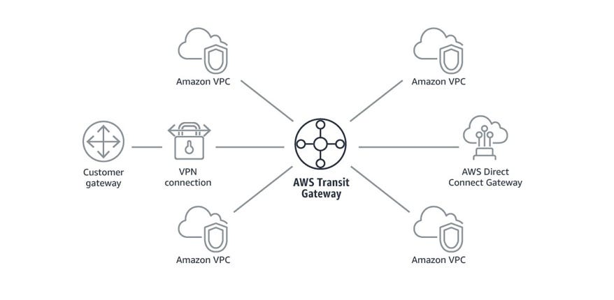

# AWS Transit Gateway

## 1. Introduction

The increasing complexity of cloud infrastructure, particularly with the growth of Virtual Private Clouds (VPCs) in modern enterprises, necessitates effective network connectivity solutions. AWS Transit Gateway addresses these challenges by offering a scalable, centralized hub to interconnect VPCs, on-premises data centers, and other remote networks.

Historically, connecting multiple VPCs involved VPC peering. While suitable for small setups, VPC peering becomes challenging as the number of VPCs increases due to its one-to-one relationship model, leading to an exponential rise in connections. Furthermore, VPC peering lacks transitive routing capabilities; if VPC A peers with VPC B, and VPC B with VPC C, VPC A cannot directly communicate with VPC C, complicating route management and increasing operational overhead.

AWS Transit Gateway overcomes these limitations. It acts as a central hub, allowing multiple VPCs, AWS Direct Connect gateways, and VPN endpoints to attach to a single gateway. This hub-and-spoke model simplifies connectivity by eliminating numerous point-to-point peering connections and enabling transitive routing among all connected networks. This results in streamlined connectivity, centralized route management, and the flexibility to expand networks across regions and AWS accounts.

This tutorial explores the core concepts, features, design patterns, and advanced capabilities of AWS Transit Gateway, demonstrating how it facilitates scalable, secure, and efficient cloud networking.

## 2. Understanding AWS Transit Gateway

### 2.1 Core Concepts

AWS Transit Gateway functions as a regional network transit hub, connecting VPCs and on-premises networks via a central gateway. This consolidation simplifies network route management and reduces operational complexity.

Key characteristics include:

* **Evolution:** Introduced in 2018, Transit Gateway provides a scalable alternative to VPC peering for managing inter-VPC connectivity.
* **Regional Scope:** As a regional resource, all attached VPCs must be within the same AWS region. Cross-region connectivity is achieved by peering multiple Transit Gateways.
* **Centralized Routing:** It acts as a regional router with a default route table where routes from attached networks are propagated, simplifying traffic management across VPCs and hybrid networks.
* **Scalability:** Designed for large deployments, it supports up to 5,000 attachments, enabling the interconnection of thousands of VPCs and remote networks.
* **Integration:** Seamlessly integrates with AWS Direct Connect, AWS Site-to-Site VPN, and third-party SD-WAN solutions.

By abstracting the complexity of individual VPC connections, Transit Gateway simplifies network design and enables advanced routing and security strategies.

### 2.2 Key Features

Transit Gateway offers several powerful features for modern network architectures:

* **VPC Attachments:** Connect multiple VPCs, enabling transitive routing so every attached VPC can communicate via the central gateway.
* **VPN Attachments:** Terminate AWS-managed site-to-site VPN connections directly on the Transit Gateway, ideal for hybrid architectures connecting on-premises networks securely to AWS.
* **Direct Connect Integration:** Supports high-throughput, low-latency links between on-premises networks and AWS via Transit VIFs (Virtual Interfaces).
* **Transit Gateway Connect:** Extends connectivity to third-party virtual appliances (e.g., SD-WAN routers) using GRE tunnels and BGP peering, integrating external network controllers.
* **Transit Gateway Peering:** Enables private connectivity between Transit Gateways in different regions or accounts, facilitating secure, scalable global networks.
* **Routing Domains:** Provides a default route table with propagated routes. Additional route tables (routing domains) can be created to segment traffic and isolate network parts.
* **Multicast Support:** Supports one-to-many communication, useful for live media streaming, real-time conferencing, etc..
* **Resource Sharing via AWS RAM:** Share Transit Gateway resources across AWS accounts using AWS Resource Access Manager (RAM) for centralized management in multi-account setups.
* **Advanced Traffic Management:** Features like appliance mode optimize traffic routing, ensuring stateful appliances (firewalls, IPS/IDS) operate effectively.

### 2.3 Common Use Cases

* **Hybrid Cloud Connectivity:** Acts as a hub for hybrid setups by consolidating VPN and Direct Connect attachments.
* **Centralized Security:** Enables deployment of network appliances in a central "hub" VPC for inspecting and securing traffic between VPCs and external networks.
* **Global Multi-Region Architectures:** Transit Gateway Peering allows extending network architecture across multiple AWS regions securely.
* **Scalable Inter-VPC Communication:** Offers a scalable alternative to VPC peering for organizations with numerous VPCs, simplifying management.

## 3. Attachments and Routing Fundamentals

Transit Gateway's strength lies in connecting diverse networks via various attachment types and managing routing centrally.

### 3.1 Attachment Types Overview

Transit Gateway supports several attachment types to connect different network entities:

* **VPC Attachments:** Connect VPCs within the same region to the Transit Gateway, forming the basis of the hub-and-spoke model.
* **VPN Attachments:** Connect on-premises networks or branch offices using AWS-managed site-to-site VPN connections terminated on the Transit Gateway.
* **Direct Connect Attachments (Transit VIF):** Integrate AWS Direct Connect for dedicated, high-bandwidth connections between on-premises data centers and AWS via a Transit Virtual Interface.
* **Peering Attachments:** Connect Transit Gateways in different AWS regions or accounts, enabling inter-regional or inter-account communication.
* **Connect Attachments:** Integrate third-party virtual appliances, such as SD-WAN devices, using GRE tunnels and BGP over a transport attachment (VPC or Direct Connect).
* **Multicast Domain Associations:** While not a direct attachment for traffic flow, associating VPC subnets with a multicast domain enables multicast traffic distribution.

### 3.2 Configuring VPC Attachments

Attaching VPCs is a primary use case. When creating a VPC attachment:

* **Subnet Selection:** Specify one dedicated subnet per Availability Zone (AZ) for the Transit Gateway ENIs.
* **Non-Overlapping CIDRs:** Ensure the CIDR ranges of attached VPCs do not overlap for unambiguous routing.
* **Route Propagation:** The VPC's CIDR is automatically propagated to the Transit Gateway's default route table.

### 3.3 Routing Fundamentals

Understanding Transit Gateway's routing mechanism is crucial.

* **Transit Gateway Route Tables:**
    * A default route table is created automatically, aggregating propagated routes from attachments.
    * Additional route tables (routing domains) can be created for traffic segmentation. Each attachment is associated with one route table for routing decisions and can propagate routes to one or more route tables.
* **Route Propagation vs. Static Routes:**
    * **Propagated Routes:** Automatically learned from attached networks (VPC CIDRs, BGP routes from VPN/Direct Connect/Connect attachments).
    * **Static Routes:** Manually configured routes in Transit Gateway route tables or VPC/subnet route tables. VPC route tables require static routes pointing towards the Transit Gateway attachment for traffic destined to other connected networks.
* **Route Prioritization:** Transit Gateway uses the longest prefix match algorithm. Static routes are generally preferred over propagated routes if they cover the same prefix, allowing for overrides.
* **Transitive Routing:** The Transit Gateway acts as a central router, enabling traffic flow between any attached networks based on its route tables.

Careful planning of attachments, route tables, propagation, and static routes ensures efficient and secure traffic flow.

## 4. Network Design Patterns with Transit Gateway

Transit Gateway enables various flexible network design patterns.

### 4.1 Hub-and-Spoke Architecture

This is a common pattern where the Transit Gateway acts as the central hub connecting spoke VPCs and other network attachments.

* **Components:** Central Transit Gateway hub, spoke VPC attachments. Centralized services (firewalls, NAT gateways) are often placed in a dedicated hub VPC.
* **Advantages:** Simplicity (centralized routing), scalability (easy addition of spokes), security (central inspection points), potential cost efficiency.
* **Considerations:** Requires careful route table management, potential need for traffic flow optimization using routing domains, and designing the hub for redundancy.

### 4.2 Multi-Region and Cross-Account Strategies

Transit Gateway facilitates connectivity across AWS regions and accounts.

* **Multi-Region:**
    * Use Transit Gateway Peering to connect regional Transit Gateways for secure, private global connectivity.
    * Requires manual static route management across the peering connection.
    * Provides geographic redundancy.
* **Cross-Account:**
    * Use AWS Resource Access Manager (RAM) to share a Transit Gateway owned by a central account with other accounts.
    * Allows VPCs from different accounts to attach while centralizing control of routing policies with the owner account.
    * Enforces standardized network policies across accounts.
* **Applications:** Global enterprise networks, multi-tenant environments, extended hybrid cloud architectures.

## 5. Availability Zone (AZ) Considerations for High Availability

Designing for high availability and performance involves strategic placement of Transit Gateway attachments across AZs.

### 5.1 Redundancy and Performance

* **Dedicated Subnets:** Use dedicated subnets in each selected AZ for Transit Gateway ENIs. A /28 subnet is often recommended.
* **Multi-AZ Attachments:** Create attachments in multiple AZs for fault tolerance; if one AZ fails, others continue routing.
* **Performance:** Traffic is preferentially routed within the same AZ if possible, minimizing latency and cross-AZ data transfer costs. Distributing attachments across AZs helps balance load.
* **On-Premises Connectivity:** Proper AZ placement and routing are important for consistent performance and avoiding asymmetric routing when connecting to on-premises networks. Be mindful of potential cross-AZ data transfer costs.

### 5.2 Traffic Optimization: AZ Affinity and Appliance Mode

Transit Gateway optimizes traffic flow, especially with stateful appliances.

* **AZ Affinity (Default Behavior):** Transit Gateway tries to keep traffic within the same AZ from source to destination ENI, reducing latency and cost.
* **Appliance Mode:**
    * **Need:** Stateful appliances (firewalls, IDS/IPS) often require symmetric routing (same path for ingress/egress traffic) to maintain connection state. The default flow hash algorithm might choose different AZ ENIs for a flow, breaking symmetry.
    * **Function:** When enabled on a VPC attachment, Appliance Mode ensures the Transit Gateway uses the same ENI (in a specific AZ) for the entire duration of a traffic flow, regardless of the default AZ affinity behavior.
    * **Use Cases:** Deploying stateful inspection appliances, centralized monitoring systems, ensuring traffic consistently traverses specific appliances.
    * **Configuration:** Set `ApplianceModeSupport=enable` on the VPC attachment.

## 6. Exploring Connectivity Options

Transit Gateway offers diverse ways to connect networks beyond basic VPC attachments.

### 6.1 Transit Gateway Peering (Cross-Region/Cross-Account)

Connects Transit Gateways in different regions or accounts.

* **Mechanism:** Request/accept model similar to VPC peering.
* **Routing:** Requires manual static routes; no dynamic route exchange.
* **Security:** Connections are private and encrypted by default.
* **Performance:** High throughput (up to 50 Gbps per peering attachment).
* **Use Cases:** Global networks, connecting to customer/partner networks in different regions/accounts, unified hybrid architectures.

### 6.2 Connect Attachments (SD-WAN Integration)

Integrates third-party virtual appliances (e.g., SD-WAN).

* **Mechanism:** Uses GRE tunnels over a transport attachment (VPC or Direct Connect) with BGP for dynamic routing information exchange.
* **Performance:** Up to 5 Gbps per GRE tunnel; up to 4 Connect peers per attachment allow aggregation up to 20 Gbps.
* **Routing:** Relies solely on BGP; static routing is not supported.
* **Use Cases:** Extending existing SD-WAN solutions into AWS, high-performance hybrid connectivity, simplified management via appliance integration.

### 6.3 VPN Attachments (Site-to-Site)

Terminates AWS-managed site-to-site IPsec VPN tunnels on the Transit Gateway.

* **Mechanism:** Connects on-premises networks securely using managed VPN service terminated on the Transit Gateway instead of a VGW.
* **Routing:** Supports dynamic routing (BGP) or static routing.
* **Enhancements:** Can use AWS Global Accelerator for optimized paths and lower latency. Equal Cost Multi-Path (ECMP) can load balance across multiple tunnels for higher aggregate bandwidth (though single flows are limited by per-tunnel cap).
* **Use Cases:** Standard hybrid connectivity, resilient failover using multiple tunnels, cost-effective branch office connections.

### 6.4 Direct Connect Integration (Hybrid Networking)

Integrates AWS Direct Connect for dedicated, high-throughput hybrid connectivity.

* **Mechanism:** Uses a Transit Virtual Interface (Transit VIF) to attach a Direct Connect connection to a Transit Gateway, overcoming scaling limitations of Private VIFs attached to VGWs. Supports multi-region/cross-account scenarios.
* **Encryption:** Can be combined with IPsec VPN (often over a Public VIF) for end-to-end encryption over the dedicated link.
* **Cost vs. Performance:** Offers highest performance/lowest latency but involves Direct Connect costs plus Transit Gateway processing charges.
* **Use Cases:** Enterprise-grade hybrid clouds, connecting hundreds of VPCs to on-premises, security-driven designs requiring dedicated links with encryption.

## 7. Advanced Transit Gateway Features

Transit Gateway offers features beyond basic routing.

### 7.1 Multicast Support

Enables efficient one-to-many communication.

* **Concept:** Sends a single packet to multiple destinations belonging to a multicast IP group (Class D address). Devices join/leave groups using IGMP or static configuration.
* **Transit Gateway Implementation:**
    * Must be enabled at Transit Gateway creation.
    * Requires creating a multicast domain and groups, associating VPC subnets (ENIs) as members.
    * Supports static or dynamic (IGMP) membership.
    * Can integrate with on-premises multicast via GRE tunnels.
* **Considerations:** Requires specific security group/NACL rules for IGMP and UDP traffic. Only Nitro System instances are supported as senders.
* **Use Cases:** Live media streaming, financial data distribution, real-time conferencing.

### 7.2 Resource Sharing with AWS RAM

Facilitates resource sharing across AWS accounts.

* **Mechanism:** AWS Resource Access Manager (RAM) allows sharing a Transit Gateway owned by one account with other accounts (within or outside an AWS Organization).
* **Control:** The owner retains full configuration control (route tables, propagation). Shared accounts typically only get permission to attach their VPCs.
* **Benefits:** Centralizes network management and policy enforcement while maintaining account boundaries. Helps optimize costs by avoiding duplicate infrastructure.
* **Considerations:** Use consistent AZ IDs (not names) when connecting cross-account VPCs. Ensure appropriate IAM policies are in place.
* **Use Cases:** Centralized networking in large enterprises, cost optimization, multi-tenant architectures.

## 8. Comparing Transit Gateway and VPC Peering

Choosing between Transit Gateway and VPC Peering depends on specific needs.

### 8.1 Architectural Differences & Use Cases

* **VPC Peering:**
    * **Model:** Direct 1:1 connections. Becomes complex at scale.
    * **Routing:** No transitive routing.
    * **Features:** Allows cross-VPC security group references.
    * **Best For:** Small deployments (few VPCs), simple connectivity needs.
* **Transit Gateway:**
    * **Model:** Hub-and-spoke, connects thousands of attachments.
    * **Routing:** Supports transitive routing via central hub.
    * **Features:** Centralized routing/policy control, various attachment types (VPN, DX, Peering, Connect).
    * **Best For:** Large-scale/complex networks, hybrid environments, need for centralized control/segmentation.

### 8.2 Performance and Cost

* **Latency:** VPC Peering generally has lower latency (direct path). Transit Gateway adds a small hop.
* **Bandwidth:** VPC Peering relies on underlying network limits. Transit Gateway has high per-attachment limits (e.g., 50 Gbps).
* **Cost:** VPC Peering has data transfer costs but no hourly/processing fees. Transit Gateway has hourly attachment costs and per-GB data processing charges. The operational simplicity of Transit Gateway at scale may outweigh its direct costs.

### 8.3 Security Considerations

* **Transit Gateway:** Offers centralized control over routing, enhancing security policy enforcement. Allows traffic segmentation using routing domains. Integrates with security services in a centralized model. Requires careful management of shared resources via RAM.
* **VPC Peering:** Security management is distributed across peering connections. Relies on security groups and NACLs within each VPC.

### 8.4 Best Practices Summary

* **Cost Optimization:** Minimize cross-AZ data transfer; choose the right connectivity option (Peering vs. TGW) based on scale and complexity; consolidate connections where possible.
* **Security:** Utilize routing domains for isolation; enforce encryption where needed (VPN, DX+VPN); manage RAM permissions carefully; implement robust monitoring and logging (CloudWatch, Flow Logs).

## 9. Conclusion

AWS Transit Gateway fundamentally improves cloud network design and management. By centralizing connectivity for VPCs, on-premises networks, and virtual appliances, it simplifies complex architectures, enhances scalability, and provides robust control over traffic flow and security. While VPC peering remains suitable for simpler scenarios, Transit Gateway offers the flexibility and advanced features required for modern, large-scale, and hybrid cloud environments.