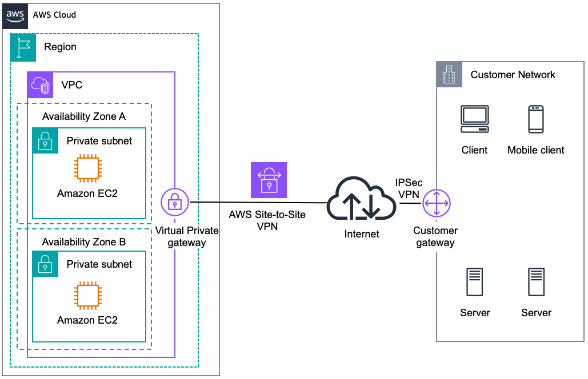
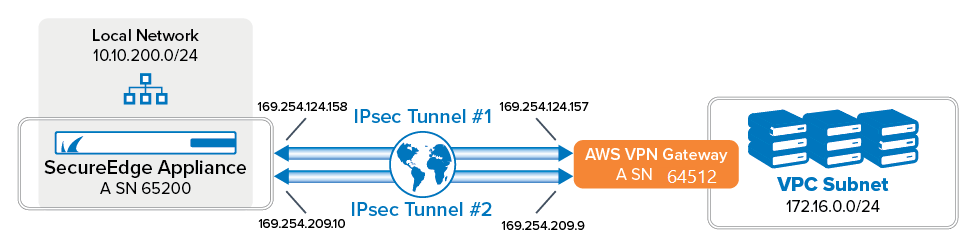
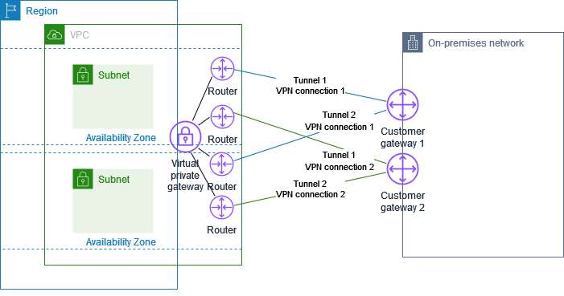
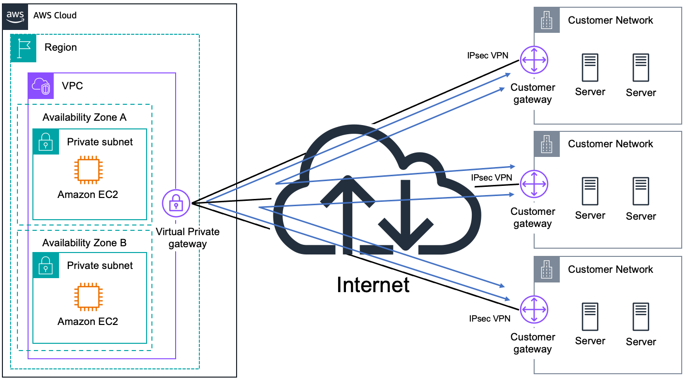
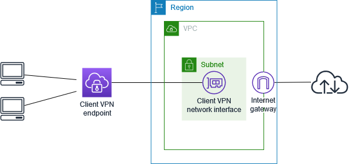

# AWS VPN

## 1. Introduction

VPN technology provides a means for establishing secure, encrypted communications over untrusted networks such as the Internet. AWS supports two main types of VPN connectivity:

- **Site-to-Site VPN:** This connects entire networks (for example, an on-premises data center and an AWS Virtual Private Cloud).
- **Client VPN:** This enables individual client devices to securely access resources within an AWS VPC or an on-premises network.

Each of these VPN types addresses different use cases—from corporate branch connectivity to secure remote access. In the following sections, we begin with a discussion of the underlying principles of VPN technology and the specific AWS implementations that support these models.

## 2. Fundamentals

### 2.1 What Is a VPN?

A Virtual Private Network (VPN) allows hosts and networks to communicate privately over an untrusted public infrastructure. By establishing an encrypted tunnel between endpoints, a VPN ensures that data transmitted across the Internet remains confidential and tamper-resistant. This privacy is critical for secure corporate communications and remote access scenarios.

### 2.2 AWS VPN Services Overview

AWS provides several VPN options:

- **AWS Site-to-Site VPN:** A managed service that connects your on-premises network (or a simulated customer network) to an AWS VPC. The service leverages IPSec protocols and offers both static and dynamic routing options.
- **AWS VPN CloudHub:** A specialized configuration of the AWS VPN service that uses a detached virtual private gateway (VGW) to interconnect multiple branch offices, facilitating a hub-and-spoke network architecture.
- **AWS Client VPN:** A fully managed client-based VPN service that enables secure remote access to your AWS resources, integrated with AWS’s authentication and authorization services.

### 2.3 IPSec and Layer 3 VPN Basics

IPSec (Internet Protocol Security) is the foundational protocol used in AWS VPN services for encrypting and authenticating IP packets. Key aspects include:

- **Two-Phase Connection Establishment:** During the initial phase, cryptographic parameters are negotiated, and a secure channel is established. In the second phase, data traffic is protected using negotiated algorithms.
- **Encryption and Data Integrity:** AWS VPN uses strong encryption standards such as Advanced Encryption Standard (AES) with 256-bit keys and SHA-2 for message integrity. This ensures that data remains confidential and unaltered.
- **Layer 3 Connectivity:** AWS Site-to-Site VPN operates at the network layer (Layer 3), meaning that it routes IP packets between networks. Although other VPN types (such as GRE or DMVPN) support additional features like multicast or dynamic hub-and-spoke topologies, AWS’s managed VPN solution focuses on IPSec connectivity.

## 3. AWS Site-to-Site VPN

AWS Site-to-Site VPN provides a secure connection between your AWS VPC and an external network, such as an on-premises data center. It is designed for high availability, security, and ease of integration.

### 3.1 Core Components

The primary components of an AWS Site-to-Site VPN include:

- **Virtual Private Gateway (VGW):** This is the AWS-managed endpoint that terminates the VPN connection on the AWS side. It is attached to your VPC and supports both static and dynamic routing.
- **Customer Gateway:** A physical or virtual router on the customer’s side that terminates the VPN connection. This can be a dedicated hardware appliance or a software solution (such as a Linux server running Libreswan).

When a VPN connection is established, AWS creates two VPN tunnels between the VGW and the customer gateway. These tunnels provide redundancy and high availability by ensuring that if one tunnel fails, the other can maintain the connectivity.

### 3.2 Encryption and Security Standards

AWS Site-to-Site VPN leverages IPSec for securing data:

- **Encryption:** Data is encrypted using AES-256, which protects against eavesdropping.
- **Data Integrity:** The use of SHA-2 algorithms ensures that any tampering of data in transit is detected.
- **Key Exchange:** The secure exchange of cryptographic keys is achieved during the IPSec phase negotiations, ensuring that both endpoints have matching parameters.

### 3.3 Routing Options

The routing options available in AWS Site-to-Site VPN include:

- **Static Routing:** Requires manual configuration of destination CIDR blocks on both sides of the VPN tunnel.
- **Dynamic Routing:** Utilizes the Border Gateway Protocol (BGP) to automatically exchange route information. Dynamic routing simplifies network management, especially when connecting to multiple remote sites.

### 3.4 High Availability and Redundant Tunnels

High availability is a critical feature of the AWS Site-to-Site VPN architecture:

- **Dual Tunnels:** AWS automatically provisions two separate tunnels for every VPN connection. These tunnels are distributed across different availability zones to enhance resilience.

- **Failover Mechanism:** If one tunnel experiences an outage, traffic is automatically rerouted through the secondary tunnel, ensuring continuous connectivity.

## 4. AWS VPN CloudHub

AWS VPN CloudHub is designed for organizations with multiple branch offices that require interconnectivity without the need to establish individual point-to-point VPN links between every site.

### 4.1 Architecture and Use Cases

In the VPN CloudHub model:

- **Detached VPN Gateway:** A virtual private gateway is used in detached mode (i.e., not associated with a VPC) to act as a central hub.
- **Multiple Branch Connections:** Each branch office connects to this cloud hub via an IPSec VPN tunnel. This setup allows every branch to communicate with each other by routing traffic through the central hub.
- **Use Cases:** VPN CloudHub is ideal for organizations that want to connect remote sites, enable branch-to-branch communication, or implement a failover path for existing network connections.

### 4.2 BGP and Dynamic Routing

Dynamic routing is essential in a VPN CloudHub environment:

- **BGP Integration:** Each customer gateway must support BGP with a unique Autonomous System Number (ASN). BGP dynamically exchanges routing information between the branch offices and the cloud hub.
- **Simplified Network Management:** With BGP, any new branch office can be added to the hub without needing to reconfigure static routes manually.

### 4.3 Limitations and Best Practices

While VPN CloudHub provides significant flexibility, there are some important considerations:

- **Non-Overlapping CIDR Blocks:** All branch offices must have unique IP ranges to avoid routing ambiguities.
- **Scalability:** Although multiple connections can be established, careful planning is required to ensure that the VGW’s routing capacity meets the network’s demands.
- **Redundancy:** VPN CloudHub can serve as a backup path if direct branch-to-branch connectivity fails, but network design must account for potential latency and bandwidth implications.

## 5. AWS Client VPN

AWS Client VPN is a managed client-based VPN solution that provides secure remote access to AWS resources and on-premises networks. It is particularly useful for scenarios where individual users need secure connectivity from remote locations.

### 5.1 Key Components

The AWS Client VPN solution comprises:

- **Client VPN Endpoint:** This is a managed endpoint that facilitates client connections. When clients connect, a network interface is automatically created within a designated subnet.
- **Dedicated Target Subnet:** A subnet in your VPC is reserved for VPN clients. This subnet provides the connectivity point from which remote clients access AWS resources.
- **Client Software:** Users must run a VPN client (such as the OpenVPN client) on their devices to establish the connection.

### 5.2 Authentication Methods

AWS Client VPN supports multiple methods for authenticating users:

- **Mutual Certificate Authentication:** Involves both the client and the server exchanging certificates, which are managed through AWS Certificate Manager (ACM). This is a common method for ensuring secure, mutual authentication.
- **Active Directory Integration:** Enables centralized user management and authentication via corporate directories.
- **SAML/Federated Authentication:** Provides seamless access by integrating with identity providers using federation protocols.

### 5.3 Network Authorization Rules

Beyond initial authentication, AWS Client VPN allows administrators to define network authorization rules:

- **Access Control:** These rules determine which users or groups have access to specific resources within the VPC.
- **Granular Permissions:** Authorization can be fine-tuned based on source IP ranges, user groups, or specific network segments, ensuring that only authorized traffic flows through the VPN.

### 5.4 Integration with On-Premises and Peered Networks

AWS Client VPN is highly versatile:

- **Seamless VPC Access:** Once connected, clients receive an IP address from a non-overlapping CIDR block, allowing them to access resources within the VPC as if they were part of the internal network.
- **Extended Connectivity:** With proper routing and peering configurations, VPN clients can also access on-premises networks or resources in peered VPCs, creating a unified network environment for distributed applications.

### 5.5 Pricing Model

AWS Client VPN pricing is based on two main factors:

- **Hourly Connection Cost:** There is a fixed charge for maintaining a VPN connection, regardless of whether any data is transmitted. For example, in the North Virginia region, a typical connection fee might be around $0.10 per hour.
- **Per-Connection Charge:** In addition, AWS charges based on the number of active client connections. In some regions, this may be approximately $0.05 per hour for each connected client.

It is important to note that pricing may vary by region and usage, so organizations should consult the latest AWS pricing documentation for accurate cost estimates.

## 6. Conclusion

A deep understanding of these services—along with practical experience in deploying and troubleshooting VPN connections—is essential for designing secure, scalable, and resilient network architectures in the AWS environment.
