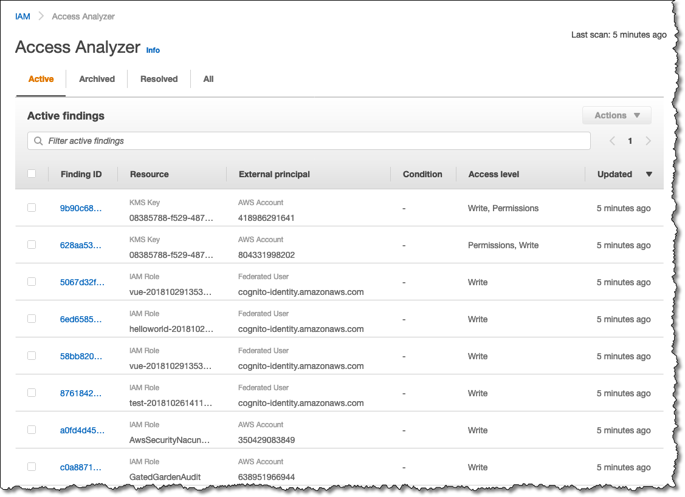
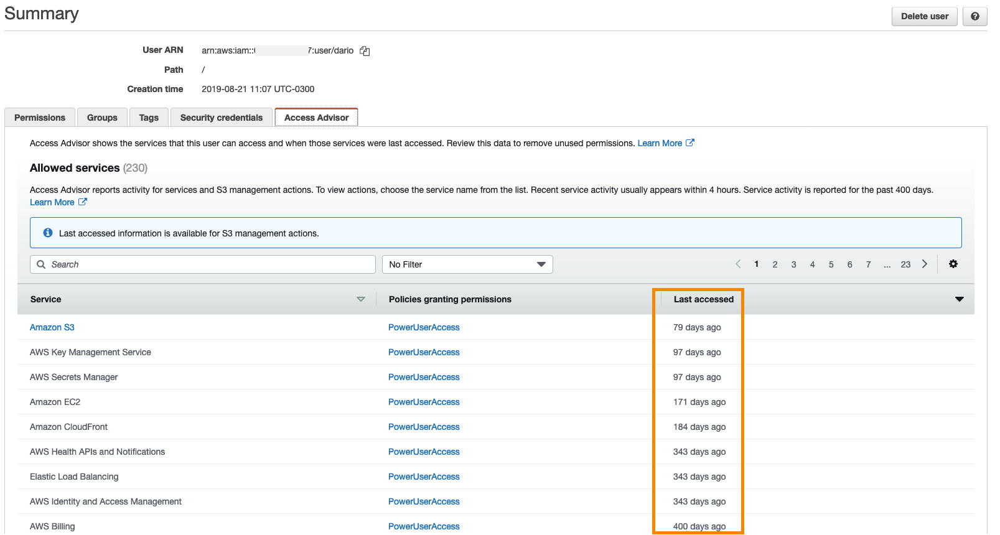
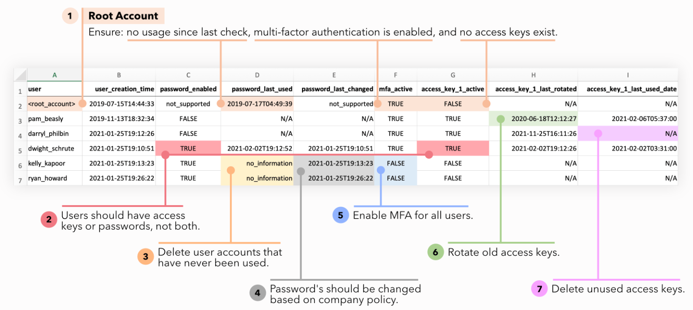

# AWS Identity and Access Management (IAM)

## 1. Introduction

In today’s cloud-first environment, securing infrastructure is paramount. AWS Identity and Access Management (IAM) is the cornerstone of AWS security, providing a flexible and powerful mechanism for controlling access to AWS resources. Whether you are managing a small project or a large enterprise environment, IAM enables you to define who (or what) can access your resources, how they can access them, and under what conditions.
## 2. Core IAM Concepts

The heart of IAM lies in its ability to define who can do what on which resources. In this section, we explain the core components of IAM policies and the different types of policies available in AWS. A deep understanding of these basics is essential before moving on to advanced design considerations.

### 2.1 IAM Policies: Structure and Syntax

IAM policies are written in JSON and represent the rules that define permissions. Every policy is composed of one or more statements, and each statement is built from a well-defined set of elements. The general structure of an IAM policy is as follows:

1. **Version:**  
    Every policy begins with a version date that signifies the policy language’s version. The current version is `"2012-10-17"`, and it must be included in all policies.
    
2. **Id (Optional):**  
    This element is used to provide a unique identifier or name for the policy. Although optional, it is useful for referencing the policy in documentation and troubleshooting.
    
3. **Statement:**  
    This is an array that contains one or more individual statements. Each statement can contain the following elements:
    
    - **Sid (Optional):** A statement identifier used for tracking and referencing a particular statement.
    - **Effect:** This must be either `"Allow"` or `"Deny"`, determining whether the statement permits or denies access.
    - **Principal (when applicable):** Specifies the user, account, or service that the policy applies to. This element is particularly used in trust policies.
    - **Action (or NotAction):** Lists the AWS service actions (API calls) that are allowed or explicitly not allowed. You can use wildcards like `*` to denote all actions or a subset using prefix patterns.
    - **Resource (or NotResource):** Identifies the resources to which the actions apply. Similar to actions, you can restrict by using ARNs and wildcards.
    - **Condition (Optional):** A key-value map that defines additional constraints under which the statement is in effect. Conditions support various operators, as detailed later in this chapter.

Let’s consider a simple example of an IAM policy that allows full access to the S3 service:

```json
{
  "Version": "2012-10-17",
  "Statement": [
    {
      "Sid": "AllowFullS3Access",
      "Effect": "Allow",
      "Action": "s3:*",
      "Resource": "*"
    }
  ]
}
```

In the above policy, every S3 action is allowed on all resources. This straightforward structure forms the basis of more complex policies that incorporate conditions, notations like `NotAction` and `NotResource`, and more.

IAM policies can also use the `NotAction` element. For example, consider a policy that allows all actions except those that belong to the IAM service:

```json
{
  "Version": "2012-10-17",
  "Statement": [
    {
      "Sid": "AllowAllExceptIAM",
      "Effect": "Allow",
      "NotAction": "iam:*",
      "Resource": "*"
    }
  ]
}
```

In this example, while the policy explicitly allows all actions by using `NotAction` (everything except IAM actions), it does not “deny” IAM actions—instead, IAM actions are simply not explicitly allowed. In IAM’s evaluation logic (which we will discuss in detail later), any action not explicitly allowed will be implicitly denied.

Understanding the structure and syntax of IAM policies is essential for designing secure and efficient policies. In the following sections, we will explore different types of policies and how you can extend this basic structure to achieve granular access control.

### 2.2 Policy Types: Identity-Based vs. Resource-Based Policies

AWS supports two primary types of IAM policies: identity-based policies and resource-based policies. Both types play a critical role in determining who can access a resource, but they are attached and evaluated in different ways.

#### Identity-Based Policies

Identity-based policies are attached to IAM identities (users, groups, or roles) and define what actions these identities are allowed or denied to perform on AWS resources. When a user or role makes a request, AWS evaluates all identity-based policies that apply to that identity. For example, if a developer has a policy that allows them to access a DynamoDB table and another policy attached to a group grants broader access, the union of those permissions is what the developer is allowed to do, subject to the explicit deny rules.

A sample identity-based policy for a developer might look like this:

```json
{
  "Version": "2012-10-17",
  "Statement": [
    {
      "Sid": "AllowReadAccessToDynamoDB",
      "Effect": "Allow",
      "Action": [
        "dynamodb:GetItem",
        "dynamodb:Query",
        "dynamodb:Scan"
      ],
      "Resource": "arn:aws:dynamodb:us-east-1:123456789012:table/DevelopersTable"
    }
  ]
}
```

In this case, the developer is allowed to perform read operations on a specific DynamoDB table.

#### Resource-Based Policies

Resource-based policies, on the other hand, are directly attached to AWS resources such as S3 buckets, Lambda functions, or SQS queues. These policies specify which principals (users, roles, or accounts) are allowed to access the resource and what actions they can perform. A common example is an S3 bucket policy that defines which AWS accounts or IAM users have access to the bucket.

An example S3 bucket policy might be:

```json
{
  "Version": "2012-10-17",
  "Statement": [
    {
      "Sid": "AllowCrossAccountAccess",
      "Effect": "Allow",
      "Principal": {
        "AWS": "arn:aws:iam::987654321098:root"
      },
      "Action": "s3:GetObject",
      "Resource": "arn:aws:s3:::example-bucket/*"
    }
  ]
}
```

This policy grants an external AWS account read access to the objects within the specified S3 bucket.

Both identity-based and resource-based policies are evaluated together during access checks. When a cross-account request is made, the identity-based policies from the requesting account and the resource-based policies on the target resource must both allow the action; otherwise, the request is denied.

This dual model allows for flexible control, ensuring that resource owners can enforce their own policies while identities can be centrally managed. In many real-world scenarios, you will use a combination of both types of policies to achieve the desired level of security.

## 3. Advanced Policy Design

Beyond the basics of policy structure, AWS provides an extensive set of features that allow you to fine-tune access control policies. Advanced policy design in IAM revolves around using condition operators, global context keys, and attribute-based access control (ABAC) to deliver highly granular security.

### 3.1 IAM Condition Operators: Fine-Grained Access Control

Conditions in IAM policies allow you to restrict access based on specific attributes such as time, IP address, or resource tags. Conditions are expressed as key–value pairs combined with operators that define how the value is compared. The following operators are commonly used:

- **StringEquals / StringNotEquals:**  
    These operators are used for case-sensitive exact matching. For example, you can use `StringEquals` to verify that a tag value on a resource exactly matches a specified string.
    
- **StringLike / StringNotLike:**  
    These operators extend exact matching by allowing the use of wildcards (such as `*` and `?`). They are particularly useful when comparing Amazon Resource Names (ARNs) or when a partial match is acceptable.
    
- **DateEquals / DateLessThan / DateGreaterThan:**  
    These operators compare date and time values. They are useful for enforcing temporal conditions such as limiting access to a particular time window or comparing the time a token was issued.
    
- **ArnLike / ArnNotLike:**  
    These operators are specialized for working with ARNs and support partial matching. When comparing ARNs, it is often more intuitive to use `ArnLike` instead of string-based operators.
    
- **Bool:**  
    This operator is used to test boolean conditions. For example, you might check whether secure transport is enabled by using `Bool` to verify that the condition `aws:SecureTransport` is `true`.
    
- **IpAddress / NotIpAddress:**  
    These operators allow you to restrict access based on IP addresses. They support CIDR notation, so you can allow or deny access from a range of IP addresses.
    

Below is an example IAM policy statement using some of these operators:

```json
{
  "Sid": "DenyAccessWithoutMFA",
  "Effect": "Deny",
  "Action": "*",
  "Resource": "*",
  "Condition": {
    "Bool": {
      "aws:MultiFactorAuthPresent": "false"
    }
  }
}
```

This statement explicitly denies all actions for any request that does not include MFA. Notice that although it denies everything without MFA, it may be combined with other allow statements so that only critical operations (or operations performed with MFA) are permitted.

Another example shows how to restrict access based on IP address:

```json
{
  "Sid": "DenyAccessOutsideCorporateIP",
  "Effect": "Deny",
  "Action": "*",
  "Resource": "*",
  "Condition": {
    "NotIpAddress": {
      "aws:SourceIp": "203.0.113.0/24"
    }
  }
}
```

In this policy, any requests originating from IP addresses outside the specified corporate IP range will be denied.

By combining different operators and conditions, you can build policies that enforce the principle of least privilege with high precision.

### 3.2 Global Condition Context Keys: Environment-Specific Rules

Global condition context keys are available for all AWS services and allow you to build conditions based on the context of the request. Some key context keys include:

- **aws:RequestedRegion:**  
    This key represents the region where the API call is made. You can use it to restrict access to certain regions. For example, if you want to allow actions only in EU regions, you might write a condition that checks whether `aws:RequestedRegion` is equal to `eu-west-1`, `eu-west-2`, or `eu-west-3`. However, be cautious with global services (such as IAM or CloudFront) that might always route through the `us-east-1` region.
    
- **aws:PrincipalArn:**  
    This key provides the ARN of the principal (user, role, or service) making the request. It is useful for enforcing policies that depend on the identity’s ARN. For instance, you can allow actions only if the request comes from a specific IAM role.
    
- **aws:SourceArn:**  
    This key is used in service-to-service requests. For example, if an S3 bucket triggers an SNS notification, the SNS topic policy can include a condition to verify that the source of the request matches the ARN of the S3 bucket.
    
- **aws:CalledVia:**  
    This key identifies the intermediate service making the call on behalf of the principal. It supports only a few services (such as CloudFormation, Athena, DynamoDB, and KMS) and is particularly useful when the request chain includes multiple services.
    
- **aws:SourceVpc, aws:SourceVpce, aws:SourceIp:**  
    These keys differentiate between public and private network requests. When requests come from public IP addresses, `aws:SourceIp` is applicable. For private requests through VPC endpoints, `aws:SourceVpc` and `aws:SourceVpce` come into play.
    

A sample policy that uses the `aws:RequestedRegion` key might look like this:

```json
{
  "Sid": "RestrictAccessToSpecificRegions",
  "Effect": "Deny",
  "NotAction": "iam:*",
  "Resource": "*",
  "Condition": {
    "StringNotEquals": {
      "aws:RequestedRegion": [
        "eu-west-1",
        "eu-west-2",
        "eu-west-3",
        "eu-central-1"
      ]
    }
  }
}
```

In this example, all actions except IAM (which are global) are denied if they are requested from outside the specified European regions. Global services are exempted by using `NotAction` with IAM.

Global context keys help you design environment-specific rules that ensure access control is applied based on the operating environment, geographical location, or other request-specific attributes.

### 3.3 Attribute-Based Access Control (ABAC): Tag-Driven Policies

Attribute-Based Access Control (ABAC) is a dynamic approach to managing permissions using tags and attributes associated with both IAM principals and AWS resources. Rather than creating numerous specific policies, ABAC allows you to define permissions based on attributes (or tags) that describe the resource or identity.

ABAC leverages two types of tags:

- **Resource Tags:**  
    Tags that are applied to AWS resources (for example, EC2 instances, S3 buckets, or RDS instances). These tags describe the resource (e.g., `Project: DataAnalytics`).
    
- **Principal Tags:**  
    Tags that are associated with IAM users or roles. These might include attributes such as department, job role, or region.
    

When using ABAC, policies typically include conditions that compare resource tags with principal tags. For example, the following policy statement allows an EC2 instance to perform actions on a resource only if the resource tag `Project` has the value `DataAnalytics` and the principal tag `Department` equals `Data`:

```json
{
  "Sid": "ABACExample",
  "Effect": "Allow",
  "Action": "ec2:*",
  "Resource": "*",
  "Condition": {
    "StringEquals": {
      "ec2:ResourceTag/Project": "DataAnalytics",
      "aws:PrincipalTag/Department": "Data"
    }
  }
}
```

In this case, the policy does not list every permitted resource explicitly. Instead, it dynamically evaluates permissions based on tags attached to both the resource and the user’s identity. This approach simplifies the management of permissions when there are large numbers of resources and users.

ABAC is especially useful in organizations with dynamic environments where resource configurations and team structures frequently change. It reduces the administrative overhead of maintaining numerous static policies and allows permissions to adjust automatically as tags change.

## 4. IAM Security Boundaries

IAM Security Boundaries help ensure that even if a user or role has been granted permissions, those permissions cannot exceed certain limits. This section covers IAM permission boundaries and the evaluation logic behind how AWS determines whether to allow or deny access.

### 4.1 IAM Permission Boundaries

IAM Permission Boundaries are a powerful mechanism that let you define the maximum permissions an IAM identity (user or role) can have. Rather than granting permissions directly, an identity’s effective permissions are determined by the intersection of the identity-based policy and the permission boundary. This means that even if an identity-based policy grants extensive permissions, the boundary restricts them to a predefined limit.

Consider an example where a permission boundary is set to allow only actions on S3, CloudWatch, and EC2:

```json
{
  "Version": "2012-10-17",
  "Statement": [
    {
      "Sid": "PermissionBoundary",
      "Effect": "Allow",
      "Action": [
        "s3:*",
        "cloudwatch:*",
        "ec2:*"
      ],
      "Resource": "*"
    }
  ]
}
```

If an identity’s attached policy also includes permissions for IAM actions (for example, `iam:CreateUser`), the effective permissions will be the intersection of both policies. In this case, even though the identity-based policy may explicitly allow `iam:CreateUser`, the permission boundary restricts the identity to only operate on S3, CloudWatch, and EC2. As a result, the identity would not be permitted to create a user.

Permission boundaries are particularly useful in scenarios where you delegate policy management to non-administrators. For instance, you might allow developers to manage their own permissions while ensuring that they cannot escalate their privileges beyond what is defined by the organization’s security requirements.

Permission boundaries also work well in conjunction with AWS Organizations’ Service Control Policies (SCPs). While SCPs limit what actions can be performed at the account or organizational unit level, permission boundaries ensure that even within those boundaries, identities cannot acquire unintended privileges.

### 4.2 IAM Policy Evaluation Logic: How AWS Decides Access

AWS evaluates policies in a defined order to determine whether a request should be allowed or denied. Understanding the evaluation logic is critical when troubleshooting access issues and designing policies that work together harmoniously.

The simplified evaluation process is as follows:

1. **Default Deny:**  
    By default, every request is implicitly denied unless an explicit allow is specified. The root user is an exception and has full access by default.
2. **Explicit Allow:**  
    If a policy explicitly allows an action, that permission overrides the default deny.
3. **Explicit Deny:**  
    If any policy explicitly denies an action, the request is immediately denied, regardless of any allows.
4. **Permission Boundaries, SCPs, and Session Policies:**  
    When using permission boundaries, service control policies (SCPs), or session policies, an explicit allow in an identity-based or resource-based policy is not enough; the action must also be allowed by the boundary or SCP.

For example, consider a scenario with the following policy statements:

- An identity-based policy that allows `sqs:DeleteQueue`
- A resource-based policy that denies `sqs:*`

Even though the identity-based policy explicitly allows the deletion of a queue, the resource-based policy’s explicit deny takes precedence. Thus, `sqs:DeleteQueue` is effectively denied.

When cross-account access is involved, both the identity-based policy (from the requester’s account) and the resource-based policy (on the target resource) must explicitly allow the action. If either one denies or fails to allow the request, the final decision is a deny.

The following diagram summarizes the evaluation logic:


## 5. Managing IAM Roles and Credentials

IAM roles and credentials allow you to delegate permissions to AWS services and users in a secure manner. In this section, we cover the creation and management of IAM roles, the significance of the `PassRole` permission, and the importance of multi-factor authentication (MFA) in protecting your AWS environment.

### 5.1 IAM Roles: Delegating Permissions to Services

IAM roles are similar to users in that they are AWS identities with permissions policies attached to them. However, roles are intended to be assumed by trusted entities, such as AWS services, applications, or even users from another account. A common use case is assigning an IAM role to an EC2 instance so that it can interact with other AWS services securely.

When an EC2 instance assumes an IAM role, temporary security credentials are provided to the instance. This avoids the need to store permanent credentials on the instance, thereby enhancing security. Other common roles include Lambda function roles, roles for CloudFormation stacks, and roles for third-party applications.

For example, a role for an EC2 instance might have a policy that allows it to read from an S3 bucket:

```json
{
  "Version": "2012-10-17",
  "Statement": [
    {
      "Sid": "EC2S3ReadAccess",
      "Effect": "Allow",
      "Action": [
        "s3:GetObject",
        "s3:ListBucket"
      ],
      "Resource": [
        "arn:aws:s3:::example-bucket",
        "arn:aws:s3:::example-bucket/*"
      ]
    }
  ]
}
```

This role is then attached to the EC2 instance, enabling it to interact with S3 without requiring explicit credentials.

### 5.2 The `PassRole` Permission: Controlling Role Assignment

When AWS services require roles to be assigned as part of their configuration (for example, assigning an IAM role to an EC2 instance), the user who configures that service must have the `iam:PassRole` permission. This permission ensures that only authorized users can pass a role to a service, preventing unauthorized privilege escalation.

For example, a policy allowing a user to pass a specific role to an EC2 instance may look like this:

```json
{
  "Version": "2012-10-17",
  "Statement": [
    {
      "Sid": "AllowPassSpecificEC2Role",
      "Effect": "Allow",
      "Action": "iam:PassRole",
      "Resource": "arn:aws:iam::123456789012:role/EC2RoleFor*"
    }
  ]
}
```

In this policy, the user is only allowed to pass roles that have names starting with `EC2RoleFor`. This restriction is critical for ensuring that users cannot arbitrarily assign roles with more privileges than they are allowed.

It is important to note that the `iam:PassRole` permission itself does not grant any permissions on the resources that the role provides access to. It merely authorizes the user to assign the role to an AWS service. The actual permissions that the role grants are determined by the role’s policies.

### 5.3 IAM Multi-Factor Authentication (MFA): Enforcing Strong Auth

Multi-Factor Authentication (MFA) significantly increases account security by requiring users to provide a second form of authentication in addition to their password. In the event of a password compromise, MFA ensures that unauthorized access is still prevented. AWS supports several types of MFA devices, including virtual MFA (using smartphone apps), hardware MFA devices, and security keys.

MFA is particularly important for sensitive operations. For example, policies can include conditions that require MFA for specific actions. One common pattern is to deny termination or stopping of EC2 instances unless MFA is present:

```json
{
  "Sid": "DenyStopTerminateWithoutMFA",
  "Effect": "Deny",
  "Action": [
    "ec2:StopInstances",
    "ec2:TerminateInstances"
  ],
  "Resource": "*",
  "Condition": {
    "Bool": {
      "aws:MultiFactorAuthPresent": "false"
    }
  }
}
```

Another advanced use of MFA is with the condition `aws:MultiFactorAuthAge`, which restricts actions based on the age of the MFA authentication. For instance, you might allow access only if the MFA authentication is no older than 300 seconds:

```json
{
  "Sid": "AllowShortTermMFAUsage",
  "Effect": "Allow",
  "Action": "ec2:RebootInstances",
  "Resource": "*",
  "Condition": {
    "NumericLessThan": {
      "aws:MultiFactorAuthAge": "300"
    }
  }
}
```

MFA is also critical for protecting sensitive IAM operations. There is a known edge case with the deletion of virtual MFA devices, where users may receive errors even when permissions appear correct. In such cases, an administrator might need to intervene via the AWS CLI or API to remove the inactive MFA device.

By enforcing MFA, you add an extra layer of security that is essential in a robust IAM strategy.

## 6. AWS Security Token Service (STS)

The AWS Security Token Service (STS) is the backbone for granting temporary, limited-privilege credentials to users and services. STS enables federation, cross-account access, and enhanced security through temporary credentials. In this section, we explore how STS works, the differences between its versions, the use of external IDs, and techniques for revoking temporary credentials.

### 6.1 STS Overview: Temporary Credentials and Federation

STS allows you to issue temporary security credentials that grant access to AWS resources for a limited period. These credentials are ideal for scenarios where long-term credentials pose a risk. STS is widely used in the following cases:

- **AssumeRole:**  
    When a user or service needs to assume a role, the `AssumeRole` API is called. This returns temporary credentials with a limited lifetime, ensuring that even if credentials are compromised, their usefulness is constrained.
    
- **AssumeRoleWithSAML:**  
    This operation allows federated users authenticated by a SAML-compliant identity provider to obtain temporary credentials.
    
- **AssumeRoleWithWebIdentity:**  
    This method supports authentication via third-party identity providers that use OpenID Connect (OIDC), such as Google or Facebook. Note that AWS now recommends using Amazon Cognito as a more integrated solution.
    
- **GetSessionToken:**  
    This operation is used to obtain temporary credentials for users who have already authenticated using MFA. It provides a short-lived token that enhances security for high-risk operations.
    

For example, when an EC2 instance needs to access S3, it might call `AssumeRole` to obtain temporary credentials. These credentials are then used for API calls until they expire, at which point a new set must be generated.

### 6.2 STS Versions: Comparing v1 and v2

AWS STS issues tokens in two formats: Version 1 and Version 2. Understanding the differences is important for compatibility and performance:

- **STS Version 1 Tokens:**  
    These tokens are issued by the global STS endpoint (typically in `us-east-1`). They have been in use for many years but come with some limitations, especially with newer AWS regions.
    
- **STS Version 2 Tokens:**  
    Version 2 tokens are issued by regional STS endpoints. They offer benefits such as reduced latency, increased session duration, and better support for new regions (e.g., `me-south-1`). Even though they are obtained from a regional endpoint, Version 2 tokens are valid across all AWS regions.
    

AWS recommends using STS Version 2 tokens wherever possible because they provide enhanced performance and reliability, particularly in geographically distributed architectures.

### 6.3 STS External ID: Securing Cross-Account Access

When you enable cross-account access, the risk of the confused deputy problem arises. In this scenario, a third party (the “deputy”) may be tricked into accessing resources in an account without the owner’s intent. To mitigate this risk, you can require an external ID in your trust policies.

The external ID is a unique value that must be provided in the `AssumeRole` API call. Only if the external ID in the request matches the one defined in the role’s trust policy will the request be accepted. This mechanism is particularly useful when granting third-party vendors or service providers access to your AWS resources.

A trust policy that enforces an external ID might look like this:

```json
{
  "Version": "2012-10-17",
  "Statement": [
    {
      "Sid": "TrustWithExternalID",
      "Effect": "Allow",
      "Principal": {
        "AWS": "arn:aws:iam::987654321098:root"
      },
      "Action": "sts:AssumeRole",
      "Condition": {
        "StringEquals": {
          "sts:ExternalId": "56789"
        }
      }
    }
  ]
}
```

In this example, the IAM role trusts only those calls that include the external ID `56789`. This prevents unauthorized parties from exploiting the trust relationship.

### 6.4 Revoking Temporary Credentials: Emergency Access Control

Temporary credentials are designed to be ephemeral; however, if they are compromised, it is imperative to have a mechanism to revoke them immediately. AWS provides a method to force the revocation of temporary credentials by applying an inline policy that explicitly denies all actions if the credentials were issued before a specified time.

For example, consider a scenario where a security breach has potentially exposed temporary credentials. An administrator can attach a policy similar to the following to an IAM role to revoke access for any session with a token issued before the current time:

```json
{
  "Version": "2012-10-17",
  "Statement": [
    {
      "Sid": "RevokeOlderSessions",
      "Effect": "Deny",
      "Action": "*",
      "Resource": "*",
      "Condition": {
        "DateLessThan": {
          "aws:TokenIssueTime": "2025-03-09T12:00:00Z"
        }
      }
    }
  ]
}
```

In this policy, any credentials issued before the specified timestamp are explicitly denied access. This mechanism allows you to revoke compromised credentials promptly while allowing new sessions to continue operating.

The ability to revoke temporary credentials is a critical emergency response tool in the IAM arsenal, ensuring that even if a breach occurs, damage can be minimized.

## 7. Monitoring and Auditing IAM

Monitoring and auditing IAM activity is essential for maintaining a secure AWS environment. AWS provides several tools for this purpose, including the IAM Access Analyzer, IAM Access Advisor, and the IAM Credentials Report. Each tool plays a unique role in identifying potential security gaps and ensuring that permissions are in line with best practices.

### 7.1 IAM Access Analyzer: Identifying Resource Exposure



IAM Access Analyzer is a service that helps you identify resources that are shared with external entities. This tool reviews resource policies (attached to S3 buckets, IAM roles, KMS keys, Lambda functions, SQS queues, and Secrets Manager secrets) to detect unintended access.

For example, if you inadvertently configure an S3 bucket policy that allows access from an external account, IAM Access Analyzer will flag this as a potential security risk. It establishes a “zone of trust” (usually your AWS account or organization), and any access outside that zone is reported as a finding.

In addition to identifying exposures, IAM Access Analyzer also offers policy validation features. It examines your policies against best practices and AWS policy grammar, issuing warnings, errors, and actionable recommendations. Furthermore, it can generate policies based on API call activity logged in CloudTrail, ensuring that the generated policies are as restrictive as possible while still permitting legitimate access.

### 7.2 IAM Access Advisor: Reviewing Service Permissions



IAM Access Advisor is another critical tool, but it operates at the individual user level. It provides detailed information about which AWS services have been accessed by a specific IAM user, along with the timestamp of the last access. This granularity allows you to identify unused permissions and reduce a user’s permissions in accordance with the principle of least privilege.

For example, if a user’s IAM Access Advisor shows that they have permissions for 40 services but have only ever accessed a few, you may choose to tighten their permissions. By reviewing the advisor’s data, administrators can eliminate unnecessary access and reduce the potential attack surface.

IAM Access Advisor is particularly useful for ongoing operational security, as it offers an actionable insight into how IAM policies are being used in practice. This helps ensure that every IAM user only has the permissions they need.

### 7.3 IAM Credentials Report: Auditing User and Role Keys



The IAM Credentials Report is a comprehensive CSV file that provides an overview of all IAM users in your account and the status of their credentials. This report includes details such as:

- The creation date of users
- The status of their passwords (enabled or disabled)
- Information about access keys (creation date, last used, and rotation details)
- MFA status for each user

Administrators can download this report via the AWS Management Console, the API, or the CLI. Although the report is generated on a scheduled basis (typically once every four hours), it serves as an important audit tool for identifying dormant credentials, enforcing rotation policies, and ensuring that all users comply with security best practices.

For example, if the report indicates that a particular user’s access keys have not been rotated for more than 90 days, you may trigger an AWS Config rule (such as `access-key-rotated`) to remediate this by notifying the user or even automatically rotating the keys.

Auditing IAM credentials regularly is essential for preventing unauthorized access and ensuring that security policies are enforced across the entire account.

## 8. Conclusion

This chapter has provided an in-depth exploration of AWS Identity and Access Management (IAM), covering a wide range of topics from the fundamentals of IAM policies to advanced security measures and auditing tools. 