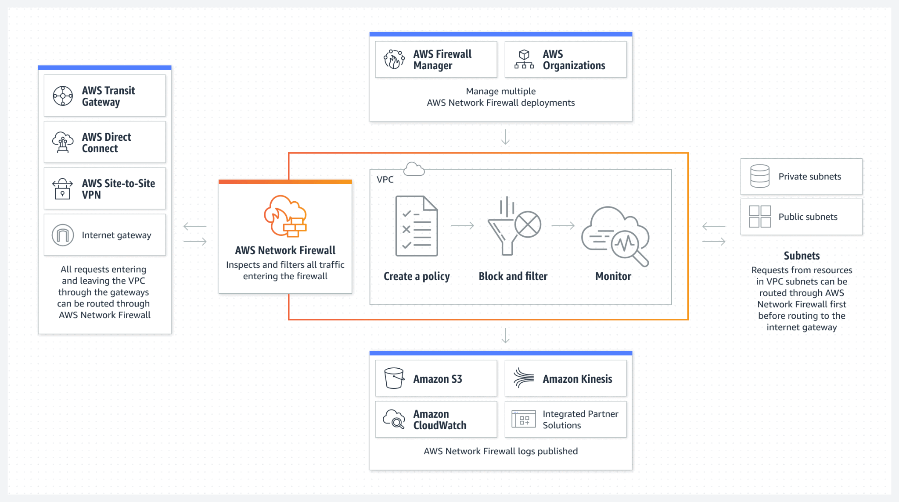
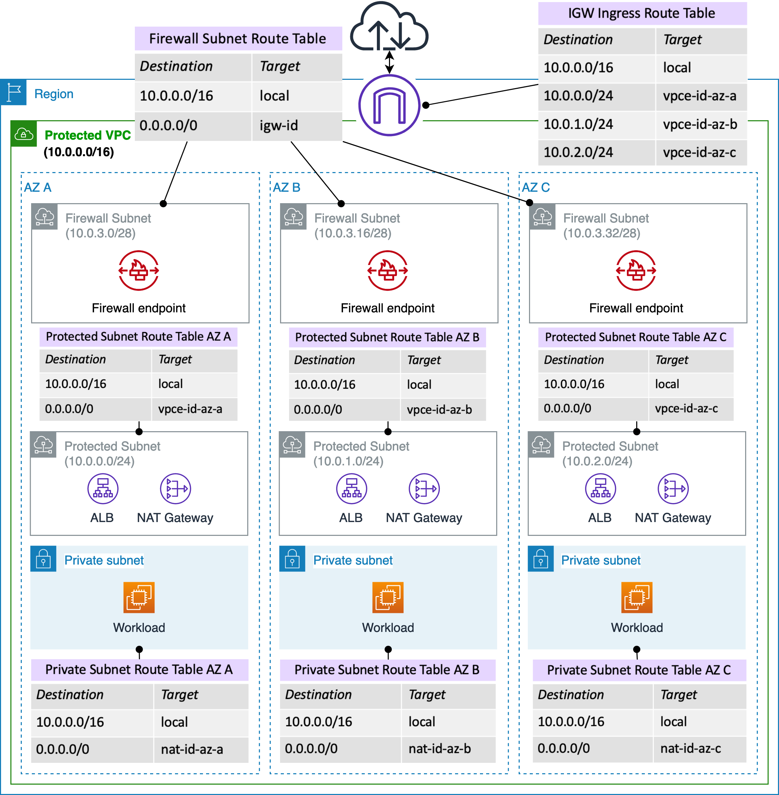

# AWS Network Firewall

## 1. Introduction

Modern cloud infrastructures demand sophisticated, scalable, and agile security solutions. As enterprises migrate workloads to AWS, the need for comprehensive network protection becomes paramount. AWS offers a suite of network security tools, and with the advent of AWS Network Firewall, customers now have a dedicated service to protect entire VPCs—from the network layer up through the application layer. This chapter discusses the evolution of AWS network protections, introduces the AWS Network Firewall, and examines its key features, deployment models, automation capabilities, and support for inspecting encrypted traffic.

## 2. Overview of Existing AWS Network Protections

Before delving into AWS Network Firewall, it is important to understand the array of network security services available in AWS:

- **Network Access Control Lists (ACLs):** Stateless filtering at the subnet level to allow or block traffic based on IP protocols and ports.
- **Amazon VPC Security Groups:** Stateful virtual firewalls attached to instances, controlling inbound and outbound traffic.
- **AWS Web Application Firewall (WAF):** Protects web applications from common exploits by filtering malicious HTTP requests targeted at specific services.
- **AWS Shield and Shield Advanced:** Provide managed Distributed Denial of Service (DDoS) protection to safeguard AWS applications.
- **AWS Firewall Manager:** A centralized management service that allows security policies and rules for WAF, Shield, and other services to be applied across multiple AWS accounts and VPCs.

Together, these services create a layered security model; however, when the requirement is to secure an entire VPC with sophisticated, granular controls, AWS Network Firewall becomes the service of choice.

## 4. What is AWS Network Firewall?

AWS Network Firewall is a fully managed, stateful, network-level firewall service designed to protect entire VPCs. It acts as a security barrier at the perimeter of your VPC, inspecting traffic that enters and exits your cloud environment. Key points include:

- **VPC-wide Protection:** The firewall is deployed at the VPC level, covering inbound, outbound, and inter-VPC communications.
- **Layer 3 to Layer 7 Inspection:** It offers deep traffic analysis, capable of filtering data from basic IP and port-level controls to application-layer (Layer 7) protocols.
- **Comprehensive Connectivity Coverage:** Whether traffic is flowing between VPCs, moving between your VPC and the internet, or traversing Direct Connect and Site-to-Site VPN connections, AWS Network Firewall provides robust protection.
- **Managed Service Integration:** Leveraging the AWS Gateway Load Balancer and proprietary AWS appliances, the service eliminates the need to deploy third-party security appliances.

By integrating directly with other AWS services and central management tools, AWS Network Firewall simplifies security administration while enhancing overall network security posture.

## 5. Key Features and Capabilities

AWS Network Firewall offers a suite of advanced features designed to provide granular control and comprehensive network security:

- **Granular Traffic Filtering:**
    
    - **IP and Port Filtering:** Define rules that filter traffic by IP addresses (supporting tens of thousands of entries) and port numbers.
    - **Protocol Filtering:** Control traffic based on protocols; for example, selectively disabling protocols such as SMB for outbound communications.
    - **Domain-Level Filtering:** Enforce outbound communication policies by allowing traffic only to approved domains, such as corporate domains or trusted third-party repositories.
    - **Pattern Matching:** Utilize regular expressions for complex matching scenarios to identify and block traffic patterns.

- **Rule Actions and Intrusion Prevention:**
    - **Actionable Rules:** Specify whether matching traffic should be allowed, dropped, or trigger alerts.
    - **Active Flow Inspection:** Enable intrusion prevention by continuously monitoring network flows for suspicious activity, mirroring capabilities found in traditional gateway load balancers.

- **High Rule Density and Scalability:**
    - Support for thousands of rules at the VPC level ensures that even complex security policies can be implemented without compromising performance.

- **Integrated Logging and Monitoring:**
    - Rule match events and inspection outcomes can be forwarded to AWS services such as Amazon S3, CloudWatch Logs, and Kinesis Data Firehose for real-time monitoring and post-event analysis.

These capabilities allow organizations to tailor their security posture finely, ensuring that only legitimate traffic is allowed while potential threats are blocked or flagged for further investigation.

## 6. Deployment Architectures

AWS Network Firewall is designed to integrate seamlessly into various network architectures. A typical deployment scenario includes:

- **VPC Design with Dedicated Firewall Subnet:**
    - The VPC is segmented to include a dedicated firewall subnet hosting firewall endpoints that interface with the AWS Network Firewall service.

- **Multiple Subnet Configuration:**
    - **Protected Subnet:** Hosts components such as an Application Load Balancer (ALB) and a NAT gateway.
    - **Private Subnet:** Contains critical resources such as EC2 instances.
    - **Public Subnet:** May host additional services or serve as an ingress point, with routing configured to ensure all traffic flows through the firewall endpoints.

- **Traffic Flow and Routing:**
    - **Outbound Traffic:** Traffic originating from EC2 instances in the private subnet flows to the NAT gateway, then is routed through the firewall endpoints for inspection before reaching the internet.
    - **Inbound Traffic:** External traffic enters via the internet gateway, passes through the firewall endpoints where it is inspected, and is then forwarded to the ALB and subsequently to the EC2 instances.
    - **Route Table Configuration:** Custom route tables ensure that both outbound and inbound traffic are directed to the firewall endpoints, integrating seamlessly with the overall network topology.

This architecture demonstrates how route tables and firewall endpoints can be orchestrated to provide full-spectrum network inspection, ensuring that all traffic—whether entering or leaving the VPC—is scrutinized according to defined security policies.

## 7. Automation and Threat Response with AWS Services

To enhance responsiveness and reduce manual intervention, AWS Network Firewall can be integrated with several AWS automation and threat detection services:

- **Threat Detection with GuardDuty:**
    - AWS GuardDuty continuously monitors your AWS environment for suspicious activity. When GuardDuty generates a finding, it can trigger further actions.

- **Centralized Security Management via Security Hub:**
    - Findings from GuardDuty and other integrated services are aggregated in AWS Security Hub, providing a single pane of glass for security posture assessment.

- **Event-Driven Automation with EventBridge and Step Functions:**
    - **Automated Rule Updates:** EventBridge can capture security findings and trigger AWS Step Functions to execute automated workflows. For example, the workflow may verify whether an attacking IP is known and, if not, call the AWS Network Firewall API to dynamically update the rule group, thereby blocking malicious traffic.
    - **Notification and Reporting:** The automation workflow can send status updates (success or failure) to Amazon SNS topics, ensuring that security teams remain informed about the changes and actions taken.

This automation framework not only expedites the threat response process but also creates a self-healing environment where security policies are continuously refined based on real-time intelligence.

## 6. Encrypted Traffic Inspection with TLS Decryption

With the increasing prevalence of encrypted traffic, traditional security tools often struggle to inspect data flows. AWS Network Firewall addresses this challenge through deep packet inspection (DPI) of encrypted traffic:

- **TLS Decryption and Re-encryption:**
    - The firewall decrypts incoming TLS traffic to inspect the payload for malicious content. Once inspection is complete, the traffic is re-encrypted and forwarded to its intended destination.

- **Integration with AWS Certificate Manager (ACM):**
    - AWS Certificate Manager provides and manages the digital certificates required for decrypting and re-encrypting traffic securely. This integration ensures that the decryption process adheres to stringent security standards without compromising the integrity of the encrypted sessions.

- **Security and Compliance:**
    - By inspecting encrypted traffic, AWS Network Firewall extends its protection to data flows that would otherwise be opaque, ensuring compliance with security policies and regulatory requirements.

This capability is essential for environments where encrypted communication is the norm, allowing organizations to maintain high security without sacrificing performance or data confidentiality.

## 7. Conclusion

AWS Network Firewall represents a significant advancement in cloud network security. By extending protection to the entire VPC, it offers granular control over network traffic, supports thousands of customizable rules, and integrates with a range of AWS services for automation and threat response. Whether through meticulous traffic filtering, active flow inspection, or deep packet inspection of encrypted data, AWS Network Firewall ensures that your cloud environment is robustly defended against an evolving threat landscape.