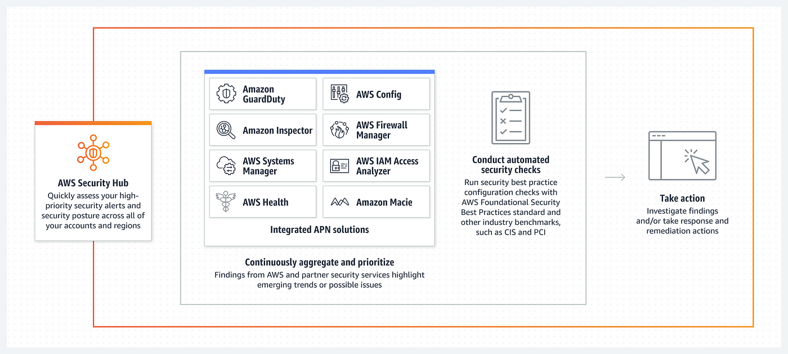

# AWS Security Hub
## 1. Introduction

AWS Security Hub is a central security tool that enables organizations to manage security across several AWS accounts while automating continuous security checks. Its core objective is to present a unified dashboard that displays the current security and compliance status, allowing administrators to quickly identify and respond to security issues. By aggregating alerts from a variety of AWS services and partner solutions, Security Hub provides a holistic view of an organization’s security posture, making it a critical component for proactive cloud security management.

## 2. Key Capabilities and Architecture

At its core, AWS Security Hub is built to aggregate and correlate security findings from various sources. Key capabilities include:

- **Centralized Dashboard:** The integrated dashboard provides real-time visibility into security and compliance status, consolidating alerts and findings from multiple sources.
- **Multi-Source Aggregation:** Security Hub collects findings from AWS services such as AWS Config, GuardDuty, Inspector, Macie, IAM Access Analyzer, AWS Systems Manager, AWS Firewall Manager, and AWS Health. It also integrates with AWS Partner Solutions, ensuring a broad coverage of potential vulnerabilities.
- **Event-Driven Architecture:** When a security issue is detected, Security Hub generates events that are forwarded to Amazon EventBridge. This facilitates automated workflows and rapid incident response.
- **Investigation Integration:** For deeper analysis of security issues, findings can be further examined using Amazon Detective, which aids in quickly pinpointing the source and impact of security incidents.

The architecture is designed to operate in a distributed environment across multiple accounts and regions while still maintaining a centralized view of security events. By leveraging native integrations and a common findings format (the AWS Security Finding Format, or ASFF), AWS Security Hub standardizes the way security information is consumed and acted upon.

## 3. Prerequisites and Configuration Requirements

Before deploying AWS Security Hub, several prerequisites and configuration steps must be met:

- **AWS Config Requirement:** AWS Security Hub relies on AWS Config for many of its security checks. It is imperative to enable AWS Config on all relevant AWS accounts, as it provides the baseline configuration data and change history required to evaluate security compliance.
- **Service Enablement:** Ensure that all AWS services which contribute to security findings (such as GuardDuty, Inspector, Macie, and others) are appropriately configured and active in your environment.
- **Standards Selection:** Prior to full deployment, determine which security standards you intend to monitor. AWS Security Hub supports multiple standards (including CIS AWS Foundations, PCI DSS, and AWS Foundational Security Best Practices), and these must be selected during the configuration process.

Meeting these prerequisites ensures that Security Hub can accurately aggregate and assess security findings across your organization.

## 4. Setting Up AWS Security Hub

Setting up AWS Security Hub involves a series of straightforward steps:

1. **Enable AWS Config:** Since many security checks performed by Security Hub depend on AWS Config, the first step is to enable AWS Config across all accounts.
2. **Select Security Standards:** Within the console, you must choose the security standards against which your environment will be continuously evaluated. Options include, but are not limited to, CIS AWS Foundations, PCI DSS, and AWS Foundational Security Best Practices.
3. **Integrate AWS Services:** The setup process includes configuring integrations with various AWS services. Once enabled, services like GuardDuty, Inspector, Macie, and others automatically send findings to Security Hub.
4. **Initiate the Service:** After confirming all prerequisites and selected options, you activate AWS Security Hub—often starting with a 30-day trial period. This activation transitions your environment into an active state where security checks and findings aggregation commence.

This structured approach ensures that all dependencies and configurations are addressed, resulting in a seamless transition to an integrated security management environment.

## 5. Multi-Account and Cross-Region Management

AWS Security Hub is designed to operate efficiently in complex, multi-account, and multi-region environments. Key features include:

- **Cross-Region Aggregation:** Security Hub supports cross-region aggregation, allowing you to centralize data from different AWS regions into one primary region. This is particularly useful for organizations with geographically distributed resources.
- **Organizations Integration:** With integration into AWS Organizations, Security Hub can automatically detect and onboard new accounts into the centralized security management framework. This includes designating a primary management account (or delegated administrator) to oversee and coordinate security activities across all member accounts.

By providing these capabilities, AWS Security Hub simplifies the management of security across large, distributed environments, ensuring consistency and centralized oversight.

## 6. Integrations with AWS and Partner Services

A major strength of AWS Security Hub is its broad integration with both native AWS services and third-party partner solutions:

- **AWS Service Integrations:** Security Hub aggregates findings from multiple AWS services:
    - **GuardDuty:** Automatically sends threat detections, such as unauthorized access attempts and anomalous API activity.
    - **AWS Config:** Supplies configuration and compliance data critical to security assessments.
    - **Inspector, Macie, IAM Access Analyzer, Firewall Manager, Systems Manager, and AWS Health:** Each contributes specific security insights, ranging from vulnerability assessments to policy compliance and threat detection.
- **Third-Party Integrations:** Beyond AWS services, Security Hub also incorporates findings from partner solutions like 3CORESec, Alert Logic, and Aqua. Additionally, findings can be shared with or received from external systems such as Atlassian, FireEye, Fortinet, and ServiceNow, enabling a broader security ecosystem.
- **Data Exchange:** Findings are standardized in the AWS Security Finding Format (ASFF), ensuring consistency regardless of the source. This standardization facilitates automated processing, archiving, and remediation across integrated services.

These integrations are fundamental in providing a complete security overview and enabling coordinated response mechanisms.

## 7. Automated Security Checks and Remediation Workflows

Automation is at the heart of AWS Security Hub’s design:

- **Continuous Security Checks:** The service performs automated security checks against the selected security standards. These continuous checks generate findings that help maintain compliance and identify vulnerabilities.
- **Custom Actions and EventBridge Integration:** Administrators can define custom actions that integrate with Amazon EventBridge. When a custom action is triggered, an event is sent to EventBridge, which can invoke remediation workflows using AWS Lambda, Step Functions, or SSM automation.
- **Remediation Architecture:** A typical remediation workflow might involve:
    - **Detection:** A service such as Macie detects a security issue (e.g., exposure of PII in an S3 bucket) and creates a finding.
    - **Aggregation:** The finding is aggregated in the central Security Hub dashboard.
    - **Action Trigger:** A custom action triggers an event in EventBridge.
    - **Automated Response:** An AWS Lambda function or other automation tool remediates the issue (for instance, adjusting bucket policies or correcting misconfigurations), and the finding is marked as resolved.
- **Logging and Auditing:** All automated actions and events can be logged in CloudWatch or SNS, ensuring that every step of the remediation process is recorded for audit and compliance purposes.

This automated framework not only speeds up the incident response process but also reduces the operational overhead required for maintaining security hygiene.

## 8. Investigating and Responding to Findings

Effective security management requires a robust mechanism for investigating and responding to identified issues:

- **Standardized Findings Format:** All findings in AWS Security Hub are formatted using ASFF, which ensures consistency across sources and simplifies analysis.
- **Workflow Management:** Each finding can be assigned a state—such as new, notified, suppressed, or resolved—allowing for clear tracking of remediation progress. It is important to note that findings must be archived within Security Hub even if they are resolved in the originating service (for example, GuardDuty), as archiving does not automatically propagate between systems.
- **Insights and Analysis:**
    - **Built-In Managed Insights:** These are automatically generated groupings of related findings based on integrated products or security standards. They provide a high-level view of recurring issues or critical vulnerabilities.
    - **Custom Insights:** Administrators have the flexibility to define custom insights that target specific security concerns within their environment, such as critical findings affecting member accounts.
- **Advanced Investigation Tools:** Integration with Amazon Detective allows for an in-depth analysis of security events, enabling administrators to quickly pinpoint the source of issues and understand the broader context of each incident.

By combining structured workflows, standardized formats, and advanced analytical tools, AWS Security Hub provides a powerful framework for timely and effective security incident management.

## 9. Pricing Model

AWS Security Hub employs a pricing model based on the volume of security checks and the ingestion of events:

- **Security Checks:** Pricing is determined per check, with an initial quota (e.g., the first 1,000 checks) offered at a fixed rate. As the number of checks increases, so does the overall cost.
- **Ingestion Events:** The first 10,000 ingestion events are free, after which charges apply on a per-finding basis.
- **Trial Period:** AWS offers a 30-day trial period, allowing organizations to evaluate the service and its benefits before fully committing to its use.

This pricing model is designed to scale with the size and complexity of your AWS environment, ensuring that costs are aligned with actual usage and security needs.

## 10. Conclusion

AWS Security Hub stands as a central pillar in AWS’s security ecosystem. By aggregating security findings from a myriad of AWS services and partner solutions, it provides a unified and actionable view of your security posture. Through comprehensive integrations, automated security checks, and flexible remediation workflows, Security Hub enables organizations to maintain robust security and compliance across multi-account, multi-region environments. Its ability to standardize and streamline security incident management makes it an indispensable tool for modern cloud security operations.