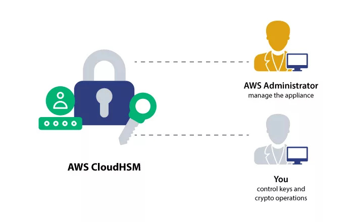

# AWS CloudHSM

## 1. Introduction

AWS CloudHSM is a service that provisions dedicated Hardware Security Modules (HSMs) in the AWS Cloud. It is designed to meet rigorous security requirements by providing tamper-resistant devices that offer FIPS 140-2 Level 3 compliance. Unlike AWS KMS, where AWS handles key management within a multi-tenant environment, CloudHSM shifts the operational burden of key lifecycle management entirely to the customer. This chapter outlines not only what CloudHSM is and how it differs from KMS but also the shared responsibility model, where AWS provides secure hardware while the customer manages the encryption keys and associated security operations.

## 2. Core Concepts

### 2.1 What is AWS CloudHSM?

AWS CloudHSM is a cloud-based, dedicated hardware security solution that delivers the cryptographic performance and protection typically required by enterprises. It provides:

- **Dedicated Hardware:** AWS provisions a dedicated HSM device that is exclusively allocated to your organization.
- **Tamper-Resistant Features:** The HSM is built to be tamper resistant with built-in compliance measures. Any unauthorized physical tampering is immediately detected.
- **Encryption Capabilities:** The service supports both symmetric and asymmetric encryption, and it is well-suited for use cases that involve TLS/SSL offloading, digital signing, and secure hashing.
- **Operational Model:** Customers are responsible for installing and managing the CloudHSM Client Software. Unlike API-driven services, operations require configuration and direct management of the HSM devices.

### 2.2 CloudHSM vs. AWS KMS: Use Cases and Differences

While both CloudHSM and AWS KMS provide encryption capabilities, their use cases and management paradigms differ significantly:

- **Management Model:**
    - **AWS KMS:** AWS manages the underlying software and key storage, offering a free tier and multi-tenant environment. It supports multiple key types, including AWS Owned, AWS Managed, and Customer Managed keys.
    - **CloudHSM:** AWS supplies the hardware only, and the customer manages all aspects of key creation, rotation, backup, and security. There is no free tier for CloudHSM.
- **Security Isolation:**
    - **CloudHSM:** Offers a single-tenant model where each HSM is dedicated to one customer, providing enhanced isolation and security.
    - **KMS:** Operates as a multi-tenant service, which may be sufficient for many use cases but does not offer the same level of physical isolation.
- **Key Accessibility:**
    - **KMS:** Keys are typically region-scoped, with the option for replication.
    - **CloudHSM:** Keys are managed within specific Virtual Private Clouds (VPCs) and can be extended across VPCs via peering, offering more granular network control.
- **Usage Scenarios:**  
    CloudHSM is particularly advantageous when compliance or performance demands mandate dedicated hardware for cryptographic operations, such as SSL/TLS offloading and Oracle Transparent Data Encryption (TDE).

### 2.3 Shared Responsibility Model: Key Management Duties

With CloudHSM, the operational responsibilities are clearly delineated:

- **AWS Responsibilities:**  
    AWS is responsible for the provision and initial configuration of the HSM hardware. It ensures that the devices are compliant with industry standards and physically secure.
- **Customer Responsibilities:**
    - **Key Lifecycle Management:** Customers must create, manage, update, and delete encryption keys.
    - **Security and Maintenance:** The customer is in charge of maintaining key security, performing regular backups, and ensuring that key usage complies with internal and regulatory policies.
    - **Access Control:** AWS IAM can be used to manage access at the cluster level (create, describe, delete operations), but the granular control over key operations within the HSM is entirely the customer's responsibility.

This model demands that organizations have robust processes in place for key management and audit, as AWS will not recover keys or assist with operational issues once the hardware is provisioned.

## 3. Deployment and Architecture

### 3.1 High Availability and Durability Design

Ensuring high availability and durability is critical for secure key management:

- **Multi-AZ Deployment:**  
    CloudHSM clusters are deployed across multiple Availability Zones (AZs). A typical high availability architecture involves pairing two CloudHSM devices across different AZs, ensuring that if one zone experiences an outage, the other remains accessible.
- **Redundancy and Failover:**  
    By distributing HSM devices within a cluster, organizations can guarantee continuous access to encryption keys and maintain operational resilience. This redundancy is fundamental for critical applications that demand uninterrupted access to cryptographic functions.
- **Secure Communication:**  
    CloudHSM clients communicate with the HSM devices over encrypted connections, maintaining the integrity and confidentiality of key operations across the network.
- **Operational Considerations:**  
    Customers must architect their deployments to include the necessary networking configurations, such as proper security groups and subnet configurations, to enable secure and reliable connectivity to their CloudHSM devices.

This architectural design ensures that data remains secure and available even in the event of localized failures within an Availability Zone.

## 4. Integration with AWS and Third-Party Services

### 4.1 Supported AWS Services

CloudHSM integrates seamlessly with several AWS services, primarily through its association with AWS KMS:

- **AWS KMS Custom Key Stores:**  
    CloudHSM can be used as the backing store for AWS KMS through custom key store configurations. This integration allows customers to leverage AWS KMS features—such as key usage logging with CloudTrail—while maintaining full control over key management.
- **Service Integrations:**
    - **EBS, S3, and RDS:**  
        CloudHSM-backed keys can be used to encrypt data in services like Amazon Elastic Block Store (EBS) volumes, Amazon Simple Storage Service (S3) objects (especially in scenarios where SSE-C encryption is desired), and Amazon Relational Database Service (RDS) instances.
    - **Redshift and Database Encryption:**  
        Some services, such as Redshift, support CloudHSM for database encryption and key management, providing enhanced security for data at rest.

By integrating CloudHSM with these services, organizations can ensure that their encryption keys are managed on dedicated hardware while still benefiting from the automation and ease-of-use provided by AWS KMS.

### 4.2 Third-Party Application Integration

Beyond AWS services, CloudHSM also supports integration with a variety of third-party applications:

- **Cryptographic Operations:**  
    CloudHSM can be utilized to perform cryptographic acceleration for SSL/TLS operations, making it an ideal choice for offloading encryption tasks from web servers or other applications.
- **Enterprise Applications:**  
    Third-party integrations include support for applications such as:
    - **Windows Server Certificate Authority**
    - **Oracle Transparent Data Encryption (TDE)**
    - **Microsoft SignTool**
    - **Java Keytool**

These integrations facilitate secure key storage and cryptographic processing in environments where compliance, performance, or security mandates the use of dedicated hardware.

## 5. Advanced Use Cases

### 5.1 Custom Key Stores with AWS KMS Integration

One of the more advanced capabilities of CloudHSM is its integration with AWS KMS through the use of custom key stores:

- **Enhanced Security and Logging:**  
    By configuring a custom key store, customers can have their KMS keys backed by CloudHSM. This setup not only grants the benefits of dedicated hardware but also integrates with AWS CloudTrail, enabling detailed logging of API calls related to key usage.
- **Seamless Service Integration:**  
    Once the custom key store is established, AWS services that leverage KMS—such as EBS, S3, and RDS—can transparently use CloudHSM-backed keys for encryption operations. This approach marries the ease-of-use of AWS KMS with the dedicated security posture of CloudHSM.

### 5.2 Cross-Account HSM Sharing

CloudHSM also supports scenarios where multiple AWS accounts within an organization require access to a single HSM cluster:

- **Network-Level Sharing:**  
    Although the CloudHSM cluster itself cannot be shared directly using AWS Resource Access Manager (RAM), the private subnets in which the cluster is deployed can be shared. By granting network access to these subnets, other accounts can deploy CloudHSM clients and interact with the HSM.
- **Security Group Configuration:**  
    When sharing access across accounts, it is essential to configure security groups to permit the necessary traffic from clients in different accounts. This approach ensures that only authorized network traffic can reach the CloudHSM cluster, maintaining strict control over key management operations.

This cross-account sharing capability is particularly useful in large organizations or multi-account architectures where centralized key management is required.

## 6. Conclusion

AWS CloudHSM represents a robust solution for organizations that require dedicated, high-assurance hardware for encryption key management. By offloading the physical security of encryption hardware to AWS while retaining full control over key operations, CloudHSM offers a unique blend of flexibility and security. The service's architectural design ensures high availability and durability, while its seamless integration with both AWS services and third-party applications allows for versatile deployment scenarios. Advanced features such as custom key stores with AWS KMS integration and cross-account sharing further extend its capabilities, making CloudHSM a critical component for enterprises with stringent compliance and performance requirements. As with all security solutions, a thorough understanding of the shared responsibility model is essential to leverage CloudHSM effectively while ensuring that all operational and security duties are appropriately managed.