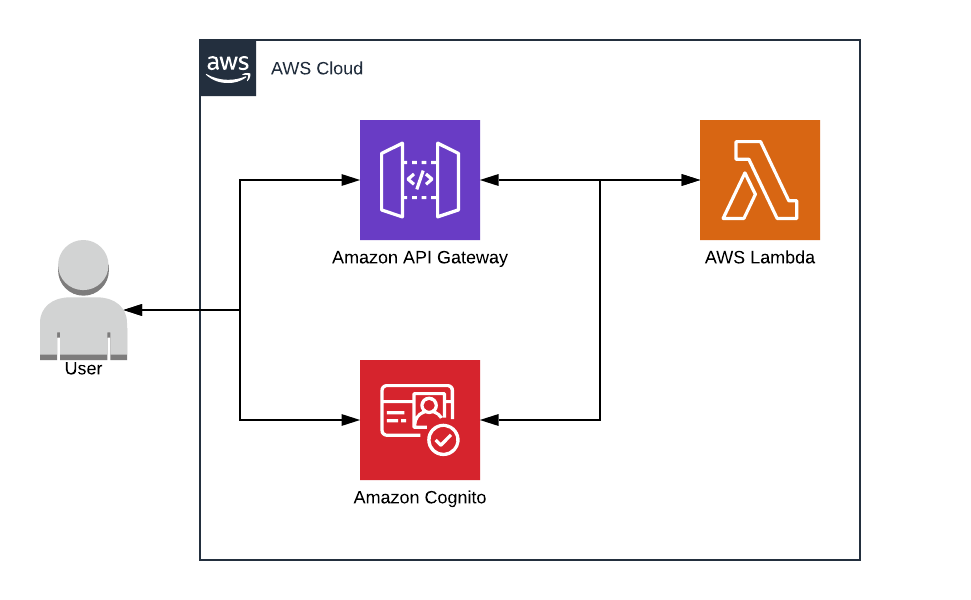
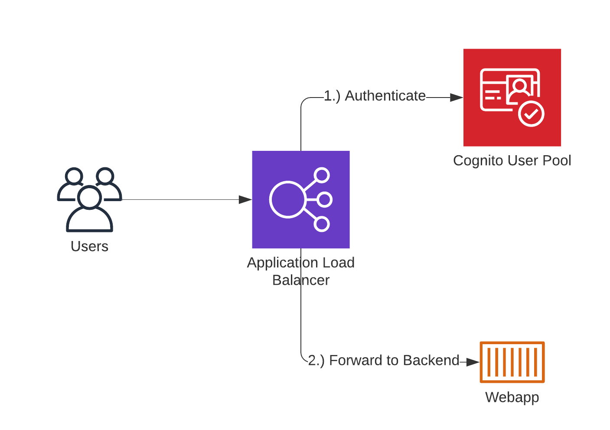
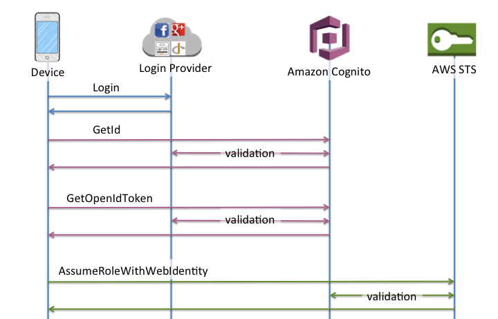

# Amazon Cognito

## 1. Introduction

Amazon Cognito is an AWS service designed to simplify the process of managing user identities and authentication for web and mobile applications. It allows developers to build secure and scalable applications without the burden of managing traditional, server-based user directories. Cognito provides a robust, serverless database for storing and managing user identities through two main services: Cognito User Pools and Cognito Identity Pools. This chapter examines Amazon Cognito in depth—exploring its architecture, features, security enhancements, integration capabilities, and best practices. Whether you are a developer, architect, or IT security specialist, understanding Cognito’s capabilities is essential for building modern, secure applications in a cloud environment.

## 2. Managing Users with Cognito User Pools (CUP)

Cognito User Pools serve as a robust, serverless database for handling application users. They are designed to provide seamless user lifecycle management—from sign-up and verification to sign-in and password management—while integrating modern authentication mechanisms and security enhancements.

### 2.1 Core Features of User Pools

#### Serverless User Database

At its core, Cognito User Pools offer a managed, serverless repository that securely stores user profiles and credentials. This service eliminates the need to run and scale traditional databases, thus reducing the operational overhead. Users register with a username or email and a password, and the pool manages their data in a scalable, highly available manner. The serverless nature of the service ensures that your application can support a growing user base without requiring manual intervention for scaling or performance tuning.

#### User Lifecycle Management (Sign-Up, Verification, Sign-In)

Cognito User Pools handle the complete user lifecycle. During registration, the service facilitates sign-up with necessary validations. The system can be configured to require email or phone number verification, ensuring that only genuine users are onboarded. Once verified, users can sign in using their credentials. Cognito also supports password reset workflows, allowing users to regain access if credentials are forgotten or compromised. The complete lifecycle management makes Cognito User Pools a one-stop solution for user management in modern applications.

### 2.2 Authentication Mechanisms

Cognito supports several authentication methods that cater to the diverse security and usability requirements of modern applications.

#### Multi-Factor Authentication (MFA)

Multi-factor authentication (MFA) adds an extra layer of security by requiring users to provide two or more verification factors during the sign-in process. Cognito can be configured to enforce MFA based on risk factors or as a mandatory requirement for all users. This ensures that even if primary credentials are compromised, unauthorized access is prevented by the additional verification step.

#### Social Identity Providers (Google, Facebook, Apple)

Modern applications increasingly allow users to sign in using their existing accounts from major social platforms. Cognito integrates seamlessly with popular social identity providers such as Google, Facebook, and Apple. This social sign-in capability not only improves the user experience by reducing friction but also leverages the robust security mechanisms provided by these identity providers.

#### JWT Tokens and Session Management

Upon successful authentication, Cognito issues JSON Web Tokens (JWTs) that serve as secure representations of user sessions. These tokens contain claims about the user and are used by downstream services to validate and authorize access. The stateless nature of JWTs simplifies session management and scales well with distributed architectures. The tokens also enable single sign-on (SSO) experiences across different applications within the same ecosystem.

### 2.3 Security Enhancements

In an era where cyber threats are increasingly sophisticated, Cognito incorporates advanced security features to protect user credentials and manage risk.

#### Compromised Credential Detection

Cognito integrates with AWS security services that continuously monitor and scan for compromised credentials. When credentials are identified as potentially compromised elsewhere on the internet, Cognito can proactively block affected users and notify them, thereby reducing the risk of unauthorized access.

#### Risk-Based Adaptive Authentication

Risk-based adaptive authentication adds contextual security to the sign-in process by evaluating the risk associated with each login attempt. Factors such as device fingerprinting, geolocation, and behavioral analysis are taken into account. If an anomaly is detected, Cognito can enforce additional security measures such as prompting for MFA. This adaptive approach helps ensure that only legitimate users gain access, even when login conditions vary.

### 2.4 Integrations with AWS Services

One of Cognito User Pools’ significant advantages is its native integration with other AWS services, simplifying the implementation of secure access across your cloud architecture.

#### Securing API Gateway with Cognito

API Gateway is a critical component for building serverless applications. When integrated with Cognito, API Gateway can delegate authentication and authorization to the User Pool. Users first authenticate with the User Pool and obtain a JWT. This token is then presented to the API Gateway, which validates the token before allowing access to backend resources. This integration streamlines the process of securing APIs without the need to implement custom authentication logic.

#### Application Load Balancer (ALB) Authentication

Similarly, Cognito integrates with Application Load Balancers (ALB) to manage user authentication. By leveraging ALB listeners and rules, Cognito can be used to authenticate users before directing traffic to backend targets such as EC2 instances, Lambda functions, or ECS containers. This native integration simplifies the security architecture by consolidating authentication at the load balancer level, thereby protecting internal resources without extensive application modifications.

## 3. Federated Identities with Cognito Identity Pools

While Cognito User Pools provide comprehensive user management and authentication, many applications require secure, temporary access to AWS resources. This is where Cognito Identity Pools come into play, enabling federated identities and the issuance of temporary AWS credentials via the AWS Security Token Service (STS).

### 3.1 Identity Pools Overview

#### Temporary AWS Credentials via AWS STS

Cognito Identity Pools are designed to grant temporary, limited-privilege credentials to users. When a user authenticates—either through a User Pool or another identity provider—they can exchange their authentication token for temporary AWS credentials. These credentials are issued by AWS STS and are used to securely access AWS resources without exposing long-term secrets.

#### Guest vs. Authenticated Access Workflows

Cognito Identity Pools support both authenticated and unauthenticated (guest) access. For authenticated users, the identity pool exchanges verified tokens from a trusted identity provider for temporary AWS credentials. For guest users, the service can be configured with a separate IAM role that restricts access to only those AWS resources that are safe for unauthenticated access. This dual-mode capability enables applications to cater to both logged-in and guest users while maintaining appropriate security controls.

### 3.2 Federating Identity Providers

Federation is the process of integrating multiple identity providers to enable users to authenticate using their preferred method. Cognito Identity Pools support a broad range of identity providers.

#### Social Logins (Facebook, Google)

For many applications, providing a familiar and frictionless sign-in experience is crucial. Cognito Identity Pools allow users to authenticate using their existing social media accounts. By integrating with providers such as Facebook and Google, developers can offer a single sign-on experience that leverages the robust authentication mechanisms these platforms provide.

#### Enterprise Identity Providers (SAML 2.0, OpenID Connect)

Enterprise environments often rely on established identity systems like Active Directory. Cognito Identity Pools can integrate with SAML 2.0 and OpenID Connect (OIDC) providers, enabling seamless authentication with corporate identity systems. This integration facilitates secure access to AWS resources for employees and contractors without the need to replicate or migrate identity information.

### 3.3 Advanced Access Control

A critical aspect of federated identity is fine-grained access control. Cognito Identity Pools enable advanced authorization mechanisms using IAM policies and policy variables.

#### Fine-Grained Permissions with IAM Policy Variables (e.g., S3/DynamoDB)

When temporary credentials are issued, they are associated with an IAM policy that defines the permitted actions. By using policy variables, such as those referencing the user’s identity (e.g., their unique user ID), developers can enforce fine-grained permissions. For example, you can restrict access to specific S3 bucket prefixes or DynamoDB table partitions based on the user’s identity. This mechanism ensures that users can only access resources that they are explicitly authorized to interact with.

#### Role Customization Based on User Attributes

Cognito Identity Pools allow for dynamic role assignment based on attributes derived from the user’s authentication token. This customization means that different users, even if authenticated through the same provider, can be granted different permissions based on attributes such as group membership, role claims, or other metadata. This dynamic approach is particularly useful in multi-tenant applications or environments with complex authorization requirements.

## 4. User Group Management and Row-Level Security

User groups in Cognito are designed to simplify the management of permissions for collections of users. By organizing users into logical groups, administrators can assign common permissions and streamline the authorization process.

### 4.1 Cognito User Pool Groups

#### Group Creation and IAM Role Assignment

Within a Cognito User Pool, groups can be created to represent different categories or roles within an organization. For instance, you might have a “Readers” group with permissions to view content and an “Editors” group with permissions to modify content. Each group is associated with an IAM role that encapsulates the permissions required for that group. By assigning users to these groups, you can centrally manage permissions and reduce the complexity of user-level policy assignments.

#### Resolving Multi-Group Membership and Precedence

One unique feature of Cognito User Pool groups is the concept of group precedence. Since a user may belong to multiple groups, Cognito uses a precedence value (a numerical indicator) to determine which group’s IAM role should be applied by default. The group with the lowest precedence value takes priority. However, applications can be designed to allow users to assume multiple roles if necessary. This flexibility is particularly useful when users need to perform actions that require permissions from more than one group.

### 4.2 Row-Level Security (RLS)

#### Dynamic Data Filtering Using Policy Variables

Beyond coarse-grained access control, many applications require row-level security (RLS) to restrict data access on a per-user basis. Cognito integrates with AWS IAM policies to enforce such security measures. Using policy variables, you can define conditions that filter data based on the user’s unique identifier. For example, you might restrict access in an S3 bucket to only the objects that have a prefix matching the user’s ID. Similarly, in DynamoDB, you can enforce conditions so that users only interact with records tied to their own identity.

#### Use Cases for Multi-Tenant Applications

Row-level security is particularly beneficial for multi-tenant applications, where a single database instance serves multiple clients. By leveraging dynamic policy variables, you ensure that each tenant’s data remains isolated and secure, even though it resides within a shared infrastructure. This granular control not only improves security but also simplifies compliance with data isolation requirements across different regulatory frameworks.

## 5. Identity Federation Architectures

Identity Federation is a critical component of modern identity management, enabling users from external systems to access AWS resources securely. This section discusses several federation architectures—from enterprise solutions using SAML 2.0 to legacy web identity federation flows and custom identity brokers.

### 5.1 Enterprise Federation with SAML 2.0

#### Integrating Microsoft ADFS and Active Directory

SAML 2.0 (Security Assertion Markup Language) is a widely adopted standard for exchanging authentication and authorization data between an identity provider and a service provider. In an enterprise setting, many organizations use Microsoft Active Directory Federation Services (ADFS) as their identity provider. With SAML 2.0 integration, AWS can trust assertions issued by ADFS to grant temporary credentials to users. This integration involves setting up a trust relationship between AWS and the identity provider, configuring the SAML metadata, and mapping SAML attributes to AWS roles. The mechanism uses the STS API called AssumeRoleWithSAML to exchange SAML assertions for temporary credentials, allowing users to access the AWS Management Console, CLI, or APIs securely.

### 5.2 Web Identity Federation

Web Identity Federation enables users to authenticate using third-party identity providers in untrusted environments. There are two primary variants: one that operates without Cognito and one that leverages Cognito for enhanced security and simplified integration.

#### With Cognito: Token Vending Machine Pattern

In the preferred model with Cognito, a client application first authenticates with a third-party identity provider (such as Google, Facebook, or an OpenID Connect provider). The identity provider issues a web identity token, which is then exchanged with Amazon Cognito. Cognito acts as a token vending machine—it verifies the token and issues its own token, which in turn can be traded with AWS STS for temporary security credentials. This process not only streamlines the integration but also supports advanced features such as anonymous access, multi-factor authentication, and data synchronization. By using Cognito, you gain the benefits of a managed service that abstracts the complexities of token exchange and session management.

#### Without Cognito: Legacy Workflows (Custom Solutions)

Although not recommended by AWS for new applications, legacy web identity federation workflows involve a direct exchange of tokens with AWS STS using the AssumeRoleWithWebIdentity API. In this model, the client receives a web identity token from the third-party provider and directly trades it for temporary credentials from STS. While functional, this approach lacks the additional security and flexibility offered by Cognito. Custom solutions may be used to implement this workflow in legacy environments, but they typically require more manual configuration and maintenance.

### 5.3 Custom Identity Brokers

#### Building Brokers for Proprietary Identity Systems

In situations where neither SAML 2.0 nor standard web identity providers are applicable—such as when an organization has a proprietary identity system—a custom identity broker can be developed. A custom broker serves as an intermediary that authenticates users against the proprietary system and then leverages AWS STS to obtain temporary credentials. The broker must handle the logic for determining the appropriate IAM role for each user and enforce fine-grained access policies. This approach centralizes identity management within the broker while still benefiting from AWS’s secure, temporary credential model. Although more complex to implement, custom identity brokers offer a tailored solution that can integrate with virtually any identity system.

## 6. Security Best Practices

Ensuring the security of your application is paramount. With Amazon Cognito, security best practices involve careful configuration of authentication flows, diligent management of credentials, and continuous monitoring of activity. This section outlines strategies and guidelines for hardening your Cognito implementation.

### 6.1 IAM Policy Variables for Dynamic Permissions

IAM policy variables are an essential tool for enforcing dynamic, fine-grained permissions in AWS. By embedding user-specific data—such as user IDs—into IAM policies, you can ensure that temporary credentials are restricted to the exact resources that the user should access. This dynamic approach minimizes the risk of privilege escalation and unauthorized data access. For instance, an S3 bucket policy can restrict access to objects prefixed with the user’s unique identifier, ensuring that even if a token is misused, its scope remains limited.

### 6.2 Securing Credentials and Sessions

#### Short-Lived Tokens and Refresh Strategies

A core security feature of Cognito is the use of short-lived tokens. By issuing tokens with limited lifetimes, Cognito reduces the window during which a stolen token might be misused. In addition, Cognito supports token refresh mechanisms that allow applications to obtain new tokens without requiring users to reauthenticate. This balance between security and usability is critical for maintaining a seamless user experience while mitigating risk.

#### Credential Lifecycle Management

Beyond tokens, the temporary AWS credentials issued via Cognito Identity Pools have built-in expiration. This means that even if credentials are intercepted, their validity is limited to a brief period. Properly configuring the expiration and refresh intervals is essential to maintain both security and operational continuity. Regular audits of token lifetimes and refresh practices are recommended to ensure that they align with your organization’s security policies.

### 6.3 Hardening Authentication

#### Enforcing MFA and Strong Password Policies

Multi-factor authentication (MFA) is a crucial defense against credential theft. Cognito can be configured to enforce MFA, either for all users or adaptively based on risk analysis. In addition to MFA, strong password policies should be implemented to ensure that user credentials are robust against brute force and dictionary attacks. Combining these measures creates a layered security approach that significantly reduces the risk of unauthorized access.

#### Monitoring for Suspicious Activity

Proactive monitoring is a key aspect of any secure authentication system. Cognito integrates with AWS CloudTrail and other monitoring tools to log authentication events. By analyzing these logs, security teams can detect anomalies such as repeated failed login attempts, logins from unusual locations, or sudden changes in user behavior. Real-time alerts and automated responses can then be configured to mitigate potential threats before they escalate.

## 7. Conclusion

By understanding and applying the principles outlined in this chapter, developers and architects can leverage Amazon Cognito to build applications that are both secure and highly responsive to user needs. Whether you are building consumer-facing applications, enterprise systems, or multi-tenant platforms, Cognito’s blend of user management, federated identity, and advanced security features offers the flexibility and power required to meet today’s challenges in identity and access management.