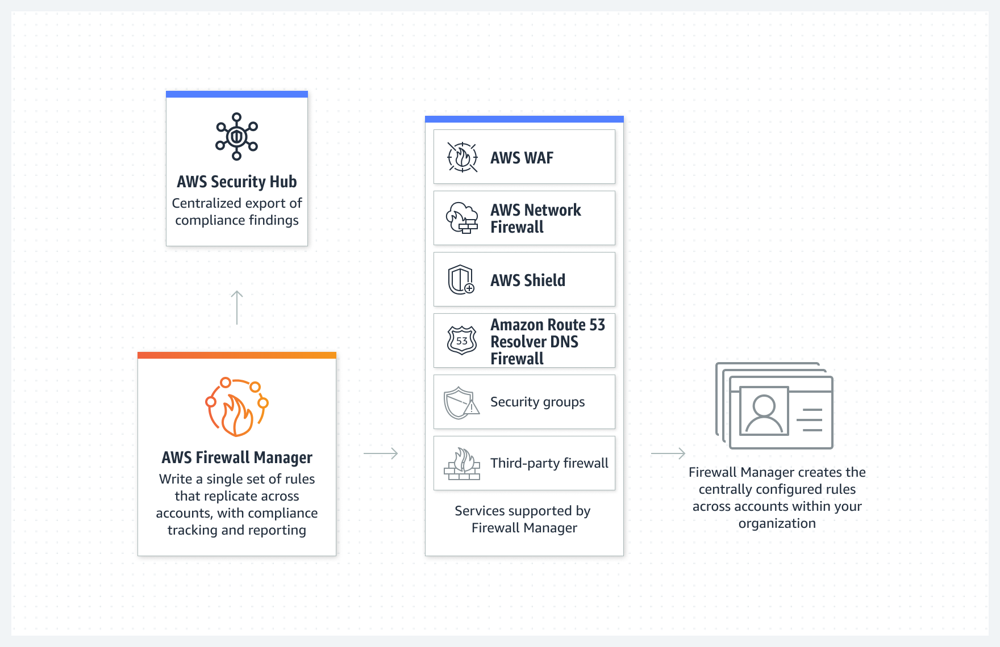

# AWS Firewall Manager

## 1. Introduction

AWS Firewall Manager is a centralized security management service designed to simplify the administration and enforcement of firewall rules across multiple AWS accounts within an organization. By enabling security teams to define and propagate a common set of security policies, Firewall Manager ensures a consistent security posture across diverse resources and accounts, streamlining compliance and reducing operational overhead.
## 2. Overview of AWS Firewall Manager

AWS Firewall Manager is engineered to provide a single pane of glass for managing firewall rules across your entire AWS Organization. Key features include:

- **Centralized Rule Management:**  
	Create and manage security policies from a central administrator account. These policies encompass a range of protections, including AWS WAF rules, Shield Advanced protections, VPC security groups, AWS Network Firewall rules, and Route 53 Resolver DNS Firewall rules.
    
- **Regional Policy Enforcement:**  
	Security policies are created at the regional level. Once defined, they are automatically deployed to all relevant accounts within the AWS Organization for that region, ensuring that every eligible resource is consistently protected.
    
- **Unified Dashboard:**  
	The centralized dashboard provides visibility into compliance across all managed accounts. It highlights non-compliant resources and offers insights into the current security posture, enabling rapid remediation when deviations occur.

By centralizing management tasks, AWS Firewall Manager not only reduces administrative complexity but also minimizes the risk of misconfigurations that can lead to security vulnerabilities.

## 3. Security Policies and Cross-Account Management

At the heart of AWS Firewall Manager lies the concept of security policies—a common set of rules that define how resources should be protected. These policies can include:

- **Web Application Firewall (WAF) Rules:**  
    Policies that specify a collection of ACL (Access Control List) rules to safeguard applications by filtering HTTP/HTTPS traffic. These rules can be applied to resources such as ALBs, API Gateways, and CloudFront distributions.
    
- **Shield Advanced Protections:**  
    Policies that leverage Shield Advanced to offer enhanced DDoS mitigation, advanced reporting, and dedicated support from the Shield Response Team. These protections are crucial for organizations exposed to frequent or sophisticated DDoS attacks.
    
- **Standardized Security Groups:**  
    Policies aimed at enforcing consistent security group settings across EC2 instances, load balancers, and ENI (Elastic Network Interface) resources within Virtual Private Clouds (VPCs).
    
- **Network Firewall and DNS Firewall Rules:**  
    Policies that extend protection at the VPC level, ensuring that network traffic is appropriately filtered, and that DNS queries are safeguarded against malicious domains.

A defining advantage of AWS Firewall Manager is its tight integration with AWS Organizations. This integration enables the central deployment of security policies across multiple accounts. When a new account or resource is added to the organization, the policies are automatically applied, thereby eliminating the need for manual intervention and ensuring that security standards are maintained from the moment of creation.

## 4. Automated Policy Enforcement

One of the most powerful features of AWS Firewall Manager is its ability to automate the enforcement of security policies. This capability is crucial for maintaining a robust and compliant security posture in dynamic cloud environments. Key elements include:

- **Automatic Detection and Remediation:**  
    When a new resource—such as an Application Load Balancer or API Gateway—is created within an AWS Organization, Firewall Manager detects its presence and applies the relevant security policies automatically. This ensures that every new resource adheres to the organization’s security requirements from day one.
    
- **Continuous Monitoring:**  
    Firewall Manager continuously monitors the compliance status of resources. Any deviation from the defined policies is flagged in the centralized dashboard, allowing security teams to quickly address and remediate issues.
    
- **Scalable Policy Management:**  
    Whether managing a handful of accounts or thousands, Firewall Manager scales with the organization. This scalability is essential for enterprises with rapidly growing AWS environments, ensuring that security policies remain consistently enforced across all resources, regardless of their number or geographic distribution.
    

The automation of policy enforcement not only accelerates the deployment of security measures but also reduces the likelihood of human error—a critical factor in maintaining an effective security posture.

## 5. Conclusion

AWS Firewall Manager transforms the complexity of multi-account security management into a streamlined, automated process. By centralizing the creation, deployment, and monitoring of security policies, it enables organizations to maintain a consistent security posture across diverse AWS resources and accounts. Its tight integration with AWS Organizations ensures that every new resource automatically complies with established security standards, while its automated enforcement and continuous monitoring capabilities reduce administrative overhead and minimize the risk of security gaps.

Moreover, by complementing the granular traffic filtering capabilities of AWS WAF and the robust DDoS protections of AWS Shield Advanced, Firewall Manager plays a crucial role in building a comprehensive, resilient security framework. For organizations looking to secure their AWS environments at scale, AWS Firewall Manager offers an indispensable tool for ensuring that security policies are not only defined but are also enforced uniformly across the entire infrastructure.

Embracing AWS Firewall Manager paves the way for a proactive, automated, and centralized approach to cloud security—empowering organizations to meet compliance requirements, respond swiftly to emerging threats, and maintain a high level of operational security across all their AWS accounts.