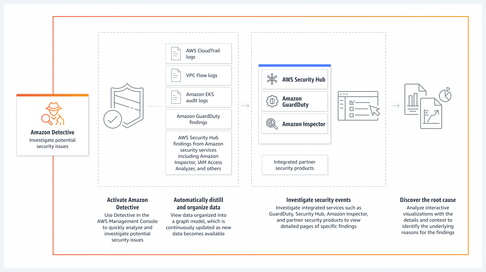
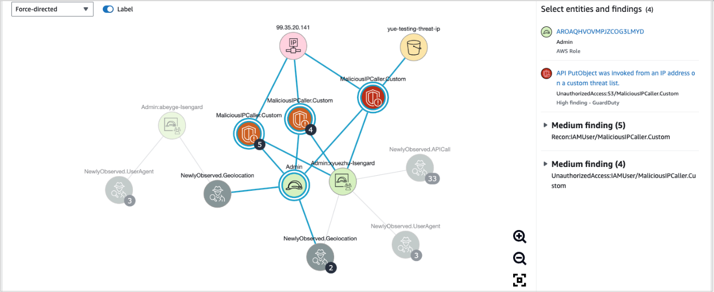

# Amazon Detective

## 1. Introduction

Amazon Detective is an AWS service purpose-built to streamline the investigation of security findings and incidents. By harnessing advanced machine learning and graph analytics, Amazon Detective accelerates root cause analysis, enabling security teams to quickly identify, understand, and remediate threats across complex, distributed environments. This chapter provides an in-depth look at Amazon Detective, its operational principles, its integration with other AWS security services, and its practical application in conducting security investigations.

## 2. How Amazon Detective Works

Amazon Detective operates by automatically collecting, processing, and analyzing data from a variety of AWS sources. The service’s architecture is built around two key technologies: machine learning and graph analytics.

### Data Collection and Processing

Amazon Detective integrates with multiple AWS data sources to create a comprehensive view of your environment. It ingests:

- **VPC Flow Logs:** These logs provide detailed records of network traffic, helping to track data flows between resources.
- **CloudTrail Logs:** These logs capture account activity and API calls, providing context for user actions and system events.
- **GuardDuty Findings:** Alerts generated by GuardDuty are forwarded to Detective, where they serve as entry points for deeper analysis.
- **Amazon EKS audit logs**
- **AWS Security Hub Findings**

By consolidating data from these sources, Amazon Detective constructs a unified dataset that is rich in contextual information.

### Machine Learning and Graph Analytics

At the heart of Amazon Detective lies its machine learning engine, which processes the collected data to identify patterns, anomalies, and correlations that may not be immediately apparent. Graph analytics further enhances this process by visually mapping out relationships between different entities—such as users, resources, and network flows—across the environment.

This dual approach allows Amazon Detective to:

- **Automatically correlate events:** Linking related events from disparate data sources to build a coherent narrative.
- **Visualize complex interactions:** Presenting data in an intuitive graph format that highlights how various elements interact, thus making it easier to pinpoint the origin of a security issue.
- **Accelerate investigations:** By reducing the manual effort required to sift through voluminous log data, security teams can rapidly transition from detection to remediation.

## 3. Integration with AWS Security Services

Amazon Detective is designed to work in concert with other AWS security services, forming a cohesive defense and investigative framework.

### Seamless Ingestion of Security Findings

Security services like GuardDuty, Macie, and Security Hub are essential for flagging potential security issues. When these services detect an anomaly—such as unusual network traffic, unauthorized access attempts, or data anomalies—they generate findings that are automatically sent to Amazon Detective. This seamless integration ensures that every alert is accompanied by the detailed contextual analysis needed for effective troubleshooting.

### Data-Driven Architecture

By leveraging data from VPC Flow Logs, CloudTrail, and GuardDuty, Amazon Detective creates a consolidated view of security events. This integration is critical for:

- **Contextualizing alerts:** Understanding not just what happened, but how it happened by examining the full chain of events.
- **Enhancing detection accuracy:** Cross-referencing multiple data points helps to filter out false positives and focus on genuine threats.
- **Supporting compliance and audit trails:** Maintaining a detailed record of security events aids in both internal investigations and external regulatory compliance.

An example scenario involves the deliberate or inadvertent disabling of CloudTrail. GuardDuty might generate a finding in response to such an event. Amazon Detective can then ingest this finding, use its machine learning capabilities to analyze the underlying data, and provide visualizations that clarify whether the action was malicious or benign.

## 4. Conducting Security Investigations

The true power of Amazon Detective is realized during the investigative process. When a potential security issue is flagged, security teams can leverage Detective’s comprehensive analytics to conduct a thorough investigation.

### Initiating the Investigation

Investigations typically begin when a security finding is generated—often by GuardDuty. Once a finding is detected, Amazon Detective’s automated processes start aggregating relevant data:

- **Event Correlation:** The system automatically links events from VPC Flow Logs, CloudTrail, and GuardDuty, creating a timeline of activity that is essential for understanding the sequence of events.
- **Triaging Alerts:** Using machine learning, Detective helps determine whether an alert is a true positive or a false positive, thereby streamlining the focus on genuine threats.

### Scoping and Analysis

After initial triage, security analysts can use Detective’s visual tools to scope the investigation. Key steps in this process include:

- **Identifying Affected Systems:** Determining which systems, users, or network segments may have been compromised.
- **Mapping Attack Vectors:** Tracing the origins of suspicious activity to establish how the intrusion occurred, such as through the disabling of critical services like CloudTrail.
- **Evaluating Impact:** Understanding the extent of the breach, including how long the suspicious activity has been ongoing and what data or services have been affected.

These capabilities are particularly valuable in scenarios where rapid remediation is necessary. For example, if CloudTrail is disabled, Detective can help identify who made the change, from where the change was initiated, and what other systems may have been compromised as a result. This detailed insight enables a targeted response, such as re-enabling CloudTrail and implementing additional safeguards to prevent future occurrences.

### Response and Remediation

Once the investigation is complete, the information gathered by Amazon Detective supports the development of a robust response strategy. The clear visualizations and comprehensive data enable security teams to:

- Quickly re-establish normal operations by addressing the root cause.
- Implement corrective measures to secure any compromised systems.
- Enhance future security postures by learning from the incident.

## 5. Conclusion

Amazon Detective is an essential tool for organizations that need to address security incidents swiftly and effectively. In an era where the speed and accuracy of response can make the difference between a minor breach and a major security disaster, Amazon Detective provides the technical edge necessary to maintain robust, secure cloud environments.