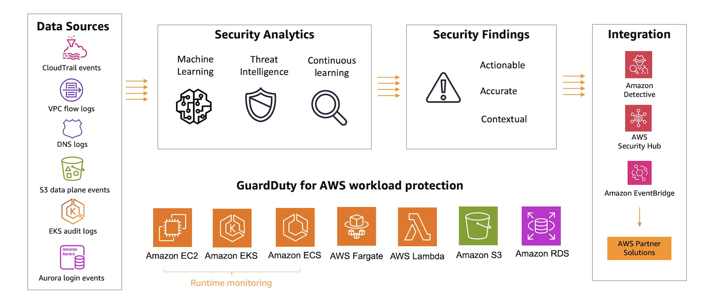
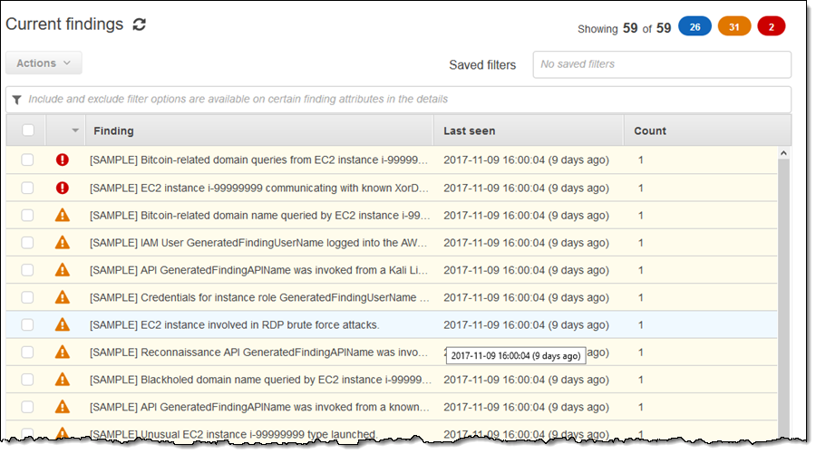
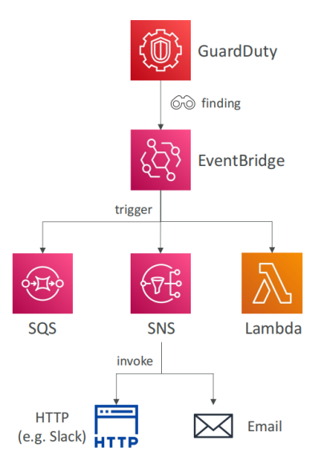
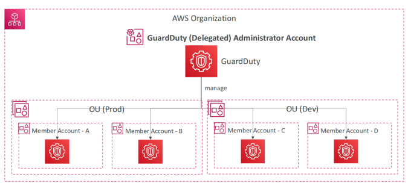

# Amazon GuardDuty

## 1. Introduction

Amazon GuardDuty is engineered to provide intelligent threat discovery across your AWS accounts. By leveraging advanced techniques, including machine learning and anomaly detection, GuardDuty automatically identifies potential security issues, thereby allowing organizations to respond quickly to threats. It operates without the need to install additional software, and users can enable it with just a single click. A 30-day trial period gives organizations the opportunity to explore its capabilities risk-free, ensuring that their cloud environments are continuously monitored against emerging threats.

## 2. Key Features and Capabilities

### 2.1. Machine Learning and Threat Detection

At the core of GuardDuty’s intelligence is its machine learning algorithm, which, along with sophisticated anomaly detection, empowers the service to discern normal activity from potential threats. GuardDuty continuously learns from historical data, adapting its models to detect deviations and suspicious patterns. Moreover, it integrates third-party threat intelligence, which enriches its ability to detect a wide spectrum of malicious activities—from subtle anomalies to overt intrusion attempts.

### 2.2. Data Sources Analyzed by GuardDuty

GuardDuty is designed to ingest and analyze data from multiple AWS sources, providing a broad view of activity within your environment. Key data sources include:

- **CloudTrail Logs:** GuardDuty monitors event logs to identify unusual API calls and unauthorized deployments.
- **Management and Data Events:** It examines management events (e.g., creating a VPC subnet) and data events (e.g., S3 object operations such as get, list, or delete) to detect irregular activities.
- **VPC Flow Logs:** The service reviews network flow logs to identify anomalous internet traffic patterns and unusual IP addresses.
- **DNS Logs:** By analyzing DNS queries, especially those that involve encoded data transmission from EC2 instances, GuardDuty can flag compromised instances.
- **Optional Data Sources:** Beyond the core inputs, GuardDuty can also analyze EKS audit logs, RDS and Aurora login events, EBS volume activity, Lambda network activity, and additional S3 data events. This extensibility ensures that as new data sources emerge, GuardDuty remains capable of delivering comprehensive security insights.

### 2.3. One-Click Activation and Trial Period

One of the significant benefits of GuardDuty is its ease of deployment. Activating the service requires only a single click, making it straightforward to integrate into existing AWS environments. Once enabled, users benefit from an immediate 30-day trial period, during which they can evaluate its functionality without commitment. This streamlined onboarding process, combined with the absence of required software installations, underscores GuardDuty’s design for rapid deployment and immediate operational insight.

## 3. Findings in GuardDuty

GuardDuty generates security findings that serve as actionable alerts when suspicious behavior is detected. These findings are pivotal in alerting security teams to potential risks and facilitating timely remediation.

### 3.1. Types of Findings

GuardDuty produces a diverse array of findings that cover various threat scenarios:

- **EC2 Findings:** These include unauthorized access attempts such as SSH brute force attacks and cryptocurrency mining activities targeting EC2 instances.
- **IAM Findings:** Indicators such as users disabling CloudTrail logging or misuse of root credentials are flagged to highlight potential insider threats or compromised accounts.
- **Kubernetes Findings:** The service monitors for anomalous access to Kubernetes credentials, particularly from suspicious IP addresses.
- **S3 Findings:** GuardDuty may identify insecure configurations, such as public access being inadvertently enabled on S3 buckets, or detect penetration testing activities.
- **Other Findings:** In addition to the above, GuardDuty supports generating sample findings, which are used to validate automated responses and ensure that the system’s detection capabilities are functioning as intended.

### 3.2. Severity Levels and Naming Conventions

Each finding generated by GuardDuty is assigned a severity score—ranging from low to high (with numerical values that might range, for example, from 0.1 to over 8)—which helps prioritize responses based on the potential impact. Additionally, GuardDuty utilizes a structured naming convention that includes:

- **ThreatPurpose:** Denotes the primary intent behind the detected threat.
- **ResourceTypeAffected:** Indicates which AWS resource (e.g., EC2, S3) is impacted.
- **Family Name:** Refers to the threat’s classification, such as anomalies in network port behavior.
- **DetectionMechanism:** Specifies the method by which the threat was detected (e.g., TCP, UDP).
- **Artifact:** Highlights the specific component involved in the malicious activity (e.g., DNS queries).

This systematic approach to naming and severity classification helps security teams quickly interpret findings and determine the necessary remediation actions.

### 3.3. Generating and Testing Sample Findings

To ensure that security automation workflows are effective, GuardDuty allows administrators to generate sample findings. This feature is particularly useful in validating the integration of GuardDuty with automated response mechanisms. By simulating real-world scenarios, security teams can test notifications, verify that remediation actions are triggered correctly, and adjust configurations before a genuine threat is encountered.

## 4. Integration with EventBridge

GuardDuty is tightly integrated with Amazon EventBridge. When a finding is detected, GuardDuty automatically sends an event to EventBridge. This integration facilitates real-time alerting and can trigger automated workflows. EventBridge’s robust rule engine allows organizations to define specific criteria and route these events to various AWS services, ensuring that security alerts are both timely and appropriately disseminated.

Building on the EventBridge integration, organizations can set up automated responses using AWS Lambda and Simple Notification Service (SNS). For example:

- **Lambda Functions:** When triggered by a GuardDuty event via EventBridge, a Lambda function can automatically update network ACLs or create Web ACLs through AWS WAF to block malicious IP addresses.
- **SNS Notifications:** Simultaneously, SNS can be configured to send email notifications or invoke HTTP endpoints, ensuring that security operators receive real-time updates about potential threats.

These integrations provide a robust mechanism for not only detecting threats but also initiating prompt, automated responses that mitigate risks before they can escalate.

## 5. Advanced GuardDuty Configurations

Advanced configurations in GuardDuty allow organizations to tailor threat detection and response strategies to their specific security posture. These configurations include multi-account management, region-wide enablement, and fine-tuning of detection parameters.

### 5.1. Managing Trusted IP Lists and Threat Lists

GuardDuty supports the configuration of both trusted IP lists and threat IP lists:

- **Trusted IP Lists:** Administrators can define lists of IP addresses and CIDR ranges that are considered safe. When traffic originates from these trusted sources, GuardDuty suppresses findings to reduce false positives—this is particularly useful during routine testing or when known, benign traffic is present.
- **Threat IP Lists:** Conversely, threat IP lists contain known malicious IP addresses. These lists can be sourced from third-party intelligence providers or created manually. Any access attempt from an IP address in the threat list will trigger a finding, enabling rapid identification and response to potential attacks.

### 5.2. Suppression Rules and Archiving Findings

To manage the volume of alerts and focus on high-priority threats, GuardDuty offers suppression rules. These rules allow security teams to automatically filter and archive findings based on specific criteria, such as:

- **Finding Type:** Entire categories of findings can be suppressed if they are deemed low value or if they have been previously reviewed as false positives.
- **Granular Criteria:** Suppression can also be applied to findings from specific resources (e.g., a particular EC2 instance), thereby reducing noise without losing critical security data.

Suppressed findings are not forwarded to downstream services like Security Hub, Amazon S3, or Amazon Detective, although they remain accessible in the GuardDuty archive for future reference.

### 5.3. Multi-Account Management and Delegated Administration

For organizations with multiple AWS accounts, GuardDuty provides robust multi-account management capabilities. Through AWS Organizations, an administrator account can centrally manage and monitor security findings across all member accounts. Key aspects include:

- **Centralized Administration:** The primary administrator account sends invitations to member accounts, enabling centralized oversight of GuardDuty findings.
- **Delegated Administration:** GuardDuty’s delegated administrator feature allows a member account to assume administrative responsibilities, providing flexibility in managing security across complex organizational structures.
- **Bi-Directional Findings Propagation:** In a multi-account setup, findings are published in both the member accounts and the administrator account, ensuring comprehensive visibility and coordinated response efforts.

### 5.4. Enabling GuardDuty Across All AWS Regions

As a best practice, it is advisable to enable GuardDuty in all AWS regions—even in those regions that are not actively used. This proactive approach ensures that potential attacks originating from any region are detected promptly, safeguarding the organization against threats that might target less monitored areas of the AWS environment.

### 5.5. Event Propagation in Multi-Account Environments

In multi-account environments, the propagation of events and findings is a critical feature. When GuardDuty is used with delegated or centralized administration, security findings are simultaneously published to both the administrator and member accounts. This dual publication mechanism ensures that all stakeholders are aware of security events, enabling a coordinated and efficient response across the organization.

## 6. Conclusion

Amazon GuardDuty is a robust and versatile threat detection service that provides continuous monitoring and intelligent analysis of AWS environments. By leveraging machine learning, anomaly detection, and an extensive array of data sources—from CloudTrail and VPC flow logs to DNS and optional logs such as EKS and RDS—GuardDuty offers comprehensive protection against a wide range of threats. Its seamless integration with AWS services like EventBridge, Lambda, and SNS enables automated, rapid responses to security events, while advanced configurations such as trusted IP lists, threat lists, suppression rules, and multi-account management allow organizations to fine-tune their security posture. Ultimately, by enabling GuardDuty across all regions, organizations can ensure that they are well-prepared to detect and respond to attacks wherever they may originate, maintaining a strong security stance in an increasingly complex threat landscape.