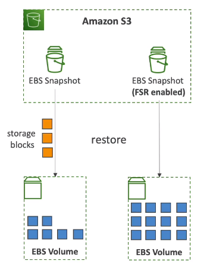

# Amazon Elastic Block Storage (EBS)

## 1. Introduction

Amazon Web Services (AWS) has revolutionized the way organizations manage computing and storage resources in the cloud. Among its suite of services, Amazon Elastic Block Store (EBS) stands out as a fundamental building block for data persistence, performance optimization, and operational resilience when working with Amazon EC2 instances.

In this chapter, we introduce EBS by reviewing its essential characteristics as a network drive and persistent storage medium. We discuss the primary motivations for using EBS—including its capability to retain data even after an EC2 instance is terminated, its use as a boot volume, and the benefits of its flexibility for dynamic scaling. As you progress through this chapter, you will gain insights into how EBS volumes operate, the architectural design that underpins them, and the ways in which AWS customers can leverage EBS to meet diverse workload requirements.

## 2. Definition and Basic Concepts

### 2.1. EBS as Network Drives

At its core, an EBS volume is a block storage device that exists independently of the physical hardware hosting your EC2 instances. Unlike local disks, which are physically attached to a server, EBS volumes are “network drives” that are accessed over the AWS internal network. This conceptualization is similar to the idea of a USB stick that you might unplug from one computer and attach to another—but with the critical distinction that the connection is mediated by a high-performance, low-latency network.

Because EBS volumes are accessed remotely, there is a non-zero network latency associated with I/O operations. However, AWS has engineered the service to minimize these delays, ensuring that many workloads experience performance comparable to locally attached storage. This network-based approach also enables several key capabilities, including the ability to detach an EBS volume from one instance and reattach it to another in a matter of seconds. This flexibility is a foundational characteristic that supports dynamic scaling, failover, and recovery strategies in cloud environments.

### 2.2. Relationship to EC2 Instances

EBS volumes are intrinsically linked to EC2 instances, yet they maintain a level of independence that distinguishes them from ephemeral instance storage. When you launch an EC2 instance, you can attach one or more EBS volumes to provide the necessary storage for operating system files, applications, logs, and other data. Notably, while an EC2 instance has a local instance store that may provide temporary storage, EBS is the primary solution for persistent storage in AWS.

### 2.3. Persistence and Data Management

One of the defining features of EBS is its persistence. Data stored on an EBS volume remains intact even when the EC2 instance to which it is attached is terminated. This persistent nature makes EBS ideal for applications where data durability is paramount. In many scenarios, an EC2 instance may be short-lived—recreated or replaced as part of an auto-scaling group, or during software updates—but the underlying EBS volume retains the state, allowing you to rebuild your environment without losing critical information.

The persistence of EBS volumes provides significant benefits in data management, including:

- **Durability:** Data is redundantly stored within an Availability Zone (AZ) to protect against component failures.
- **Stateful Applications:** Workloads that require stateful data (such as databases or file systems) can reliably use EBS without the need for constant replication to external systems.
- **Recovery and Reprovisioning:** After an EC2 instance is terminated, the same EBS volume can be reattached to a new instance, allowing for seamless recovery of applications and data continuity.

## 3. EBS Architecture and Technical Details

### 3.1. Network Drive Characteristics

As a network drive, an EBS volume is not physically co-located with the EC2 instance that uses it. Instead, the volume is a managed resource in AWS’s highly redundant storage infrastructure within a specific Availability Zone. This design offers several advantages:

- **Flexibility:** Volumes can be created, attached, detached, and moved (via snapshots) without regard to the physical server hardware.
- **Scalability:** AWS can scale storage independently of compute resources, allowing users to provision the exact storage capacity and performance they need.
- **Fault Tolerance:** Data is automatically replicated within an Availability Zone to guard against hardware failures.

However, using a network drive introduces considerations such as network latency. While the AWS network is optimized for high throughput and low latency, applications with extremely latency-sensitive operations must be designed to account for the slight delay inherent in any network transfer. AWS continuously refines its internal networking protocols to ensure that even workloads requiring rapid I/O operations receive performance comparable to that of locally attached disks.

### 3.2. Availability Zone Constraints

Every EBS volume is bound to a specific Availability Zone (AZ) within a region. This binding has critical operational implications:

- **Zone Affinity:** An EBS volume created in one AZ (for example, us-east-1a) cannot be directly attached to an EC2 instance located in a different AZ (such as us-east-1b). This design helps ensure high availability and data redundancy within the zone.
- **Data Movement:** To use an EBS volume’s data in another AZ, you must first create a snapshot of the volume. Snapshots are stored in Amazon S3 and can be used to recreate a new EBS volume in a different AZ or region.
- **Operational Planning:** When designing highly available architectures, it is essential to plan for the zone-specific nature of EBS volumes. You might maintain separate volumes in each AZ or use snapshots to propagate data across zones in the event of an outage.

These constraints underscore the need for robust architectural planning, particularly for applications requiring high availability across multiple zones or regions.

### 3.3. Provisioning Capacity and Performance

When provisioning an EBS volume, you must specify two key parameters: the storage capacity (in gigabytes or terabytes) and the performance characteristics, typically measured in I/O operations per second (IOPS) and throughput. This provisioning model means that you need to plan in advance for both the size of the data you intend to store and the performance requirements of your applications.

There are several factors to consider:

- **Capacity Planning:** Since EBS volumes are “pre-provisioned” resources, you must declare the amount of storage you need at creation time. While volumes can be resized later (a topic discussed in detail in Section 4), the initial provisioning step sets the baseline for available storage.
- **Performance Tuning:** Different EBS volume types offer varying performance profiles. For instance, with general purpose SSD (gp2/gp3) volumes, the IOPS and throughput are generally balanced for cost-effective performance, while provisioned IOPS volumes (io1/io2) offer high, consistent performance for demanding workloads.
- **Billing Implications:** AWS bills EBS volumes based on the provisioned capacity and performance parameters. This means that there is a direct cost association with both the size of the volume and the level of IOPS you require. Optimizing this balance is critical for maintaining both performance and cost efficiency.

### 3.4. Attachment and Detachment Process

Attaching an EBS volume to an EC2 instance is a dynamic operation that provides significant operational flexibility. The process involves:

- **Volume Creation:** When you create an EBS volume, you specify the AZ, capacity, and performance characteristics. The volume exists independently until it is attached to an instance.
- **Attachment:** Once attached, the EC2 instance can access the volume as if it were a local disk. 
- **Detachment:** Volumes can be detached from an instance without interrupting the volume’s data persistence. This is particularly useful during instance replacement or when implementing failover strategies. During the detachment phase, the operating system must ensure that all I/O operations have been gracefully terminated to avoid data corruption.

## 4. EBS Volume Management

### 4.1. Delete on Termination Attribute

One of the key features provided during EBS volume creation is the “Delete on Termination” (DOT) attribute. This attribute determines whether an EBS volume is automatically deleted when its associated EC2 instance is terminated. The default behavior typically varies between the root volume and additional attached volumes:

- **Root Volume:** By default, the root volume is configured to be deleted upon instance termination. This ensures that temporary instance-specific data does not linger in your account after the instance is shut down.
- **Additional Volumes:** For non-root, attached EBS volumes, the default setting is to retain the volume after instance termination. This is particularly useful for preserving data that might be shared between different instances or that requires longer-term retention.

Administrators can modify this behavior at launch time or after the instance is running. For example, if you wish to preserve the operating system state or critical log files even after an instance is terminated, you can disable the DOT attribute on the root volume. Understanding and configuring the DOT attribute correctly is essential not only for meeting data retention requirements but also for controlling cost, as unwanted volumes can result in unexpected charges.

### 4.2. EBS Volume Resizing

EBS volumes offer the flexibility to be resized as your storage and performance needs change. Resizing an EBS volume involves two primary steps:

1. **Modifying the Volume:** Through the AWS Management Console, CLI, or API, you can modify the volume’s size (and in some cases, performance parameters such as IOPS). When a volume is modified, it transitions through several states, including a “modifying” phase where the new parameters are applied and an “optimizing” phase during which the volume’s data blocks are reorganized.
2. **Repartitioning the File System:** After the volume’s capacity is increased, the underlying partition on the operating system may not automatically extend to fill the new space. Administrators must then perform a file system expansion or repartitioning operation (using tools such as `growpart` on Linux or the Disk Management utility on Windows) to make the additional capacity available to applications.

It is important to note that while you can increase the size of an EBS volume, you cannot decrease it. If a reduction in capacity is needed, you must create a new, smaller volume and migrate your data accordingly.

### 4.4. Repartitioning After Resizing

Following a successful resize operation, the final—but critical—step is to ensure that the operating system recognizes the additional storage capacity. This typically involves:

- **Detecting the New Volume Size:** The operating system must be notified that the underlying disk has grown. On Linux, this may involve using tools such as `lsblk` or `fdisk` to confirm the new disk size.
- **Extending the Partition:** Using partitioning tools, the administrator extends the existing partition to occupy the newly available space. For Linux systems, the `growpart` command is commonly used for this purpose.
- **Expanding the File System:** Once the partition is extended, the file system itself must be resized to fill the partition. On Linux, commands such as `resize2fs` (for ext filesystems) or `xfs_growfs` (for XFS) are used. On Windows, the Disk Management utility performs a similar role.

Completing these steps ensures that your EC2 instance can fully leverage the new capacity, preventing scenarios where a resized volume appears larger at the storage layer but remains underutilized due to an unextended file system.

## 5. EBS Volume Types

Amazon EBS offers a range of volume types, each engineered to address specific workload requirements—from cost-effective general-purpose storage to high-performance, mission-critical environments. In this section, we delve into the characteristics of each volume type, their typical use cases, and the critical factors that should guide your selection.

### 5.1. General Purpose SSD (gp2, gp3)

General purpose SSD volumes, available as gp2 and gp3, are designed to provide a balanced combination of price and performance for a wide variety of workloads. These volumes are often the default choice for applications requiring low latency and consistent performance without incurring the premium costs of high-end storage solutions.

- **GP2 Volumes:** Traditionally, gp2 volumes link performance (IOPS) directly with the size of the volume. As the volume size increases, so does the baseline performance, with the ability to burst to higher IOPS for short durations. This model is ideal for workloads where moderate performance scaling is acceptable as storage needs grow.
- **GP3 Volumes:** As a newer generation, gp3 volumes decouple IOPS and throughput from volume size. This separation allows you to independently configure performance parameters, providing greater flexibility and cost control. With gp3, a baseline of 3,000 IOPS and 125 MB/s of throughput is provided, with the option to scale up to 16,000 IOPS and 1,000 MB/s as required.

For most general-purpose applications—ranging from development and test environments to production workloads where cost efficiency is a key factor—these SSD volumes offer an optimal balance between performance and price.

### 5.2. Provisioned IOPS SSD (io1, io2)

For applications that demand consistently high I/O performance, such as high-transaction databases or latency-sensitive enterprise applications, provisioned IOPS SSD volumes (io1 and io2) are the preferred choice. These volumes are engineered to deliver predictable, high-performance storage by allowing you to specify the exact IOPS you require.

- **IO1 Volumes:** These volumes offer the ability to provision IOPS independently from storage size, making them suitable for workloads that require sustained, high IOPS beyond what is available with gp2 or gp3 volumes. With support for up to 64,000 IOPS (in certain configurations), io1 volumes are designed for mission-critical systems.
- **IO2 Volumes:** An enhancement over io1, io2 volumes (including the IO2 Block Express variant) further extend performance and scalability. They can support even larger capacities (up to 64 TB) and provide sub-millisecond latency with maximum IOPS reaching up to 256,000 in some configurations. IO2 volumes also benefit from improved durability and multi-attach capabilities for clustered environments.

These volumes are ideally suited for critical database applications, large-scale transactional systems, and workloads that cannot tolerate performance variability.

### 5.3. Throughput Optimized HDD (st1)

For workloads that prioritize throughput over IOPS, such as big data applications, log processing, and data warehousing, Throughput Optimized HDD volumes (st1) provide a cost-effective solution. St1 volumes are designed to deliver high sequential throughput while maintaining a lower cost per gigabyte compared to SSD-based options.

- **Key Characteristics:** St1 volumes typically offer a maximum throughput of up to 500 MB/s and are well-suited for scenarios where large, sequential data transfers are common.
- **Use Cases:** Applications that involve streaming large volumes of data—such as batch processing systems and log aggregation platforms—can benefit from the cost-effective performance provided by st1 volumes.

### 5.4. Cold HDD (sc1)

Cold HDD volumes (sc1) are designed for infrequently accessed workloads where cost minimization is the primary concern. These volumes are ideal for archival data, backup storage, and other scenarios where high performance is not required.

- **Key Characteristics:** With a maximum throughput of around 250 MB/s and lower IOPS compared to st1 volumes, sc1 volumes are optimized for storage cost rather than performance.
- **Use Cases:** Scenarios such as long-term data archiving, infrequently accessed backups, and historical data storage are well-suited to the sc1 volume type. The trade-off for cost savings is that data retrieval may involve higher latency.

### 5.5. Volume Comparison

| Feature                            | io2 Block Express                                                                                                   | io1                                        | gp3                                                                                                | gp2                                  | st1                                       | sc1                              |
| ---------------------------------- | ------------------------------------------------------------------------------------------------------------------- | ------------------------------------------ | -------------------------------------------------------------------------------------------------- | ------------------------------------ | ----------------------------------------- | -------------------------------- |
| **Volume Type**                    | Provisioned IOPS SSD                                                                                                | Provisioned IOPS SSD                       | General Purpose SSD                                                                                | General Purpose SSD                  | Throughput Optimized HDD                  | Cold HDD                         |
| **Best For**                       | Business-critical latency-sensitive applications                                                                    | Latency-sensitive transactional workloads  | Wide variety of transactional workloads                                                            | Boot volumes, interactive apps       | Throughput-intensive workloads            | Less frequently accessed data    |
| **Use Cases**                      | I/O-intensive NoSQL & relational databases                                                                          | I/O-intensive NoSQL & relational databases | Virtual desktops, medium databases                                                                 | Boot volumes, dev & test             | Big data, data warehouses, log processing | Colder data, fewer scans per day |
| **Volume Size**                    | 4 GB - 64 TB                                                                                                        | 4 GB - 16 TB                               | 1 GB - 16 TB                                                                                       | 1 GB - 16 TB                         | 125 GB - 16 TB                            | 125 GB - 16 TB                   |
| **Durability**                     | 99.999%                                                                                                             | 99.8% - 99.9%                              | 99.8% - 99.9%                                                                                      | 99.8% - 99.9%                        | 99.8% - 99.9%                             | 99.8% - 99.9%                    |
| **Latency**                        | Sub-millisecond                                                                                                     | Single-digit millisecond                   | Single-digit millisecond                                                                           | Single-digit millisecond             | N/A                                       | N/A                              |
| **Max IOPS/Volume**                | 256,000                                                                                                             | 64,000                                     | 16,000                                                                                             | 16,000                               | 500                                       | 250                              |
| **Max Throughput/Volume**          | 4,000 MB/s                                                                                                          | 1,000 MB/s                                 | 1,000 MB/s                                                                                         | 250 MB/s                             | 500 MB/s                                  | 250 MB/s                         |
| **Max IOPS/Instance**              | 420,000                                                                                                             | 420,000                                    | 260,000                                                                                            | 260,000                              | N/A                                       | N/A                              |
| **Max Throughput/Instance**        | 12,500 MB/s                                                                                                         | 12,500 MB/s                                | 12,500 MB/s                                                                                        | 7,500 MB/s                           | 12,500 MB/s                               | 7,500 MB/s                       |
| **IOPS/GB**                        | 1,000 IOPS/GB                                                                                                       | 50 IOPS/GB                                 | N/A                                                                                                | 3 IOPS/GB (baseline)                 | N/A                                       | N/A                              |
| **Baseline Throughput**            | N/A                                                                                                                 | N/A                                        | 125 MB/s                                                                                           | N/A                                  | 40 MB/s per TB                            | 12 MB/s per TB                   |
| **Burst Capability**               | N/A                                                                                                                 | N/A                                        | N/A                                                                                                | Up to 3,000 IOPS (for volumes < 1TB) | 250 MB/s per TB                           | 80 MB/s per TB                   |
| **Price (Storage)**                | $0.125/GB-month                                                                                                     | $0.125/GB-month                            | $0.08/GB-month                                                                                     | $0.10/GB-month                       | $0.045/GB-month                           | $0.015/GB-month                  |
| **Price (Performance)**            | Tiered: \n- $0.065/IOPS-month up to 32K IOPS\n- $0.046/IOPS-month 32K-64K IOPS\n- $0.032/IOPS-month >64K IOPS | $0.065/provisioned IOPS-month              | - 3,000 IOPS free\n- $0.005/IOPS-month over 3K\n- 125 MB/s free\n- $0.04/MB/s-month over 125 | Included                             | Included                                  | Included                         |
| **Dominant Performance Attribute** | IOPS, throughput, latency, capacity, durability                                                                     | IOPS                                       | $/IOPS                                                                                             | IOPS                                 | MB/s                                      | MB/s                             |

## 6. Multi-Attach Capability

One of the more sophisticated features offered by Amazon EBS is the Multi-Attach capability. Traditionally, an EBS volume is restricted to a single EC2 instance at any one time. However, with multi-attach, certain high-performance volumes (specifically from the io1 and io2 families) can be concurrently attached to up to 16 EC2 instances within the same Availability Zone.

- **Functionality:** Multi-Attach allows multiple EC2 instances to have simultaneous, read/write access to a single EBS volume. This capability is particularly beneficial in clustered environments where a shared data store is necessary.
- **Operational Advantages:** By enabling multi-attach, organizations can enhance application availability and facilitate distributed data processing. For example, in a clustered Linux environment running a shared database or file system, multi-attach minimizes downtime by allowing multiple nodes to access the same storage concurrently.

### 6.1. Use Cases for Multi-Attach

Multi-Attach is primarily intended for scenarios where high availability and concurrent data access are critical. Common use cases include:

- **Clustered File Systems:** Applications that require a distributed file system to support multiple clients concurrently—such as clustered database systems or shared file storage for container orchestration platforms—benefit from multi-attach.
- **High Availability Architectures:** In environments where failover speed is essential, multi-attach ensures that if one instance fails, others can immediately take over access to the critical data stored on the shared volume.
- **Distributed Applications:** Workloads that involve concurrent data processing across multiple nodes, such as big data analytics or large-scale simulation environments, can leverage multi-attach to reduce data duplication and improve performance.

### 6.2. Limitations and Requirements

While the multi-attach feature opens up many possibilities, it also comes with important limitations and prerequisites:

- **Volume Type Restriction:** Multi-attach is only available for io1 and io2 volumes. General purpose and HDD volumes do not support this feature.
- **Availability Zone Constraint:** All EC2 instances attached to a multi-attach volume must reside within the same Availability Zone.
- **Instance Limit:** A maximum of 16 EC2 instances can be simultaneously attached to a single multi-attach volume.

### 6.3. File System Considerations

When implementing multi-attach or any advanced volume management strategy, it is essential to choose a file system that can handle concurrent read/write operations from multiple sources. Cluster-aware file systems are designed to manage access from multiple nodes, providing:

- **Data Integrity:** Ensuring that concurrent operations do not lead to data corruption.
- **Locking Mechanisms:** Coordinating access to shared data through distributed locking or journaling.
- **Scalability:** Efficiently managing metadata and data distribution across nodes.

The choice of file system becomes even more critical when performance and reliability are paramount, as is often the case in mission-critical applications.

## 7. EBS Snapshots

### 7.1. Creating and Managing Snapshots

An EBS Snapshot is a point-in-time backup of an EBS volume. Snapshots are stored in Amazon S3 and can be used to create new EBS volumes. Key features include:

- **Non-Disruptive Backups:** Snapshots can be taken while the volume is attached and in use. Although detaching the volume is recommended to ensure consistency, AWS supports live snapshots.
- **Incremental Backups:** After the initial snapshot, subsequent snapshots are incremental—only the data blocks that have changed since the last snapshot are saved. This approach optimizes storage costs and reduces backup times.
- **Automation and Scheduling:** AWS provides APIs and tools to automate the creation and management of snapshots, enabling regular backups and compliance with data retention policies.

### 7.2. Cross-AZ and Cross-Region Capabilities

One of the significant benefits of EBS Snapshots is their portability. Unlike EBS volumes, which are confined to a single Availability Zone, snapshots are stored in S3 and can be used to create volumes in any AZ or even in a different AWS region. This flexibility supports:

- **Disaster Recovery:** In the event of an AZ outage, snapshots allow you to quickly restore data in another AZ or region.
- **Geographic Replication:** Organizations can replicate critical data across regions for regulatory compliance or to improve access latency for globally distributed applications.
- **Operational Flexibility:** Snapshots decouple the storage of data from the physical infrastructure, enabling dynamic provisioning of volumes where and when they are needed.

### 7.3. EBS Snapshot Archive

To further optimize costs, AWS offers an archive tier for EBS Snapshots. By moving less frequently accessed snapshots to an archive tier, you can reduce storage costs by up to 75%. However, there are trade-offs:

- **Restoration Latency:** Snapshots in the archive tier may take between 24 to 72 hours to restore fully.
- **Use Case Considerations:** This tier is ideal for long-term archival of data that is rarely restored, such as historical logs or regulatory backups.

### 7.4. Recycle Bin for Snapshots

Accidental deletion of snapshots can have significant consequences. To mitigate this risk, AWS provides a Recycle Bin feature for snapshots:

- **Protection Against Accidental Deletion:** Deleted snapshots are moved to the Recycle Bin rather than being immediately purged.
- **Configurable Retention:** The retention period for snapshots in the Recycle Bin can be configured—from as short as one day to as long as one year—providing a safety net for critical data.
- **Operational Recovery:** Administrators can restore snapshots from the Recycle Bin if deletion was inadvertent, ensuring continuity in backup strategies.

### 7.5. Fast Snapshot Restore

Fast Snapshot Restore (FSR) in Amazon EBS is a feature that allows you to create volumes from snapshots that are fully initialized at creation. This means they deliver full performance immediately, without the performance impact or latency of the standard initialization process.

When you create a normal EBS volume from a snapshot, the data is loaded lazily from Amazon S3 - blocks are pulled down only when they're first accessed. This causes a "first-access penalty" where I/O operations might experience higher latency until all blocks are loaded.

With Fast Snapshot Restore enabled:

- Volumes are fully initialized at creation time
- There's no performance impact when accessing data for the first time
- Applications can achieve full performance immediately, without waiting for data to be loaded

FSR is particularly valuable for:

- Boot volumes, where fast instance launches are required
- Database workloads that need consistent performance
- Disaster recovery scenarios where rapid recovery is critical

FSR is configured per snapshot and Availability Zone, with pricing typically based on FSR-enabled capacity minutes. There are also limits on how many volumes can be created with the FSR benefit concurrently.

## 8. Performance Optimization

Achieving optimal performance from EBS involves carefully balancing IOPS, throughput, volume size, and cost. In this section, we explore strategies for performance optimization, including IOPS management, throughput considerations, guidelines for volume selection, and performance monitoring best practices.

### 8.1. IOPS Management

I/O operations per second (IOPS) is a critical performance metric for many applications, especially those involving databases and transaction processing. Effective IOPS management includes:

- **Provisioning Sufficient IOPS:** For mission-critical workloads, use provisioned IOPS volumes (io1/io2) to guarantee the performance needed. With gp3 volumes, you have the flexibility to configure IOPS independently, enabling you to fine-tune performance.
- **Monitoring IOPS Utilization:** Regularly track IOPS usage to ensure that your volume’s performance remains within the expected thresholds. AWS CloudWatch and other monitoring tools can provide insights into IOPS trends and help detect bottlenecks.
- **Balancing Performance and Cost:** Since IOPS directly influence billing, it is important to provision only what is necessary. Adjust performance parameters dynamically to match workload patterns, thereby optimizing costs.

### 8.2. Throughput Considerations

Throughput—measured in megabytes per second (MB/s)—is another essential factor, particularly for workloads involving large sequential data transfers:

- **Selecting the Appropriate Volume Type:** Workloads that require high throughput, such as data warehousing and media streaming, should consider st1 volumes (for throughput-optimized HDD) or gp3 volumes with independently configurable throughput settings.
- **Optimizing Workload Patterns:** Design applications to maximize sequential I/O, which can often achieve higher throughput compared to random I/O operations.
- **Utilizing Burst Capabilities:** Some volume types (like gp2) offer burst performance for short periods. Understand the burst mechanics and design your application to handle peak and baseline performance requirements effectively.

### 8.3. Volume Selection Guidelines

Choosing the right EBS volume type for your workload is crucial for achieving a balance between cost, performance, and reliability. Here are key guidelines:

- **Assess Your Workload Requirements:** Understand whether your workload is IOPS-bound, throughput-bound, or a mix of both. For instance, transactional databases might require high IOPS, while large file transfers benefit from high throughput.
- **Consider Future Growth:** Select a volume type that can scale as your data grows. With gp3 volumes, you can adjust performance parameters without needing to resize the volume.
- **Review Cost Implications:** Compare the cost per gigabyte and per provisioned IOPS across volume types. In many cases, a slightly more expensive volume that meets performance needs can reduce overall costs by avoiding performance bottlenecks.

### 8.4. Performance Monitoring

Consistent performance monitoring is key to maintaining a healthy EBS environment:

- **Utilize AWS Monitoring Tools:** AWS CloudWatch provides metrics such as IOPS, throughput, latency, and burst balance for EBS volumes. Setting up alarms and dashboards can alert you to performance issues before they impact applications.
- **Implement Regular Reviews:** Schedule periodic reviews of volume performance and usage patterns. This proactive approach allows you to make adjustments in advance of anticipated performance degradation.
- **Benchmarking and Testing:** Conduct regular performance tests, especially after significant changes (like resizing or switching volume types), to ensure that the system meets the required service level objectives.

## 9. Conclusion

Amazon EBS remains a foundational service within AWS, providing the scalability, durability, and performance required by modern applications. By understanding the technical details, architectural constraints, and advanced features described in this chapter, you are better equipped to design, deploy, and manage robust storage solutions in the AWS cloud.