# Amazon S3
## 1. Introduction

Amazon Simple Storage Service (Amazon S3) is a highly scalable, durable, and secure object storage service used by organizations worldwide as a backbone for a broad array of applications—from backup and archival to hosting static websites and building data lakes. In this chapter, we introduce the fundamental concepts, features, and architectural principles of Amazon S3 that form the basis for its widespread adoption in both production environments and certification exams.

## 2. S3 Fundamentals

### 2.1. Key Features and Benefits

AWS S3 offers several features that make it a preferred choice for object storage:

- **Durability and Reliability:**  
    All objects stored in S3 benefit from an extraordinary durability rating of 99.999999999% (11 nines). This means that even if you store millions of objects, the expected loss is statistically negligible over many millennia.
    
- **Scalability and Performance:**  
    S3 automatically scales to handle high request rates, with performance designed to support thousands of requests per second per prefix. The service is optimized for low latency and high throughput, making it suitable for a wide range of workloads—from frequently accessed applications to archival storage.
    
- **Cost-Effective Storage:**  
    With its pay-as-you-go pricing model and various storage classes, S3 enables you to match performance and cost with your data access patterns. Lifecycle policies further help in automating transitions between classes to optimize costs over time.
    
- **Ease of Integration:**  
    S3 is accessed via a simple web services interface (RESTful APIs) and integrates seamlessly with other AWS services. This facilitates advanced workflows such as event-driven processing (using Lambda) and secure content delivery (with CloudFront).
    
- **Security and Compliance:**  
    Built with security in mind, S3 supports features such as bucket policies, encryption (both in transit and at rest), and access control mechanisms that help meet stringent compliance requirements.

### 2.2. Buckets and Objects

At the heart of S3’s design are buckets and objects:

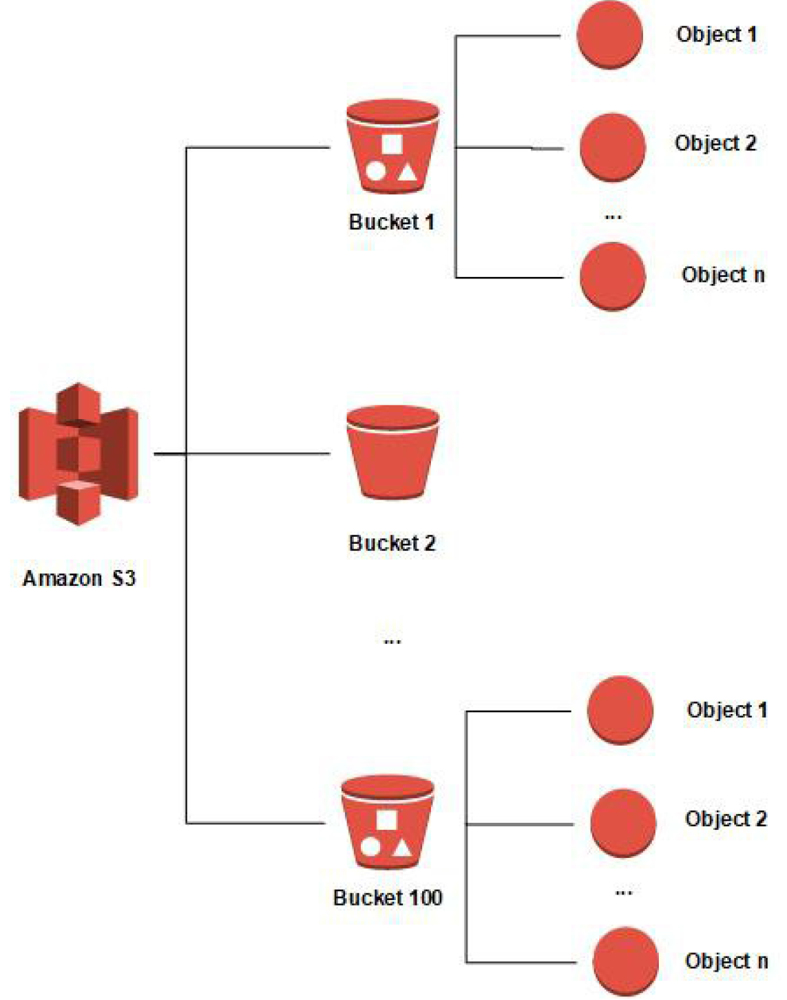

- **Buckets:**  
    A bucket is a top-level container in S3 that holds objects. Key characteristics include:
    - **Globally Unique Names:** Every bucket name must be unique across all AWS accounts and regions. This ensures that bucket names form a global namespace.
    - **Region-Specific Creation:** While bucket names are unique globally, each bucket is created in—and is associated with—a specific AWS region. This regional placement affects latency and regulatory compliance.
    - **Naming Conventions:** Bucket names must adhere to specific rules:
        - Length between 3 and 63 characters.
        - Only lowercase letters, numbers, and hyphens are allowed.
        - Names cannot be formatted as IP addresses.
- **Objects:**  
    An object is the fundamental entity stored in S3 and consists of the following:
    - **Data (Object Body):** The actual content of the file, which can be any type of data.
    - **Key:** A unique identifier for the object within the bucket. The key is essentially the full “path” to the object. Although S3 does not use a true hierarchical file system, the use of delimiters (typically the slash “/”) creates the appearance of folders.
    - **Metadata:** Objects come with system-defined metadata (e.g., Content-Type, Content-Length) and can also have user-defined metadata (custom key–value pairs).
    - **Maximum Object Size:** An individual object can be as large as 5 terabytes.

### 2.3. S3 Storage Classes

AWS S3 offers several storage classes tailored to different access patterns and cost requirements. Each class provides the same 11 nines of durability but differs in availability, retrieval time, and pricing:

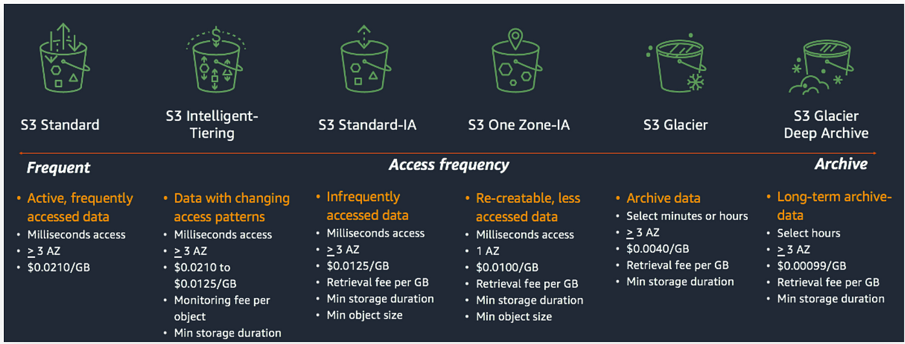

- **S3 Standard – General Purpose:**  
    Designed for frequently accessed data, it offers low latency and high throughput with a 99.99% availability SLA. Use cases include dynamic websites, mobile and gaming applications, and big data analytics.

- **S3 Intelligent-Tiering:**  
	This class automatically moves objects between tiers based on changing access patterns. It offers cost savings without performance impact by monitoring object usage and optimizing storage costs. A small monthly monitoring fee applies, but there are no retrieval charges.
    
- **S3 Standard-Infrequent Access (Standard-IA):**  
    Intended for data that is accessed less frequently but still requires rapid access when needed. It costs less to store compared to the Standard class; however, there is a retrieval fee. It is ideal for disaster recovery and backups, with a 99.9% availability SLA.
    
- **S3 One Zone-Infrequent Access (One Zone-IA):**  
    Similar to Standard-IA in terms of cost savings, but the data is stored in a single Availability Zone. This makes it less resilient to the failure of an entire zone (99.5% availability). It is suitable for secondary backups or easily reproducible data.
    
- **S3 Glacier Classes:**  
    These classes are optimized for long-term archival and backup:
    - **Glacier Instant Retrieval:** Provides millisecond retrieval times for data that is rarely accessed. It requires a minimum storage duration of 90 days.
    - **Glacier Flexible Retrieval:** Offers multiple retrieval options:
        - **Expedited:** Retrieval in 1–5 minutes.
        - **Standard:** Retrieval in 3–5 hours.
        - **Bulk:** Retrieval in 5–12 hours (with the lowest cost).
        - A minimum storage duration of 90 days is enforced.
    - **Glacier Deep Archive:** The lowest-cost storage option for data that is rarely accessed and can tolerate longer retrieval times—typically 12 to 48 hours—and has a minimum storage duration of 180 days.

### 2.4. S3 Object Tags & Metadata

Managing objects in S3 is enhanced through the use of metadata and tags:

- **Object Metadata:**  
    When you upload an object, you can include metadata, which consists of key–value pairs:
    - **System-Defined Metadata:** Automatically set by S3 (e.g., Content-Length, Content-Type).
    - **User-Defined Metadata:** Custom metadata that you specify. To distinguish these from system metadata, the keys must be prefixed with `x-amz-meta-`.  
        Metadata is useful for conveying information about an object (such as its origin, format, or custom attributes) that can be read along with the object.

- **Object Tags:**  
    Tags are additional key–value pairs that you can assign to an object. Unlike metadata, tags are intended for:
    - **Fine-Grained Access Control:** You can use tags to enforce bucket policies that restrict access based on tag values.
    - **Cost Allocation and Analytics:** Tags can help in categorizing and tracking storage costs or in grouping objects for analytics.
    - **Lifecycle Management:** Although tags can influence lifecycle rules, note that neither object metadata nor tags are inherently searchable within S3. To perform searches based on metadata or tags, you must maintain an external index (for example, using DynamoDB).

## **3. S3 Security Framework**

### 3.1. Block Public Access Settings

Block Public Access settings are an important safeguard against inadvertent data exposure. These settings are applied at both the bucket and account levels to override any bucket policy or ACL that might otherwise allow public access.

- **Purpose:**  
    They are designed to prevent data leaks by ensuring that even if a bucket policy is configured to grant public read or write access, the bucket remains private.
    
- **Configuration Options:**  
    You can enable or disable Block Public Access settings on an individual bucket basis, and administrators can enforce these settings across all buckets in an account.
    
- **Best Practice:**  
    For most sensitive data storage, it is recommended to keep these settings enabled to enforce a “default deny” posture for public access.

### 3.2. Bucket Policies

Bucket policies are JSON-based resource policies that allow you to define fine-grained access control at the bucket level. They are a core component of S3 security and are used to grant or restrict permissions based on various conditions.

#### Key Features of Bucket Policies

- **Resource Specification:**  
    Policies define the scope of access by specifying ARNs for buckets and objects (e.g., using `"arn:aws:s3:::example-bucket/*"` to refer to all objects).
    
- **Policy Effects:**  
    Statements within the policy can have an `"Effect"` of either `"Allow"` or `"Deny"`, determining whether the specified actions are permitted.
    
- **Conditions:**  
    Use condition keys such as `aws:SecureTransport` to enforce HTTPS, `aws:SourceIp` or `aws:SourceVpce` to restrict access by IP address or VPC endpoint, and other keys like `s3:x-amz-server-side-encryption` to enforce encryption upon upload.

#### Sample S3 Bucket Policies

Below are a few examples of common bucket policy patterns:

- **Force HTTPS for All Requests:**
    
    ```json
    {
        "Version": "2012-10-17",
        "Statement": [
            {
                "Sid": "DenyNonSecureTransport",
                "Effect": "Deny",
                "Principal": "*",
                "Action": "s3:*",
                "Resource": [
                    "arn:aws:s3:::example-bucket",
                    "arn:aws:s3:::example-bucket/*"
                ],
                "Condition": {
                    "Bool": {
                        "aws:SecureTransport": "false"
                    }
                }
            }
        ]
    }
    ```
    
- **Restrict Access to Specific IP Addresses:**
    
    ```json
    {
        "Version": "2012-10-17",
        "Statement": [
            {
                "Sid": "IPAllow",
                "Effect": "Allow",
                "Principal": "*",
                "Action": "s3:GetObject",
                "Resource": "arn:aws:s3:::example-bucket/*",
                "Condition": {
                    "IpAddress": {
                        "aws:SourceIp": "203.0.113.0/24"
                    }
                }
            }
        ]
    }
    ```
    
- **Enforce Use of a Specific KMS Key for SSE-KMS:**
    
    ```json
    {
        "Version": "2012-10-17",
        "Statement": [
            {
                "Sid": "EnforceKMSEncryption",
                "Effect": "Deny",
                "Principal": "*",
                "Action": "s3:PutObject",
                "Resource": "arn:aws:s3:::example-bucket/*",
                "Condition": {
                    "StringNotEquals": {
                        "s3:x-amz-server-side-encryption": "aws:kms"
                    }
                }
            }
        ]
    }
    ```

### 3.3. Authorization Evaluation Process

The authorization process in Amazon S3 involves evaluating multiple layers of policies to decide whether an S3 request should be allowed or denied. Understanding this process is crucial for troubleshooting access issues and designing secure architectures.

#### The Multi-Layered Evaluation

1. **User Context (IAM Policies):**  
    When a request is made, the IAM policies attached to the requesting principal (user or role) are first evaluated. These policies determine the baseline permissions for S3 operations.
    
2. **Bucket Context (Bucket Policies):**  
    Next, the bucket policy associated with the target bucket is evaluated. This policy can grant additional permissions or enforce restrictions (such as explicit denies) that override the user’s IAM policies.
    
3. **Object Context (Object ACLs):**  
    Finally, if the object is owned by a different account than the bucket owner, the object’s Access Control List (ACL) is evaluated. However, with the advent of bucket owner enforced settings, ACLs are often disabled to simplify the security model.

#### Additional Considerations

- **Explicit Deny:**  
    At any stage, if an explicit deny is encountered in any policy, the request is immediately rejected.
    
- **Bucket vs. Object-Level Permissions:**  
    Operations on the bucket (e.g., listing objects) differ from operations on objects (e.g., retrieving a file). Bucket policies must clearly delineate the resource scope (with or without a trailing `/*`) to reflect these differences.
    
- **Simplifying Authorization:**  
    AWS recommends using bucket policies and enforcing bucket owner controls to minimize complexity. This approach reduces reliance on ACLs and streamlines the evaluation process.

### 3.4. Cross-Account Access & Canned ACLs

Cross-account access in S3 allows users from one AWS account to access buckets or objects in another account. There are several approaches to enable this securely:

#### Cross-Account Access Methods

- **IAM Policies and Bucket Policies:**  
    The most common method is to grant access through a combination of IAM policies on the requesting account and bucket policies on the target bucket. The bucket policy can explicitly allow actions by principals from another account.
    
- **IAM Roles:**  
    An IAM role can be created in the target account that external users assume to gain temporary access to the S3 bucket. This method eliminates the need to configure complex bucket policies.

#### Object Ownership and Canned ACLs

- **Object Ownership Settings:**  
    To simplify cross-account access, AWS now recommends using bucket owner enforced settings so that all objects in a bucket are automatically owned by the bucket owner. This prevents complications with object-level ACLs.
    
- **Canned ACLs:**  
    When ACLs are still used (for example, if bucket owner enforcement is disabled), “canned ACLs” provide a shortcut. For instance, adding the `x-amz-acl: bucket-owner-full-control` header during object upload grants the bucket owner full permissions on that object. Although ACLs are considered a legacy approach, understanding them remains important for legacy systems and exam scenarios.

### 3.5. Pre-signed URLs

Pre-signed URLs provide a method to grant temporary access to private S3 objects without changing the bucket’s overall access policy. These URLs are especially useful when you want to allow third parties or web applications to download or upload files securely.

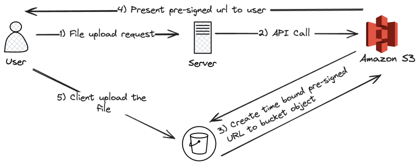

#### Key Characteristics

- **Temporary Access:**  
    Pre-signed URLs include an expiration time (by default one hour, but customizable via the SDK or CLI) after which they become invalid.
    
- **Permission Inheritance:**  
    The permissions associated with the pre-signed URL are those of the AWS principal who generated the URL. For example, if a user with read permissions generates a pre-signed URL for a GET operation, anyone with the URL can access the object as if they had the same permissions.
    
- **Use Cases:**
    - **Download:** Allowing a user to download premium content temporarily from a private bucket.
    - **Upload:** Permitting a client to upload a file to a specific location without granting broader write permissions.

- **Generation:**  
    Pre-signed URLs can be generated using AWS SDKs, the AWS CLI, or through the S3 console (with limitations on duration).

### 3.6. S3 Access Logs

S3 Access Logs provide detailed records of the requests made to your S3 buckets. These logs are essential for auditing, compliance, and forensic investigations.

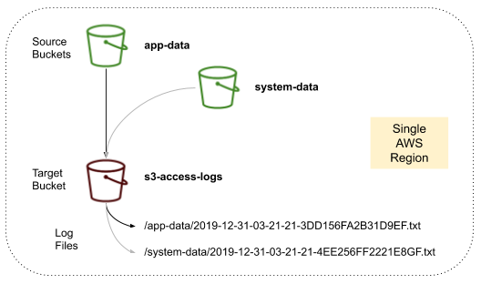

#### Key Aspects of Access Logging

- **Log Content:**  
	Each log record includes details about the request such as the requester’s identity, request time, action performed, and the HTTP status code returned. This helps in tracking who accessed or modified objects in the bucket.
    
- **Delivery:**  
	Access logs are written as files into a target S3 bucket. Note that the target logging bucket must reside in the same region as the source bucket to avoid cross-region data transfer issues.
    
- **Performance Considerations:**  
	Logging is performed on a best-effort basis. There can be delays in log delivery (ranging from minutes to hours), and the logs may occasionally be incomplete.
    
- **Best Practices:**
    - **Separate Logging Bucket:**  
        Ensure that the target bucket used for access logs is not the same as the bucket being logged. This prevents a logging loop where the act of logging generates further logs.
    - **Analysis Tools:**  
        Use tools such as Amazon Athena to query and analyze the log data for insights on access patterns and security audits.

## 4. Data Protection in S3

### 4.1 S3 Encryption Mechanisms

Amazon S3 provides several methods to encrypt objects at rest. These mechanisms help protect your data by ensuring that even if storage media are compromised, the contents remain unreadable without the proper keys.

#### Server-Side Encryption (SSE)

There are three primary server-side encryption options available:

- **SSE-S3 (Server-Side Encryption with S3-Managed Keys):**  
    With SSE-S3, Amazon S3 handles the entire encryption process by managing the encryption keys internally. When you upload an object, you simply include the header  
    `x-amz-server-side-encryption: AES256`  
    and S3 automatically encrypts your data using AES-256. This method is enabled by default for many new buckets and does not require any customer intervention for key management.
    
- **SSE-KMS (Server-Side Encryption with AWS KMS-Managed Keys):**  
    SSE-KMS provides additional control by integrating with the AWS Key Management Service (KMS). When you specify SSE-KMS (by including the header  
    `x-amz-server-side-encryption: aws:kms`  
    and optionally the specific key ID via  
    `x-amz-server-side-encryption-aws-kms-key-id`), S3 uses a KMS key to encrypt your objects. Advantages of SSE-KMS include:
    
    - **Auditability:** Every use of a KMS key is logged in AWS CloudTrail, supporting compliance and audit requirements.
    - **Granular Access Control:** You can use IAM policies to control not only access to the data but also the permissions for using the underlying KMS keys.
    - **Additional Security Overhead:** Clients must have permission (e.g., `kms:GenerateDataKey`) to perform encryption and decryption operations.
    
    However, note that each API call to generate or decrypt a data key counts toward your KMS API quota.
    
- **SSE-C (Server-Side Encryption with Customer-Provided Keys):**  
    SSE-C lets you manage your own encryption keys. In this mode, you provide the encryption key with each PUT and GET request (over HTTPS), and S3 uses your key to encrypt or decrypt the object. S3 does not store your key; it is used only transiently for the operation. This method requires that you securely manage and transmit the key for every operation.

#### Client-Side Encryption

In client-side encryption, data is encrypted on the client before being uploaded to Amazon S3. The encryption keys remain under your control entirely, and decryption occurs on the client side after download. This method is useful when you wish to maintain complete control over the encryption process and key management, independent of AWS services.

#### Encryption in Transit

While the focus here is on data at rest, it is important to note that Amazon S3 also supports encryption in transit. S3 provides HTTPS endpoints to ensure that data is encrypted between your client and S3 using SSL/TLS. Bucket policies can be configured (via the `aws:SecureTransport` condition) to enforce the use of HTTPS for all requests.

### 4.2 S3 Default Encryption

Default encryption allows you to ensure that every object uploaded into a bucket is automatically encrypted without requiring you to specify encryption parameters on each request.

- **Default Behavior:**  
    When default encryption is enabled on a bucket, every new object is encrypted automatically. By default, S3 applies SSE-S3 encryption; however, you can modify this setting to use SSE-KMS if your compliance or security policies require you to manage keys through AWS KMS.
    
- **Enforcement via Bucket Policies:**  
    In addition to default encryption settings, you can also enforce encryption at upload by using bucket policies. For example, you can configure a policy that denies any PUT object request that does not include the proper encryption header (whether SSE-S3, SSE-KMS, or SSE-C). Importantly, bucket policies are evaluated before default encryption settings take effect, ensuring that only properly encrypted objects are stored.

### 4.3 S3 Bucket Key

To further optimize the use of SSE-KMS encryption, Amazon S3 offers the **S3 Bucket Key** feature.

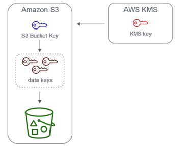

- **Purpose and Benefits:**  
	When using SSE-KMS, each object upload typically requires an API call to AWS KMS to generate a data key. For high-throughput workloads, this can result in a large number of KMS requests, increasing both latency and cost. An S3 Bucket Key allows Amazon S3 to generate and cache a data key at the bucket level. Subsequent encryptions can then use this bucket key to encrypt objects without making additional calls to KMS for every single object upload.
    
- **Cost and Performance Optimization:**  
    By using a bucket key, the number of KMS API calls can be reduced by up to 99%, significantly lowering costs and reducing CloudTrail log events related to KMS operations. This approach maintains the same level of security while optimizing performance for large-scale encryption operations.

You can enable or disable the bucket key setting from the S3 Console on a per-bucket basis. When enabled, S3 transparently handles envelope encryption using the bucket key without any changes required in your application logic.

### 4.4 Batch Encryption Using S3 Batch Operations

For situations where you need to update or encrypt many objects that are already stored in S3, Amazon S3 provides **S3 Batch Operations**.

- **Bulk Processing:**  
    S3 Batch Operations enable you to perform bulk actions—such as updating encryption settings—on existing S3 objects. This is particularly useful if you have a legacy bucket with objects that are not encrypted, and you wish to enforce encryption without having to re-upload each object individually.
    
- **Workflow Overview:**
    1. **Inventory and Identification:** Use S3 Inventory to generate a list of objects along with metadata that includes encryption status.
    2. **Filtering:** Process the inventory report with a tool like Amazon Athena to identify which objects require encryption updates.
    3. **Batch Operation Job:** Submit the list of objects to an S3 Batch Operations job that updates each object’s encryption settings (for example, by re-encrypting them with SSE-KMS).

- **Prerequisites:**  
    The batch job must have appropriate permissions to read from and write to the bucket, including permissions to use the KMS key if SSE-KMS encryption is applied.

Using S3 Batch Operations streamlines the process of enforcing encryption across a large number of objects without downtime or manual intervention.

### 4.5 S3 Object Lock & Glacier Vault Lock

For compliance and legal requirements, Amazon S3 offers mechanisms to prevent deletion or modification of objects after they are stored. These features enable a Write Once Read Many (WORM) model.

#### S3 Object Lock

- **Purpose:**  
    S3 Object Lock allows you to enforce a WORM policy on individual objects. When an object lock is applied, an object version is protected from being overwritten or deleted for a specified retention period.
    
- **Retention Modes:**
    - **Compliance Mode:** In this mode, the retention period is enforced strictly. No user—not even the bucket owner or root user—can delete or alter the locked object version until the retention period expires.
    - **Governance Mode:** This mode provides more flexibility. While the object is protected from deletion by most users, authorized users (typically with special administrative permissions) can override the retention settings if needed.

- **Legal Hold:**  
    Additionally, a legal hold can be placed on an object. Unlike time-bound retention, a legal hold protects an object indefinitely until the hold is explicitly removed, regardless of any retention period set.

#### Glacier Vault Lock

- **Purpose:**  
    Glacier Vault Lock applies a similar WORM concept at the archival level within Amazon S3 Glacier. By creating and then locking a Vault Lock policy on a Glacier vault, you ensure that objects archived in that vault cannot be altered or deleted. Once the policy is locked, it cannot be modified, thereby providing a robust mechanism for long-term retention and regulatory compliance.

Both S3 Object Lock and Glacier Vault Lock are critical for organizations that must adhere to strict data retention policies and need to prove that data has not been tampered with.

### 4.6 S3 MFA Delete

To add an additional layer of protection against accidental or malicious deletion of objects—especially in versioned buckets—Amazon S3 offers the **MFA Delete** feature.

- **What is MFA Delete?**  
    MFA (Multi-Factor Authentication) Delete requires that a second form of authentication (typically a one-time code generated by a physical or virtual MFA device) be provided when performing certain destructive actions.
    
- **When is MFA Delete Required?**  
    MFA Delete is required for:
    - Permanently deleting a specific object version.
    - Changing the versioning state of a bucket (such as suspending versioning).

- **Implementation Considerations:**
    - MFA Delete can only be enabled or disabled by the bucket owner using the AWS root account.
    - By requiring MFA for permanent deletions, you reduce the risk of accidental data loss as well as potential malicious operations.
    - Once enabled, any API call that could result in a permanent deletion or suspension of versioning must include valid MFA authentication.

MFA Delete is particularly important in environments where data integrity is paramount and strict controls are needed over the deletion of stored data.

## 5. Advanced Access Control

### 5.1. S3 Access Points

S3 Access Points are designed to simplify access management for S3 buckets containing large and diverse datasets. Rather than maintaining a single, monolithic bucket policy that applies to all objects, you can create multiple access points—each with its own policy tailored to a specific application or user group.


**Key Features:**

- **Granular Access Control:**  
	Each access point can restrict access to a subset of objects—often by enforcing a prefix (e.g., `/finance/` or `/sales/`). This enables different departments or applications to work with only the data they require.
    
- **Simplified Policy Management:**  
	By offloading detailed access rules from the bucket policy to individual access point policies, overall security management is greatly simplified. For example, you might configure:
	- A _finance access point_ granting read/write permissions exclusively for objects under the `/finance` prefix.
	- A _sales access point_ with its own policy allowing access only to the `/sales` prefix.
	- An _analytics access point_ with read-only permissions for multiple data sets.

- **Unique DNS Endpoints:**  
	Each access point is assigned a unique DNS name. Clients use these DNS names to access the S3 data without having to manage bucket-wide policies.
    
- **VPC Integration:**  
	Access points can be set to accept traffic either from the public internet or exclusively from a Virtual Private Cloud (VPC). When used within a VPC, they often work in conjunction with VPC endpoints to ensure that the data remains on the private AWS network.
    

By implementing S3 Access Points, organizations can efficiently enforce the principle of least privilege and scale their security management across large, complex buckets.

### 5.2. S3 Multi-Region Access Points

S3 Multi-Region Access Points provide a single, global endpoint that spans multiple S3 buckets distributed across different AWS regions. This architecture is ideal for applications requiring low-latency global access, enhanced resiliency, and simplified cross-region management.

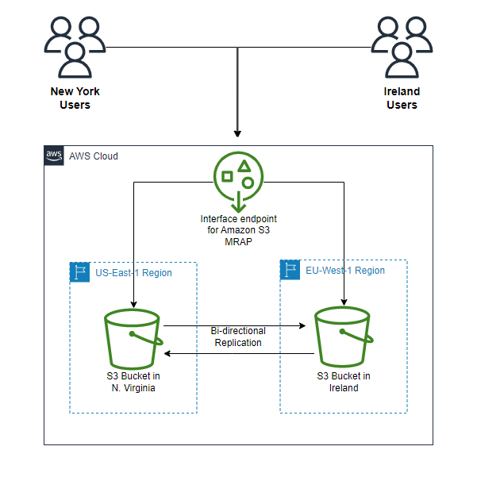

**Key Components and Benefits:**

- **Global Unified Endpoint:**  
	Instead of managing multiple regional endpoints, clients interact with one global endpoint. This endpoint dynamically routes requests to the S3 bucket in the region that can best serve the request—typically the one with the lowest latency.
    
- **Dynamic Routing and Failover:**  
	The system supports both active/active and active/passive configurations. In an active/passive setup, one bucket is designated as primary while secondary buckets serve as backups in the event of a regional outage.
    
- **Bidirectional Replication:**  
	S3 ensures that data is kept in sync across regions through replication rules. Data written to one bucket is asynchronously replicated to others, maintaining consistency across the multi-region access point.
    
- **Simplified Data Management:**  
	With a unified endpoint, developers and administrators can avoid the complexity of dealing with multiple bucket names and regional-specific configurations.

This solution is particularly useful for global applications where data availability, latency, and disaster recovery are critical.

### 5.3. S3 Object Lambda

S3 Object Lambda allows you to transform S3 objects on the fly as they are retrieved, without having to store multiple versions of the same data. This feature leverages AWS Lambda to process the object data before it is returned to the requester.

**Common Use Cases:**

- **Data Redaction:**  
    An analytics application might require access to a redacted version of documents that removes sensitive information. S3 Object Lambda can invoke a Lambda function to strip out personally identifiable information (PII) dynamically.
    
- **Data Enrichment:**  
    Instead of duplicating enriched content into another bucket, you can use a Lambda function to add information (such as customer data from a loyalty database) on the fly, delivering an enriched object to a marketing application.
    
- **Format Conversion and Transformation:**  
    Convert object formats (for example, XML to JSON) or perform image processing tasks like resizing or watermarking before the data is consumed.
    

**Architecture Overview:**

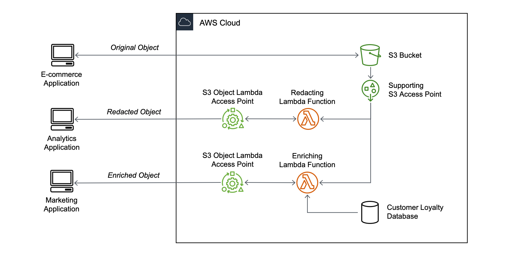

1. **Integration with Access Points:**  
    An S3 Object Lambda access point is created on top of an existing S3 bucket and is associated with a Lambda function.
2. **On-Demand Transformation:**  
    When a GET request is made through this access point, the Lambda function intercepts the request, retrieves the original object, performs the required transformation, and returns the modified object.
3. **Seamless Client Experience:**  
    The client receives a version of the object that is dynamically modified according to the business rules, without the need to manage multiple stored copies.

This approach minimizes storage redundancy while offering flexible, real-time data transformation capabilities.

### 5.4. VPC Endpoint Strategy

For secure, private access to Amazon S3 from within your Virtual Private Cloud (VPC), AWS provides two primary endpoint options: Gateway Endpoints and Interface Endpoints. These endpoints ensure that your data traffic remains within the AWS network, reducing exposure to the public internet.

**VPC Gateway Endpoints:**

- **Cost-Effective and Simple:**  
    Gateway endpoints are free of charge and integrate directly with your VPC’s route tables. They are designed for resources located entirely within the VPC.
- **Traffic Isolation:**  
    They guarantee that S3 traffic from your VPC does not traverse the internet, thus enhancing security.
- **Limitations:**  
    These endpoints are only accessible from within the VPC and cannot be used for connectivity from on-premises environments.

**VPC Interface Endpoints (AWS PrivateLink):**

- **Enhanced Connectivity:**  
    Interface endpoints deploy Elastic Network Interfaces (ENIs) in your subnets, allowing secure access to S3 from both VPC resources and on-premises networks via Direct Connect or VPN.
- **Security Controls:**  
    You can attach security groups to the ENIs and enforce granular access through endpoint policies.
- **Cost Considerations:**  
    These endpoints incur hourly charges per Availability Zone and require additional configuration compared to gateway endpoints.

**Policy Integration:**  
Bucket policies can further refine access by using conditions such as `aws:SourceVpc` or `aws:SourceVpce` to restrict requests to those originating from specific VPCs or VPC endpoints.

Choosing the right VPC endpoint strategy depends on your network architecture and connectivity requirements, ensuring that access to S3 is both secure and efficient.

### 5.5. Regaining Access to Locked S3 Buckets

Misconfigurations in bucket policies can inadvertently lock out all users, including administrators, from accessing your S3 bucket. A common scenario involves setting a blanket deny rule (e.g., denying all S3 actions for all principals) that effectively blocks any interaction with the bucket.

**Recovery Strategy:**

- **Leverage the Root User:**  
    Despite restrictive bucket policies, the AWS account's root user is not subject to these denies. The root user retains the ability to modify or delete bucket policies.
    
- **Steps to Regain Access:**
    1. **Sign in as the Root User:**  
        Use your account's root credentials to access the AWS Management Console.
    2. **Modify or Remove the Problematic Policy:**  
        Identify the overly restrictive policy that is locking out access and delete or adjust it accordingly.
    3. **Reconfigure Securely:**  
        After regaining access, implement a revised policy that follows best practices (e.g., using specific conditions and granting only necessary permissions) to prevent accidental lockouts in the future.

- **Preventative Measures:**  
    Regularly audit and test your bucket policies, and consider implementing safeguards such as change notifications or policy simulations to avoid such scenarios.

## 6. Data Management Features

### 6.1. S3 Versioning

S3 Versioning is a powerful feature that helps safeguard your data by keeping multiple variants of an object in the same bucket. When versioning is enabled, every update or deletion operation creates a new object version rather than permanently overwriting or removing the original.

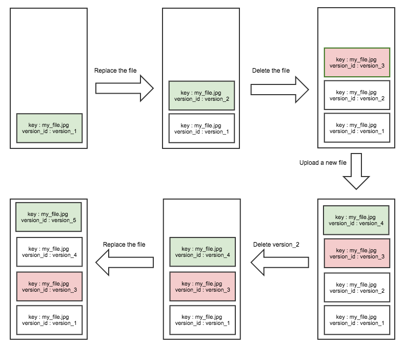

**Key Points:**

- **Protection Against Unintended Deletion:**  
	Enabling versioning protects your data from accidental deletes or overwrites. When you delete an object, Amazon S3 does not remove the previous versions; instead, it adds a delete marker that can be later removed to restore an earlier version.
    
- **Historical Record and Rollback:**  
    Each time an object is modified, a new version is created. This allows you to roll back to an earlier state of an object if necessary. Objects uploaded before versioning is enabled have a version ID of `null`.
    
- **Management Considerations:**  
	While versioning adds a layer of data protection, it also requires management of older versions. You can combine versioning with lifecycle rules (see Section 6.3) to expire or transition older versions and thereby control storage costs. 
    
- **Best Practices:**  
	It is recommended to enable versioning as soon as you create your bucket so that all subsequent modifications are versioned. Be aware that once versioning is enabled, any update or deletion creates an additional version, which may impact your billing if older versions are retained indefinitely.

### 6.2. S3 Replication

S3 Replication is designed to automatically and asynchronously copy objects between buckets, either within the same region or across different regions. This feature not only increases data availability but also supports compliance, disaster recovery, and global access use cases.

**Key Points:**

- **Types of Replication:**
    - **Cross-Region Replication (CRR):** Replicates objects to a bucket in a different AWS region. This is useful for geographic redundancy, reducing latency for users in distant regions, and meeting regulatory requirements.
    - **Same-Region Replication (SRR):** Replicates objects within the same AWS region. SRR is typically used to consolidate logs or to maintain a test environment that mirrors production.

- **Prerequisites:**  
    Replication requires that versioning is enabled on both the source and destination buckets. In addition, you must grant Amazon S3 the necessary IAM permissions to read from the source and write to the destination bucket.
    
- **Replication Behavior:**  
    By default, only new objects are replicated. If you need to replicate existing objects, you can leverage S3 Batch Replication to initiate replication for objects already stored.
    
- **Additional Considerations:**  
    You can configure replication rules to include delete markers and, optionally, exclude certain objects based on prefixes or tags. This flexibility enables you to tailor replication to your specific business needs.


### 6.3. S3 Lifecycle Rules

Lifecycle rules in Amazon S3 automate the management of objects over time. These rules help you transition objects between storage classes and eventually expire (delete) objects that are no longer needed, thereby optimizing storage costs and simplifying data management.

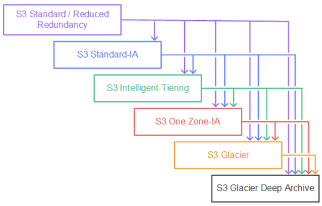

**Key Points:**

- **Transition Actions:**  
    You can configure rules to automatically transition objects from one storage class to another based on the object's age. For example, frequently accessed data might reside in the Standard class and then transition to Standard-Infrequent Access (Standard-IA) after 60 days, or to a Glacier tier for archival purposes after six months.
    
- **Expiration Actions:**  
    Lifecycle rules also support expiration actions, which permanently delete objects after a specified period. This is particularly useful for managing temporary files (such as log files) or outdated backups.
    
- **Abort Incomplete Multipart Uploads:**  
    To prevent stranded parts from consuming storage, you can define a rule that aborts multipart uploads that do not complete within a specified number of days.
    
- **Filtering by Prefix or Tags:**  
    Lifecycle rules can be applied to all objects in a bucket or can be scoped to specific prefixes or objects with certain tags. This granularity allows you to tailor the rule to different subsets of data within the same bucket.
    
- **Cost Optimization:**  
    By transitioning objects to lower-cost storage classes or deleting them when they are no longer needed, lifecycle rules help you control your storage expenses without manual intervention.

### 6.4. S3 Analytics

S3 Analytics is a feature that collects usage data and access patterns for objects stored in your buckets. It provides insights that can help you optimize your storage strategy and design cost-effective lifecycle policies.

**Key Points:**

- **Usage and Access Pattern Analysis:**  
    S3 Analytics monitors how frequently objects are accessed and can help you identify objects that are candidates for transitioning to a less expensive storage class.
    
- **Report Generation:**  
    The analytics data is aggregated into reports that are updated on a daily basis. It typically takes between 24 to 48 hours for the initial analysis to appear.
    
- **Integration with Visualization Tools:**  
    You can integrate S3 Analytics data with Amazon QuickSight to create dashboards and visualizations that give you a deeper understanding of your storage usage patterns.
    
- **Actionable Insights:**  
    The analysis helps you determine the “sweet spot” for transitioning objects. This information is invaluable when setting up lifecycle rules to ensure that objects are stored cost-effectively while still meeting performance requirements.
    

---

### 6.5. Storage Class Analysis

Often mentioned interchangeably with S3 Analytics, Storage Class Analysis specifically focuses on evaluating object access patterns to provide recommendations for transitioning objects between storage classes.

**Key Points:**

- **Purpose and Benefits:**  
    Storage Class Analysis examines how often objects are accessed and can recommend whether objects should remain in the Standard class or be moved to Standard-IA. This is critical for achieving cost savings by automatically moving infrequently accessed data to lower-cost tiers.
    
- **Report Details:**  
    The analysis produces a CSV report that summarizes storage metrics such as the frequency of access and object age. This report can be used to fine-tune your lifecycle policies and ensure that your data is stored in the most appropriate and cost-effective storage class.
    
- **Scope and Limitations:**  
    The analysis is designed to work with objects stored in Standard and Standard-IA classes. It does not apply to storage classes such as One Zone-IA or Glacier. Understanding this limitation helps in setting realistic expectations and planning your data management strategy.
    
- **Practical Use:**  
    The insights from Storage Class Analysis empower you to implement proactive lifecycle transitions, thereby reducing costs by moving data to cheaper storage options when it is no longer frequently accessed.

## 7. S3 Performance Optimization

Amazon S3 is renowned for its near‐infinite scalability and high durability. However, as usage scales—especially for high-throughput applications—it becomes critical to understand both the baseline performance characteristics and the best practices to optimize S3 for your workload. In this section, we examine the fundamentals of S3 performance, describe key performance best practices, discuss special considerations for large file uploads when using KMS encryption, and review the use of S3 Transfer Acceleration for speeding up transfers.

### 7.1. S3 Performance Fundamentals

Amazon S3 is engineered to handle massive request rates automatically. By default, S3 scales to support:

- **Write Operations:** Up to **3,500 PUT/COPY/POST/DELETE requests per second per prefix**.
- **Read Operations:** Up to **5,500 GET/HEAD requests per second per prefix**.

**Understanding Prefixes:**  
An S3 object’s key (its full name) can be conceptually divided into a “prefix” and an “object name.” The prefix is the portion of the key that comes before the final component (for example, the folder structure). S3 performance scales per prefix, meaning that if your objects are spread over multiple prefixes, you can achieve higher aggregate request rates. For example, if you store objects under the prefixes `/folder1/sub1/` and `/folder1/sub2/`, each prefix will have its own independent performance limits.

Because there is no upper limit on the number of prefixes within a bucket, proper key design allows you to scale your request throughput well beyond the per-prefix limits.

### 7.2. Performance Best Practices

To achieve optimal performance with S3, consider the following best practices:

1. **Design Your Key Names Wisely:**
    - Distribute objects across multiple prefixes so that no single prefix becomes a bottleneck.
    - Use a naming convention that naturally “shards” your data (for example, including a date or random component in the prefix).

2. **Utilize Multi-Part Upload for Large Objects:**
    - For files larger than 100 MB, Amazon recommends using multi-part upload.
    - Files exceeding 5 GB _must_ be uploaded using multi-part upload.
    - **Benefits:**
        - **Parallelism:** Breaks the file into parts and uploads them concurrently to maximize available bandwidth.
        - **Resilience:** If a part fails, only that part is retried rather than the entire file.
        - **Reassembly:** Once all parts are uploaded, S3 automatically reassembles them into the final object.

3. **Leverage Byte-Range Fetches for Efficient Downloads:**
    - For large objects, clients can request specific byte ranges in parallel, speeding up overall download times.
    - Byte-range requests allow you to retrieve only the portions of a file you need (for example, just the header information), reducing unnecessary data transfer and improving performance.

By combining these practices with careful architectural design, you can maximize throughput and responsiveness for your S3-based applications.

### 7.3. Large File Uploads with KMS Key

When security requirements dictate that large objects must be encrypted using server-side encryption with AWS KMS (SSE-KMS), additional performance considerations come into play:

1. **Encryption Overhead in Multi-Part Uploads:**
    - With SSE-KMS, each part of a multi-part upload is encrypted using a data key that is generated by KMS.
    - When S3 reassembles the parts, it must call KMS to decrypt the data keys before re-encrypting the final object.
    - This process introduces additional API calls and latency.

2. **Necessary Permissions:**    
    - In addition to the standard S3 permissions, the uploading entity must have the appropriate KMS permissions (for example, **kms:GenerateDataKey** and **kms:Decrypt**) to successfully complete the upload and reassembly process.
    - Failure to include these permissions can result in incomplete uploads or errors during reassembly.

3. **Optimization with S3 Bucket Keys:**
    - To mitigate the performance impact and cost associated with frequent KMS API calls, Amazon S3 offers **S3 Bucket Keys**.
    - By enabling bucket keys, S3 reduces the number of calls made to KMS—often by as much as 99%—without compromising security.
    - This approach leverages envelope encryption, where one S3 Bucket key is used to encrypt multiple data keys, thereby lowering latency and cost during large file uploads.

Using SSE-KMS for large file uploads requires careful planning to ensure that both security and performance targets are met. Be sure to design your IAM policies appropriately and consider enabling S3 Bucket Keys when operating at scale.

### 7.4. S3 Transfer Acceleration

For applications where clients are geographically distant from the S3 bucket’s region, **S3 Transfer Acceleration** offers a way to reduce latency and improve transfer speeds by leveraging AWS’s global edge network:

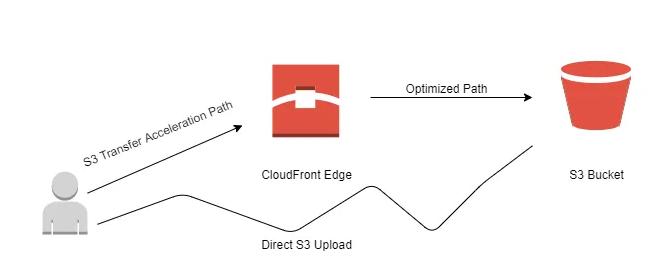

1. **How It Works:**
    - When Transfer Acceleration is enabled, data is first transferred from the client to a nearby AWS edge location.
    - From the edge location, the data is forwarded over the high-speed, private AWS network to the S3 bucket in the target region.
    - This process reduces the distance data travels over the public internet, improving upload and download performance, particularly over long distances.

2. **Compatibility and Use Cases:**
    - S3 Transfer Acceleration is compatible with multi-part uploads, meaning you can simultaneously optimize performance for large, encrypted, or multi-part objects.
    - It is especially useful for global applications where users in diverse geographical locations require quick access to S3 objects.
    - Typical use cases include media content delivery, global backups, and applications with distributed user bases.

3. **Cost Considerations:**
    - While Transfer Acceleration can significantly improve transfer performance, it does incur additional costs based on the data transferred through edge locations.
    - Evaluate the trade-offs between cost and performance improvements for your specific application requirements.

## 8. Event-Driven S3 Architecture

Event-driven architectures allow systems to react in real time to changes in state or the occurrence of specific events. With Amazon S3, you can monitor your buckets for events—such as the creation, deletion, or restoration of objects—and trigger downstream processing without manual intervention. This capability enables a variety of use cases such as dynamic image processing, metadata indexing, real-time analytics, and automated workflows.

S3 event notifications are the foundation of this architecture. They let you specify which S3 events to capture, how to filter them based on object key patterns (using prefix or suffix filters), and where to send these notifications. Targets for S3 event notifications include Amazon SNS, Amazon SQS, AWS Lambda, and—via integration with Amazon EventBridge—more than 18 AWS service destinations. In the sections that follow, we examine these mechanisms in detail.

### 8.1. S3 Event Notifications

Amazon S3 event notifications provide a mechanism to monitor your buckets and automatically publish messages when certain events occur. This section covers the key concepts, supported event types, filtering options, and delivery characteristics.

#### Supported Events and Use Cases

S3 can emit notifications for a variety of events, including:

- **Object Creation:** Triggered when a new object is added (e.g., via PUT, POST, or COPY operations).  
    _Use case:_ Automatically generating thumbnails when an image is uploaded.
- **Object Removal:** Triggered when an object is deleted.
- **Object Restoration:** Emitted when an archived object (such as one stored in Glacier) is restored.
- **Replication Events:** Generated when objects are replicated between buckets.

These notifications enable you to build workflows that automatically react to changes. For example, you might index metadata from new files, trigger a virus scan, or initiate data transformations.

#### Filtering and Configuration

When setting up event notifications, you can define filters so that only specific events trigger downstream processing. Two common filters are:

- **Prefix Filtering:** Specify that only objects within a particular “folder” or key path (e.g., `images/`) generate notifications.
- **Suffix Filtering:** Limit notifications to objects with specific file extensions (e.g., `.jpeg`), ensuring that only certain types of files trigger processing.

The notifications are designed to be delivered asynchronously—typically within seconds, though in some cases delivery may take up to a minute.

#### Notification Targets

S3 notifications can be sent directly to one of several target services:

- **Amazon SNS:** For fan-out messaging and broadcast patterns.
- **Amazon SQS:** To queue events for reliable, decoupled processing.
- **AWS Lambda:** To trigger serverless functions for immediate processing.
- **Amazon EventBridge:** Offers advanced filtering (with JSON rules), replay capabilities, and integration with more than 18 AWS service destinations.

When you configure a notification to target SNS, SQS, or Lambda, you must ensure that the target service’s resource-based policy grants permission for S3 to invoke it.

### 8.2. Lambda & S3 Event Notifications

AWS Lambda is a natural partner for S3 event notifications. This section delves into how S3 events can trigger Lambda functions, the processing patterns typically used, and best practices for error handling and reliability.

#### Integration Overview

When an S3 event (such as an object creation) occurs and matches your notification filters, Amazon S3 can invoke an AWS Lambda function asynchronously. The event payload passed to Lambda contains critical metadata such as:

- The bucket name.
- The object key.
- The event type (e.g., object created or deleted).
- Additional context if versioning is enabled.

This payload allows your Lambda function to:

- **Retrieve and Process the Object:** For instance, generate a thumbnail image or parse the file to extract metadata.
- **Initiate Further Actions:** Such as updating a database, sending notifications, or triggering additional workflows.

#### Use Cases and Patterns

Common patterns when using Lambda with S3 event notifications include:

- **Media Processing:** A Lambda function automatically resizes images or converts videos upon upload.
- **Metadata Extraction:** Extracting and storing object metadata in a DynamoDB table for search or analytics.
- **Data Transformation:** Using Lambda to modify the content of an object (e.g., redacting sensitive information) before passing it along to downstream consumers.
- **Object Lambda (Advanced):** In a related pattern, S3 Object Lambda allows you to intercept GET requests to transform objects on the fly using a Lambda function. This is useful when you want to present different views of the same underlying data (e.g., redacted vs. enriched).

#### Best Practices

- **Enable Versioning:** To help ensure that multiple write operations to the same object are captured correctly, thereby avoiding missed notifications.
- **Configure Dead-Letter Queues (DLQs):** Set up DLQs for your Lambda functions to handle failures gracefully.
- **Resource Policies:** Ensure that the Lambda function’s resource policy grants permission to be invoked by S3.
- **Stateless Design:** Design Lambda functions to be stateless and idempotent, so that retries do not cause unintended side effects.

### 8.3. Building Event-Driven Applications

#### Decoupling and Scalability

Event-driven architectures enable you to decouple components so that each service handles a specific task:

- **S3 as an Event Source:** Objects uploaded to S3 trigger events that serve as the starting point for processing pipelines.
- **Lambda for Processing:** Lambda functions can perform tasks such as data validation, transformation, and routing.
- **Integration with Other Services:** Downstream services (SNS, SQS, EventBridge, Step Functions) can further process, orchestrate, or store the results.

This decoupling not only simplifies the architecture but also improves scalability. For example, your system can automatically scale the number of concurrent Lambda executions in response to bursts of S3 events.

#### Example Architectures

1. **Thumbnail Generation Workflow:**
    - **Event Trigger:** An object creation event for an image file in S3.
    - **Lambda Processing:** A Lambda function is triggered to generate multiple sizes of the image.
    - **Storage and Notification:** The resized images are stored in another S3 bucket, and a notification is sent via SNS to inform downstream systems that the processing is complete.

2. **Metadata Indexing Pipeline:**
    - **Event Trigger:** S3 events on new data file uploads.
    - **Lambda Function:** Processes the file to extract key metadata and then writes the metadata into a DynamoDB table.
    - **Search and Analytics:** The indexed metadata allows for efficient searching and can be used to drive analytical dashboards or trigger further workflows.

3. **Real-Time Data Transformation with S3 Object Lambda:**    
    - **Event Trigger & Request Interception:** A client request for an S3 object is intercepted by an S3 Object Lambda access point.
    - **Lambda Transformation:** The Lambda function modifies the object content on the fly—such as redacting sensitive information or converting data formats—before returning it to the client.
    - **Single Source of Truth:** Both the original object (used by one application) and the transformed object (used by another application) are served from the same S3 bucket, simplifying data management.

#### Advanced Event Routing with EventBridge

By integrating S3 event notifications with Amazon EventBridge, you gain:

- **Advanced Filtering:** Create rules that inspect event details (such as object size, metadata, or custom attributes) to determine routing.
- **Multiple Destinations:** Direct a single S3 event to several AWS services, such as Step Functions for workflow orchestration or Kinesis Data Streams for real-time analytics.
- **Event Replay:** EventBridge enables you to archive and replay events, which is useful for auditing and debugging event-driven workflows.

#### Design Considerations

When building event-driven applications with S3, consider the following:

- **Reliability:** Use retries, DLQs, and idempotent processing in your Lambda functions to handle occasional failures.
- **Security:** Ensure that resource policies are correctly configured so that only authorized services can trigger and process events.
- **Monitoring:** Leverage CloudWatch metrics and logs to monitor the performance of your event notifications and processing functions.
- **Cost Optimization:** Since S3 event notifications are a built-in feature with no additional cost, focus on optimizing downstream services (like Lambda execution time) to control costs.

## 9. S3 Cost Management

### 9.1. AWS S3 Pricing Overview

Amazon S3 pricing is structured around several key dimensions that together determine the overall cost of your storage solution. Understanding these pricing components is the first step in managing and optimizing your S3 expenses.

#### Pricing Components

- **Data Storage Costs:**  
    S3 charges you based on the total volume of data stored. The cost per gigabyte decreases as you store more data, thanks to tiered pricing. Pricing is also region-specific, so the storage cost in one AWS region may differ from another.
    
- **Request and Retrieval Charges:**  
    In addition to storage, you incur costs for every API call made to S3. These include PUT, COPY, POST, DELETE (grouped at approximately 3,500 requests per second per prefix) and GET/HEAD requests (up to 5,500 requests per second per prefix). Although these are low on a per-1000-request basis, they can accumulate significantly at scale.
    
- **Data Transfer Costs:**  
    Data transferred into S3 is typically free, whereas data egress (i.e., transferring data out of S3) is charged based on the destination (e.g., internet, other AWS regions, or between AWS services). Evaluating these costs is important for applications with heavy data movement.
    
- **Encryption and Management Features:**  
    Depending on your configuration—such as using server-side encryption (SSE-KMS)—additional charges may apply. These may include fees for API calls to the AWS Key Management Service (KMS).
    

#### Pricing Tools and Resources

- **AWS Pricing Calculator:**  
    The AWS Pricing Calculator allows you to simulate your S3 usage by specifying storage volume, request rates, and data transfer parameters. This tool helps forecast monthly costs and make informed decisions about configuration.
    
- **AWS S3 Pricing Page:**  
    The pricing page is organized into several tabs (e.g., Storage and Requests, Data Transfer, and Management & Insights). It provides a high-level overview of how S3’s pricing model adapts to different usage patterns.

### 9.2. S3 Cost Savings Strategies

Cost savings in S3 are achieved through a combination of choosing the right storage class, implementing lifecycle policies, and leveraging built-in features that shift costs away from the bucket owner.

#### Choosing the Appropriate Storage Class

Amazon S3 offers multiple storage classes tailored to different access patterns and durability/availability needs:

- **S3 Standard-General Purpose:**  
    Designed for frequently accessed data with high performance and 99.99% availability.
    
- **S3 Standard-Infrequent Access (Standard-IA):**  
    Suitable for data that is accessed less frequently but requires rapid access. Although storage costs are lower, there are retrieval fees.
    
- **S3 One Zone-Infrequent Access (One Zone-IA):**  
    Offers cost savings by storing data in a single Availability Zone. It is ideal for secondary backups or data that can be easily reproduced.
    
- **S3 Intelligent Tiering:**  
    Automatically moves objects between frequent and infrequent access tiers based on changing access patterns, with a small monthly monitoring fee but no retrieval charges.
    
- **Glacier Storage Classes (Instant Retrieval, Flexible Retrieval, Deep Archive):**  
    These classes are designed for archival and long-term backup. They offer the lowest storage costs but incur higher retrieval fees and longer access times.

#### Lifecycle Policies

Lifecycle rules automate the transition of objects between storage classes or their expiration:

- **Transition Actions:**  
    Define when an object should be moved (e.g., transition from S3 Standard to Standard-IA after 60 days, or to Glacier for archiving after six months).
- **Expiration Actions:**  
    Specify when objects should be deleted (e.g., expiring access logs after 365 days) to further reduce storage costs.

#### Additional Cost-Saving Techniques

- **Object Compression:**  
    Compressing files before uploading reduces the storage footprint and, consequently, the cost.
    
- **S3 Requester Pays:**  
    With this feature enabled, the requester—not the bucket owner—bears the cost of data transfer when accessing objects. This is particularly useful when sharing large datasets with multiple external users.
    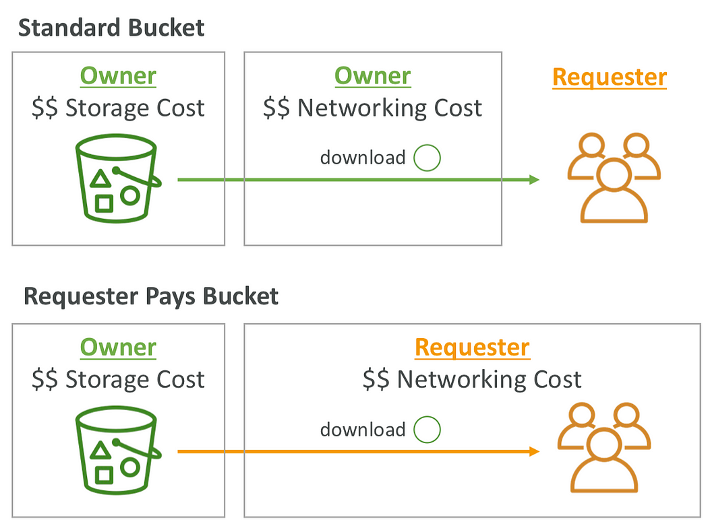

### 9.3. S3 Storage Lens

S3 Storage Lens is an advanced analytics tool that provides comprehensive visibility into your S3 storage usage and activity. It plays a key role in cost management by enabling you to monitor trends, detect anomalies, and identify cost optimization opportunities.

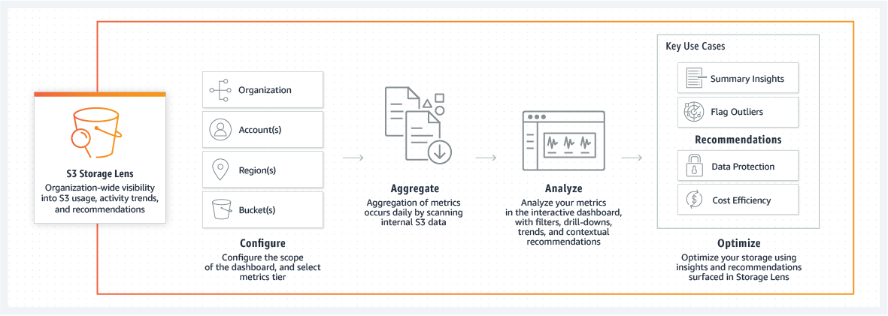

#### Key Features and Metrics

- **Usage and Activity Metrics:**  
	Storage Lens aggregates metrics such as total storage bytes, object count, average object size, and bucket count. It offers insights into which buckets or prefixes are growing fastest.
    
- **Cost Optimization Insights:**  
	It provides metrics on non-current version storage and incomplete multipart uploads, helping you identify objects that could be transitioned to lower-cost classes or deleted.
    
- **Data Protection and Access Metrics:**  
	Metrics regarding versioning, replication, and access management help ensure that your data protection measures are not inadvertently driving up costs.

#### Dashboard and Reporting

- **Pre-configured and Custom Dashboards:**  
    Storage Lens comes with a default dashboard that aggregates data across accounts and regions. You can also create custom dashboards to focus on specific metrics or organizational units.
    
- **Export Options:**  
    Reports can be exported in CSV or Parquet format, enabling further analysis in tools such as Amazon QuickSight or Athena.

#### Free vs. Advanced Metrics

- **Free Metrics:**  
    Available to all customers and include basic usage data updated over a recent period (typically 14 days).
- **Advanced (Paid) Metrics:**  
    Provide additional detailed insights, such as enhanced activity metrics and cost optimization recommendations, with data retained for up to 15 months.

S3 Storage Lens empowers you to make informed decisions by offering a centralized view of your storage environment, ultimately guiding strategies to reduce waste and optimize costs.

### 9.4. Optimizing Costs with Storage Class Analysis

Storage Class Analysis (sometimes referred to as S3 Analytics) is a feature designed to help you determine the optimal storage class for your objects based on their access patterns.

#### How Storage Class Analysis Works

- **Data Collection and Reporting:**  
    Storage Class Analysis monitors access patterns and usage statistics over time. It generates a CSV report that details which objects remain in the Standard storage class and which could be transitioned to Standard-IA for cost savings.
    
- **Reporting Frequency:**  
    The report is updated daily, with initial analysis typically becoming available between 24 to 48 hours after activation. This allows you to quickly gauge how your data is being accessed.
    
- **Integration with Lifecycle Policies:**  
    The insights gained from Storage Class Analysis can be directly used to formulate or fine-tune S3 Lifecycle rules. For example, if the analysis shows that a significant portion of objects in the Standard class has not been accessed for 30 days, you might create a rule to transition those objects to Standard-IA.

#### Benefits and Limitations

- **Cost Optimization:**  
    By identifying objects that are infrequently accessed, you can reduce storage costs without sacrificing the availability of data that is needed on demand.
- **Automation:**  
    Storage Class Analysis removes guesswork by providing data-driven recommendations that can be implemented automatically via lifecycle policies.
- **Scope of Analysis:**  
    Note that Storage Class Analysis currently focuses on the Standard and Standard-IA storage classes. It does not extend to One Zone-IA or Glacier tiers, so these use cases should be managed separately.

Storage Class Analysis is a critical tool in your cost optimization toolkit. It provides the actionable insights necessary to configure automated transitions that align with your usage patterns, thereby ensuring you are not overpaying for storage that could be stored more economically.

## 10. S3 Website Hosting

### 10.1. S3 Website Overview

Amazon S3 provides an integrated feature that enables the hosting of static websites directly from an S3 bucket. Key aspects include:

- **Static Content Delivery:**  
    S3 is ideal for hosting content that does not change frequently, such as company landing pages, product documentation, and media assets. Since S3 is designed to serve objects with high availability and low latency, it can deliver your website assets quickly to users across the globe.
    
- **Website Endpoint:**  
    Once you enable static website hosting on a bucket, Amazon S3 assigns a dedicated website endpoint URL. This URL’s format depends on the AWS region where the bucket resides. For example, the endpoint might look like `http://bucket-name.s3-website-region.amazonaws.com`.
    
- **Access Requirements:**  
    For a website to be accessible publicly, its objects must be readable. By default, S3 buckets are private; therefore, to host a website, you must configure a bucket policy (or other access settings) that allows public read access to the necessary files. If the proper permissions are not in place, visitors might encounter errors (e.g., HTTP 403 Forbidden).
    
- **Seamless Integration:**  
    The static website hosting feature integrates with other AWS services. For example, you can later front your S3-hosted website with Amazon CloudFront for enhanced performance, caching, and the option to use custom domain names.

### 10.2. Setting up static websites

Setting up a static website in Amazon S3 involves several steps that ensure your website assets are stored, served, and updated reliably:

1. **Create an S3 Bucket:**  
    The bucket name must be globally unique. Although S3 is a global service, buckets are created in a specific AWS region. When planning for a static website, choose a region close to your target audience to reduce latency.
    
2. **Upload Website Assets:**  
    Place your static website files—HTML, CSS, JavaScript, images, and any other resources—into the bucket. S3 stores these files as objects. It is recommended to use a logical folder (or key prefix) structure for organization, even though S3 does not implement traditional directories.
    
3. **Enable Static Website Hosting:**  
    In the S3 console, navigate to the bucket’s properties and enable the static website hosting option. You must specify the index document (commonly named `index.html`). You can also define an error document (for example, `error.html`) that is served in case of HTTP errors.
    
4. **Configure Public Access:**  
    Since the website will be accessed via a browser, the objects need to be publicly readable. This is typically achieved by applying a bucket policy that grants the `s3:GetObject` permission to all principals (using `"Principal": "*"`) for objects in the bucket. Be cautious to restrict public access only when hosting content that is meant to be public.
    
5. **Test the Website:**  
    Once the above settings are configured, use the provided website endpoint to access your website. If any HTTP errors (e.g., 403 Forbidden) occur, verify that the bucket policy and object permissions are correctly set to allow public access.
    

### 10.3. CORS Configuration

Cross-Origin Resource Sharing (CORS) is a mechanism that allows web browsers to permit web pages to request resources from a domain other than the one that served the web page. This security feature is especially relevant when your static website hosted in S3 makes requests (for example, AJAX calls) to a different domain or even when serving assets from multiple S3 buckets.

- **Understanding the Same-Origin Policy:**  
    By default, web browsers enforce a same-origin policy. The “origin” of a resource is defined by its scheme (HTTP or HTTPS), host, and port. For instance, `https://www.example.com` is considered a single origin. If your website’s HTML (served from one S3 bucket) attempts to load images or scripts from another domain (or a different S3 bucket configured as a static website), the browser will block the request unless the target resource explicitly allows it.
    
- **Role of CORS in S3:**  
    To allow cross-origin requests, you configure CORS rules on your S3 bucket. This involves specifying:
    
    - **Allowed Origins:**  
        You can permit specific origins (e.g., `https://www.example.com`) or allow all origins using `"*"` if appropriate.
        
    - **Allowed Methods:**  
        Define which HTTP methods are permitted (typically `GET`, `POST`, `PUT`, etc.). For static website hosting, `GET` is the most common.
        
    - **Allowed Headers and Exposed Headers:**  
        Specify which headers can be included in the request and which headers are exposed to the client.
        
    - **Max Age:**  
        Determine how long the browser should cache the CORS preflight response.
        
- **CORS Preflight Requests:**  
    Before sending a cross-origin request that might affect user data, browsers send an OPTIONS request (the “preflight” request) to determine if the actual request is safe to send. The S3 bucket must respond with the appropriate CORS headers—especially `Access-Control-Allow-Origin`—to allow the actual request.
    
- **Implementing CORS in S3:**  
    In the S3 console, under the bucket’s permissions, you can add a CORS configuration in XML format. For example:
    
    ```xml
    <CORSConfiguration>
        <CORSRule>
            <AllowedOrigin>https://www.example.com</AllowedOrigin>
            <AllowedMethod>GET</AllowedMethod>
            <AllowedHeader>*</AllowedHeader>
            <MaxAgeSeconds>3000</MaxAgeSeconds>
        </CORSRule>
    </CORSConfiguration>
    ```
    
    This configuration tells the browser that any web page from `https://www.example.com` is allowed to perform GET requests on this S3 bucket, with the preflight response cached for 3000 seconds.

## 11. Conclusion

AWS S3 is much more than a simple storage service—it is a comprehensive platform that underpins many of today’s data-driven applications. A deep, technical understanding of its architecture and capabilities is critical for designing resilient, secure, and cost-effective cloud solutions.