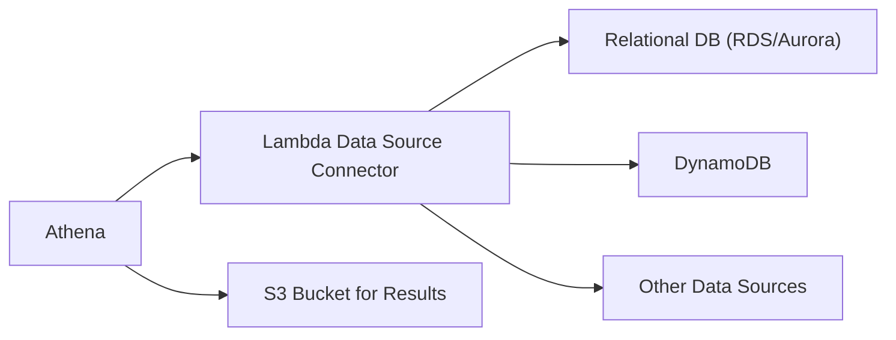

# Amazon Athena – Serverless Querying and Analysis

## 1. Overview of Amazon Athena

Amazon Athena is a fully managed, serverless query service that empowers organizations to analyze data directly in Amazon S3 using standard SQL. It eliminates the complexities of setting up and managing servers or clusters, allowing you to run ad hoc queries against vast datasets stored in Amazon S3 with ease. You only pay for the data scanned by your queries, making Athena a cost-effective solution for business intelligence and analytics. The cost model is pay-as-you-go, priced at **$5 per TB of data scanned**. Crucially, only successful and cancelled queries are counted towards billing; failed queries are not charged, and there are **no charges for Data Definition Language (DDL)** operations like `CREATE`, `ALTER`, and `DROP`.

Athena's key strengths include its support for ANSI SQL, seamless integration with other AWS services, and ability to query diverse data formats such as JSON, CSV, Parquet, and ORC. This flexibility enables both technical and non-technical users to efficiently extract valuable insights from their data lakes. From ad hoc analysis to building interactive dashboards, Athena provides a powerful and versatile tool for modern data analytics.

## 2. Key Features and Capabilities

Amazon Athena is designed with several core features that make it a powerful and user-friendly analytics tool:

### 2.1. Serverless Architecture

Athena's serverless nature is a fundamental advantage. You avoid the operational overhead of provisioning, configuring, and managing servers. By simply pointing Athena to your Amazon S3 bucket, you can immediately begin querying your data. This design ensures automatic scaling based on your query workload and significantly reduces operational complexity.

### 2.2. SQL Querying and Integration

Supporting ANSI SQL makes Athena accessible to anyone familiar with relational databases. This lowers the barrier to entry and allows for the use of standard SQL syntax for data analysis. Furthermore, Athena's deep integration with other AWS services enhances its functionality:

- **Amazon QuickSight:** Enables the creation of interactive dashboards and visualizations directly from Athena query results, facilitating data exploration and sharing of insights.
- **AWS Glue:** Integrates with the Glue Data Catalog for centralized metadata management, allowing you to define and manage schemas for your data stored in S3.
- **AWS IAM:** Leverages IAM for robust security, enabling fine-grained access control to your data and Athena queries, ensuring data governance and compliance.
- **Monitoring Tools (Amazon CloudWatch & AWS CloudTrail):** Provides tools for monitoring query performance, tracking costs, and auditing security-related events, enhancing operational visibility and security management.

### 2.3. Versatile Data Format Support

Athena can directly query data in various formats, including CSV, JSON, ORC, and columnar formats like Apache Parquet. This eliminates the need for upfront data conversion and ETL processes. While Athena supports multiple formats, using columnar formats like **ORC and Apache Parquet is highly recommended as they can save you 30-90% on query costs and improve performance significantly.** This is because columnar formats drastically reduce the amount of data scanned by queries.

### 2.4. Federated Queries: Expanding Data Access

Beyond querying data in Amazon S3, Athena offers federated query capabilities. This allows you to seamlessly access and analyze data residing in a variety of data sources beyond your data lake, effectively breaking down data silos. Using AWS Lambda-based Data Source Connectors, Athena can query:

- **Relational Databases:** Including Amazon RDS, Aurora, and SQL Server.
- **Non-Relational Databases:** Such as Amazon DynamoDB and DocumentDB.
- **On-Premises Databases:** Through the development and use of custom connectors.
- **Other AWS Services:** Like Amazon CloudWatch Logs.

This capability allows you to unify data analysis across disparate sources, creating a more comprehensive view of your data landscape.



### 2.5. Athena Workgroups: Organize and Control Access

Athena Workgroups provide a powerful way to organize and manage users, teams, applications, and workloads within Athena. They offer granular control over query access and cost tracking. Key features of Workgroups include:

- **Organization**: Structure users and workloads into logical groups.
- **Access Control**: Integrate with IAM to control query access at the workgroup level.
- **Cost Tracking**: Track query costs associated with each workgroup, improving cost visibility and accountability.
- **Customization**: Each workgroup can have its own:
    - **Query History**: Separate query history for each workgroup.
    - **Data Limits**: Implement data limits to restrict the amount of data queries can scan within a workgroup, controlling costs.
    - **IAM Policies**: Define specific IAM policies for each workgroup, enabling fine-grained access control.
    - **Encryption Settings**: Configure distinct encryption settings per workgroup to meet varying security requirements.
- **Integration**: Seamlessly integrates with IAM for authentication and authorization, CloudWatch for monitoring, and SNS for notifications.

### 2.6. ACID Transactions with Apache Iceberg

Athena, powered by Apache Iceberg table format, supports **ACID (Atomicity, Consistency, Isolation, Durability) transactions**. This feature allows concurrent users to safely make row-level modifications to data within Athena. To enable ACID transactions, simply add `'table_type' = 'ICEBERG'` in your `CREATE TABLE` command.

Key benefits of ACID transactions in Athena through Apache Iceberg include:

- **Concurrent Modifications**: Safe row-level modifications by multiple users without data corruption.
- **Compatibility**: Compatible with other services supporting Iceberg table format, such as EMR and Spark.
- **Simplified Data Management**: Removes the need for custom record locking mechanisms.
- **Time Travel**: Enables time travel operations, allowing you to recover recently deleted data using `SELECT` statements, providing data recovery and audit capabilities.
- **Performance**: Benefits from periodic compaction to maintain query performance over time.

This approach offers another method for achieving ACID properties in Athena, similar to Governed Tables in Lake Formation, providing flexibility in choosing the right approach based on specific needs.

## 3. How Amazon Athena Works: Schema-on-Read

Athena utilizes a distributed SQL engine based on Presto to process queries. It operates on a "schema-on-read" principle. This means that you define the schema and data types when you run a query, rather than during data loading or ingestion. This approach provides significant agility, allowing you to quickly analyze raw data in S3 without the delays associated with traditional ETL processes.

The service workflow involves reading data directly from Amazon S3, processing it in parallel across a distributed cluster of nodes, and then returning the query results. Athena automatically handles scaling, resource allocation, and query optimization behind the scenes, abstracting away the infrastructure management complexities from the user.

## 4. Performance and Cost Optimization Strategies

As Athena charges based on the volume of data scanned per query (**$5 per TB**), optimizing query performance is essential for cost efficiency and speed. Implementing the following strategies, as recommended by AWS, can significantly improve your Athena query performance and reduce costs:

### 4.1. Utilize Columnar Data Formats

Storing your data in columnar formats like Apache Parquet or ORC is a primary optimization technique. These formats significantly reduce data scanned as Athena only reads the columns specified in the query, rather than processing entire rows. **This can save you 30-90% in query costs and improve performance.** Choosing columnar formats is one of the most impactful ways to optimize Athena costs.

### 4.2. Implement Data Compression

Compressing your datasets reduces both storage space and the amount of data Athena needs to scan. Compression techniques are fully compatible with Athena and can yield substantial improvements in query performance by minimizing data volume.

### 4.3. Employ Data Partitioning

Partitioning your data based on logical categories, such as date or geographical region, allows Athena to query only relevant partitions. When queries include partition filters (e.g., `WHERE year='2023'`), Athena intelligently scans only the data within those specified partitions, dramatically reducing the data scanned and query execution time. A common partitioning scheme involves date-based partitioning, like:

```
s3://your-bucket/flightdata/
└── year=1991/
    └── month=01/
        └── day=01/
```

### 4.4. Consolidate to Larger Files

Storing data as a large number of small files in S3 can introduce overhead during query execution. Consolidating smaller files into larger files (ideally 128 MB or more) improves scan efficiency and overall query performance by reducing the overhead associated with processing numerous files.

## 5. Anti-Patterns: When NOT to use Athena

While Athena is powerful, it is not suited for all use cases. Avoid using Athena for:

- **Highly Formatted Reports and Visualizations**: Athena is designed for data querying and analysis. For creating highly formatted reports and interactive visualizations, **Amazon QuickSight is the more appropriate service.**
- **ETL (Extract, Transform, Load) Operations**: While Athena can perform transformations within queries, it is not designed for heavy ETL workloads. **AWS Glue is the dedicated service for ETL operations** and data preparation tasks, providing robust capabilities for data transformation and movement.

Using the right tool for the right job ensures efficiency and cost-effectiveness within the AWS ecosystem.

## 6. Conclusion

Amazon Athena stands out as a robust, adaptable, and cost-efficient service for directly querying large datasets within Amazon S3. Its serverless architecture eliminates infrastructure management, while its adherence to standard SQL and tight integration with the AWS ecosystem simplifies and streamlines data analysis workflows. From ad hoc investigations to building sophisticated data dashboards and unifying data from diverse sources, Athena’s broad spectrum of capabilities—including schema-on-read flexibility, federated querying, Workgroups for organization, and ACID transactions—establishes it as a vital asset for contemporary data analytics. Remember to optimize your data formats and query patterns to leverage Athena's cost-effectiveness, and to choose the right AWS service for specific tasks, using QuickSight for visualizations and Glue for ETL.

For the latest information and detailed guidance, refer to the [Amazon Athena Product Page](https://aws.amazon.com/athena/) and the comprehensive [Amazon Athena Documentation](https://docs.aws.amazon.com/athena/latest/ug/what-is.html).